## Project Approaches

### Project Life Cycel and Phases

강의 초반에 프로젝트 라이프사이클과 단계에 대한 주제를 다루었습니다. 이 영상에서는 개발 접근 방식에서 프로젝트의 시작부터 끝까지 여러 단계, 즉 프로젝트가 어떻게 진행되는지 이해하는 것이 정말 중요하기 때문에 이에 대해 조금 더 자세히 설명해 보겠습니다.

인생의 모든 것에는 일종의 라이프사이클이 있습니다. 예를 들어 여러분의 생애주기는 어떻게 되나요? 사람은 태어나서 성장하고, 십대가 되고, 성인이 되고, 결국 늙게 되죠. 안타깝게도 우리의 수명 주기는 우리가 죽으면 끝납니다. 프로젝트에서도 마찬가지입니다.

프로젝트는 여러분과 마찬가지로 여러 단계를 거칩니다. 어렸을 때는 어린 시절, 청소년기, 성인기 등의 시기가 있을 수 있듯이 프로젝트가 거쳐야 하는 단계는 여러 가지가 있습니다.

그렇다면 프로젝트 라이프사이클이란 정확히 무엇일까요? 라이프사이클은 프로젝트가 시작될 때부터 끝날 때까지 따라가는 경로를 말합니다.

예를 들어 웹사이트를 업그레이드해야 한다고 가정해 보겠습니다. 제품을 다시 개발해야 하고 새 제품을 만들어야 합니다. 이 프로젝트를 하겠다는 생각부터 시작하여 요구사항을 수집하고, 설계, 구축, 코딩, 테스트, 제품 출시에 이르기까지 모든 과정을 거칩니다. 따라서 아이디어에서 완성까지 모든 것이 프로젝트의 라이프사이클이 됩니다. 여기에는 처음부터 끝까지 진행해야 하는 모든 주요 활동과 단계가 포함되어 있습니다.

이제 예측적 접근 방식, 애자일 접근 방식 또는 하이브리드 접근 방식을 사용하든 상관없이 적용됩니다. 이 섹션에서는 이러한 특정 접근 방식에 대해 자세히 설명합니다. 하지만 이러한 라이프사이클은 프로젝트에 관계없이 여러분이 취하고 있는 접근 방식을 따르는 것입니다. 모든 프로젝트에는 특정한 라이프사이클이 있습니다.

여기 제가 가지고 있는 흥미로운 라이프사이클이 있는데, 이 특정 라이프사이클은 모든 단계를 보여줍니다. 웹 디자인 프로젝트를 진행 중이라고 가정해 보겠습니다. 새로운 웹사이트를 만들고 있습니다.

프로젝트 초기에는 프로젝트 시작과 요구 사항 수집이 한 단계입니다. 프로젝트의 목표는 무엇인가요? 웹사이트의 형태는 어떻게 되나요? 5페이지짜리 웹사이트인가요? 6페이지짜리 웹사이트인가요? 그런 다음 웹사이트를 디자인해야 합니다. 이것은 와이어프레임이 될 것입니다. 와이어프레임은 UI의 모양과 사람들이 UI와 상호작용하는 방식이 될 것입니다. 그런 다음 웹사이트를 디자인한 후에는 웹사이트를 구축하고 코딩을 해야 합니다. 그런 다음 테스트를 거쳐 라이브로 적용하고 운영 부서로 넘깁니다.

이제 여기서 잠시 멈추고 싶습니다. 이 작은 상자 보이시죠? 이것은 **페이즈 게이트 리뷰**입니다. 단계 게이트 검토는 프로젝트의 많은 부분을 수행한 후 조직에서 "이 프로젝트를 계속할까요?"라고 말할 수 있는 단계입니다. 요구 사항을 수집하고, 디자인하고, 웹사이트를 구축한 후 테스트하기 전에 "이 웹사이트가 정말 우리가 원하는 것인가? 주요 목적에 부합하는가?"라고 묻는 것입니다. 조직이 프로젝트의 진행 상황을 살펴보고 "계속 진행해야 할까요, 아니면 중단해야 할까요? 여기서 멈춰야 할까요, 아니면 계속 진행해야 할까요?"라고 결정하는 것입니다. 이는 많은 조직에서 실제로 하는 일이며 여러분도 하고 있을 수도 있는 일입니다. 제가 참여한 프로젝트 중 단계별 게이트 검토를 하지 않은 프로젝트는 생각나지 않습니다.

자, 다시 본론으로 돌아가겠습니다.

**프로젝트 단계란 무엇인가요?** 프로젝트 단계는 종종 작업을 더 쉽게 관리하기 위해 프로젝트가 여러 단계로 나뉘는 경우를 말합니다. 요구 사항을 수집하고 개발하여 라이브로 푸시한 웹사이트 프로젝트를 보셨죠? 다음은 여러 단계입니다.

이제 프로젝트에서 단계는 누가 결정하나요? 바로 프로젝트 관리자입니다. 프로젝트 관리자는 프로젝트의 여러 단계를 결정합니다. 따라서 여러분에게 작업을 맡기면 상대방이 "좋아요, 이 작업을 완료해야 합니다"라고 말할 것입니다. 그러면 여러분은 "이 일을 하려면 먼저 디자인을 해야 합니다. 먼저 코딩을 해야 하고, 먼저 테스트해야 합니다"라고 말할 것입니다. 그래서 앞으로 진행할 모든 단계를 거치게 됩니다.

다양한 단계를 거치는 모든 프로젝트는 프로젝트 관리자가 결정합니다. 그리고 여기에 흥미로운 점이 있습니다. 하나의 프로젝트를 10명의 다른 프로젝트 매니저에게 맡기면 10개의 다른 단계로 나뉘는 것은 당연한 일입니다. 어느 것 하나 틀린 것이 없습니다. 잘못된 단계 수나 단계 유형 같은 것은 없습니다. 프로젝트에 적합하다고 생각하는지 여부를 결정하는 문제입니다. 같은 프로젝트를 10명의 다른 프로젝트 매니저에게 맡기고 10개의 다른 단계를 거쳐 동일한 결과물을 얻을 수 있습니다. 다시 말하지만 틀렸다는 뜻은 아닙니다. 다만 모든 프로젝트가 각기 다르게 관리될 뿐입니다.

프로젝트 단계는 하나 이상의 결과물을 생성하는 관련 활동의 그룹입니다. 단계는 결과물을 산출하기 위해 수행됩니다. 예를 들어 디자인 단계에서 웹사이트를 디자인한다면 그 결과물은 무엇일까요? 웹사이트의 디자인, 웹사이트가 어떤 모습이어야 하는지에 대한 결과물입니다. 코딩 또는 개발이라는 단계가 있다면 결과물은 개발된 웹사이트 또는 코딩된 웹사이트가 될 것입니다. 따라서 프로젝트 단계는 관련 활동의 그룹입니다. 개발 단계의 모든 활동은 웹사이트 개발과 관련이 있고, 디자인 단계의 모든 활동은 웹사이트 디자인과 관련이 있습니다.

단계는 순차적일 수 있습니다. 즉, 요구 사항을 수집하고 웹사이트를 디자인하고 웹사이트를 코딩합니다. 따라서 순차적일 수도 있지만 때로는 겹치거나 과도기적일 수도 있습니다. 이것이 의미하는 바는 다음과 같습니다.

웹사이트를 구축하는 경우 코딩을 시작하기 전에 전체 웹사이트 개발을 완료하고 테스트를 시작해야 하나요? 아니요, 코딩의 20%가 완료되면 테스트를 시작할 수 있습니다. 이렇게 하면 웹사이트 개발과 테스트가 약간 겹치는 부분이 생깁니다.

**이제 페이즈 게이트(Phase Gate)라는 용어로 돌아가 보겠습니다.** 시험에서 흔히 볼 수 있는 용어입니다. 페이즈 게이트란 정확히 무엇인가요? 프로젝트의 진행, 방향 변경, 작업 반복, 일시 중지 또는 중지 여부를 결정하는 데 사용되는 검토 지점입니다.

단계 게이트란 프로젝트의 30%가 진행된 후 조직에서 "단계 게이트 검토를 해보자"라고 말하는 경우를 가정해 보겠습니다. 지금까지 진행된 모든 작업을 검토하고 프로젝트의 방향이 우리가 원하는 방향으로 나아가고 있는지, 조직에 가치를 창출할 수 있는 방향으로 가고 있는지, 아니면 그냥 멈춰야 하는지 자문해 봅니다.

그들이 할 수 있는 선택은 다음과 같습니다.

- **중지:** "이 프로젝트를 계속할까요?"
- **일시 중지:** "이 프로젝트는 시간이 많이 걸리고 리소스 집약적이라 지금 당장 수행할 시간이나 자금이 없을 수도 있습니다. 잠시 보류했다가 나중에 다시 살펴보겠습니다."
- **반복:** 30%의 작업을 완료한 부분을 다시 살펴봅니다. 모두 잘된 일인가요? 완료된 작업에 만족하나요? 돌아가서 고쳐야 할까요?
- **방향 변경:** 기존의 방식을 바꿔보겠습니다. 코딩하는 방식이 많은 오류를 발생시키고 있기 때문에 방향을 바꾸려고 하는 것일 수도 있습니다. 우리는 여전히 이 일을 하고 싶지만 방향을 바꾸어 보겠습니다. 웹사이트를 코딩하는 다른 방법을 사용해 보겠습니다.
- **진행:** "모든 것이 완벽합니다. 계속 전진합시다."

페이즈 게이트는 페이즈 시작 전에도, 페이즈 종료 시 정렬을 확인하기 위해 발생할 수 있습니다. 계속 진행해야 하는지 확인할 수 있는 단계 게이트가 있습니다. 한 단계가 끝날 때 또는 다른 단계가 시작될 때 수행할 수도 있습니다. 정렬을 확인하려고 하는 것이죠. 모든 것이 제자리에 있나요? 계속 진행하기 전에 리소스가 충분한가요?

> **PMBOK 8판 연결 - 프로젝트 단계와 페이즈 게이트**
>
> 교재는 페이즈 게이트를 단계 종료 후뿐 아니라 다음 단계 시작 전에도 둘 수 있다고 설명합니다. 계속, 수정 후 계속, 종료, 현재 단계 유지·반복, 임시 보류 등의 결정을 내릴 수 있습니다.

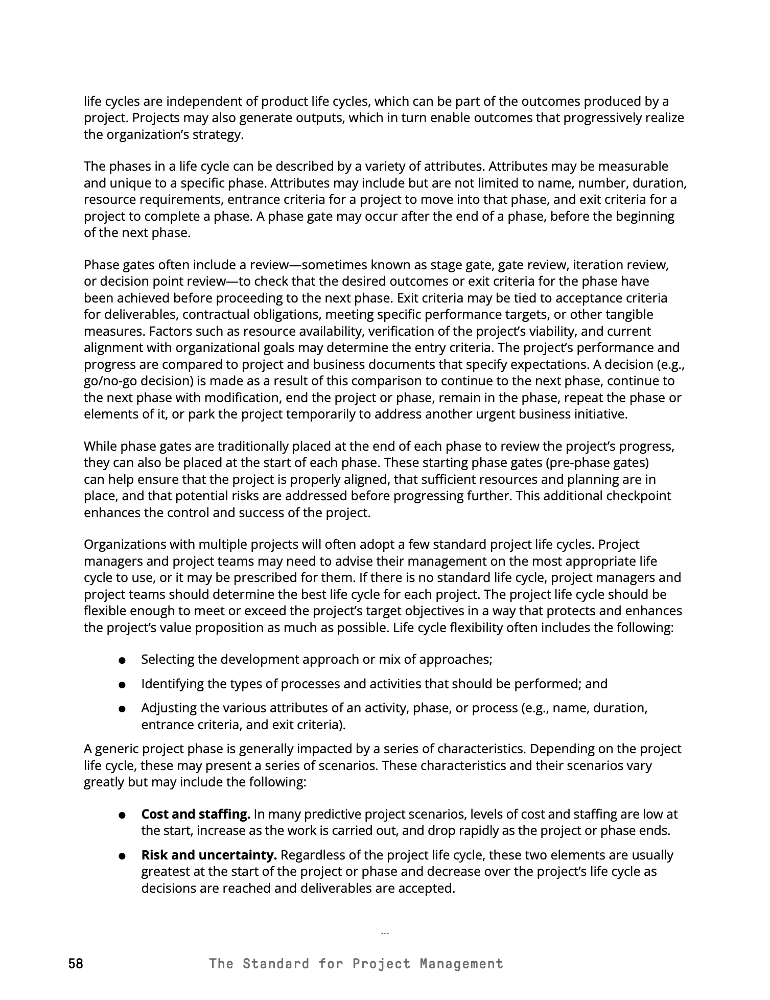

*PMBOK® Guide 8th Edition, The Standard for Project Management, p. 58.*

이제 또 한 가지 중요한 것은 시간 경과에 따른 프로젝트 단계입니다.

**1. 비용과 인력**
비용와 인력은 일반적으로 프로젝트 시작 또는 초기 단계에서 낮습니다. 업무가 늘어나기 시작하면 당연히 증가합니다. 마지막에 가까워지면 빠르게 감소합니다.

예를 들어 집을 짓기 시작하는데 프로젝트 초반에 기초 작업자만 있다고 가정해 보겠습니다. 처음에는 나무꾼들만 와서 나무를 모두 제거할 수도 있습니다. 겨우 몇 명이었죠? 그러다 갑자기 기초 공사 직원들이 와서 10명이 생깁니다. 그런 다음 그들은 떠납니다. 그런 다음 골조 제작자가 오고, 골조가 완성되면 전기 기술자와 배관공을 부르기 시작합니다. 프로젝트 초반에는 다섯 명 정도가 나무를 정리하고 있었지만 구조가 완성됨에 따라 100명의 직원이 해당 프로젝트에 참여하고 있습니다. 따라서 프로젝트 초기에는 인력이 많지 않을 수 있지만 시간이 지날수록 비용과 인력이 증가합니다.

**2. 위험과 불확실성**
프로젝트 초기에는 일반적으로 위험과 불확실성이 가장 높으며, 의사 결정이 이루어지고 결과물이 승인됨에 따라 감소합니다.

프로젝트를 시작하면서 고객에게 "이 웹사이트를 만들겠습니다"라고 말하면 고객이 원하는 것을 검증할 수 있는 어떤 것도 만들어지지 않았기 때문에 처음부터 잘못될 위험, 고객이 싫어하는 제품을 만들 위험은 매우 높습니다. 사람들이 원하는 것을 자세히 설명할 수 있다고 해서 여러분이 그 내용을 이해한다는 의미는 아닙니다. 사람들이 머릿속에서 보고 있는 것은 때때로 자신이 원하는 것을 설명하기 매우 어렵습니다.

프로젝트 초기에는 요구 사항을 충족하지 못할 위험이 매우 높습니다. 하지만 프로젝트가 진행됨에 따라 결과물을 생산하기 시작합니다. 고객은 "마음에 들지 않으니 바꿔주세요. 색상이 올바르지 않습니다. 너무 파란색입니다. 이 상자를 여기로 옮기세요"라고 말할 수 있습니다. 이제 고객이 원하는 결과물을 얻기 시작했습니다.

**3. 이해관계자의 영향력과 변경 비용**
변화에 대한 이해관계자의 영향력은 변경이 쉽고 비용이 적게 드는 프로젝트 초기에 가장 강력합니다.

프로젝트를 시작할 때 집을 짓고 설계한다고 가정해 보겠습니다. 처음에 건축가와 함께 집을 설계할 때 이해관계자의 영향을 받으면 '이 방은 너무 큽니다, 너무 작습니다. 거실을 더 크게 만드세요. 주방을 여기로 옮기세요'라고 쉽게 말할 수 있습니다. 문제없습니다. 프로젝트 초기에는 이해관계자가 쉽게 변경을 요구해 프로젝트에 영향을 미칩니다.

하지만 프로젝트가 진행되고 사람들이 변화를 원할수록 비용이 더 많이 듭니다. 집을 지을 때 처음에 설계 단계에서 거실의 위치를 바꾸고 싶다면 그냥 그림일 뿐이므로 문제없습니다. 하지만 전체 기초와 대부분의 구조물을 지었는데 "거실을 여기에 배치하세요"라고 하면 훨씬 더 많은 비용이 듭니다. 새로운 허가가 필요하고 이미 구축한 것을 철거해야 합니다.

따라서 프로젝트가 진행됨에 따라 변경 비용이 급격히 증가합니다. 건물의 50%를 지었는데 고객이 "주방을 옮겨줄 수 있나요?"라고 묻는다고 상상해 보세요. 배관의 모든 파이프를 이동해야 하므로 비용이 많이 듭니다.

> **PMBOK 8판 연결 - 시간에 따른 위험과 변경 비용**
>
> 프로젝트 초반에는 위험과 불확실성이 높고, 시간이 지날수록 변경 비용이 커지는 관계를 Figure 4-1에서 확인할 수 있습니다.

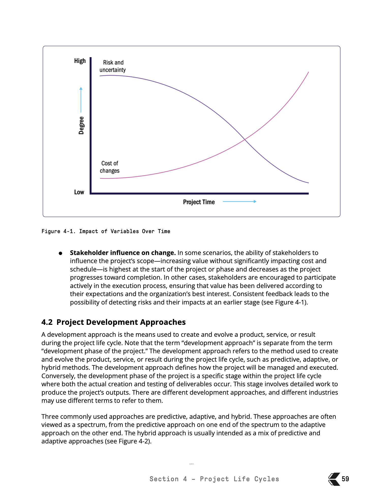

*PMBOK® Guide 8th Edition, Figure 4-1, p. 59.*

정기적인 이해관계자 피드백은 위험을 조기에 파악하고 프로젝트가 가치를 제공하고 있는지 확인하는 데 도움이 됩니다. 시험과 관련하여 이해관계자의 피드백은 프로젝트가 가치를 제공하고 있는지 확인할 수 있는 가장 좋은 방법 중 하나라는 점을 기억하시기 바랍니다. 프로젝트가 만들어지는 동안 이해관계자를 계속 참여시키는 것이 중요합니다. 이해관계자에게 진행 상황을 지속적으로 알리는 것이 중요합니다. 그래야 그들이 들어와서 '우리는 이걸 좋아하지 않아요'라고 말할 수 있기 때문입니다. 고객이 좋아하지 않는 것은 절대 만들지 마세요. 고객이 내 결과물을 좋아할지 알 수 있는 가장 좋은 방법은 고객을 일찍 참여시키는 것입니다. 여러분이 만들고 있는 것의 일부를 보여주세요. 이제 이들의 도움으로 요구 사항을 충족하지 못할 위험, 즉 리스크를 조기에 파악할 수 있습니다.

PMBOK 가이드에서 가져온 흥미로운 차트가 하나 있습니다. 방금 보여드린 모든 내용을 시각적으로 설명해 줍니다.

프로젝트 초반에는 시작일과 종료일이 정해져 있고 프로젝트가 처음부터 끝까지 진행되기 때문에 변경 비용이 매우 낮습니다. 예를 들어 집을 설계하기 시작했는데 거실을 옮기고 싶거나 침실을 하나 더 추가하고 싶어도 문제없습니다. 변경 비용이 매우 저렴합니다.

하지만 프로젝트 후반에 변경하고 싶다면 어떻게 해야 할까요? 변경 비용이 낮은 수준에서 높은 수준으로 많이 올라가는 것을 알 수 있습니다. 변경 비용은 훨씬 더 높습니다. 프로젝트가 거의 완료된 상태에서 고객이 주방의 위치를 바꾸고 싶다고 하면 어떻게 해야 할까요? 1층의 모든 공사를 철거하고 아래층의 모든 파이프를 제거하고 지하실의 천장을 모두 부수고 파이프를 옮겨야 합니다. 고객이 이를 수락하면 비용이 훨씬 더 많이 든다는 점을 기억하세요.

따라서 이 **변경 비용 곡선**을 기억하세요. 시험에 대비하여 꼭 기억하세요. 프로젝트 초기에는 누군가 변경을 원할 경우 훨씬 저렴하지만 프로젝트가 진행됨에 따라 변경 비용이 급격하게 증가합니다.

이제 다른 하나는 위험과 불확실성입니다. 프로젝트 초기에는 위험과 불확실성이 높습니다. 즉, 결과물을 충족하지 못할 위험이 있다는 뜻입니다. 우리가 무엇을 하고 있는지, 팀이 그 일을 해낼 수 있을지, 땅이 집의 무게를 지탱할 수 있을지 불확실합니다. 흙을 파보기 전까지는 그 흙 아래에 무엇이 있는지 알 수 없죠? 제거하려면 엄청난 비용이 드는 거대한 바위가 있을 수도 있습니다. 따라서 처음에는 수많은 불확실성이 존재합니다. 하지만 프로젝트가 진행되고 작업에 대해 알아가기 시작하면 불확실성이 줄어들기 시작합니다. 모든 일의 시작에는 많은 위험이 따릅니다. 시간이 지날수록 위험은 줄어들고 업무에 대해 더 많이 알게 되고 위험을 완화하기 시작할 수 있습니다.

이 영상의 핵심은 바로 이것입니다.

첫째, 프로젝트는 여러 단계로 구성되어 있습니다. 프로젝트를 시작할 때는 불확실성이 높고 변경이 쉽다는 점을 기억하세요. 변경은 쉽게 할 수 있으며 비교적 저렴합니다.

둘째, 프로젝트가 진행되기 시작하면 단계별 게이트 검토를 수행해야 합니다. 페이즈 게이트를 30% 또는 20%에 해야 한다는 정해진 규칙은 없습니다. 조직과 프로젝트마다 상황이 다릅니다. 따라서 프로젝트 전반에 걸쳐 단계별 게이트 검토를 수행해야 한다는 점을 기억하세요.

그리고 프로젝트가 진행됨에 따라 불확실성과 위험은 줄어들 것입니다.

### Incremental vs Iterative development

강의의 나머지 부분을 진행하기 전에 여러분이 많이 사용하게 될 두 가지 용어를 다루고자 하는데, 그 두 가지 용어는 **증분 전달**과 **반복 전달**입니다. 이 두 가지 방법은 모두 적응형 또는 애자일 방식이므로 주의해야 합니다. 용어의 차이점을 알아두세요.

프로젝트를 진행하면서 고객에게 물건을 전달할 때 어떻게 전달할까요? 제가 여러분을 고용하여 "이 집을 지어주세요"라고 말했다고 가정해 봅시다. 그러면 여러분은 나가서 제 요구 사항을 수집하고, 건축업자를 고용하고, 건축업자를 관리하고, 집을 배달합니다. 이는 한 번의 배송이 될 것입니다. 이는 예측적 프로젝트 관리에서 흔히 볼 수 있는데, 전체 제품을 하나로 구축하여 하나로 납품하는 방식입니다. 집을 짓는 동안에는 정말 아무런 변화가 없었습니다. 부분적으로 제공할 수 없죠. 이는 예측적 프로젝트 관리입니다.

오늘 제가 말씀드리는 것은 다릅니다. 반복적 전달과 점진적 전달에 대해 이야기하겠습니다. 이는 애자일 또는 적응형 방식입니다.

**1. 증분 전달 (Incremental Delivery)**

증분 전달은 시간이 지남에 따라 제품을 나누어 배송한다는 의미입니다. 예를 들어 웹사이트를 만든다고 가정해 보겠습니다. 5페이지 분량의 웹사이트입니다. 현재 인터넷에 조직을 위한 웹사이트가 없습니다.

"제가 이 홈페이지를 만들어서 한 번에 한 페이지씩 전달해도 괜찮을까요? 예를 들어 홈페이지가 완성되면 그것만 드리고 바로 전달해도 될까요? 지금 바로 사용할 수 있다는 뜻입니다. 홈페이지를 만들어서 웹 서버에 설치하면 회사 이름과 주소, 그리고 회사에서 하는 일에 대한 간단한 텍스트만 있는 웹사이트가 생기는 것이죠."

그래서 저는 먼저 홈페이지를 제공했습니다. 그러면 이것이 증분 1이 됩니다. 작업이 끝나면 회사 소개 및 문의처 페이지를 올리겠습니다. 두 페이지가 더 전달될 예정입니다. 이제 세 개의 웹 페이지가 생겼습니다. 이것이 증분 2입니다. 그런 다음 몇 개의 제품 페이지가 필요합니다. 그럼 나중에 전달해드리겠습니다.

이 프로젝트에서는 홈페이지와 회사 소개, 연락처를 전달한 다음 제품을 전달합니다. 그래서 세 번의 배송이 있었습니다.

이것이 좋은 이유는 무엇일까요? 가치를 더 빨리 얻을 수 있기 때문입니다. 내가 무언가를 만드는 순간 그것을 밀어내고, 여러분은 즉시 결과를 보기 시작합니다. 웹사이트는 없지만 적어도 인터넷에 홈페이지가 있다고 상상해 보세요. 그러면 사람들은 여러분이 무엇을 하는지, 어떻게 연락할 수 있는지, 여러분에 대한 정보를 알 수 있습니다. 두 번째 배송에서는 이제 더 많은 정보를 알게 되고, 세 번째 배송에서는 물건을 구매할 수 있습니다.

이 경우에는 이를 증분 전달이라고 합니다. 제품을 증분 1, 증분 2, 증분 3으로 나누어 배송하고 있습니다.

**2. 반복 전달 (Iterative Delivery)**

제가 여러분을 위해 이 휴대폰을 제작한다고 가정할 때, 이 휴대폰을 조금씩 배송할 수 있을까요? 그냥 본체만 드리고 "가치 있게 사용하세요"라고 말할 수 있을까요? 여러분은 "아니요, 그건 쓸 수 없어요. 소프트웨어나 하드웨어가 들어 있지 않습니다"라고 말할 것입니다.

증분 전달의 핵심은 내가 증분을 하나 주면 여러분은 이를 사용하기 시작하고 이를 통해 가치를 얻을 수 있다는 점입니다. 하지만 휴대폰과 같은 물건은 조금씩 배송할 수 없죠. 전체가 필요하니까요. 전체 구조가 필요하고 하드웨어가 필요하고 소프트웨어가 필요하죠. 소프트웨어가 없는 휴대폰은 쓸모가 없으니까요.

그래서 제가 할 일은 이걸 반복해서 만드는 것입니다. 제가 할 일은 휴대폰 전체를 제작하는 겁니다. 여러분의 요구 사항을 모을게요. 소프트웨어, 하드웨어 등 모든 것을 포함한 전체 휴대폰을 제작해 드립니다.

그럼 제가 알려드리겠습니다. 여러분이 말합니다.

"흠, Andrew, 너무 무거워요."
"알았어, 너무 무겁다고 적을게."
"Andrew, 너무 커요."
"그래, 너무 커."
"Andrew, 폭이 충분하지 않아요."
"그럼 더 짧고 조금 더 넓게 써주세요, 알았어요."
"Andrew, 너무 느려요."
"좋아, 더 빠른 프로세서를 원하겠지."
"Andrew, 색상이 너무 선명하지 않아요."
"좋아, 더 나은 화면을 원하잖아."

다시 돌아가서 그 요구 사항을 모두 받아들였습니다. 그런 다음 제품을 업데이트합니다. 제가 다시 돌려주면 "좋아 보이는데 아직 너무 길어요"라고 말합니다. "알았어요, 조금 더 짧게 만들게요." 이런 식으로 계속 진행됩니다.

제가 제품을 반복해서 만들고 제품을 만들어서 제공하면 여러분은 요구 사항을 제시하고, 저는 제품을 다시 돌려드립니다. 여러분이 "흠, 좋아 보이네요"라고 말하면 제품을 다시 가져가서 다시 돌려드립니다. 그리고 완벽한 제품이 나올 때까지 이 작업을 계속합니다.

이를 반복이라고 합니다. 따라서 반복은 기본적으로 제품 전체를 구축하는 것입니다. 단 한 번의 배송이지만 피드백을 주시면 피드백을 반영하여 제품을 다시 만들 수 있도록 하고 있습니다.

이제 반복과 증분은 모두 적응형 방법이며 애자일 방법이기도 합니다. 어떤 것을 선택하느냐는 작업 내용에 따라 다릅니다. 저 전화기처럼 모든 것을 점진적으로 제공할 수 있는 것은 아니며, 어떤 것은 반복적으로 제공하는 것이 가장 좋습니다. 프로젝트에 가장 적합한 것을 선택하세요.

하지만 현재로서는 **반복 또는 반복적이고 점진적인 전달이 적응형 또는 애자일 방식에 해당**한다는 점만 기억하세요.

### Development approaches

프로젝트를 수행할 때는 프로젝트에 적합한 접근 방식을 선택하는 것이 중요합니다. 프로젝트 관리의 세계와 시험에는 세 가지 종류의 접근 방식이 있습니다.

**예측적 프로젝트 관리, 하이브리드 프로젝트 관리, 적응형 프로젝트 관리**의 세 가지입니다.

예측적 프로젝트 관리를 워터폴 또는 계획 기반 접근법이라고도 부를 수 있고, 적응형 접근 방식은 애자일, 애자일 프로젝트 관리 및 시중에 나와 있는 애자일 프레임워크의 모든 다른 변형이라고도 합니다.

이 다이어그램을 살펴보겠습니다. PMBOK에서 나온 것입니다.

이전 영상에서 반복 전달의 차이점에 대해 설명해 드렸습니다. 제품을 전체적으로 전달하고 완벽한 제품이 될 때까지 계속 반복하거나, 증분 방식을 사용하여 부분적으로 전달할 수 있습니다.

예측 프로젝트 관리에는 실제로 많은 것이 없습니다. 예측 프로젝트 관리에는 반복적이고 점진적인 전달이 없습니다. 예측 프로젝트 관리는 전체적으로 제품을 제공합니다. 예를 들어 5페이지짜리 웹사이트를 만들라고 저를 고용하셨다고 가정해 보겠습니다. 모든 요구 사항을 수집하여 전체 웹사이트를 구축했습니다. 한 번의 큰 배달. 제가 만들었고 한 번에 드렸습니다. 예측이 가능합니다.

하지만 적응형 프로젝트 관리에서는 이제 규모가 커지고 반복적이고 점진적인 배포를 활용하고 있다는 것을 알 수 있습니다. 따라서 애자일을 수행할 때는 점진적이거나 반복적이거나 둘 다를 수행할 것으로 예상합니다.

다른 하나는 하이브리드 프로젝트 관리입니다. 하이브리드 프로젝트 관리는 이 중간에 위치합니다. 점진적 전달 또는 반복을 활용하여 집을 설계하고 예측을 통해 집을 지을 수 있는 프로젝트입니다. 따라서 집을 설계하고, 적응하고, 집을 짓고, 예측할 수 있습니다. 이를 하이브리드 프로젝트라고 합니다.

믿거나 말거나 하이브리드 프로젝트 관리라는 단어가 더 많이 사용되고 있습니다. 많은 기업이 예측에서 하이브리드로 전환하고 있습니다. 모든 것을 순수 애자일 또는 순수 예측으로 구축할 수 있는 것은 아닙니다.

이제 검토하고 싶은 용어가 몇 가지 있습니다.

**첫째, 개발 접근 방식이란 정확히 무엇인가요?** 프로젝트 중에 제품, 서비스 또는 결과물을 만들고 발전시키는 데 사용되는 방법입니다. 그 방법은 무엇인가요? 방금 살펴봤습니다. 예측형, 적응형, 하이브리드형입니다. 시험을 위해 알아야 할 세 가지 방법입니다.

이제 이러한 접근 방식은 다양한 스펙트럼으로 존재합니다. 한쪽 끝은 예측, 다른 쪽 끝은 적응, 중간은 하이브리드입니다.

개발 접근 방식은 프로젝트가 어떻게 관리되고 실행되는지 설명합니다. 예측 프로젝트를 관리하는 방식은 하이브리드, 애자일 프로젝트를 관리하는 방식과 다를 수 있습니다. 예측 프로젝트에서는 전체 프로젝트를 계획하고 대규모로 실행하는 하나의 거대한 계획 섹션이 있다는 점을 기억하세요. 모든 것을 한 번에 구축합니다. 점진적 제공을 수행하는 경우 작은 부분만 계획하고 해당 부분을 빌드하여 고객에게 전달한 다음 다음 부분을 계획하고 해당 부분을 실행하여 고객에게 전달합니다. 따라서 예측형인지 적응형인지에 따라 프로젝트의 관리 및 실행 방식이 매우 달라집니다.

> **PMBOK 8판 연결 - 개발 접근 방식의 스펙트럼**
>
> 예측형에서 적응형으로 갈수록 반복적·점진적 특성이 증가하며, 하이브리드는 두 접근 방식의 조합으로 위치합니다.

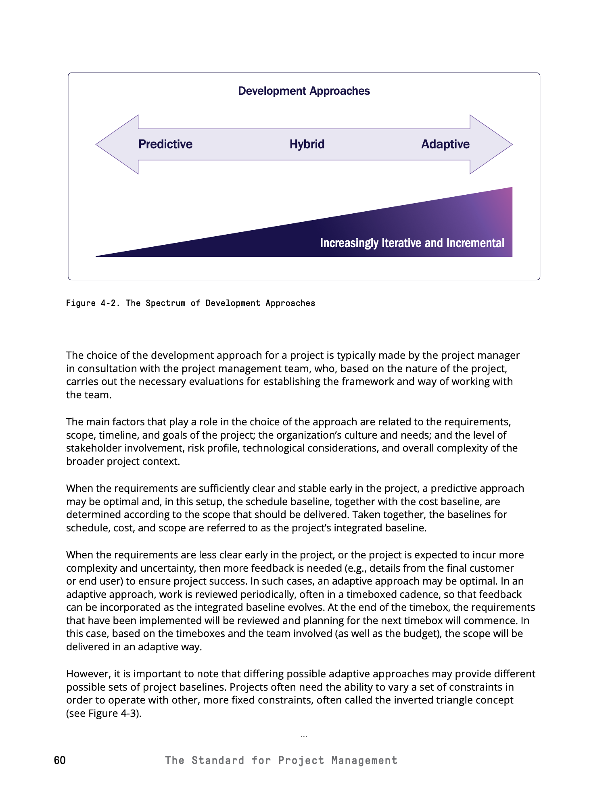

*PMBOK® Guide 8th Edition, Figure 4-2, p. 60.*

개발 접근 방식은 프로젝트의 개발 단계와 다릅니다. 중요한 내용이기 때문에 이 부분을 여기에 넣었습니다. 개발 접근 방식에 따라 여러 단계가 결정될 수 있습니다. 같은 것이 아닙니다. 사람들은 단계와 발전을 같은 것이라고 생각하지만 그렇지 않습니다. 프로젝트에는 여러 단계가 있습니다. 이것이 프로젝트의 수명 주기입니다. 사용하는 접근 방식에 따라 이러한 단계가 수행되는 방식이 달라질 수 있습니다.

예를 들어 예측 프로젝트에는 하나의 순차적인 단계 집합만 있습니다. 요구 사항을 수집하고, 제품을 설계하고, 제품을 제작하고, 제품을 테스트합니다. 애자일 프로젝트에서는 이러한 작업을 반복적으로 수행합니다. 애자일 프로젝트에서는 증분 1에 대한 요구 사항을 수집하고, 설계하고, 빌드하고, 릴리스하고, 설계하고, 빌드하고, 테스트하고, 릴리스하고, 다시 계획하는 과정을 거칩니다. 따라서 이 예제에서는 단계가 계속 반복되고 있습니다.

이제 개발 접근 방식은 누가 선택할까요? 시험에 중요한 내용입니다. 일반적으로 프로젝트 관리자가 프로젝트 관리 팀의 의견을 수렴하여 선택합니다. 주변에 조수, 잠재적 팀원, 주제별 전문가가 있을 수 있습니다. 어떤 접근 방식을 사용할지 선택할 수 있습니다. 예측형, 적응형, 여기서 적응형을 사용하고 여기서 예측형을 사용하는 것은 매우 다르며 여러 가지 요소에 따라 달라집니다. 그 중 몇 가지를 살펴보겠습니다.

요구 사항, 범위, 일정, 목표, 위험, 기술, 복잡성, 이해관계자 참여, 조직이 원하는 것 등에 따라 달라집니다. 몇 가지 예를 들어보겠습니다.

정말 참여하고 싶어하는 이해관계자가 있고 그들이 일부를 구축한 후 많은 피드백을 제공하고자 한다면 적응형 방식이 가장 좋은 방법이라고 생각합니다. 이해관계자가 좀 더 손을 떼고 접근하기 어렵고 여러분의 작업을 신뢰하며 상세한 요구 사항을 제시하는 경우 예측 기능을 사용하는 것이 가장 좋습니다.

점진적으로 푸시할 수 있는 작업, 시간이 지남에 따라 부분적으로 제공될 수 있는 제품을 제공한다면 예측을 사용하지 말고 적응형을 사용하세요. 가치를 더 빨리 파악합니다. 때로는 제품을 더 빨리 시장에 출시해야 할 때도 있습니다. 새로운 마켓플레이스이기 때문에 매우 빠르게 출시하고 싶고 최소한의 제품을 사용하여 매우 빠르게 시장에 출시할 수 있다면 짧은 타임라인 때문에 적응형 제품을 사용하는 것이 좋습니다.

여기에도 옳고 그른 방법은 없습니다. 고객에게 가장 큰 가치를 제공하는 최고의 제품을 선택하기만 하면 됩니다.

이제 몇 가지 핵심 사항을 빠르게 살펴보고자 합니다.

**예측 접근 방식**은 프로젝트 초기에 요구사항이 명확하고 안정적일 때 가장 효과적입니다. 요구 사항이 명확하지 않다면, 요구 사항이 점진적으로 구체화될 때 이 서비스는 적합하지 않다는 것을 기억하세요. 예측 프로젝트에서는 범위, 일정, 비용이 미리 계획되어 통합 기준선을 형성합니다. 예측 프로젝트에는 비용, 일정 및 범위 기준선이 있습니다.

**적응형 프로젝트**는 적응력이 뛰어납니다. 시간 경과에 따른 변화에 대응합니다. 적응형 접근 방식은 요구 사항이 불분명하거나 복잡하거나 불확실할 때 가장 효과적입니다. 이전에 구축된 적이 없는 앱을 구축하는 경우처럼 말입니다. 적응형 프로젝트에서는 짧은 시간 내에 작업을 검토하므로 피드백을 통해 작업을 조정하고 발전시킬 수 있습니다. 적응형 프로젝트에서는 요구사항이 변화함에 따라 더 많은 피드백을 받게 됩니다. 무언가를 만들어서 고객에게 보여주면 고객이 "아, 마음에 들지 않아요. 이걸 바꾸고 이걸 수정해도 좋습니다"라고 말할 수 있습니다. 이 방법은 범위를 알 수 없는 프로젝트에서 유용합니다. 프로젝트가 실제로 진행되거나 작업이 반쯤 완료될 때까지 범위를 알 수 없는 경우가 있기 때문입니다.

이제 이 주제에 대해 말씀드리기 전에 흥미로운 내용을 다루고자 합니다. PMBOK에서 나온 자료인데 여러분께 보여드리고 싶은 것이 있습니다.

**예측 프로젝트**에서는 범위가 고정되어 있음을 알 수 있습니다. 범위를 변경해서는 안 됩니다. 이제 예측 프로젝트에서 시간이 지남에 따라 달라지는 것은 예산과 일정입니다. 예산과 일정을 변경하고 싶지 않지만 범위를 달성하기 위해 변경해야 한다는 점을 지적하고 싶습니다. 범위가 고정되면 예산이나 일정을 변경하여 예기치 않은 변경 사항을 관리할 수 있습니다. 예상치 못한 변화란 무엇인가요? 건물을 짓고 있는데 그곳에서 큰 바위를 발견했다고 가정해 보겠습니다. 새로운 규정이 생겼습니다. 이제 일정과 비용 또는 예산만 조정하면 됩니다. 따라서 이 예측 프로젝트에서는 범위를 동일하게 유지하고 예산과 일정을 변경합니다.

예를 들어 보겠습니다. 프로젝트를 관리하고 있는데 20층짜리 고층 빌딩을 지어야 한다고 가정해 보겠습니다. 1억 달러 규모의 프로젝트입니다. 15층짜리 건물을 짓고 나면 돈이 부족해집니다. 1억을 다 사용하셨습니다. 그냥 멈추나요? "Andrew, 돈이 다 떨어졌어요. 15층에서 멈출 거예요." 정말요? 프로젝트를 끝내야 합니다. 그렇지 않으면 건물을 사용할 수 없습니다. 허가와 설계는 20층으로 되어 있습니다. 이제 여러분이 할 일은 프로젝트를 완료하기 위해 더 많은 시간을 추가하고 더 많은 돈을 추가하는 것입니다. 일정과 비용을 변경할 수 있습니다.

**적응형 프로젝트**에서는 달라질 것입니다. 적응형 프로젝트에서는 범위가 다양합니다. 스크럼 프로젝트와 같은 애자일 프로젝트에서는 제품 범위가 항상 변경됩니다. 제품 백로그라는 것이 있는데 요구 사항을 추가하고 변경하고 있습니다. 이 경우 예산과 일정이 정해져 있고 필요에 따라 범위를 변경할 수 있습니다.

이것을 **삼각형 반전**이라고 합니다. 예측 프로젝트에서는 범위를 동일하게 유지하면서 시간과 비용을 변경할 수 있습니다. 적응형 프로젝트에서는 시간과 비용은 동일하게 유지하면서 범위만 변경할 수 있습니다.

> **PMBOK 8판 연결 - 제약 조건 선택**
>
> Figure 4-3은 범위를 고정하고 예산·일정을 조정하는 경우와, 예산·일정을 고정하고 범위를 조정하는 경우를 비교합니다.

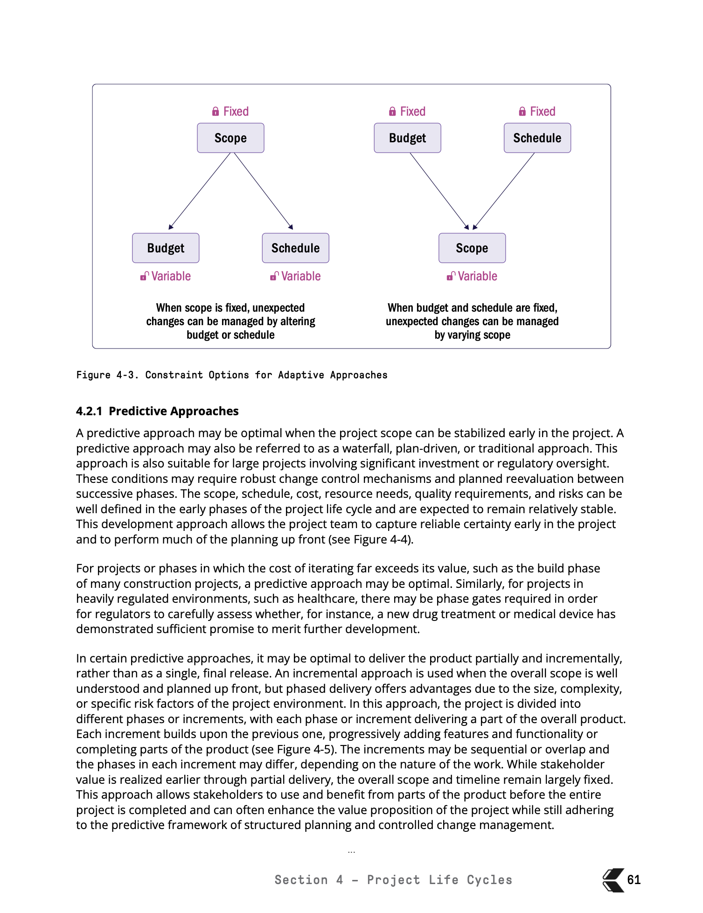

*PMBOK® Guide 8th Edition, Figure 4-3, p. 61.*

예를 들어 보겠습니다. 스크럼 프로젝트와 같은 애자일 프로젝트에서는 다음과 같은 작업을 수행합니다. 요구 사항 목록을 작성하고 이를 제품 백로그라고 부릅니다. 여기에는 사람들이 계속 추가하고 변경하고 수정하는 요구 사항 목록이 있습니다. 제품 소유자가 이 작업을 수행합니다.

따라서 적응형 프로젝트에서는 요구 사항을 계속 추가하지만 범위를 계속 추가하는 프로젝트를 진행 중이라면 프로젝트가 끝나지 않을 것입니다. 이것이 바로 애자일 프로젝트에서 하는 일입니다. 1년 동안 진행되는 100만 달러 규모의 프로젝트라고 합니다. 1년 동안 할 수 있는 한 많은 일을 하고 100만 달러를 모을 것입니다. 시간과 돈이 부족하면 프로젝트는 종료됩니다. 우리가 가진 것은 무엇이든 그것으로 끝나는 것이죠. 이것이 바로 적응형 프로젝트의 방식입니다.

이에 대한 자세한 내용은 애자일 섹션에서 설명하겠습니다.

자, 여기서는 다양한 형태의 개발 접근 방식에 대해 몇 가지 설명했습니다. 지금부터 여러분이 이해했으면 하는 핵심 사항은 다음과 같습니다.

- 예측 프로젝트는 일반적으로 한 번에 모든 것을 제공합니다.
- 적응형 프로젝트에서는 점진적 또는 반복적 전달을 사용하거나 때로는 둘 다 사용하게 될 것입니다.
- 물론 하이브리드는 이 두 가지의 중간 지점입니다.
- 예측 프로젝트에서는 범위가 동일하게 유지되고 시간과 비용이 달라진다는 점을 명심하세요.
- 적응형 프로젝트에서는 범위는 다양하지만 시간과 비용은 동일하게 유지합니다.

### Predicitive Approache

이전 동영상에서는 예측, 적응, 하이브리드 등 세 가지 접근 방식을 개략적으로 살펴봤습니다. 이번 영상에서는 **예측 프로젝트 관리**에 대해 자세히 살펴봅니다.

여기 예측 프로젝트 관리의 샘플이 있으며 단계별로 진행되는 것을 볼 수 있습니다. 예측적 프로젝트 관리를 폭포수식 프로젝트 관리라고도 합니다. 예전 소프트웨어 개발에서는 워터폴 프로젝트 관리 또는 워터폴 개발이라고 하곤 했습니다. 이걸 보면 왜 폭포라고 불리는지 알 수 있습니다. 물이 위에서 아래로 떨어지는 것처럼 단계가 순차적으로 진행되기 때문입니다.

예측 프로젝트에서는 단계를 거치게 됩니다. 이 프로젝트가 실현 가능한가요? 제품을 디자인하고, 제품을 제작하고, 제품을 확인하고, 제품을 전송하고, 프로젝트를 종료합니다. 간단한 프로젝트이며 기본적으로 시간이 지남에 따라 순차적으로 여러 단계를 거치게 됩니다.

이제 몇 가지 간단히 말씀드리고 싶은 것이 있습니다.

**첫째, 범위를 명확하게 정의하고 조기에 안정화할 수 있을 때 가장 효과적입니다.** 예측 프로젝트는 프로젝트 초기에 범위를 알 수 있을 때 가장 효과적입니다. 시간이 지남에 따라 범위가 정교해지거나 더 자세해지거나 변경되어서는 안 됩니다. 예를 들어 예측 프로젝트에서 20층짜리 건물을 짓고 싶은데 10층짜리 건물을 짓고 나서 마음이 바뀌어 30층을 원한다고 결정할 수 없습니다. 그 위에 10층을 더 얹으려면 기초를 뜯어내야 하므로 이러한 변경은 아마도 불가능하거나 전체 프로젝트를 폐기하고 다시 시작해야 할 것입니다. 따라서 범위를 잘 파악해야 합니다. 프로젝트 초기에 범위를 잘 정의해야 합니다.

**둘째, 워터폴, 계획 중심 또는 기존의 전통적인 프로젝트 관리라고도 합니다.** 이 접근 방식은 강력한 변경 제어가 필요한 대형 프로젝트, 대형 건물 건설, 대규모 투자 또는 규제 환경(키워드: 강력한 변경 제어)에 사용됩니다. 그리고 이것이 시험의 주제가 될 것입니다. 누군가 예측 프로젝트에서 무언가를 변경하고자 할 때 이는 쉽지 않은 일이며 매우 어려운 일입니다. 프로젝트 관리자는 변경 사항을 평가해야 하고 이해해야 하며 일반적으로 일종의 변경 관리 위원회를 거쳐야 합니다.

**셋째, 예측 프로젝트에서는 범위, 일정, 비용, 리소스, 품질 요구 사항 및 위험을 조기에 계획하고 안정적으로 유지할 것으로 예상합니다.** 예측 프로젝트는 사전에 많은 계획을 세워야 합니다. 계획을 세우는 데 6개월에서 1년이 걸리고 그 후 실행하는 데 또 6개월에서 1년이 걸릴 수 있습니다. 때로는 계획이 실행보다 더 오래 걸리기도 합니다. 왜 그럴까요? 안정화를 위해 노력하고 있기 때문입니다. 일단 계획이 안정화되면 전체 작업을 완료합니다.

**넷째, 이제는 다음 단계로 넘어가기 전에 진행 상황을 검토하기 위해 단계 게이트를 사용하는 경우가 많습니다.** 이 특정 방식에는 많은 페이즈 게이트가 사용됩니다.

이것이 바로 예측 프로젝트 관리입니다. 요즘에도 건설 프로젝트, 광고 프로젝트 등 많은 프로젝트가 여전히 예측 방식으로 진행되고 있다는 점을 명심하세요.

> **PMBOK 8판 연결 - 예측형 및 점진적 전달 수명주기**
>
> Figure 4-4는 순차적인 예측형 수명주기를, Figure 4-5는 전체 계획은 예측형으로 유지하면서 결과를 증분 단위로 전달하는 형태를 보여줍니다.

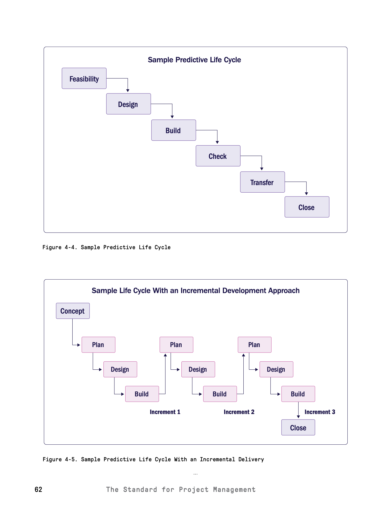

*PMBOK® Guide 8th Edition, Figures 4-4 and 4-5, p. 62.*

### Adaptive Approache

예측 프로젝트가 어떤 모습인지 살펴보았으니 이제 적응형 프로젝트가 어떤 모습인지 살펴봅시다. 여기 다이어그램이 있습니다.

적응형 프로젝트를 시작할 때 먼저 **프로젝트 비전을 정의**합니다. 이 프로젝트는 무엇을 만들 예정인가요? 새 휴대폰을 만드는 건가요? 새 차를 만드는 건가요? 무엇을 만드는 건가요? 따라서 제품, 프로젝트, 제품 비전을 정의해야 합니다. 이 제품은 어떤 모습일까요? 이 제품의 모든 요구 사항은 바로 여기에 있습니다.

그런 다음 반복 작업을 개발하여 고객에게 제공하고 고객이 제품에 대한 피드백을 제공하도록 합니다. 그러면 고객은 "이 휴대폰을 더 크게 만들었으면 좋겠다거나 더 넓게 만들었으면 좋겠다"는 의견을 제시합니다. 이 피드백을 백로그에 넣으면 됩니다.

백로그는 해야 할 일의 목록이 될 것이며, 우선순위를 정하여 이것부터 하고, 이것부터 하고 할 수 있습니다. 일반적으로 제품 소유자가 이 작업을 수행합니다. 따라서 피드백을 수집하여 백로그에 넣고 고객이 원하는 것의 우선순위를 정합니다. 다음 반복을 빌드합니다. 다시 돌려주면서 "이거 마음에 드세요?"라고 물어보면 고객은 "네, 괜찮아요"라고 대답합니다. 그런 다음 더 많은 피드백을 받고 그들이 원하는 것이 무엇인지 알려줍니다. 그런 다음 다음 반복을 빌드합니다.

고객이 "그거 알아? 이것이 우리가 원하는 것입니다. 이것이 바로 우리가 찾고 있는 것입니다"라고 말할 때까지 반복합니다. 이것이 고객의 요구 사항과 일치하는 순간입니다.

따라서 적응형 프로젝트에 대해 여러분이 기억했으면 하는 몇 가지 사항이 있습니다.

**첫째, 적응형 프로젝트는 변화 주도형이라고도 하며, 예측형 프로젝트는 계획 주도형이라고도 합니다.** 대부분은 적응형을 애자일이라고 부릅니다.

**둘째, 요구 사항과 기술 솔루션이 불확실하거나 불안정하거나 변경될 가능성이 있을 때 유용합니다.** 따라서 범위가 많이 변경되는 경우에는 이 변경 중심 주기 또는 애자일 방법을 사용하는 것을 잊지 마세요.

**셋째, 명확한 비전을 조기에 설정합니다.** 우리는 그것을 보았습니다. 하지만 피드백을 통해 세부 요구사항이 개선, 변경 또는 대체됩니다. 그래서 프로젝트 초반에는 휴대폰을 만들어야 한다는 것을 알고 있습니다. 더 큰 휴대폰을 원하지만 정확히 얼마나 큰지, 얼마나 무거운지, 얼마나 빠른지는 반복할 때마다 구체화할 것입니다.

**넷째, 적응형 접근 방식은 반복적일 수 있으므로 수명 주기에 따라 작업이 개선될 수 있습니다. 증분 배송이 가능하므로 제품이 작은 조각으로 배송됩니다.** 이에 대해 살펴봤습니다.

**다섯째, 애자일 방식은 보통 1~4주 정도의 짧은 반복을 통해 팀이 작업을 계획, 구축, 검토 및 조정하는 경우가 많습니다.** 이전 다이어그램에서 이를 확인했습니다. 각 반복은 일반적으로 1주에서 4주 정도 소요될 수 있습니다.

> **PMBOK 8판 연결 - 적응형 개발 수명주기**
>
> 반복마다 결과를 검토하고 피드백을 백로그 우선순위에 반영한 뒤 다음 반복으로 진행하는 흐름입니다.

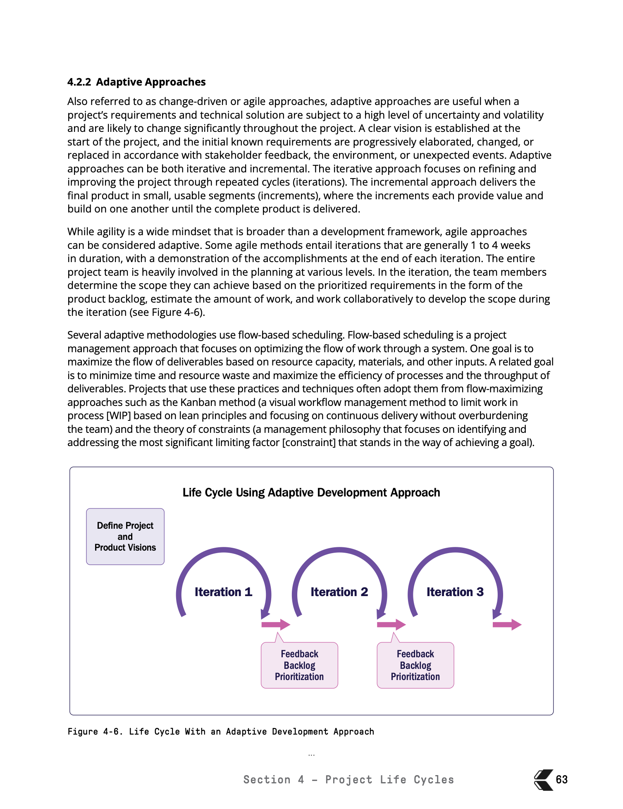

*PMBOK® Guide 8th Edition, Figure 4-6, p. 63.*

자, 이제 중요한 주제입니다. 이게 우리 시험과 무슨 관련이 있는지 궁금하신가요?

시험 문제를 출제할 겁니다. 그리고 프로젝트에 대해 알려줄 것입니다. 그리고 반복과 변화 중심일지, 아니면 예측이나 계획 중심일지 선택해야 할 것입니다. 선택을 해야 합니다. 따라서 질문을 주의 깊게 읽고 요구 사항과 복잡성을 파악하여 예측형인지 적응형 질문인지 판단하세요.

### Hybrid Approach

자, 이제 예측적 프로젝트 관리와 적응형 프로젝트 관리 사이의 중간 지점에 대해 잘 이해했으니 이제 하이브리드 접근 방식에 대해 살펴봅시다. 하이브리드 접근 방식은 언제 유용하며 정확히 어떤 방식인가요?

우선 하이브리드 접근 방식은 **예측 방식과 적응 방식이 결합된 방식**입니다. 이전 영상에서 예측이 한쪽 끝에 있고 적응이 다른 쪽 끝에 있으며 하이브리드가 바로 중간에 있는 다이어그램을 보여드린 적이 있습니다.

그렇다면 언제 이 기능을 사용할까요? 기본적으로 **프로젝트의 일부가 명확하고 안정적이지만 다른 부분은 불확실할 때** 사용합니다. 예를 들어 하단에 있는 다이어그램을 보세요. 이 프로젝트의 절반은 적응형 프로젝트이고 절반은 예측형 프로젝트입니다.

예를 들어 맞춤형 주택을 만들고 있다고 가정해 보겠습니다. 맞춤형 주택 설계는 집을 짓는 모든 설계에 적응형 접근 방식을 사용한 다음 집을 완성할 때는 예측형 접근 방식을 사용할 수 있습니다.

또 다른 예로 소프트웨어를 코딩하는 경우를 들 수 있습니다. 요구 사항을 수집하고 소프트웨어를 설계하고 코딩하는 이 모든 과정이 적응형으로 이루어집니다. 즉 범위를 변경할 수 있습니다. 애플리케이션을 코딩하는 동안 애플리케이션을 디자인하면서 애플리케이션의 모양을 수정할 수 있습니다. 적응형 기능을 사용하고 있고 범위를 변경하고 있는 것이죠.

그러나 애플리케이션을 테스트하고 배포하는 데 있어서는 예측 방식이 완벽하게 작동합니다. 테스트와 배포는 팀이 반복적으로 수행해 온 작업이기 때문에 새로운 것이 아니기 때문입니다. 무언가를 테스트할 때, 특히 무언가를 배포할 때 요구 사항을 변경하는 일은 거의 없습니다. 이전에도 많이 해왔던 일입니다.

"Andrew, 그것도 애자일로 할 수 있어요"라고 말할 수도 있습니다. 틀린 말은 아니죠? 어떤 방식을 선택하느냐는 여러분과 여러분이 창출하고자 하는 가치, 그리고 조직에 달려 있습니다.

하이브리드 접근 방식은 **결과물을 모듈화하거나 여러 팀에서 처리할 수 있을 때 효과적**입니다. 예를 들어 이 작업을 수행하는 팀은 이 작업을 수행하는 팀과 완전히 다른 팀이 될 수 있습니다. 같은 팀일 수도 있지만 다른 팀일 수도 있습니다.

이 접근 방식은 예측 가능한 작업을 제어하면서 작업 변경에 대한 프로젝트의 유연성을 제공합니다. 따라서 적응형 부분에서는 작업에 대한 통제력이 떨어지지만 유연성이 높고, 예측형 부분에서는 더 많은 제어 권한이 있습니다.

프로젝트는 전체적으로 하나의 기본 접근 방식을 사용하면서 특정 단계, 결과물 또는 작업 스트림에 대해 다른 접근 방식을 사용할 수 있습니다. 따라서 거대한 예측 프로젝트일 수도 있지만 일부 결과물이나 프로세스 몇 개만 적응형 방법을 사용하여 구현할 수 있습니다.

> **PMBOK 8판 연결 - 하이브리드 적용 패턴**
>
> 예측형과 적응형을 동시에 사용하거나, 예측형 중심 프로젝트 안에 일부 적응형 요소를 배치하는 대표적인 하이브리드 패턴입니다.

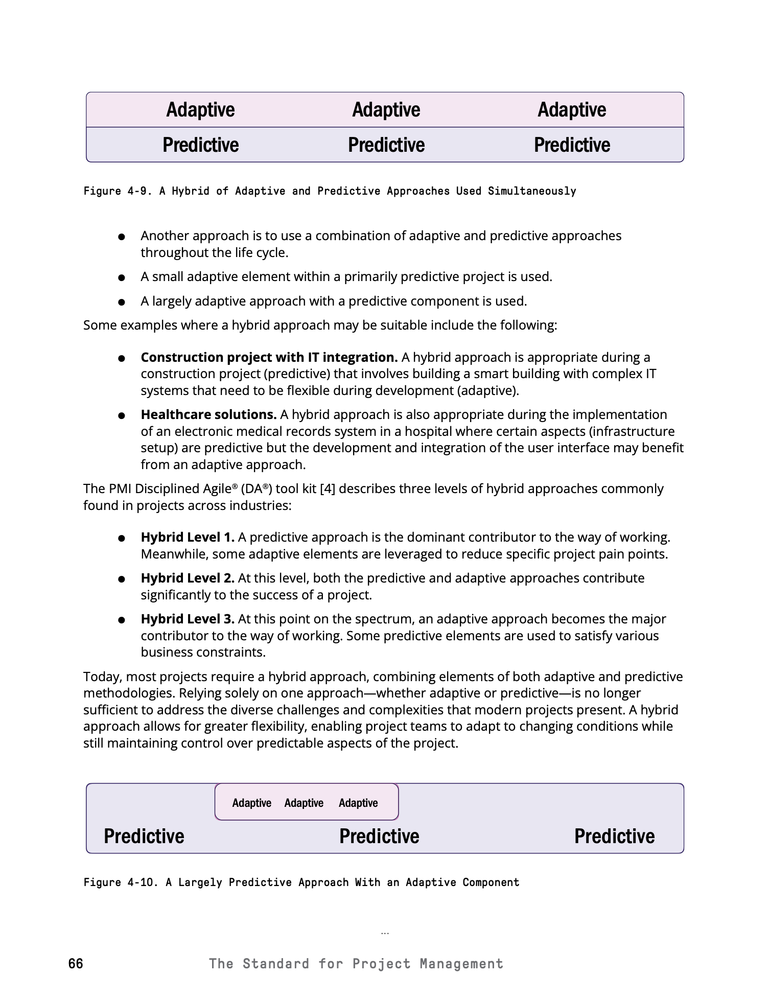

*PMBOK® Guide 8th Edition, Figures 4-9 and 4-10, p. 66.*

PMBOK 가이드와 애자일 실무 가이드에서는 하이브리드 방식에 대해 자세히 설명합니다. 하지만 그 전에 이 과정을 진행하면서 예측과 관련된 모든 프로세스와 적응형 방법과 관련된 모든 용어와 프로세스를 심도 있게 다뤄야 합니다. 강좌의 마지막 부분에는 하이브리드에 대한 또 다른 섹션이 있습니다.

### Focus Areas

시험 공부에 있어서 학생들을 미치게 만드는 주요 요인 중 하나가 바로 이것입니다. **40개 프로세스 차트**입니다.

여기서는 프로젝트 관리자가 프로젝트 시작부터 전체 프로젝트 또는 프로젝트 내 단계를 마무리하기 위해 수행해야 하는 모든 프로세스를 설명합니다. 시험을 치르기 위해서는 이러한 프로세스가 무엇인지 알아야 합니다.

이러한 프로세스가 무엇인지 알고 있어야 하며 자신이 하고 있는 일을 설명할 수 있어야 합니다. 이 차트를 외울 필요는 없습니다. 시험을 위해 이 차트를 다시 그릴 필요는 없지만, 프로젝트 시작 단계와 같은 내용은 알고 있어야 합니다. 그게 정확히 무엇인가요? 프로젝트 계획을 통합하고 조정합니다. 그게 뭐죠? 일정 개발, 그게 뭔가요? 비용 추정, 예산을 결정합니다. 이름만 읽어보셔도 그 의미를 이해하실 수 있을 겁니다. 따라서 프로젝트 관리자가 시험을 위해 하는 일을 이해해야 합니다.

이제 이 40개 프로세스에 대해서는 이 과정의 후반부에 나오는 프로젝트 관리 프로세스라고 부르는 다른 섹션에서 각 프로세스에 대해 자세히 다룰 것입니다. 하지만 이 섹션에서 다루고 싶은 것은 상단에 있는 내용입니다. 이 **다섯 가지 프로세스 그룹**과 정확히 어떻게 상호 작용하는지, 또는 포커스 영역이라고 알려진 것에 대해 이야기하고 싶습니다.

그래서 저는 차트의 맨 위에 있는 시작, 계획, 실행, 모니터링 및 제어, 마무리를 **포커스 영역**이라고 부르고 싶습니다. 어떤 사람들은 프로세스 그룹이라고 부르기도 합니다. 왜 그럴까요? 프로세스를 그룹화했기 때문입니다. 계획을 살펴보면 여러 프로세스가 있습니다. 그래서 어떤 사람들은 프로세스 그룹을 계획이라고 말하지만 이것이 계획의 초점 영역입니다. 이 모든 과정이 계획에서 수행하게 될 프로세스입니다.

또한 거버넌스, 범위, 일정, 재무, 이해관계자, 리소스 및 위험과 같은 **성과 도메인**이 있습니다. 이것은 프로젝트 자체 내에서 서로 다른 섹션을 그룹화하는 것입니다. 따라서 이 섹션에서는 상단에 있는 이 다섯 가지 프로세스 그룹을 모두 다룹니다.

본격적으로 시작하기 전에 이에 대한 간략한 개요를 알려드리겠습니다. 다시 초점 영역에 대해 이야기하고 있습니다.

프로젝트를 시작할 때는 먼저 프로젝트 승인을 받아야 합니다. 그게 바로 **시작(Initiating)**입니다. 시작이라는 단어를 들을 때마다 프로젝트 승인을 받아야 한다고 생각하세요. 여기에서 프로젝트를 시작할 수 있습니다. 여기에서 프로젝트 헌장이라는 문서를 작성할 수 있습니다.

프로젝트 승인을 받으면 다음으로 할 일은 프로젝트 계획을 세우는 것입니다. 프로젝트가 승인되었으니 이제 어떻게 작업을 수행해야 할까요? 작업을 어떻게 실행할 것인가? 작업을 어떻게 통제할 것인가? 이것이 바로 **계획(Planning)**입니다. 프로젝트 관리 계획을 만듭니다.

**실행(Executing)**은 작업을 수행한다는 의미입니다. 바로 작업을 시작할 수 있습니다. 여기서부터 벽을 칠하기 시작합니다. 여기서 애플리케이션을 잡고 집을 짓기 시작할 것입니다.

그런 다음 다음 항목이 표시됩니다. **모니터링 및 제어(Monitoring & Controlling)**. 작업을 확인하고 있습니다. 모니터링 및 제어는 작업을 점검하고 계획 또는 실행 중인 작업이 계획과 일치하는지 확인하는 것입니다. 그런 다음 프로젝트를 **마무리(Closing)**하는 것입니다.

따라서 쉽게 이해할 수 있습니다. 작업을 승인하세요. 시작하기. 작업을 계획합니다. 작업을 수행하고, 실행하세요. 작업을 확인합니다. 작업이 계획대로 진행되고 있는지 확인하고 작업을 종료합니다.

> **PMBOK 8판 연결 - 포커스 영역과 프로젝트 경계**
>
> Figure 4-12는 비즈니스 문서에서 시작해 착수·계획·실행·모니터링 및 통제·종료를 거쳐 결과물과 프로젝트 기록이 나오는 전체 관계를 보여줍니다.

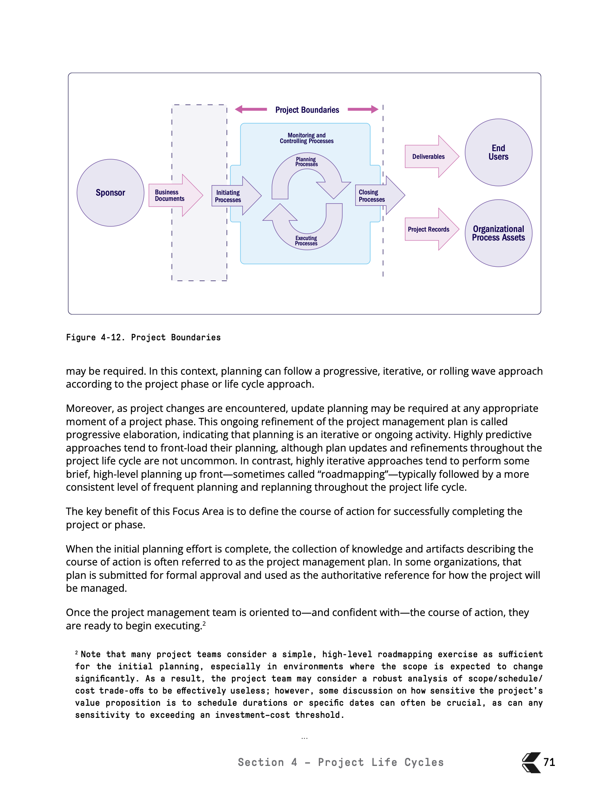

*PMBOK® Guide 8th Edition, Figure 4-12, p. 71.*

여기 이것들을 보면 꽤 순차적으로 구성되어 있는 것처럼 보이죠? 시작하고, 계획하고, 실행하고, 모니터링하고, 제어하고, 마무리합니다. 하지만 실제로는 그 자체로 순차적이지 않습니다.

PMBOK 가이드의 또 다른 다이어그램을 보여드리겠습니다. 프로젝트를 시작하기 위해 스폰서는 **비즈니스 문서**라고 하는 것을 작성합니다. 비즈니스 문서에는 왜 이 프로젝트를 해야 하는지, 이 프로젝트를 수행하면 어떤 이점이 있는지 설명하는 내용이 담겨 있습니다. 이러한 비즈니스 문서는 전체 프로젝트의 시작입니다.

그러면 모든 시작 프로세스가 시작됩니다. 이를 시작하고, 헌장을 개발하고, 이해관계자를 파악한다는 것을 알게 됩니다.

프로젝트가 시작되면 이제 계획을 시작할 수 있습니다. 하지만 여러분에게 계획에 대해 보여드리고 싶은 것이 있습니다. 계획을 시작합니다. 계획이 끝나면 작업을 실행한 다음 다시 계획을 세웁니다. 하지만 왜 여기에 원형이 있을까요? 프로젝트에서는 전체 프로젝트를 한 번에 계획할 수 없을 수도 있기 때문입니다.

프로젝트에 여러 개의 결과물이 있다고 가정해 보겠습니다. 결과물 하나를 계획할 수 있습니다. 이 작업이 완료되면 바로 실행하여 결과물을 만들어냅니다. 그런 다음 돌아가서 결과물 2를 계획하고 실행한 다음 결과물 3을 계획하는 식으로 모든 결과물을 완성할 때까지 계속 진행합니다.

여러분들이 상단에 있는 이 큰 것을 주목해 주셨으면 합니다. **모니터링 및 제어**. 모니터링 및 제어라는 용어를 들었을 때 모니터링 및 제어는 일을 계속 추적하는 것을 의미합니다. 프로젝트가 실행되면 팀에서 할 일은 애플리케이션을 코딩하거나 벽에 페인트칠을 하는 것입니다. 여러분의 역할은 팀이 계획에 따라 일하고 있는지 확인하는 것입니다.

당신의 일은 벽을 녹색으로 칠하는 일이 될 것입니다. 계획을 확인해 보겠습니다. 계획에는 녹색으로 칠하라고 되어 있었습니다. 초록색으로 칠해져 있나요? 네. 계획에 따르면 이 웹페이지를 코딩해야 한다고 되어 있습니다. 이 웹페이지를 코딩하고 있나요? 이것이 바로 모니터링과 제어입니다. 모니터링 및 제어는 팀이 계획을 잘 따르고 있는지 확인하는 것입니다. 작업이 계획대로 진행되고 있는지 확인하기 위해 작업을 추적하는 것입니다.

결과물을 생성한 후에는 프로젝트를 종료합니다. 이제 프로젝트의 해당 섹션을 공식적으로 종료해야 합니다.

이제 프로젝트가 완료되면 크게 두 가지를 얻게 됩니다. 첫째, 결과물의 결과물을 얻을 수 있습니다. 결과물은 작품 그 자체입니다. 방을 페인트칠하는 것이 프로젝트의 목적이라면 결과물은 페인트칠한 방이 될 것입니다. 웹사이트를 만드는 것이 업무였다면 결과물은 웹사이트입니다. 최종 사용자에게 이를 제공합니다. 하지만 프로젝트의 산출물도 있습니다. 프로젝트를 진행하면서 교훈을 통해 많은 것을 배웠겠죠? 조직의 지식을 창출합니다. 프로젝트 기록입니다. 좋은 프로젝트 관리 계획에 대한 좋은 템플릿이 있을 수도 있고 새로운 기법이 있을 수도 있습니다. 이렇게 하면 **조직 프로세스 자산**으로 알려진 것이 업데이트됩니다. 다른 프로젝트 관리자가 여러분처럼 성공할 수 있도록 향후 프로젝트에 활용할 수 있는 자료가 될 것입니다.

이제 이러한 중점 영역과 관련하여 한 가지 지적하고 싶은 것이 있습니다. 사람들을 혼란스럽게 하는 것 중 하나는 포커스 영역입니다. 이 포커스 영역은 **모든 산업 응용 분야에 적용**된다는 점을 기억하세요. 모든 산업과 애플리케이션 영역에 적용됩니다. 건설, 광고, IT 등 어떤 프로젝트든 상관없습니다. 모든 프로젝트는 시작, 계획, 실행, 모니터링, 제어 및 종료가 이루어져야 합니다. 간단합니다. 어떤 산업에 속해 있든, 어떤 프로젝트를 관리하든 모든 개발 접근 방식에 적용됩니다. 예측, 적응, 하이브리드 모두 가능합니다. 예측 프로젝트도 계획이 있어야 하고 애자일 프로젝트도 계획이 있어야 합니다. 하이브리드도 당연히 계획이 있어야 합니다. 계획 없이 어떤 작업도 해서는 안 됩니다. 프로젝트 유형에 상관없습니다.

이제 여기서부터 혼란스러워집니다. 바로 여기 이 문장은 사람들을 혼란스럽게 합니다. 사람들은 시작, 계획, 실행을 **단계**라고 생각합니다. 단계가 아닙니다. 이 영상이 끝나기 전에 이해가 되셔야 합니다. 이러한 집중 영역은 단계가 아닙니다. 프로젝트에 단계가 있는 경우 포커스 영역은 단계 내부에서 발생할 수 있습니다.

초점 영역이 항상 순차적인 것은 아닙니다. 이 모든 작업은 프로젝트 중에 겹치고 반복됩니다. 네, 실행, 모니터링, 제어 및 계획은 기본적으로 모두 동시에 이루어집니다. 모니터링 및 제어는 계획이 계획대로 실행되고 있는지 확인하는 것입니다. 계획과 실행이 동시에 이루어지고 있습니다. 결과물 2를 계획하는 동안 결과물 1을 실행하고 있는 것이죠.

> **PMBOK 8판 연결 - 예측형과 적응형에서의 포커스 영역 상호작용**
>
> 포커스 영역은 프로젝트 단계가 아니며 항상 순차적으로 한 번씩만 수행되는 것도 아닙니다. 예측형에서는 단계 전반에 노력 수준이 겹치고, 적응형에서는 각 반복마다 계획·실행·모니터링 및 통제가 되풀이됩니다.

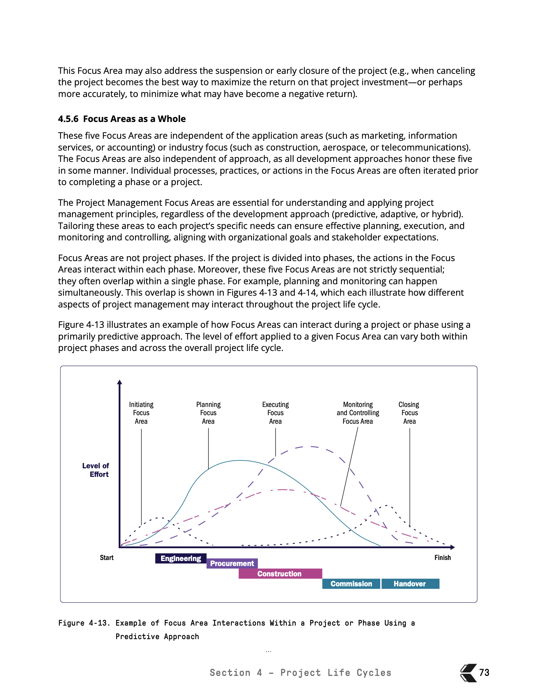

*PMBOK® Guide 8th Edition, Figure 4-13, p. 73.*

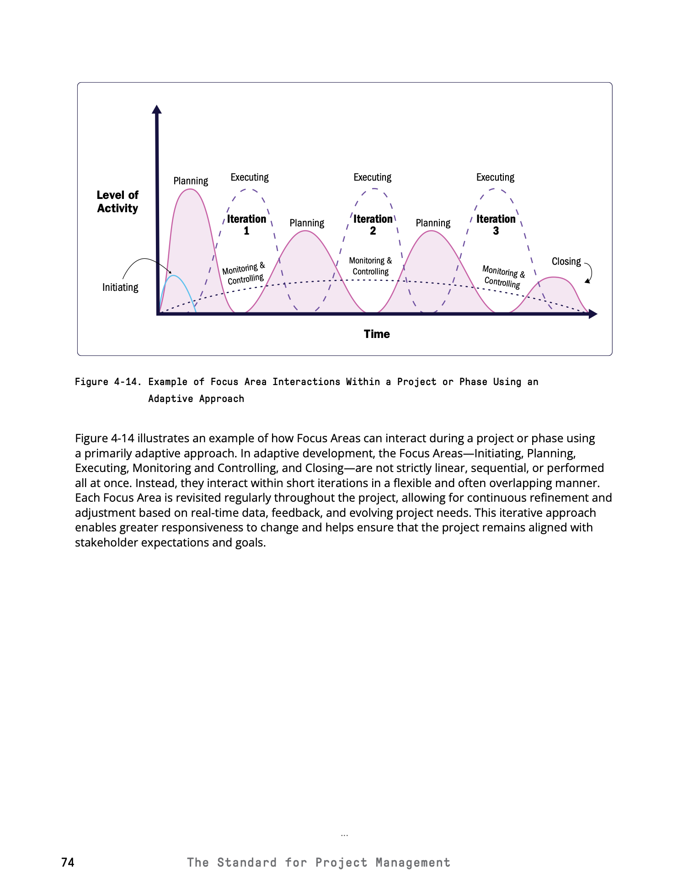

*PMBOK® Guide 8th Edition, Figure 4-14, p. 74.*

각 중점 영역의 노력 수준은 프로젝트 단계, 수명 주기 및 개발 접근 방식에 따라 달라질 수 있습니다. 따라서 어떤 프로젝트는 많은 계획을 세우고 어떤 프로젝트는 계획이 매우 느슨할 수 있습니다. 어떤 프로젝트는 실행이 어렵고 어떤 프로젝트는 실행이 빠릅니다.

이제 바로 여기 이 문장으로 돌아가겠습니다. 이 프로세스, 이 40개의 프로세스, 이 5개의 프로세스 그룹. 한 가지 지적하고 싶은 것이 있습니다. 이 전체 테이블은 프로젝트의 전체 내부에 존재하지 않습니다. 이 표는 전체 프로젝트에 관한 것이 아닙니다. **프로젝트 내 모든 단계에 적용됩니다.**

예를 들어 애플리케이션을 디자인하는 경우 40개의 프로세스가 모두 있습니다. 애플리케이션 프로그래밍, 애플리케이션 개발 등 총 40개의 프로세스가 있습니다. 애플리케이션을 테스트할 때도 40개 프로세스 모두가 적용됩니다. 모든 단계에는 이 전체 차트가 포함되어 있습니다.

프로젝트의 모든 단계를 누가 만드는지 기억하시나요? 바로 여러분입니다. 단계를 생성합니다. 단계의 결과물은 무엇인가요? 결과물입니다. 이러한 결과물을 만들기 위해 다음 40가지 프로세스를 수행합니다.

이제 여러분께 보여드리고 싶은 차트가 있는데요, 이걸 확인해 보세요. 예를 들어 웹사이트나 애플리케이션처럼 출력하고 있습니다. 첫 번째 단계는 애플리케이션을 발견하고 계획하는 것입니다. 아직 시작되지 않았습니다. 계획, 실행, 모니터링, 제어 및 마무리가 이루어집니다. 따라서 1단계에서는 웹사이트의 목표를 정의합니다. 요구 사항을 수집하고 디스커버리 회의를 진행합니다. 실행할 때는 디스커버리 미팅을 하고 사용자와 대화하고 검토하고 계획대로 잘 진행되고 있는지 확인합니다. 그런 다음 승인을 받습니다.

2단계에서는 이제 설계하고 구축해야 합니다. 시작하려면 먼저 확인을 받아야 합니다. 누가 설계하고 누가 구축하는가. 그런 다음 스프린트 계획을 세워야 합니다. 그런 다음 작업을 수행해야 합니다. 와이어프레임을 만들고 코드를 작성하고 콘텐츠를 만들어야 합니다. 모니터링 및 제어를 통해 이 모든 콘텐츠가 올바르게 수행되는지 추적합니다. 결제를 완료하면 승인을 받습니다.

그런 다음 테스트하고 실행해야 합니다. 테스트 및 출시를 시작합니다. 기획에서 QA를 수행합니다. QA를 어떻게 수행할지 계획합니다. 그런 다음 테스트합니다. 모든 작업이 올바르게 완료되었는지 확인한 다음 프로젝트를 넘겨주면 프로젝트가 완료됩니다.

여기서 제가 말씀드리고자 하는 요점은 이 **40가지 프로세스가 모든 단계에 존재**한다는 것입니다. 그래서 제 프로젝트에는 세 단계만 있습니다. 더 많이 넣었어야 했는데 화면에 맞추기에는 너무 커서요. 하지만 옳고 그른 방법은 없다는 것을 기억하세요.

제가 말하고자 하는 요점은 이 40개의 프로세스가 한 프로젝트에서 여러 번 수행된다는 것입니다. 프로젝트에서 한 단계를 수행할 때마다 이 40가지 프로세스를 수행하게 됩니다. 따라서 기획은 한 번만 하는 일이고 시작은 한 번만 하는 일이고 실행은 한 번만 하는 일이라고 생각하지 마세요. 프로젝트에서 이 작업을 여러 번 수행합니다.

이것이 시험을 위해 여러분이 알아야 할 방법입니다. 하지만 실생활에서 하는 일이기도 합니다. 이 40가지 프로세스의 목적은 무엇인가요? 결과물을 만드는 것입니다.

### Focuss Areas Detail

이 과정의 뒷부분에 나오는 이 40개의 프로세스를 하나하나 살펴볼 것입니다. 이제 계획, 실행, 모니터링에 대해 알아보겠습니다. 기본적으로 전체 계획을 세우려고 합니다.

하지만 이 모든 프로세스의 입력, 도구, 기술, 결과물인 ITTO에 대해 알아보기 전에 5개의 프로세스 그룹, 즉 5개의 포커스 영역을 비교적 빠르게 살펴보고 그 안에서 여러분이 무엇을 하고 있는지 잘 이해할 수 있도록 하고자 합니다.

**1. 시작(Initiating)**

새 프로젝트 또는 새 프로젝트 단계를 정의하는 데 사용됩니다. 무슨 말인가요? 왜 새 프로젝트 또는 프로젝트의 새로운 단계일까요? 이 40가지 프로세스는 프로젝트 자체에만 존재하는 것이 아니라 프로젝트의 모든 단계에 존재하기 때문입니다. 프로젝트가 한 단계만 있는 경우 이 40개의 프로세스가 전체 프로젝트에 존재합니다. 따라서 여러 단계로 구성된 프로젝트가 있는 경우 이러한 프로세스는 모든 단계에 적용됩니다.

이제 해당 프로젝트의 첫 번째 단계를 시작하면 전체 프로젝트가 시작됩니다. 프로젝트의 마지막 단계를 완료하면 해당 단계가 종료되는 것이 아니라 전체 프로젝트를 종료합니다.

여러분들이 프로젝트를 시작한다고 생각할 때마다 공식적인 승인을 받아 프로젝트를 시작한다고 생각했으면 합니다. 시작이라는 단어를 들으면 권한 부여를 떠올리게 됩니다. 누군가 "Andrew, 시작해요"라고 말하면 저는 "좋아, 그 프로젝트를 승인받고 싶지?"라고 생각합니다.

여기서 목표는 이해관계자의 기대치, 프로젝트의 목적, 범위, 목표를 일치시키는 것입니다. 우리는 프로젝트 헌장을 만들어서 이 일을 합니다. 이해관계자를 조율하고 기대치를 조정하는 문서입니다. 프로젝트의 목적과 함께 그들이 원하는 것은 무엇인가요? 우리는 무엇에 맞춰져 있나요? 프로젝트 목적과 범위에 대한 기대치는 무엇인가요?

시작 단계에서 팀은 초기 범위, 높은 수준의 범위, 초기 재정 자원을 정의합니다. 따라서 높은 수준의 예산을 책정하고, 이해관계자를 식별하고, 프로젝트 관리 역할을 할당합니다. 프로젝트 관리자가 프로젝트에 배정되는 곳입니다. 시험의 경우 프로젝트 관리자는 프로젝트 헌장의 프로젝트 시작 섹션에 지정되어 있다는 점을 기억하세요.

따라서 프로젝트 헌장은 높은 수준의 범위, 높은 수준의 예산, 높은 수준의 일정을 제시하고 작업을 수행할 프로젝트 관리자를 지정하는 문서입니다.

이해관계자 등록부라는 것도 있습니다. 이해관계자 식별이라는 프로세스가 있음을 알 수 있습니다. 여기에서 이 프로젝트의 영향을 받게 될 모든 사람들과 그들이 프로젝트에 어떤 영향을 미칠지에 대한 문서, 즉 이해관계자 명부를 작성합니다. 이것이 시작입니다.

**2. 계획(Planning)**

계획에는 수많은 프로세스가 있다는 것을 알 수 있습니다. 그래서 여기서 무엇을 하고 계신가요? 여기에는 프로젝트 범위를 정의하는 데 사용되는 작업이 포함되겠죠? 범위를 정의하려고 합니다. 프로젝트의 범위가 무엇인지 자세히 설명합니다. 목표를 구체화하고 작업을 완료하는 방법을 결정합니다.

따라서 계획에 따라 작업이 결정됩니다. 벽을 칠할 거예요. 이 애플리케이션을 코딩해 보겠습니다. 이 애플리케이션을 배포하겠습니다. 이러한 방식(범위)으로 테스트할 것이며 어떻게 할 것인지 알려줄 것입니다. 따라서 작업의 내용뿐만 아니라 방법, 기술, 작업이 완료되는 방식까지 계획합니다.

프로젝트 관리 계획과 같은 아티팩트가 생성될 수 있습니다. 이 모든 계획 프로세스를 수행한 주요 결과물은 거대한 프로젝트 관리 계획이 될 것입니다. 애자일 프로젝트인 경우 제품 백로그가 있을 것입니다.

계획은 항상 한 번으로 끝나는 것이 아닙니다. 피드백 루프, 롤링 웨이브 계획 또는 점진적인 정교화를 통해 이루어질 수 있습니다. 따라서 계획에 몇 달이 걸리기도 하고 계획이 몇 번이고 반복되는 경우도 있습니다.

예를 들어 프로젝트의 범위를 계획하기 시작한 후 예산이 부족하다는 사실을 깨달았다고 가정해 봅시다. "좋아, 모든 범위를 다 할 수 있는 돈이 부족해." 그래서 다시 돌아가서 예산이 얼마나 있는지에 따라 범위를 다시 계획합니다. 또는 범위를 계획하기 시작하고 비용으로 넘어가다가 이 모든 작업을 수행할 재정적 여유가 없거나 시간이 없거나 위험이 어떤 영향을 미칠지 깨닫게 될 수도 있습니다. 따라서 이러한 계획 프로세스는 실제로 반복됩니다. 이 작업을 계속 반복해서 수행합니다. 한 섹션의 피드백 루프를 사용하여 다른 섹션을 업데이트합니다.

범위를 설정하고 있습니다. 범위를 계획하고 있습니다. 그런 다음 일정으로 이동합니다. 그런 다음 범위로 돌아가서 "이 모든 작업을 하기에는 시간이 부족해요"라고 말할 수도 있습니다. 아니면 비용으로 내려가서 "시간은 충분해요. 돈을 더 추가하면 그 모든 작업을 그 시간 안에 모두 할 수 있습니다. 돌아가서 범위와 시간을 다시 업데이트해 봅시다." 그리고 계획이 완벽해질 때까지 이런 일이 계속 반복됩니다.

이제 새로운 정보나 변경 사항이 발견되면 프로젝트 전체에서 계획을 업데이트해야 할 수 있습니다. 이 모든 프로세스를 수행하여 얻는 이 계획은 변경될 수 있습니다. 일반적으로 변경 요청을 통해 이루어집니다. 따라서 고정되어 있다고 생각하지 마세요.

예측 프로젝트는 보통 사전에 더 많은 계획을 세웁니다. 반복 프로젝트는 높은 수준의 계획을 세운 다음 더 자주 교체합니다. 따라서 예측 프로젝트는 많은 계획을 세우고 일단 프로젝트가 실행되면 변경하지 않으려고 합니다. 반면 반복 프로젝트는 모든 반복에 대해 이 작업을 반복해서 수행합니다.

계획의 주요 이점은 프로젝트 또는 단계를 성공적으로 완료하는 데 필요한 행동 방침을 정의하는 것입니다. 그래서 여기서 목표는 무엇인가요? 프로젝트 관리 계획을 알려주세요. 업무가 무엇인지, 어떻게 해야 하는지 알려주세요. 프로젝트를 성공적으로 실행, 모니터링 및 제어하고 종료하기 위한 조치 과정을 알려주세요.

**3. 실행(Executing)**

여러분은 실행을 생각할 때 일을 생각했으면 합니다. 시작하기. 누군가 시작하라고 하면 권한을 부여해야 한다고 생각합니다. 프로젝트를 승인합니다. 누군가는 계획이라고 말합니다. '좋아, 이제 어떤 일을 할 것인지 계획을 세워야겠다. 우리는 무엇을 하고 있으며 어떻게 할 것인가?' 이것이 바로 PM 계획입니다. 누군가 프로젝트를 실행하라고 하면 어떤 생각이 드시나요? 일을 생각하시나요? 실행이라고 말하는 순간 여러분은 일이라고 말합니다.

따라서 실행은 작업 자체를 수행하는 것입니다. 여기에는 현재 계획에 따라 프로젝트 작업을 완료하는 데 사용되는 작업이 포함됩니다. 따라서 큰 프로젝트 관리 계획이 있는데 그 계획에 '이 벽에 페인트를 칠할 거야. 가구를 치우고, 방에 테이프를 붙이고, 방에 페인트를 칠하는 것'이 바로 실행입니다. 계획에 벽에 페인트칠을 하라고 되어 있다면 벽에 페인트칠을 하세요. 실행은 작업을 수행하는 것입니다.

업무를 어떻게 정의할 건가요? 바로 기획입니다. 이제 작업을 시작하세요. 실행 중입니다. 기억하세요: 계획은 일을 하는 방법, 실행은 일을 하는 것입니다. 계획에는 이 방법으로 애플리케이션을 코딩하도록 되어 있습니다. 실행 중: 이제 이 메서드로 애플리케이션을 코딩합니다. 계획 단계에서는 앉아서 "어떻게 작업을 할까?"라고 생각하며 글을 적습니다. 실행: 키보드로 타이핑을 하고, 애플리케이션을 코딩하고, 캔에서 페인트를 꺼내 벽에 페인트를 칠합니다.

여기에는 리소스 조정, 이해관계자 관리, 업무 수행이 포함됩니다. 여기서 중요한 것은 이해관계자에게 최신 정보를 제공하는 것입니다. 건설 프로젝트와 같은 프로젝트를 진행할 때는 자재 배송, 마감재를 투입하는 목수, 전기 기술자, 배관공 등 모든 유형의 리소스를 조율해야 한다는 점을 기억하세요. 목표는 팀이 가치 있는 프로젝트를 제공하는 데 집중할 수 있도록 하는 것입니다.

**4. 모니터링 및 제어(Monitoring & Controlling)**

다시 돌아가 보겠습니다. 시작하기: 작업을 승인합니다. 계획: 작업 계획, 작업 방법, 작업 내용을 계획합니다. 실행: 작업을 수행합니다. 이제 모니터링 및 제어란 무엇인가요? 모니터링 및 제어는 작업을 추적하고, 작업을 측정하고, 프로젝트 진행 상황을 검토하고, 조절하는 것입니다.

지금 하고 있는 작업이 계획대로 진행되고 있나요? 계획: 벽을 초록색으로 칠해야 합니다. 벽을 초록색으로 칠하고 있나요? 예산이 정해져 있나요? 예산을 초과하고 있나요? 일정대로 진행 중인가요? 예정보다 늦어지고 있나요? 프로젝트의 범위가 늘어나거나 범위에 문제가 있나요? 이것이 바로 모니터링 및 제어입니다. 작업을 확인 중입니다.

계획 변경이 필요한 시기를 파악하고 변경을 시작할 수 있도록 지원합니다. 작업을 하고, 작업을 추적하다가 '이 작업 중 일부는 너무 많은 비용을 지출하고 있구나. 시간이 너무 오래 걸립니다. 범위가 수정되었습니다'라는 사실을 깨닫게 됩니다. 이제 변경을 시작해야 합니다. 프로젝트 관리 계획을 변경해야 할 수도 있습니다.

모니터링은 실제 성과, 즉 실제로 수행한 작업을 계획 성과와 비교하여 계획과 비교합니다. 무슨 일이 있었는지 보세요. 계획을 살펴보세요. 일치했나요? 그런 다음 업무 성과 보고서라고 하는 보고서를 작성합니다. 상태 보고서를 작성합니다. 이 프로젝트가 범위 내에 있나요? 계획대로 진행되고 있나요? 예산 범위 내에 있나요?

여기에는 시간과 범위 간의 차이, 즉 차이 분석이 포함됩니다. 추세가 있나요? 예를 들어 첫 주에 예산에서 10%를 초과했습니다. 2주차에는 15%, 3주차에는 20%를 초과합니다. 트렌드가 있습니다. 시간이 지남에 따라 예산이 초과되고 있습니다. 이는 좋은 트렌드가 아닙니다. 옵션을 평가하고 있습니다. 프로젝트에서 일어나는 일을 수정하고 이러한 조치를 권장하려면 어떻게 해야 하나요? 주요 이점은 프로젝트를 순조롭게 진행할 수 있다는 것입니다. 프로젝트를 추적하여 계속 진행하세요.

**5. 종료(Closing)**

프로젝트 또는 페이즈 종료라는 하나의 프로세스가 있습니다. 여기에는 프로젝트 또는 단계를 공식적으로 완료하거나 종료하는 작업이 포함됩니다. 공급업체와 계약이 있는 경우 여기에서 계약을 해지할 수 있습니다.

다시 한 번 강조하고 싶은 것은 다단계 프로젝트의 경우 모든 단계가 끝날 때마다 이 작업을 수행한다는 점입니다. 하지만 프로젝트의 마지막 단계, 즉 클로징을 할 때는 기본적으로 전체 프로젝트를 마무리하는 것입니다.

이제 프로젝트를 계속 진행하는 것이 더 이상 비즈니스적으로 합리적이지 않은 경우 프로젝트를 조기에 종료하는 데에도 사용할 수 있습니다. 따라서 종결은 프로젝트를 행정적으로 종료하는 것임을 명심하고 싶습니다. 공식적으로 종료합니다.

프로젝트 도중에 조직에서 "이 프로젝트를 계속하고 싶지 않다"고 판단하는 단계 게이트 검토가 있을 수 있습니다. 프로젝트가 조기에 종료되는 경우 프로젝트가 공식적으로 종료되는지, 공식적으로 종료 절차를 거치는지 확인하는 것이 중요한데 종료는 많은 일을 하기 때문입니다.

우선 필요한 프로젝트 작업과 다른 영역의 작업이 완료되었는지 확인합니다. 따라서 계획이 완료되었는지, 작업이 완료되고 실행되었는지 확인합니다. 보고서가 모니터링 및 제어에서 작성되었는지 확인합니다.

주요 이점은 프로젝트 단계를 적절하게 종료하고 운영으로 전환할 수 있다는 것입니다. 이것은 중요합니다. 프로젝트 종료를 위한 구체적인 프로세스가 필요한 이유는 프로젝트를 종료하는 것이 결코 쉬운 일이 아니기 때문입니다. 프로젝트를 종료하면 결과물이 만들어지고 이해관계자의 검증을 받았지만 최종적으로 교훈을 얻어야 합니다. 프로젝트 팀을 해산해야 합니다. 프로젝트 기록을 보관해야 합니다. 이 작업이 완료되었음을 규제 기관에 업데이트해야 할 수도 있습니다. 프로젝트에서 만든 내용을 운영 부서로 이전해야 합니다. 프로젝트에서 잘된 점과 잘못된 점을 명시한 최종 프로젝트 보고서를 작성해야 합니다.

결산은 프로젝트가 예상한 산출물, 결과, 혜택 및 가치를 제공했는지 여부를 확인합니다. 따라서 프로젝트를 마무리할 때 스스로에게 물어보세요: 이 프로젝트는 성공적이었나요? 우리가 원하는 가치를 제공했나요? 이를 프로젝트 보고서라고 부르는 문서에 기록합니다.

자, 이제 간단히 정리해 보겠습니다. 5가지 중점 영역이 있습니다.

- **시작:** 작업을 승인한다고 생각하세요.
- **계획:** 프로젝트 관리 계획을 세우는 것을 생각하세요. 계획에는 무엇을 할 것인지, 어떻게 할 것인지가 명시되어 있습니다.
- **실행:** 일이라고 생각하세요. 우리는 일을 해야 합니다. 벽에 페인트칠을 해야 합니다. 애플리케이션을 코딩해야 합니다.
- **모니터링 및 제어:** 계획에 나와 있는 대로 계획을 실행하고 있나요? 실행은 작업을 추적하여 프로젝트를 계획대로 유지하는 것입니다.
- **종료:** 공식적으로 서비스를 종료합니다. 관리적으로 종료합니다. 팀을 해제합니다. 해당 기록을 보관하세요. 결과물을 전송합니다. 최종 보고서를 작성하세요.

이 다섯 가지 프로세스 그룹은 모든 프로젝트에 적용된다는 점을 잊지 마세요.

> **PMBOK 8판 연결 - 포커스 영역과 성과 도메인 매핑**
>
> PMBOK 8판의 Table 2-1은 다섯 포커스 영역을 거버넌스·범위·일정·재무·이해관계자·리소스·위험 성과 도메인의 프로세스와 연결합니다.

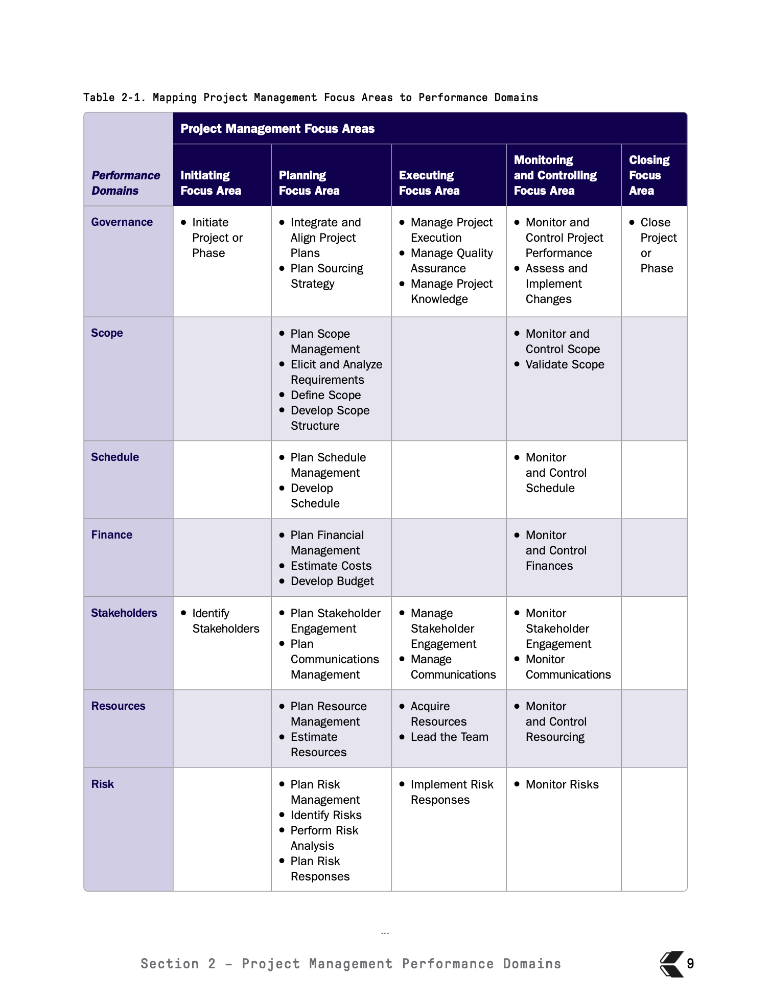

*PMBOK® Guide 8th Edition, Table 2-1, p. 9.*
