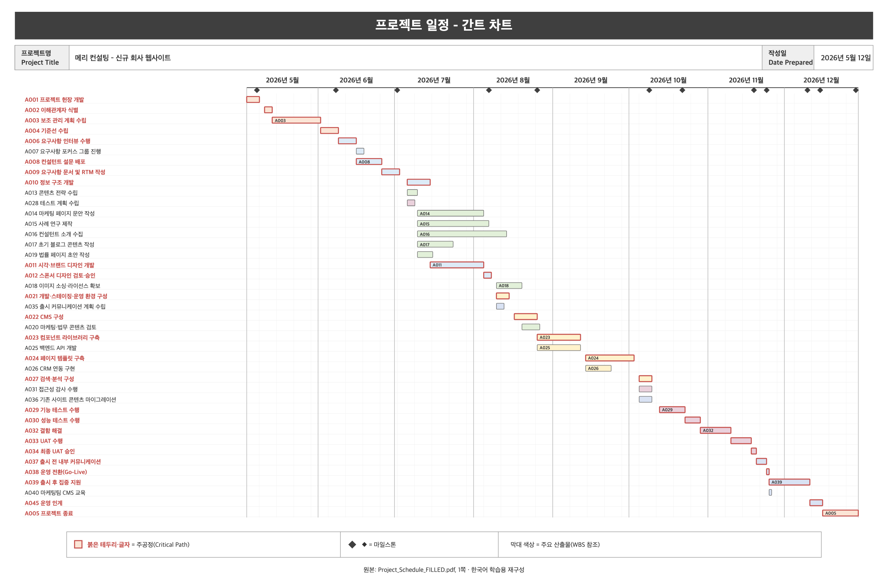
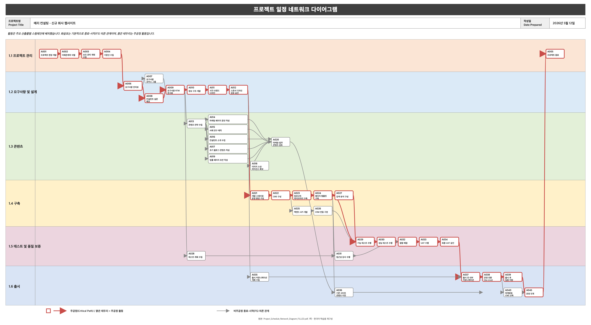

## PMBOK 8th Edition Processes

### SECTION DOWNLOAD, PLEASE WATCH

저는 20년 넘게 프로젝트 관리 강의를 해왔고 이제 오랫동안 해보고 싶었던 일을 해보고 싶습니다. 그것은 PMBOK 가이드를 바탕으로 실제 현장에 적용하는 것입니다.

PMBOK 가이드에서는 40가지 프로세스에 대해 배우게 될 텐데 이번 강의 섹션에서는 이 40가지 프로세스를 모두 살펴보겠습니다. 하지만 우리가 할 일은 조금 다를 겁니다.

이제 더 이상 단순히 어떤 서류가 있고 어떤 계획이 있는지 알려드리고 여러분이 스스로 알아내도록 내버려두지는 않을 겁니다. 이 과정은 단순히 시험에 합격하도록 돕기 위해 설계된 것이 아니기 때문이죠. 이 강의의 이 부분은 여러분이 실제 프로젝트에서 이를 적용할 수 있도록 돕기 위해 마련되었습니다.

그래서 제가 이렇게 했습니다. **PMBOK 가이드에서 언급한 모든 문서를 작성했습니다.** 위험 등록부부터 이슈 로그, 활동 목록, 마일스톤 목록에 이르기까지 모든 것이 여기에 포함되어 있으며 방대한 프로젝트 관리 계획서와 그 구성 요소들, 관리 계획, 기준선 등도 모두 여기에 있습니다.

이 강좌를 진행하는 동안 저는 **'메리 컨설팅'**을 예시로 들어 설명해 드리겠습니다. 메리 컨설팅은 저희가 완전히 새로운 웹사이트를 제작해 드릴 예정인 컨설팅 회사입니다. 그래서 이 문서들을 모두 보여드릴 테니 실제 모습이 어떤지 직접 확인해 보실 수 있을 겁니다.

자, 그럼 어떻게 하면 여러분이 이 내용을 생생하게 체감할 수 있을까요? 제가 소개해 드리는 모든 내용의 **빈 템플릿**을 제공해 드릴 테니 여러분도 바로 프로젝트에 활용해 보실 수 있습니다.

이 강의의 첨부 파일이 어떤지 한번 살펴볼까요? 기본적으로 세 가지 주요 첨부물을 갖게 되는 셈이죠.

**1. 발표 자료 (348페이지)**
제가 발표할 모든 슬라이드입니다. 슬라이드를 중앙에 배치하지 않고 빈 공간을 꽤 많이 남겨두었으니 여러분이 메모를 할 수 있도록 했습니다. PDF 파일에는 아무런 제한이 없으므로 파일을 열어 메모를 직접 입력하실 수 있습니다.

**2. PMBOK 프로세스 차트**
이걸 꼭 인쇄해 두세요. 이건 제가 항상 들고 다니는 건데 가끔은 이걸 가리키기도 해요. 화면에서 내가 뭘 보고 있는지 보려고 눈을 찡그리지 마세요. 이 내용을 인쇄해서 항상 휴대하시기를 강력히 권장합니다. 혹시 추가로 메모를 남기고 싶으실 경우를 대비해 '메모 페이지'라는 빈 페이지를 남겨 두었습니다.

**3. 템플릿 ZIP 파일**
여러분이 보고 싶어 하시는 그 파일은 ZIP 파일로 제공될 예정입니다. 이 ZIP 파일을 열면 여러 개의 폴더가 들어 있습니다. 이것들을 모두 추출해야 합니다. 거기에 모든 절차가 담겨 있습니다.

#### 강의 첨부자료 실제 구성

강의에서 언급한 자료는 모두 [`lecture_docs`](lecture_docs/) 폴더에 있습니다. 발표자료와 차트는 바로 열어 볼 수 있고, 압축 파일 안의 양식은 각 프로세스별로 **작성 예시(메리 컨설팅)**와 **재사용할 빈 양식**으로 짝을 이룹니다.

| 강의 자료 | 실제 파일 | 활용 방법 |
| --- | --- | --- |
| 발표 자료 | [PMBOK 프로세스 발표자료(348쪽)](lecture_docs/PMBOK+Process+Presentation.pdf) | 각 프로세스의 목적, ITTO, 도구와 예시를 슬라이드 순서로 확인합니다. |
| 프로세스 차트 | [PMBOK 8판 프로세스 차트(2쪽)](lecture_docs/PMBOK+8+Process+Chart.pdf) | 7개 성과영역과 5개 중점영역에 걸친 40개 프로세스의 위치를 한눈에 확인하고, 2쪽 메모 페이지에 학습 내용을 적습니다. |
| 계획·문서 양식 | [PMBOK 8판 계획·문서 양식 압축 파일](lecture_docs/PMBOK+8+Plans+and+Documents.zip) | 프로세스별 작성 예시와 빈 양식을 제공합니다. 압축 파일에는 메리 컨설팅 프로젝트 관리 계획서와 프로젝트 문서도 함께 들어 있습니다. |
| 인공지능 양식 작성 프롬프트 | [인공지능 양식 작성 프롬프트](lecture_docs/AI+Prompt+to+use+for+template.pdf) | 빈 양식과 함께 프로젝트 맥락을 입력해, PMI 표준에 맞는 초안을 생성할 때 사용합니다. |

#### 메리 컨설팅 템플릿 지도

강의 진행 중 아래 프로세스가 나오면 압축 파일에서 같은 이름의 폴더를 열어 작성본과 빈 양식을 함께 비교합니다. 모든 양식이 모든 프로세스에 제공되는 것은 아니며, 실제 제공된 산출물은 다음과 같습니다.

| 프로세스 또는 영역 | 제공되는 주요 양식 |
| --- | --- |
| **프로젝트 또는 단계 시작** | 비즈니스 케이스, 편익관리계획, 프로젝트 헌장, 가정 로그, 책임할당 매트릭스 |
| **이해관계자 식별** | 이해관계자 분석, 이해관계자 식별 설문지, 이해관계자 매핑 및 표현, 이해관계자 등록부 |
| **소싱 전략 계획** | 조달관리계획, 조달 전략, 공급원 선정 기준 |
| **범위 관리 계획 / 요구사항 도출 및 분석 / 범위 정의 / 범위 구조 개발** | 범위관리계획, 요구사항관리계획, 요구사항 문서, 요구사항 추적 매트릭스, 프로젝트 범위 기술서, 작업분류체계(WBS), WBS 사전 |
| **일정 관리 계획 / 일정 개발** | 일정관리계획, 활동 목록, 활동 속성, 기간 추정치, 기간 추정 워크시트, 마일스톤 목록, 프로젝트 달력, 프로젝트 일정, 네트워크 다이어그램, 일정 기준선 |
| **재무 관리 계획 / 원가 추정 / 예산 개발** | 재무관리계획, 자금조달 전략, 활동 원가 추정치, 추정 근거, 원가 기준선, 프로젝트 자금조달 요구사항 |
| **이해관계자 참여 계획 / 의사소통 관리 계획** | 이해관계자 참여 평가 매트릭스, 이해관계자 참여 계획, 의사소통관리계획 |
| **자원 관리 계획 / 자원 추정** | 자원관리계획, 팀 헌장, 자원 요구사항, 자원분류체계, 자원 추정 근거 |
| **위험 관리 계획 / 위험 식별 / 위험 대응 계획** | 위험관리계획, 위험 등록부 |
| **프로젝트 실행 관리 / 품질보증 관리 / 프로젝트 지식 관리** | 변경 요청, 이슈 로그, 작업 성과 데이터, 품질관리계획, 품질 메트릭, 품질 보고서, 친화도 다이어그램, 인과관계 다이어그램, 순서도, 교훈 학습 등록부 |
| **팀 이끌기** | 개인 평가, 팀 성과 평가 |
| **프로젝트 성과 모니터링 및 통제 / 변경 평가 및 실행** | 작업 성과 정보, 작업 성과 보고서, 변경 로그, 변경 요청(간단 양식·평가·승인) |
| **프로젝트 또는 단계 종료** | 최종 제품 전환, 최종 보고서, 최종 교훈 학습 등록부 |

자, 이제 이 40가지 프로세스 전반에 걸쳐 문서에 대해 설명해 드리겠습니다. 예를 들어 우리가 가장 먼저 다룰 주제 중 하나는 '프로젝트 시작 단계'입니다. 이곳에 들어가시면 프로젝트 헌장 같은 제가 설명할 모든 문서가 여기에 있습니다. 두 개를 드릴게요.

- **작성 예시:** 메리 컨설팅 과정에서 강의할 때 사용하는 작성된 예시
- **빈 양식:** 여러분이 프로젝트에 사용할 수 있는 빈 템플릿

**[꿀팁] AI로 템플릿 자동 작성하는 방법**

여러분이 현재 진행 중인 실제 프로젝트든 상상해 낸 가상의 프로젝트든 방법은 다음과 같습니다. LLM, ChatGPT, Claude 등 어떤 서비스든 가보세요. 명령 프롬프트나 채팅 창을 열고 "지금 이 프로젝트를 진행 중이에요"라고 말해 보세요. 가능한 한 자세하게 적어 주세요.

> "지금 IT 프로젝트를 진행 중입니다. 내용은 이렇습니다. 주요 성과물은 이렇고 회사 규모는 이 정도이며 업종은 이렇고 위치는 이렇습니다. 가능한 한 많은 정보를 입력한 다음..."

그리고 마지막에 이렇게 요청하세요.

> **"이 양식을 PMBOK 표준에 따라 작성해 주세요" 또는 "PMI 표준을 준수해서 작성해 주세요"**

그러면 AI가 해당 양식을 가져와 대신 작성해 줄 것입니다. 그렇게 하면 템플릿을 그대로 유지해야 한다는 것을 알 수 있습니다.

이렇게 하면 템플릿에 실제 프로젝트 내용이 채워진 모습을 확인할 수 있으므로 프로젝트에서 이 템플릿을 어떻게 활용해야 하는지 직접 확인해 보실 수 있습니다.

이 과정을 마치면 사실상 여러분만의 **프로젝트 관리 사무소(PMO)**를 열 수 있을 겁니다. 왜냐하면 제가 PMBOK 가이드에 언급된 모든 문서와 계획을 하나도 빠짐없이 다 알려드릴 테니까요.

예를 들어 이 프로젝트 헌장을 열어보시면 저는 이 기능이 정말 기대됩니다. 프로젝트 정보를 입력하기만 하면 AI가 자동으로 내용을 채워주는 것을 지켜보시면 됩니다. "와, 이거 내 프로젝트에 활용하면 되겠네"라고 생각하게 될 거예요.

**이 강좌를 따라가는 방법**

진행 과정에 대해 설명할 때 여러분이 해야 할 일은 제가 그 과정을 설명하는 동안 여기서 해당 과정을 찾아보는 것입니다. 물론 모든 프로세스에 문서가 있는 것은 아니며 모든 프로세스에 계획이 마련되어 있는 것도 아닙니다. 40개 중 24개나 25개 정도는 가지고 있는 것 같아요.

예를 들어 이해관계자를 파악할 때 바로 여기에서 이 항목을 찾아 열어보시면 제가 제시하는 자료들을 확인하실 수 있습니다.

제가 지금 보여드리고 있는 것, 즉 제가 인쇄해서 손에 들고 있는 이 자료들, '프로젝트 관리 계획'과 '프로젝트 문서'라고 적혀 있는 이 두 가지가 바로 전체 세트입니다.

- 하나는 **60페이지 분량의 메리 컨설팅 프로젝트 관리 계획서**
- 다른 하나는 **92페이지 분량의 메리 컨설팅 프로젝트 문서**

그리고 여기 있는 것이 귀하의 계획과 관련된 모든 지원 문서입니다.

자, 이 세 가지 첨부 파일이 여러분이 제 설명을 따라가시면서 사용하게 될 자료입니다. 강력히 추천합니다. 과정 차트를 인쇄하고 필요한 최소한의 준비물만 챙겨서 제가 수업을 진행하는 대로 따라오시며 이 빈 템플릿들을 활용해 보세요. 어떤 AI든 찾아가서 여러분의 프로젝트를 설명하고 "이 템플릿을 PMBOK 표준에 따라 작성해 주세요"라고 말해 보세요.

이제 지식이 더 풍부해졌기 때문에 시험에 합격할 수 있을 뿐만 아니라 더 훌륭한 프로젝트 매니저가 될 수 있을 것입니다.

자, 그럼 시작해 봅시다.

### Introduction to section

특정 시험을 준비할 때 많은 학생들이 한 가지 내용을 이해하는 데 큰 어려움을 겪는데 이 내용이 시험의 상당 부분을 차지하며 바로 **'공정 흐름도(Process Flow)'**입니다.

사실 저희도 이미 검토해 본 사항입니다. 지금까지 성과 영역에 대해 이야기하면서 도메인에 대해서는 언급했지만 그 과정 자체에 대해서는 자세히 다루지 않았습니다.

이번 섹션에서는 그 과정들을 다룰 것입니다. 이 모든 프로세스와 각 프로세스에 해당하는 **ITTO(입력, 도구 및 기법, 산출물)**를 하나하나 살펴보겠습니다.

사실 예전에는 이런 강의를 진행할 때 그냥 내용을 훑어보는 식으로 진행했습니다. 간략히 설명해 드리고 다음 주제로 넘어갔습니다. 하지만 우리는 그 상황을 바꿔 나갈 겁니다. 이 강좌에서 저의 목표는 이러한 과정을 생생하게 전달하고 실제 현장에서 어떻게 적용되는지 보여드리는 것입니다.

그럼 어떻게 해야 할까요? 시나리오 전체를 하나씩 훑어보도록 하겠습니다.

**우리가 진행할 시나리오는 '메리 컨설팅(Merry Consultant)'**이라는 회사에서 근무하는 내용입니다. 메리 컨설팅은 기본적으로 컨설팅과 프로젝트 관리 업무를 수행하는 회사이며 새로운 웹사이트가 필요합니다. 그래서 메리가 우리 프로젝트의 후원자가 되고 프로젝트 총괄을 맡게 될 거예요. 저희가 프로젝트 매니저를 맡게 될 예정이며 함께 일할 팀원들도 몇 명 있을 것입니다. 구체적인 팀원 구성은 시간이 지나면서 결정될 것입니다.

이러한 과정 전반에 걸쳐 시험을 준비하기 위해 숙지해야 할 수많은 문서와 계획서가 있을 것입니다. 이제부터 단계별로 진행해 나가면서 그 계획, 즉 프로젝트 관리 계획을 수립해 나갈 것입니다.

다음은 메리를 위한 프로젝트 관리 계획서입니다. 총 60페이지 분량이며 우리는 이 계획서들을 하나하나 꼼꼼히 살펴볼 예정입니다. 또한 프로젝트 문서도 작성하게 될 텐데 이건 훨씬 더 큰 작업입니다. 이 프로젝트 문서들은 프로젝트 관리 계획을 뒷받침하는 데 도움이 됩니다. 따라서 프로젝트가 진행되고 모니터링 및 관리 단계에 접어들면 그 전 과정을 지원해 줄 수 있는 도구가 마련되어 있습니다.

이 동영상이나 이 강좌의 다른 곳에서 템플릿을 찾으실 수 있을 겁니다. 이 모든 내용을 다운로드해서 저와 함께 따라 해 보실 수 있을 거예요. 또한 여러분이 직접 프로젝트에 적용할 수 있도록 빈 템플릿도 제공해 드릴 예정입니다. 여러분께 **AI를 꼭 사용해 보시길 강력히 추천**합니다. 템플릿과 함께 제공해 드릴 안내문에는 템플릿을 제대로 활용하기 위해 사용할 수 있는 프롬프트 유형이 설명되어 있습니다. 그렇게 하면 PMI 표준을 준수하는 프로젝트 헌장 등 이러한 모든 문서를 실제로 적용하기 시작할 수 있습니다.

꼭 전문가 수준이 될 필요는 없지만 여러분이 이 내용들을 실제로 적용하고 실생활에서 활용할수록 이 강좌와 제가 곧 알려드릴 모든 내용에서 더 큰 도움을 얻을 뿐만 아니라 더 뛰어난 프로젝트 관리자가 될 수 있을 거라고 믿습니다.

**한 가지 지적하고 싶은 게 있습니다.** 네, 제가 PMP 교재를 집필하긴 했지만 'PMBOK 가이드는 제가 쓴 게 아닙니다. 이 책에 실린 내용은 세계적으로 명성이 높고 매우 똑똑하며 저보다 훨씬 더 뛰어난 프로젝트 관리자들이 만든 것입니다. 이 책의 독자는 여러분과 같은 동료들, 즉 대규모 프로젝트를 관리하는 분들이 될 것이며 이 책에 담긴 내용은 모범 사례로 인정받고 있습니다.

"PMBOK 가이드"에서 다루는 이러한 모든 프로세스는 프로젝트 관리의 모범 사례가 될 것입니다. 여기서 가치 하락은 없다고 봅니다.

다음 영상에서 다룰 '프로젝트 시작'과 같은 이러한 프로세스를 배우고 실제로 어떻게 적용되는지 살펴보며 여러분의 프로젝트에 이를 어떻게 적용할 수 있는지 알아본다면 프로젝트 매니저로서 여러분께 큰 도움이 될 것이라고 생각합니다.

**이름 뒤에 이니셜 몇 개를 붙이기 위해서만 자격증을 따지 마세요. 이를 통해 더 뛰어난 프로젝트 매니저가 되세요.** 시험에 합격하기 위해서만 이 부분을 훑어보지 마세요. 이 내용을 꼼꼼히 살펴보시면 더 훌륭한 프로젝트 매니저가 되실 수 있습니다. 이 내용들을 익혀 실제 프로젝트에 적용해 보세요. 그렇게 한다면 더 뛰어난 프로젝트 매니저가 될 수 있을 것입니다. 직접 어떻게 진행되는지 보게 될 테니 자신감이 생기고 더 복잡한 프로젝트도 기꺼이 맡게 될 거예요.

많은 분들이 저에게 이런 말씀을 하십니다. "앤드류, 나 PMP 시험은 통과했는데 여전히 예전처럼 일하고 있어." 그게 무슨 말이야? 거기서 아무런 가치도 얻지 못했다는 거야? 가치를 얻으려면 실제로 적용해 봐야죠.

다시 말하지만 이건 제가 만든 게 아닙니다. 세계적으로 유명한 PM 전공 학생 여러분, 그들 중 한 명이 되고 싶다면 지금부터 이 방법들을 실천해 보세요. 제가 설명해 드리는 내용을 따라가면서 어떻게 적용해 나갈 수 있을지 직접 확인해 보세요.

마지막으로 한 가지 더 말씀드리자면 앞으로 많은 내용을 다룰 예정입니다. 이 섹션에서 다룰 내용은 시험을 치르는 데 있어 지나치게 상세한 내용이지만 이 과정은 PMI의 요구 사항에 따라 일정 시간 분량을 충족해야 하기 때문입니다. 겉보기에는 길게 끌고 가는 것처럼 보일지 몰라도 사실 그렇게 하지는 않을 거예요. 하지만 저는 그 수업 시간을 채워야 할 뿐만 아니라 여러분이 시험에 합격하게 하는 것뿐만 아니라 실력을 더 키워드리고 싶습니다. 사실 여러분께 제대로 가르쳐 드리고 싶어요. 이 강좌는 단순히 시험에 합격하게 하려는 목적이 아니거든요. 이 강좌는 제가 할 수 있는 한 최선을 다해 이 책의 내용을 여러분께 알려드리기 위한 것입니다.

그러니까 네, 시험 치르기에는 좀 과할 것 같네요. 저는 당신의 자격증 시험 수준을 훨씬 뛰어넘을 겁니다. 근무 시간을 채워야 한다는 건 인정해요. 지금 여기서 근무 시간을 채우고 있긴 하지만 그저 시간을 채우기 위해서만 일하고 싶진 않아요. 여러분이 내용을 익히고 실제로 적용할 수 있도록 충분히 시간을 할애하고 싶어요. 이 과정을 최고의 PMI 자격증 과정으로 만들어 여러분이 효과적으로 학습하고 시험에 합격할 수 있도록 하겠습니다.

자, 그럼 계속해서 이 모든 과정을 하나씩 살펴보겠습니다.

### Initiate project or phase

> **한글 프로세스명:** 프로젝트 또는 단계 시작

프로젝트 관리에 있어 가장 먼저 해야 할 일은 **프로젝트 승인을 받는 것**입니다.

생각해 보면 프로젝트 계획을 세우기 위해서는 조직의 자원을 활용해야만 합니다. 예를 들어 급여 같은 경우입니다. 어떤 조직이 당신에게 프로젝트를 기획해 달라고 한다면 그 대가로 보수를 지급해야 할 것입니다. 물론 무료로 일하지 않는 한 말이죠.

당신 같은 조직 내 인력을 활용하게 될 거군요. 상사의 시간이나 고객의 시간 등 다른 사람들의 시간을 사용하게 될 것입니다. 요구 사항을 수집하기 시작하면 잠재적인 팀원들이 일정과 예산을 수립하고 품질 기준을 마련하는 등의 작업을 도와줄 것입니다. 다시 말해 프로젝트를 계획하는 데는 상당한 자원이 필요합니다. 물론 프로젝트가 실행되면 결과물을 실제로 제작하는 데 엄청난 양의 자원이 투입될 것입니다.

자, 그 모든 일을 시작하기 전에 조직에서 여러분의 프로젝트를 승인하고 공식적으로 추진하기로 결정하기 전에 먼저 해야 할 일이 하나 더 있습니다.

그러면 이제 차트의 첫 번째 단계로 넘어가겠습니다. 프로세스 차트를 살펴보겠습니다. 제가 이 40가지 프로세스를 하나씩 설명해 드리는 동안 여러분께서는 이 자료를 꼭 출력해 두시기 바랍니다. 이걸 인쇄해서 책상 위에 두세요.

우리가 가장 먼저 할 일, 그리고 여러분이 그 프로젝트나 단계에서 가장 먼저 해야 할 일은 바로 이 **'시작(Initiate)' 단계**입니다.

'Initiate'라는 단어를 떠올릴 때마다 **'승인하다(Authorize)'**라고 생각해 주셨으면 합니다. 프로젝트에서 '승인'이라는 단어를 떠올릴 때 여러분은 **'프로젝트 헌장(Project Charter)'**을 생각해 주셨으면 합니다. 이는 예측형 프로젝트와 애자일 프로젝트 모두에 해당됩니다. 두 과정 모두 프로젝트 헌장이 수립되는 초기 단계를 거치게 됩니다.

**프로젝트 헌장이란 정확히 무엇일까요?**

프로젝트 헌장은 프로젝트를 공식적으로 승인할 수 있게 해주는 문서입니다.

이 과정은 공식적으로 문서를 작성하고 개발하는 과정입니다. 지금 언급하고 있는 문서는 이 프로젝트나 단계를 공식적으로 승인하여 시작하게 할 프로젝트 헌장입니다. 이것은 경영진의 결정으로 해당 프로젝트를 계획할 수 있도록 자원을 지원하겠다는 조직의 약속입니다.

따라서 이 단계가 승인되면 이제 본격적으로 이해관계자를 파악하고 요구사항을 수집하며 범위와 일정, 예산 등을 수립해 나갈 수 있습니다.

하지만 그 내용에는 무엇이 담길까요? 이 문서는 프로젝트의 산출물과 이 프로젝트가 정확히 무엇을 수행할 것인지에 대해 개요를 제시할 것입니다. 메리 컨설팅의 시나리오에 따라 우리는 메리 컨설팅을 위한 완전히 새로운 웹사이트를 개발하게 될 것입니다. 하지만 이를 실행하려면 계획이 필요하고 바로 이 계획이 제 손에 있습니다.

이 문서가 수행하는 또 다른 역할, 즉 이 프로젝트 헌장이 수행하게 될 또 다른 역할은 **여러분의 권한을 명확히 규정**하는 것입니다. 이 문서에는 프로젝트 관리자의 신원과 그 사람의 권한 수준이 명시될 것입니다. 이 프로젝트에서 그들은 어떤 역할을 할 수 있을까요? 따라서 프로젝트 관리자는 프로젝트 활동에 필요한 자원을 배정할 수 있는 권한을 갖게 됩니다.

이러한 프로젝트 활동, 즉 프로젝트 계획 수립과 업무 수행은 승인된 프로젝트 헌장을 통해 공식적으로 시작되고 승인됩니다.

그것이 바로 여기서 우리가 달성하고자 하는 목표입니다. 이 프로젝트 또는 단계의 시작 단계에서 목표는 프로젝트를 공식적으로 승인하고 프로젝트 관리자가 프로젝트의 계획, 실행, 모니터링 및 관리를 시작할 수 있도록 권한을 부여하는 문서를 작성하는 것입니다.

그러니 이 문서를 **프로젝트를 시작하는 것**으로 생각하시면 됩니다.

자, 이제 이게 무엇인지 알았으니 ITTO에 대해 살펴보겠습니다.

### Initiate project or phase input

> **한글 구간명:** 프로젝트 또는 단계 시작 — 입력

프로젝트 헌장을 작성하기 전에 이 과정을 시작하기 위해 몇 가지 정보가 필요할 것입니다. 그 다음에는 헌장을 작성하기 전에 몇 가지 도구를 살펴보겠습니다.

다음은 이 특정 프로세스와 관련된 모든 ITTO(입력, 도구 및 기법, 출력) 목록입니다. 그럼 이제 이 모든 내용을 하나씩 살펴보도록 하죠. 특히 이 영상에서는 그 입력 사항들을 한번 살펴보겠습니다.

**이 과정에 필요한 입력 요소들에 대해 이야기해 보겠습니다.**

즉 이러한 입력값들은 실제 프로세스를 시작하는 데 필요하거나 사용하게 될 요소들입니다.

자, 먼저 살펴볼 것은 두 가지 문서입니다. 여기서 말하는 입력 자료는 **'비즈니스 문서'**라고 합니다. 비즈니스 문서는 두 가지로 나뉩니다.

**1. 비즈니스 케이스(Business Case)와 혜택 관리 계획(Benefits Management Plan)**

- 사업 타당성 분석서
- 혜택 관리 계획서

이게 왜 필요할까요? 프로젝트를 시작하려면 상사에게 무언가 보고해야 하거든요. 왜 이 일을 하려는 건가요? 왜 이 프로젝트를 하고 싶은 건가요? 아니면 왜 이 프로젝트를 해야 하며 이 프로젝트를 진행하면 어떤 이점이 있나요?

배경은 저희 웹사이트가 매우 오래되었다는 점입니다. 잠재 고객이 전혀 발생하지 않고 있습니다. 우리는 많은 매출을 잃고 있습니다. 그 결과 잠재 고객은 50% 증가하고 매출도 50% 성장할 것입니다. 이것이 바로 사업 타당성 분석 및 혜택 관리 계획입니다. 이는 '비즈니스 문서'라고 불리는 입력 항목에 해당합니다.

**비즈니스 문서란 무엇인가요?**

- **비즈니스 케이스:** 해당 프로젝트를 수행해야 하는 구체적인 사유가 명시되어 있습니다. 왜 우리가 먼저 시작해야 하며 어떤 이점을 얻을 수 있나요? 프로젝트에 투자할 가치가 있는지 여부를 판단하는 데 필요한 정보입니다. 기업이 프로젝트를 진행해야 하는 이유는 무엇일까요?
  - 시장 수요: 특정 제품에 대한 수요가 다시 급증하고 있을지도 모릅니다.
  - 고객 요청
  - 내부적인 조직적 필요성: 예를 들어 요즘 많은 기업들이 AI 프로젝트를 도입하고 있습니다.
  - 새로운 규정이나 지침

- **혜택 관리 계획:** 이 프로젝트가 가져올 주요 이점은 무엇이며 그 이점을 어떻게 측정할 수 있을까요? 예를 들어 새로운 웹사이트 개발 프로젝트에서 우리가 언급한 주요 이점은 더 많은 잠재 고객을 확보하고 매출을 50% 증가시킬 수 있다는 점입니다. 다시 말해 이 프로젝트가 완료되면 우리가 얻게 될 제품, 서비스 또는 결과는 무엇일까요? 이는 단순히 프로젝트에 대한 비용 편익 분석을 수행함으로써 도출될 수도 있습니다.

**실제로 어떻게 생겼는지 보여드리겠습니다.**

**메리 컨설팅 시나리오:** 메리 컨설팅은 메리라는 분이 소유하고 있는 프로젝트 관리 컨설팅 회사이며 그녀가 이 회사의 CEO입니다. 지금 그녀는 아주 오래된 웹사이트를 가지고 있습니다.

- **비즈니스 케이스:** 문제는 현재 웹사이트가 구식이라는 점입니다. 해당 기업의 글로벌 규모를 반영하지 못합니다. 전략적 연계성은 15% 성장이라는 기업 전략을 뒷받침합니다. 현재 사이트는 개설된 지 7년이 되었습니다. 페이지가 너무 느립니다. 기존 사이트를 수정할 수도 있지만 새로운 사이트를 구축하는 것이 좋습니다. 그들은 15만 달러를 들여 새로운 사이트를 구축하기로 결정했습니다.

- **혜택 관리 계획:** 출시 후 12개월 이내에 잠재 고객 수가 25% 증가할 것입니다. 마케팅 활동을 10일에서 하루 미만으로 단축할 수 있게 될 것입니다. 브랜드 이미지를 향상시킵니다. 출시 첫 달 내에 콘텐츠 업데이트 속도가 빨라지고 모바일 전환율이 상승하는 등 이러한 긍정적인 효과는 지속적으로 이어질 것입니다.

제가 사용한 이 템플릿들이 매우 상세하다는 점을 강조하고 싶습니다. PMI 규정을 준수합니다. 기본적으로 PMI 웹사이트에서 다운로드했습니다. 여러분의 제안서는 제 것만큼 상세하지 않아도 되지만 내용이 상세할수록 프로젝트가 시작될 가능성이 높아집니다.

#### 이 시나리오에 해당하는 문서

위 내용은 [PMBOK 8판 계획·문서 양식 압축 파일](lecture_docs/PMBOK+8+Plans+and+Documents.zip) 안의 **프로젝트 또는 단계 시작** 폴더에 있는 다음 두 문서에 해당합니다.

| 한국어 문서명 | 이 시나리오에서 다루는 내용 | 메리 컨설팅 작성본 | 재사용할 빈 양식 |
| --- | --- | --- | --- |
| **비즈니스 케이스(사업 타당성 분석서)** | 노후 웹사이트 문제, 기업의 15% 성장 전략과의 연계, 기존 사이트 수정과 신규 구축 대안, 15만 달러 규모의 신규 사이트 구축 결정 | `프로젝트 또는 단계 시작/비즈니스 케이스_작성본.pdf` 원본 경로: `Initiate Project or Phase/Business_Case_FILLED.pdf` | `프로젝트 또는 단계 시작/비즈니스 케이스_빈_양식.pdf` 원본 경로: `Initiate Project or Phase/Business_Case_BLANK.pdf` |
| **편익 관리 계획서(혜택 관리 계획)** | 출시 후 12개월 이내 잠재 고객 25% 증가, 마케팅 활동 기간 단축, 브랜드 이미지 향상, 콘텐츠 업데이트 속도와 모바일 전환율 개선 및 편익의 지속 | `프로젝트 또는 단계 시작/편익_관리_계획서_작성본.pdf` 원본 경로: `Initiate Project or Phase/Benefits_Management_Plan_FILLED.pdf` | `프로젝트 또는 단계 시작/편익_관리_계획서_빈_양식.pdf` 원본 경로: `Initiate Project or Phase/Benefits_Management_Plan_BLANK.pdf` |

> **파일 표기 안내:** 압축 파일 안의 실제 영문 파일명은 변경하지 않았습니다. 위의 한국어 경로는 뜻을 알아보기 위한 표시이며, `작성본`은 메리 컨설팅 사례가 채워진 문서이고 `빈 양식`은 다른 프로젝트에 재사용하는 템플릿입니다.

**2. 합의(Agreements)**

여러분이 '합의'라는 단어를 볼 때마다 '계약'을 떠올려 주셨으면 합니다. 공급업체와 체결하는 계약과 같은 것. 이 내용은 공급업체로 일하는 경우에만 해당됩니다. 만약 본인이 계약자라면.

예를 들어 건설 회사에서 일한다고 가정해 봅시다. 시공사는 밥과 계약을 맺고 밥을 위해 집을 짓기로 했다. 밥에게서 받은 그 계약이 귀사의 프로젝트를 시작하게 될 것입니다. 내부 고객과 외부 고객 사이에서 발생할 수 있습니다.

시험에서 합의서, 계약서 등 모두 같은 의미입니다.

**3. EEF와 OPA - 일반적인 입력**

- **EEF(기업 환경 요인):** 'EEF'라는 용어가 나올 때면 기업 환경 요인이 해당 프로세스에 지대한 영향을 미칠 수 있다는 점을 꼭 기억해 주셨으면 합니다. EEF 그 자체가 바로 문화입니다. 따라야 할 규정, 외부적인 영향, 회사의 위험 감수 성향 때문입니다. 예를 들어 메리 컨설팅에서 프로젝트 헌장을 작성할 때 해당 국가의 개인정보 보호법을 준수해야 한다는 내용을 반드시 포함해야 합니다. 웹사이트에 해당 내용을 명시해야 하기 때문이죠. 그건 EEF일 겁니다.

- **OPA(조직 프로세스 자산):** 귀사에서 이 특정 프로세스를 수행하기 위해 마련한 템플릿이나 절차일 수 있습니다. 제가 여러분께 드린 비즈니스 케이스용 템플릿과 프로젝트 헌장용 템플릿이 바로 이 특정 프로세스에서 사용될 OPA가 될 것입니다.

프로젝트 헌장을 승인받으려면 비즈니스 케이스와 혜택 관리 계획이 필요합니다. 왜 그 일을 하려는 거지? 우리에게 어떤 이점이 있나? 바로 그 질문에 답하는 것이죠. 이 프로젝트 헌장은 프로젝트 관리 계획 수립의 토대가 될 것입니다.

자, 이제 입력을 다 다루었으니 이제 도구로 넘어가 보겠습니다.

### Initiate project or phase tools

자, 이제 과정을 시작하는 데 필요한 것들은 모두 준비되었으니 우리에게 도움이 될 만한 도구에는 어떤 것들이 있을까요? 프로젝트 헌장을 작성하는 데 도움이 될 만한 것들은 무엇일까요?

**1. 전문가 판단(Expert Judgment)**

프로젝트 헌장을 작성하려고 하는데 어떻게 해야 할지 잘 모르겠네요. 어떤 내용을 포함해야 할지 모르시거나 한 번도 작성해 본 적이 없을 수도 있습니다. 가장 좋은 방법은 누군가에게 물어보고 도움을 받는 것입니다. 조직 내의 밥이나 피터 혹은 제인이 이 일을 처리하는 데 있어 모범 사례를 알려줌으로써 도움을 줄 수 있을 겁니다.

**2. 데이터 수집 - 브레인스토밍, 포커스 그룹, 인터뷰**

프로젝트 헌장은 단순히 프로젝트를 승인하는 문서가 아닙니다. 개요, 주요 산출물, 개요 수준의 요구사항, 개요 수준의 범위, 개요 수준의 일정, 개요 수준의 위험과 같은 내용들이 포함되어 있습니다. 꽤 많은 정보가 담겨 있습니다. 그리고 그런 데이터를 얻으려면 고객들을 직접 만나야 합니다.

- **브레인스토밍:** 새로운 웹사이트는 어떤 형태여야 할까요? 프로젝트에 무엇을 포함해야 할까요? 무엇을 제외해야 할까요? 프로젝트에 어떤 위험 요소가 있을까요?
- **회의(Meetings):** 메리와 만나야 하고 밥과도 만나야 하며 피터, 제인, 조엘과도 만나야 해요. 회의가 꽤 많겠네요.
- **대인 관계 기술:** 이해관계자들 사이에 갈등이 생길지도 모릅니다. 회의 진행 및 관리를 담당하게 될 것입니다.

**3. 책임 할당 매트릭스(RAM) - RACI 차트**

시험을 준비하면서 꼭 알아두어야 할 도구 중 하나입니다.

RAM이란 기본적으로 차트인데 상단에는 역할이 표시되며 담당자를 기재할 수도 있습니다. 예를 들어 스폰서는 '메리'였고 프로젝트 매니저는 '앤드류'인 우리였거나 여러분의 이름, 분석가 등이 해당됩니다. 그런 다음 그 아래로 작업 항목을 나열합니다.

RACI는 다음을 의미합니다.
- **R - Responsible(책임자):** 업무를 실제로 수행하는 사람
- **A - Accountable(보고 대상자/승인권자):** 업무가 제대로 수행되도록 최종 책임을 지는 사람
- **C - Consulted(자문 대상자):** 업무 수행에 도움을 줄 수 있는 전문가
- **I - Informed(정보 제공 대상자):** 업무가 완료되었다는 사실을 알려야 하는 사람

시험을 볼 때 RACI 매트릭스가 무엇인지 꼭 기억하고 모든 과제에는 **'A'가 오직 하나만** 있어야 한다는 점을 명심하세요. 여러 사람을 R, C, I로 지정할 수는 있지만 최종적인 책임을 져야 할 사람(A)은 오직 한 명뿐이어야 합니다. A가 두 개 나오는 경우는 절대 피해야 합니다. 두 사람이 책임을 지게 되면 서로를 탓할 가능성이 높기 때문입니다.

예: 프로젝트 비전을 정의할 때 후원자가 A(책임)지만 실제 업무는 프로젝트 관리자가 R로 수행합니다. 비즈니스 분석가는 C, 개발자는 I가 될 수 있습니다.

**4. 프로젝트 캔버스(Project Canvas)**

이것은 시각적 도구입니다. 프로젝트의 계획과 주요 내용을 개요로 제시합니다. 지금처럼 프로젝트 초기 단계에서는 프로젝트 개요가 그리 상세하지 않을 것입니다. 수준이 꽤 높겠지만 프로젝트가 진행됨에 따라 더 자세한 내용을 알려드리겠습니다.

프로젝트 캔버스에는 이런 항목이 있습니다.

- 이 프로젝트의 목적은 무엇인가? -> 메리를 위한 새로운 웹사이트 구축
- 목표는 무엇인가? -> 전환율 높이기
- 프로젝트 승인 요건은 무엇인가? -> 새로운 웹사이트가 정상적으로 작동해야 하며 페이지 로딩 시간은 3초 이내여야 함
- 전체적인 범위는? 주요 산출물은? 가정, 위험 요소, 교훈, 팀 구성원, 잠재적 이해관계자, 주요 단계, 프로젝트 단계는 무엇인가?

이것은 완성된 프로젝트 캔버스에 가깝습니다. 처음에 프로젝트를 시작할 때는 캔버스가 그리 세밀하지 않을 것입니다. 이건 시각적 도구로 우리 프로젝트를 개요화하고 계획하는 데 도움이 될 뿐만 아니라 누구나 프로젝트를 한눈에 빠르게 파악할 수 있게 해줍니다.

이것들은 우리가 다음 단계, 즉 헌장 초안을 완성하는 데 도움이 될 도구들 중 일부가 될 것입니다.

### Initiate project or phase output

자, 이제 문서를 작성하는 데 도움이 되는 도구들이나 기존 도구들을 활용했으니 특히 프로젝트 헌장의 경우 이 과정의 결과물은 당연히 프로젝트 헌장이 될 것입니다. 하지만 저희에게는 **'가정 로그'**라고 부르는 또 다른 문서도 있습니다. 이것이 이 과정의 두 가지 주요 결과물이 될 것입니다.

**1. 프로젝트 헌장(Project Charter) - 주요 산출물**

프로젝트 헌장은 프로젝트의 존재를 공식적으로 승인하고 프로젝트 관리자에게 권한을 부여하는 역할을 합니다. 해당 문서는 조직의 고위 경영진의 승인을 받아야 합니다. 이 예시에서는 메리 본인이 될 것입니다. CEO께서 우리 프로젝트에 최종 승인을 하실 예정입니다.

여기에는 다음이 포함될 것입니다.

- 주요 위험 요소, 주요 요구 사항, 주요 예산, 주요 일정
- 목적 및 근거 (비즈니스 케이스와 혜택 관리 계획에서 가져옴)
- 프로젝트 관리자 권한 수준

**2. 가정 로그(Assumption Log)**

가정이란 정확히 무엇일까요? 가정이란 프로젝트의 현재 단계에서 **사실로 간주되는 모든 것**을 말합니다. 나중에 프로젝트 진행에 제약을 줄 수도 있는 가정입니다.

- 예: 웹사이트를 제작할 때 현재 사용 중인 웹 서버로도 새로운 웹사이트를 수용할 수 있을 것이라고 가정하여 굳이 새로운 웹 서버를 마련할 필요가 없다고 생각할 수 있습니다. 충분한 대역폭과 저장 공간이 있다고 가정하는 것입니다.
- 애플리케이션을 개발한다면 팀원들이 필요한 지식을 갖추고 있다고 가정하고 외부 컨설턴트가 필요 없다고 생각할 수 있습니다.
- 벽에 페인트를 칠하는 경우 이 시점에서 벽에 구멍이 없다고 가정할 수 있습니다.

이 강좌에서 '로그'나 '레지스터'라는 단어가 등장할 때마다 해당 항목은 이 과정에서 생성된 것이지만 그 과정이 중단되었다는 뜻은 아닙니다. 계속 업데이트됩니다. 즉 프로젝트 승인을 받는 즉시 이 절차에 따라 해당 문서를 작성하게 되며 프로젝트가 진행되는 동안 사실상 종료될 때까지 계속해서 내용을 업데이트하게 됩니다.

**실제 문서는 어떻게 생겼을까요?**

**프로젝트 헌장 샘플:**

- **목적:** 메리의 기존 웹사이트를 더 현대적인 웹사이트로 교체하기 위함
- **개요:** 새로운 공개 웹사이트를 기획, 개발 및 출시
- **범위:** 대중을 대상으로 한 마케팅 사이트
- **주요 산출물 및 개략적 요구사항:** 반응형으로 만들고 싶습니다. 태블릿, 모바일 기기 모두에서 반응형으로 작동해야 함
- **주요 목표 및 성공 기준:** 프로젝트가 성공했는지 어떻게 알 수 있을까요?
- **주요 단계(Milestone):** 이번 달에 사업 계획서 승인, 마감일 등
- **이해관계자:** 메리(CEO, 스폰서), 프로젝트 매니저는 저(앤드류), 팀원은 밥, 빌, 크리스틴
- **종료 기준:** 프로젝트가 완료되면 운영 환경으로 넘길 수 있는지, 즉 프로덕션 환경에 배포되었을 때
- **프로젝트 매니저 권한 수준:** PM은 밥, 빌, 크리스틴으로 구성된 핵심 팀에 의해 선정 및 배정됩니다. 일정 한도 내에서 지출을 승인하고 권한을 위임하며 예산 범위 내에서 최대 10%까지 예산을 재배정할 수 있습니다. 인력 배치 결정권, 기술적 결정, 문제 해결 권한이 있습니다.
- **후원사 서명**

**가정 로그 샘플:**

- 이 프로젝트는 설립 허가 후 6개월 이내에 시작될 수 있다.
- 이 세 사람(밥, 빌, 크리스틴)이 우리 프로젝트에 참여할 수 있을 것이다.
- 그 밖에도 여러 가지 가정들...

이 두 문서는 바로 그런 모습일 것입니다. 잊지 마세요, 그런 것들에 대한 템플릿이 준비되어 있습니다. 실제 프로젝트에서 이것들을 사용하실 수 있습니다.

자, 현재까지 프로젝트 헌장이 승인되었습니다. 그래서 프로젝트의 현재 단계에서 우리는 메리를 찾아갔습니다. 우리는 메리에게 완전히 새로운 웹사이트가 필요하다는 점, 즉 사업적 타당성을 설명해 주었습니다. 왜 그것을 사야 하는지, 이점으로는 페이지 로딩 속도 향상과 훨씬 더 많은 잠재 고객 확보가 있다고 설명했습니다. 그녀는 동의했고 프로젝트 헌장을 받았으며 이제 승인되었습니다.

다음에는 무엇을 할까요? 그건 다음 단계인 이해관계자 파악 과정에서 다룰 예정이니 다음 영상에서 뵙겠습니다.

### Identify Stakeholders

> **한글 프로세스명:** 이해관계자 식별

자, 이제 프로젝트 헌장이 마련되었고 모든 승인이 완료되었으며 후원자인 메리가 서명까지 마쳤습니다. 다시 말해 상사가 귀하의 프로젝트 시작을 승인했습니다. 가장 먼저 무엇을 할 건가요?

PMI에 따르면 프로젝트나 단계를 시작하고 프로젝트 헌장이 승인되면 다음으로 해야 할 일은 이 목록을 훑어보며 **이해관계자를 파악**하는 것입니다.

예를 들어 앱 개발 프로젝트, 방 페인트칠, 사무실 이전 혹은 건물 건축을 담당하게 되었다고 상상해 보세요. 그 프로젝트에 배정받는 순간 가장 먼저 해야 할 일은 이 프로젝트가 누구에게 영향을 미치는지 파악하는 것입니다. 이 프로젝트에 어떤 영향을 미칠 사람들이 있을까요? 누가 이 프로젝트를 진행하게 될까요? 이 프로젝트에서 각 구성원들은 어느 정도의 권한을 가지고 있을까요? 다시 말해 이해관계자들을 파악해야 합니다.

이 과정의 주요 목표, 즉 주요 결과물은 **이해관계자 명부(Stakeholder Register)**를 작성하는 것입니다.

그럼 이해관계자 명부를 한번 살펴보겠습니다. 이 문서는 가로 방향으로 작성되어 있어서 분량이 꽤 많습니다. 기본적으로 여러분이 보유한 이해관계자 목록일 뿐입니다. 여러분은 이걸 다운로드할 수 있습니다.

여기에는 이해관계자들의 이름만 나와 있습니다. 이 과정을 '이해관계자 파악'이라고 합니다.

#### 이 설명에 해당하는 문서

위 내용은 [PMBOK 8판 계획·문서 양식 압축 파일](lecture_docs/PMBOK+8+Plans+and+Documents.zip) 안의 **이해관계자 식별** 폴더에 있는 **이해관계자 명부**에 해당합니다.

| 한국어 문서명 | 문서에 기록하는 내용 | 메리 컨설팅 작성본 | 재사용할 빈 양식 |
| --- | --- | --- | --- |
| **이해관계자 명부** | 식별된 이해관계자의 이름, 연락처, 직위와 역할, 주요 요구사항과 기대사항, 프로젝트에 대한 영향력·관심도 등의 분류 정보 | `이해관계자 식별/이해관계자 명부_작성본.pdf` 원본 경로: `Identifiy Stakeholers/Stakeholder_Register_FILLED.pdf` | `이해관계자 식별/이해관계자 명부_빈_양식.pdf` 원본 경로: `Identifiy Stakeholers/Stakeholder_Register_BLANK.pdf` |

> **파일 표기 안내:** 압축 파일의 실제 폴더명 `Identifiy Stakeholers`에는 원본 철자 오류가 있으므로 변경하지 않고 그대로 표시했습니다. `작성본`에는 메리, 앤드류, 밥 등 메리 컨설팅 사례가 채워져 있고, `빈 양식`은 다른 프로젝트에 재사용하는 템플릿입니다.

- **메리:** CEO이자 후원자. 연락처, 요구사항, 기대사항이 적혀 있습니다. 그리고 '분류'가 있습니다. 그녀의 영향력은 어느 정도일까? 관심사는 무엇일까? 그녀는 막강한 영향력과 높은 관심을 가지고 있으니 어떻게 그녀를 면밀히 관리해 나갈 것인가.
- **앤드류(프로젝트 매니저):** 이메일 주소, 명확한 업무 범위, 의사결정 권한, 권한 위임이 필요합니다. 기대는 해당 업무 범위를 성공적으로 완수하는 것입니다.
- **밥:** 웹 개발자이자 기술 책임자. 이메일 주소, 기술 스택 승인, 이 프로젝트에 대한 기대와 평가.

이 과정을 통해 바로 이 문서가 만들어질 것입니다.

**우리가 뭘 하고 있나요?**

우리는 지금 이해관계가 있는 개인, 단체 또는 조직을 파악할 예정입니다. '지분'이라는 단어에 주목하세요. 이 프로젝트에 지분을 가져야 합니다. 이 프로젝트는 그들에게 영향을 미칠 것입니다. 어딘가에서 어떤 식으로든 이 프로젝트의 결과물이나 진행 상황이 그들에게 영향을 미치게 될 것이거나 혹은 그들에게 영향을 미치는 것으로 여겨질 수도 있습니다.

이 과정에서 우리는 이 이해관계자들을 분석하게 될 것입니다. 그들이 이 프로젝트에 어떤 관심을 가지고 있는지 그리고 어떤 역할을 맡게 될지 알고 싶습니다. 예를 들어 메리는 의사결정을 담당하게 되겠지만 기술 책임자인 밥은 웹사이트 제작을 직접 돕게 되므로 프로젝트에 직접적으로 관여하게 될 것입니다.

이들이 프로젝트에 미치는 영향이나 상호 의존 관계는 무엇이며 프로젝트의 성공에 어떤 영향을 미치나요? 예를 들어 메리는 프로젝트의 성공에 큰 영향을 미칩니다. 밥도 마찬가지입니다. 하지만 고객들은 어떨까요? 그들이 큰 영향을 미칠까요? 네, 그렇습니다. 왜냐하면 고객들이 웹사이트를 이용하지 않으면 웹사이트가 성공하지 못할 수도 있기 때문이죠.

여기서 가장 큰 장점은 프로젝트 팀이 각 이해관계자나 이해관계자 그룹과 어떻게 소통할지 결정하는 데 도움을 준다는 점입니다. 이 문서의 궁극적인 목적은 이들과 어떻게 소통할지 즉 이 사람들을 프로젝트에 어떻게 참여시킬지 그리고 그들의 요구 사항을 어떻게 충족시킬지 알아보는 것입니다.

**이 프로세스는 시작 단계에 있습니다. 하지만 계속 반복됩니다.**

제 프로세스 차트에는 '시작 중'이라고 표시된 프로세스가 많이 있을 텐데 사실 프로젝트 전반에 걸쳐 진행하게 될 것입니다. PMI가 우리에게 전하는 메시지는 이 과정이 바로 여기서 시작된다는 것입니다. 프로젝트를 시작할 때부터 이해관계자를 파악하기 시작해야 합니다. 하지만 그렇다고 해서 멈춰서는 안 됩니다. 여러분은 이해관계자를 파악하는 이 과정을 계속해서 반복하게 될 것입니다.

생각해 보면 매일 출근할 때마다 이해관계자들을 파악해야 합니다. 어제 피터가 떠났고 제인이 그 자리를 대신했다. 조직에 신입 사원이 한 명 들어왔습니다. 완전히 새로운 고객층이 생겼습니다. 메리가 CEO직에서 물러났고 다른 사람이 그 자리를 이어받았다. 이해관계자들은 오고 간다. 사람과 조직은 오고 간다.

그러니 여러분께서는 **이해관계자 명부가 지속적으로 업데이트되는 살아있는 문서**라는 점을 명심해 주시기 바랍니다. 조직 내 이해관계자의 변경 사항을 반영하기 위해 이 문서를 매일, 매주, 매월 꾸준히 업데이트해야 합니다.

그리고 '정기적'이라는 표현은 조직에 따라 매월일 수도 있고 매주일 수도 있습니다. 지속적인 식별은 프로젝트 환경이 변화함에 따라 위험 관리를 뒷받침할 수 있습니다. 새로운 이해관계자가 참여하게 되면 새로운 위험 요소가 발생할 수 있으니까요. 예를 들어 이해관계자와의 소통이 원활하지 않을 위험입니다.

예를 들어 조직에 새로 부임한 중간 관리자나 영업 관리자가 있는데 여러분이 그 이해관계자를 파악하지 못했다고 가정해 봅시다. 그건 큰 문제입니다. 그것은 프로젝트에 영향을 미칠 수 있는 위험 요소입니다. 방금 부임한 그 신임 고위 임원이 영업 부문을 총괄하고 있는데 귀사의 웹사이트가 영업 실적에 직접적인 영향을 미치기 때문입니다. 그 사람은 참여도가 높고 요구 사항을 제시해야 하지만 당신은 이를 제대로 파악하지 못하고 있습니다.

그러니 기억해 두세요. 이 작업은 프로젝트 진행 중 필요에 따라 주기적으로 수행됩니다. 우리가 무엇을 하고 있는 건가요? 이해관계자들을 파악하고 있는 겁니다. 우리는 이 '이해관계자 명부'라는 살아있는 문서를 작성하고 있습니다. 여기에는 모든 이해관계자가 나열될 것입니다. 이 보고서는 해당 프로젝트가 그들에게 어떤 영향을 미칠지 그리고 우리가 그 문제를 어떻게 해결할 것인지 알려줄 것입니다.

### Identify Stakeholders Inputs and Tools

자, 이제 이해관계자를 파악하는 과정을 파악했으니 이번 사안에 대한 ITTO를 살펴보겠습니다. 사용 가능한 도구가 꽤 많기 때문에 입력 항목과 도구들을 살펴보겠습니다. 이 도구들 중 일부는 시험에서 매우 중요한 주제가 될 것입니다.

**1. 입력**

과정을 진행하려면 무엇이 필요할까요?

**- 프로젝트 헌장:** 프로젝트 헌장에는 주요 이해관계자들이 명시될 것입니다. 후원사, 고객은 좋은 출발점이 됩니다. 이 과정은 헌장의 내용을 구체화해 나갈 것이기 때문에 모든 이해관계자가 포함된 것은 아닙니다.

**- 비즈니스 문서:**
- **비즈니스 케이스:** 프로젝트의 목표와 이해관계자들이 명시되어 있습니다. 왜 그들이 이 프로젝트를 원할까요? 영업 부서에서 이 프로젝트를 원하거든요.
- **혜택 관리 계획:** 이를 통해 혜택을 받게 될 이해관계자, 특히 영업 리드와 조직 내 영업 부서 전체를 파악할 수 있습니다.

**- 프로젝트 관리 계획:** 지금 이 강좌의 진행 단계에서는 아직 프로젝트 관리 계획을 작성하지는 않았지만 이는 계속해서 진행해 나갈 작업이라는 점을 기억하세요. 나중에 프로젝트 관리 계획이 마련되면 다시 이 단계로 돌아와서 이 과정을 계속해서 반복하게 될 것입니다.

- **커뮤니케이션 관리 계획:** 이 목록은 이해관계자와 그들의 의사소통 요구 사항을 파악했습니다. 만약 이미 '밥에게는 이런 종류의 커뮤니케이션이 필요하다'고 명시된 커뮤니케이션 관리 계획이 있다면 그건 바로 '이 사람이 내 이해관계자구나'라고 알려주는 셈이죠.
- **이해관계자 참여 계획:** 이를 통해 이해관계자와 그들과의 소통 전략을 파악합니다.

**- 프로젝트 문서:**
- **변경 로그, 이슈 로그, 요구사항 문서:** 이해관계자들이 변경 사항을 제안하거나 이슈를 제기하거나 요구사항을 전달할 때 그 사람이 이해관계자라는 사실을 알게 됩니다.
- **계약서:** 공급업체로 일하고 있으며 고객으로부터 계약서를 받았을 경우 이제 그 고객을 이해관계자로 파악한 것입니다.

**- EEF 및 OPA:** 귀사의 경영 방식이나 기업 문화, 템플릿 등을 고려할 때 제가 이해관계자 명부용 템플릿을 드렸잖아요. 이 템플릿이 바로 OPA가 될 것입니다.

**2. 도구 및 기법**

**- 전문가 판단:** 웹사이트 프로젝트, 애플리케이션 프로젝트에 영향을 미칠 수 있는 다양한 이해관계자들은 누구일까요? 정치 환경, 해당 산업, 기술에 대한 전문 지식을 갖춘 사람에게 물어보거나 이전에 이와 같은 프로젝트를 진행해 본 경험이 있는 사람에게 물어보세요.

**- 데이터 수집:**
- **설문지와 설문조사:** 잠재적 이해관계자들로 구성된 규모가 크고 흩어져 있는 그룹들로부터 의견을 수렴
- **브레인스토밍:** 잠재적인 팀원들을 한자리에 모아 이 프로젝트로 인해 영향을 받을 사람들이 누구인지 파악
- **인터뷰와 회의:** 다양한 사람들을 만나 "이 프로젝트가 여러분에게 영향을 미칠까요?"라고 물어보며 상황 파악

이 과정을 위한 표준 설문지가 있습니다. "누가 이 프로젝트를 승인하고 자금을 지원했나요? 누가 그 일을 수행할 것인가? 이 웹사이트로 인해 긍정적인 영향을 받게 될 대상은 누구일까요? 부정적인 영향을 받게 될 대상은 누구일까요? 공급업체는 어디일까요? 기술 분야 전문 지식을 보유한 사람은 누구일까요?"

**- 데이터 분석: 이해관계자 분석**

프로젝트에서 각 이해관계자가 어떤 역할을 수행하는지 파악하기 위해 활용합니다. 그들의 역할은 무엇인가요? 후원자인가요? 팀원인가요? 프로젝트로 인해 긍정적/부정적 영향을 받나요? 태도는 어떨까? 지지자일까? 중립적일까?

메리처럼 파악한 이해관계자들을 하나씩 나열하면서 '메리의 관심사는 무엇일까? 메리는 이 프로젝트에 어떤 영향을 미칠까?'라고 생각해 볼 수 있습니다.

**- 데이터 표현: 이해관계자를 나타내는 방법**

**a) 권력/관심사 매트릭스 (권력/영향력, 영향력 매트릭스)**

- **권력은 낮고 관심도 낮음:** 지켜보기(Monitor) - 변화하는지 지켜보기만 하면 됩니다.
- **권력은 높고 관심은 낮음:** 만족시키기(Keep Satisfied) - 만족시켜야 합니다.
- **권력은 낮고 관심은 높음:** 정보 제공하기(Keep Informed) - 지속적으로 정보를 제공
- **권력은 높고 관심도 높음:** 밀접 관리하기(Manage Closely) - 각별히 주의해서 관리해야 합니다.

예: 메리는 CEO로 막강한 권한과 높은 관심을 가지고 있으므로 '밀접 관리' 영역에 넣어야 합니다. 회계 부서의 제인은 관심이 낮고 힘도 없으므로 '모니터' 영역에 둡니다. 팀원인 피터는 팀원이므로 관심은 높지만 권한은 메리만큼은 아닙니다.

**b) 이해관계자 큐브:** 권력, 관심, 영향력을 바탕으로 3차원 큐브 안에 사람들을 배치하는 모델입니다.

**c) 현저성 모델(Salience Model):** 시험에서 접하게 될 수도 있는 모델로 이해관계자들에게 세 가지, 즉 **권력(Power), 시급성(Urgency), 정당성(Legitimacy)**을 부여합니다.

- **권력:** 권한의 정도
- **시급성:** 즉각적인 조치가 필요한 정도
- **정당성:** 실제 프로젝트 자체에 얼마나 깊이 관여하고 있는지, 적절한지

예를 들어 메리는 권한이 크고 시급성도 높으며 정당성도 높습니다. 프로그래머인 피터는 권한이 크지 않을지 모르지만 즉각적인 대응이 필요하며 실제 업무를 직접 수행하고 있기 때문에 정당성이 있습니다.

**d) 영향력의 방향:** 이해관계자들이 어디서 오는지 생각해 보세요.

- **상향:** 상급자, 고위 경영진
- **하향:** 당신이나 팀원들보다 권한이 적은 사람들
- **외부:** 정부 규제 당국, 최종 사용자, 일반 대중
- **수평:** 당신과 비슷한 직급에 있는 사람들, 기능별 관리자

**- 우선순위 설정(Prioritization):**

이제 이해관계자가 누구인지 파악했고 그들의 관심사와 영향력 수준을 알게 되었으니 이 프로젝트가 그들에게 어떤 영향을 미치는지 또 그들이 프로젝트에 어떤 영향을 미치는지 생각해 보십시오. 가장 두드러지고 중요한 이해관계자들은 이해관계자 명단에 바로 기재하십시오.

자, 여기 있는 도구들을 활용하면 이해관계자 목록을 작성하는 데 도움이 될 것입니다.

### Identify Stakeholders Output

이제 이해관계자를 파악하는 작업 자체를 마쳤으니 이 과정을 통해 실제 이해관계자 명단을 확보했을 것입니다. 도구 부분에서는 정말 많은 작업을 했습니다. 해당 이해관계자들을 파악했고 평가를 마쳤으며 두드러짐 모델도 살펴보았습니다.

이제 이해관계자 명단을 확보하셨습니다. 이게 정확히 뭘까요? **이해관계자 명부는 프로젝트 이해관계자에 대한 정보를 저장하는 문서**가 될 것입니다.

**이해관계자 명부에는 어떤 내용이 포함될까요?**

- **신원 확인 정보:** 이름, 역할, 직책, 근무지 및 연락처 정보
- **요구 사항과 기대 사항:** 그들이 원하는 것과 기대하는 것
- **영향과 파급 효과:** 예를 들어 밥이라는 팀원이 있다고 가정해 봅시다. 이 팀원의 요구사항은 프로젝트에서 결과를 얻는 것이고 기대하는 바는 자신이 그 업무를 수행할 수 있게 될 것이라는 점입니다. 팀원으로서 영향력은 크지 않을지 몰라도 CEO로서 프로젝트에 미치는 영향력과 파급력은 상당할 것입니다.
- **분류:** 내부 / 외부
  - 밥은 내부 직원입니다.
  - 아마존은 외부 이해관계자가 될 수 있습니다. 웹사이트를 구축하고 아마존 웹 서비스(AWS)에 호스팅하는 경우 아마존은 외부 이해관계자가 됩니다.
- **영향력, 관심도, 참여도:** 영향력은 어느 정도이며 이 프로젝트가 그들의 이익에 부합하는가? 이 프로젝트가 그들에게 어떤 영향을 미치거나 어떤 변화를 가져오는가?

여기서 이해관계자 명단을 다시 한번 살펴보겠습니다.

예를 들어 우리 팀에 **크리스틴**이라는 동료가 있는데 우리 프로젝트에서 크리스틴은 콘텐츠 전략가를 맡게 될 거예요. 그녀는 카피라이터입니다. 그녀가 우리 새 웹사이트에 올릴 내용을 작성할 거예요.

- **요구 사항:** 업무를 수행하기 위해 컨설턴트들의 도움이 필요합니다. 사례 연구와 브랜드 보이스 가이드라인이 필요합니다. 브랜드의 어조가 어떻게 되어야 하는지에 대한 조언이 필요합니다.
- **기대:** 현실적인 콘텐츠 마감일. 감당할 수 없는 일을 맡기지 마세요. 필요할 경우 해당 분야의 전문가와 상담할 수 있습니다.
- **분류:** 메리처럼 강력한 권한을 가지고 있지 않다. 직접 일을 맡고 있기 때문에 관심이 매우 높으며 항상 최신 정보를 파악하고 있어야 합니다.

이건 그냥 예시일 뿐이에요. 그리고 다시 말하지만 여러분은 모든 이해관계자 한 명 한 명에게 이 과정을 반복해야 합니다.

**그 밖의 결과물로는 무엇이 있을까요?**

**1. 변경 요청서:** 왜 변경 요청을 하는 걸까요? 기억하세요, 이는 지속적으로 이루어지는 과정입니다. 프로젝트 전체에 걸쳐 그렇게 하세요. 지금은 시나리오상 기획 단계에 들어가지 않았지만 프로젝트가 실행되어 실제로 업무를 수행하고 있다고 상상해 보세요. 프로젝트 관리 계획서가 있고 팀은 업무를 완수하기 위해 이 계획을 따르고 있습니다. 그러다 조직에 새로운 사람이 합류합니다. 완전히 새로운 이해관계자입니다.

그러면 평가를 수행하고 그들을 파악해야 하며 변경 요청이 필요할 수도 있습니다. 왜냐하면 이 문서들 중 일부를 수정해야 할 수도 있기 때문입니다. 예를 들어 이해관계자들과 어떻게 소통할지 결정하기 위해 **커뮤니케이션 관리 계획**이나 **이해관계자 참여 계획**을 업데이트할 수 있습니다.

**2. 프로젝트 관리 계획 업데이트:** 새로운 이해관계자가 합류하면 커뮤니케이션 관리 계획, 이해관계자 참여 계획을 업데이트해야 할 수도 있습니다.

**3. 프로젝트 문서 업데이트:**

- **가정 로그:** 새로운 이해관계자가 등장하면 다른 가정을 세워야 합니다. 이해관계자가 문서화 방식을 어떻게 원하는지에 대한 가정, 어떤 형태의 의사소통이 필요한가.
- **이슈 로그:** 이해관계자들이 제기한 문제점
- **위험 등록부:** 새로운 이해관계자가 새로운 위험 요소를 파악해 낼 수도 있습니다. 혹은 그들을 식별하지 못하면 위험할 수 있습니다.

예를 들어 여러분이 프로젝트를 관리하고 있는데 조가 신입 영업 사원으로 조직에 합류했다고 가정해 봅시다. 그러자 조가 "그 새 웹사이트가 제대로 작동하지 않네"라고 말했습니다. 그 순간 문제가 된 것입니다. 혹은 조엘이 "이 웹사이트가 제대로 작동하지 않을 수도 있어"라고 말할 수도 있습니다. 이제 그게 위험 요소라는 걸 알게 된 셈이죠.

그래서 문서 업데이트 항목 중 하나로 위험 등록부가 포함된 것입니다.

자, 여기 있는 것은 우리가 도출한 추가 결과물 중 일부에 불과합니다.

**지금까지 무엇을 해왔는지 한번 살펴봅시다.**

우리는 헌장을 마련했습니다. 우리는 공인 프로젝트 관리자입니다. 이해관계자 명부를 작성했습니다. 이 프로젝트로 인해 어떤 사람들이 영향을 받고 있는지 알고 있습니다.

계속해 봅시다. 계획할 일이 정말 많네요.

### Introduction to planning

자, 이제 프로젝트의 초기 단계를 마쳤습니다. 프로젝트 헌장을 마련하고 이해관계자들도 파악했으니 다음으로 해야 할 일은 이 문서 전체에서 가장 큰 비중을 차지하는 부분입니다.

사실 다음 중점 분야를 계획하는 과정에서 보시다시피 **총 19개의 프로세스**가 있습니다. 프로세스가 40개이고 프로세스 그룹이 5개라는 점을 고려하면 이 부분은 꽤 규모가 큰 편입니다.

계획 수립에서 우리가 무엇을 하고 있을까요? 아버지는 항상 저에게 이렇게 말씀하셨습니다. **"계획을 세우지 않는다면 실패를 계획하는 것과 다름없다."** 프로젝트에서 성공하고 싶다면 철저하고 치밀하게 짜여진 계획을 반드시 세워야 합니다. 훌륭한 계획은 훌륭한 실행, 훌륭한 모니터링 및 관리, 그리고 훌륭한 마무리를 보장합니다.

따라서 PMI는 포괄적인 계획을 수립하는 데 필요한 다양한 프로세스를 포함하는 이 프레임워크를 제시했습니다.

계획의 규모는 어느 정도일까요? 앞으로 19단계에 걸쳐 이 문서 전체를 완성해 나갈 예정입니다. **이 문서는 이 프로젝트를 실행하고 모니터링 및 관리하며 종료하는 방법을 안내해 줄 것입니다.**

이 관리 계획에는 관련 서류가 함께 첨부될 예정이므로 이 문서만 있는 것은 아닙니다. 사실 그 외에도 여러 가지 서류가 함께 제공될 예정이며 특히 이 모든 서류들이 포함될 것입니다. 이 문서들은 해당 계획을 뒷받침하기 위해 프로젝트에서 사용하게 될 추가 자료들입니다.

혹시 "앤드류, 그거 너무 많은 거 아니야?"라고 생각하신다면 인정하건대 정말 많은 양이긴 합니다. 여러분께 바로 말씀드리겠습니다. 알아야 할 내용이 꽤 많지만 안타깝게도 시험을 보려면 이 모든 것을 숙지해야 합니다.

그럼 이제 이 문서들과 계획을 모두 작성하는 이 과정을 즐겁게 진행해 봅시다. 만약 우리가 이 과정을 올바르게 수행한다면 프로젝트가 정상적으로 실행되고 모니터링 및 제어되며 마무리될 수 있을 것입니다.

### Integrate and align project plans

자, 그럼 시작해 볼까요? 이 19가지 프로세스를 하나씩 살펴보겠습니다. 물론 이 부분이 프로세스 차트에서 가장 큰 비중을 차지할 텐데 다시 말해 총 19가지 프로세스가 포함되어 있기 때문입니다.

우리는 항상 그 **거버넌스 프로세스**부터 시작할 것입니다. 거버넌스 프로세스는 그 아래에 있는 모든 프로세스를 포괄합니다.

여기 있는 거대한 프로세스 차트를 살펴보면 이 영상에서 제가 다루고 있는 프로세스는 바로 **'프로젝트 관리 계획서 개발(Develop Project Management Plan)'**입니다.

그 과정의 목표는 이 방대한 문서를 작성하는 것입니다. 이 문서는 프로젝트를 실행, 관리 및 종료하는 방법을 안내합니다.

사실 이 문서는 단일 프로세스에서 생성된 것이 아닙니다. 이 방대한 문서를 얻으려면 그 이면에 있는 모든 다른 절차들을 거쳐야 합니다.

따라서 이 문서, 즉 이 프로젝트 관리 계획서에는 범위 관리 계획이 포함될 것입니다. 범위 관리 계획은 어떻게 얻을 수 있나요? 이 절차를 따르면 됩니다. 이 문서에는 범위 기준선이 포함될 예정입니다. 이걸 여기서 가져올게요. 이 문서에는 일정 관리 계획과 일정 기준선이 포함되어 있습니다. 이 문서에는 비용 또는 재무 관리 계획과 비용 기준선이 포함될 것입니다.

이해되시나요? 다시 말해 이 문서는 이 과정을 통해 생성됩니다. 하지만 이 과정을 수행하려면 그 밑에 있는 모든 과정을 먼저 완료해야 합니다. 따라서 그 밑바탕에 있는 이 모든 과정들은 실제로 이 더 큰 과정으로 이어집니다.

그러니까 내가 "이봐, 밥, 이봐, 메리. 귀하는 이제 이 프로젝트의 프로젝트 매니저로 지정되었습니다. 내가 바라는 건 그저 그 과정을 따르는 것뿐이야"라고 말한다면 당신은 "알겠어"라고 대답하겠죠. 글쎄요, 그 말은 기본적으로 제가 당신에게 그 아래에 있는 모든 과정을 하나도 빠짐없이 다 따라야 한다고 말하는 셈이에요.

따라서 이 거버넌스 프로세스는 기본적으로 여러분이 실제로 무엇을 하고 있는지 알려주는 포괄적인 요약 과정입니다. 그리고 그 과정을 진행하려면 그 기반이 되는 다른 모든 작업들을 먼저 수행해야 합니다. 왜냐하면 그 다른 과정들의 결과물이 바로 이 큰 계획을 수립하는 데 필요한 입력 자료가 되기 때문입니다.

**그렇다면 '프로젝트 관리 계획서 개발'이라는 이 프로세스의 목표는 무엇일까요?**

바로 모든 하위 관리 계획, 기준선 및 지원 프로젝트 문서를 **하나의 통합된 프로젝트 관리 계획**으로 통합하는 것입니다.

나머지 프로세스들, 즉 나머지 18개—여기 총 19개의 프로세스가 있다는 점을 기억해 주세요—우리는 그중 하나를 다루고 있습니다. '통합 및 프로젝트 계획 조정' 아래에 있는 나머지 18개 프로세스는 개별적인 계획을 수립하는 반면 이 프로세스는 그 모든 계획을 하나로 통합합니다.

이 대규모 계획, 즉 대규모 프로젝트 관리 계획은 **프로젝트가 어떻게 실행, 모니터링 및 통제되고 종료될지**를 규정합니다.

이것이 입력값이 될 것입니다. 단언컨대 이것이 모든 실행, 모니터링, 제어 및 종료 프로세스의 기반이 될 것입니다. 승인된 계획은 프로젝트 전반에 걸쳐 성과를 평가하는 기준이 됩니다.

프로젝트 진행 기간 내내 이것이 바로 여러분의 프로젝트 성과를 평가하는 기준이 될 것입니다. 이 문서는 업무 수행 방법과 성과 측정 방법을 안내합니다. 작업이 진행되고 팀이 결과물을 만들어 가는 과정에서 이 계획을 바탕으로 팀의 성과를 평가하게 될 것입니다.

프로젝트 후원자나 상사가 가장 자주 묻는 질문 중 하나는 "프로젝트 진행 상황은 어때요?"일 것입니다. 그러면 당신은 "아, 잘 진행되고 있어요"라고 대답하겠죠. 하지만 그렇게 대답하려면 기준선과 계획안을 실제 진행 상황과 비교해 봐야 합니다.

자, 이것이 계획입니다. 이제 이 계획과 실제 진행 상황을 비교하여 프로젝트가 어떻게 진행되고 있는지 확인하게 될 것입니다.

이것이 바로 '통합 및 조정 프로젝트 계획'입니다. 다음은 목표입니다. 이 계획을 수립하기 위해 그 아래에 있는 18가지 절차를 모두 진행해 봅시다.

###  Integrate and align project plans inputs and tools

프로젝트 계획을 통합하고 조정하는 데 필요한 몇 가지 입력 사항과 도구를 살펴보겠습니다. 이 프로세스와 관련된 다양한 ITTO들을 하나씩 살펴보겠습니다.

**1. 입력**

**- 프로젝트 헌장:** 이 단계에 이르려면 프로젝트 헌장이 이미 승인되었어야 합니다. 프로젝트 헌장에는 프로젝트에 대한 개요 정보, 주요 산출물, 가정 등이 포함되어 있습니다. 또한 권한도 부여할 것입니다. 해당 기관은 귀하가 방대한 프로젝트 관리 계획을 수립하기 위해 필요한 자원을 활용할 능력이 있다고 명시해야 합니다. 그게 첫 번째 입력값이 될 겁니다.

**- 다른 계획 프로세스의 산출물:** 흥미로운 입력입니다. 나머지 18가지 계획 수립 과정을 진행하면 그 결과물이 나올 것입니다. 예를 들어 '범위 관리 계획'을 수립하면 범위 관리 계획서가 생성됩니다. 그 과정을 통해 도출된 이 문서는 본 문서의 기초 자료가 됩니다. 따라서 이 계획 범위 관리는 이 프로젝트 관리 계획에 포함되어야 합니다.

'다른 계획 프로세스의 산출물'이라고 적힌 이 항목을 보시면 다른 18개 계획 프로세스를 진행하면서 해당 프로세스에서 생성된 문서들을 받게 될 것입니다. 그들이 귀하에게 범위 관리 계획서, 일정 관리 계획서, 일정 기준선, 비용 관리 계획과 비용 기준선 등을 제공할 것입니다. 이것들이 프로젝트 관리 계획의 구성 요소가 됩니다. 그러면 모든 기준선과 세부 관리 계획이 제공될 것입니다.

**- EEF와 OPA:**

- **EEF:** 조직 문화가 작동하는 방식, 조직의 구조, 우리가 따르는 규정, 그리고 우리가 사용하는 컴퓨터 정보 시스템 등은 모두 계획 수립 방식에 영향을 미칩니다. 예를 들어 의료 업계에서 일하고 있다면 환자 기록의 개인정보 보호를 위한 HIPAA 규정과 같이 의료 분야에서 준수해야 하는 모든 규정이 이 계획의 내용에 영향을 미칠 수 있다는 점을 염두에 두는 것이 좋습니다. 이는 기준선에 영향을 미치며 업무 수행 방식에도 영향을 미칩니다.

- **OPA:** 조직을 위해 프로젝트 관리 계획을 수립해야 할 때 조직에서 제공해 줄 수 있는 가장 유용한 것 중 하나가 바로 템플릿이거든요. 해당 기관에서 이 계획을 수립하는 데 사용할 수 있는 양식을 제공해 준다면 매우 감사하겠습니다. 이전 프로젝트 관리자들로부터 얻은 교훈, 구성 관리 지식 기반은 이 계획들의 다양한 항목을 어떻게 구성하거나 이 계획들을 어떻게 설정하는지에 대한 내용을 다룰 것입니다. 그러니 이 OPA가 이 계획을 수립하는 데 있어 훌륭한 출발점이 될 것입니다.

**2. 도구 및 기법**

자, 이 자료들이 바로 우리가 작업을 시작하는 데 필요한 것들입니다. 이 거대한 계획을 세우는 데 도움이 될 만한 것들은 무엇일까요?

**- 전문가 판단:** 어떻게 해야 할지 잘 모르겠습니다. 회사에서 프로젝트 관리 계획을 수립하라고 맡겼지만 어떻게 해야 할지 잘 모르겠다. 그 일을 어떻게 하는지 아는 전문 지식을 갖춘 조직 내의 누군가에게 물어보세요. 예를 들어 비용 관리 단계에 이르렀을 때 예산 편성에 필요한 지식이 부족할 것이라는 점을 명심하세요. 스케줄링을 할 만한 지식이 부족할 수도 있습니다. 그래서 우리는 범위, 일정, 비용, 위험 등 각 분야에 전문 지식을 갖춘 전문가들을 채용할 예정입니다.

**- 데이터 수집:** 이 거대한 계획을 세우려면 많은 정보를 수집해야 합니다. 이 계획을 수립하는 데 도움을 주고 있는 이해관계자들과 전문가들로부터 정보를 수집해야 할 것입니다.

- **브레인스토밍:** 많은 사람들을 한자리에 모아 그들의 의견을 수렴하고 이러한 계획을 통합하기 위한 방안을 모색
- **체크리스트:** 특정 공급업체의 제품을 설치하는 프로젝트나 상용 소프트웨어를 설치하는 프로젝트의 경우 해당 공급업체에서 프로젝트의 성공을 위해 계획에 포함해야 할 사항들을 정리한 체크리스트를 제공해 줄 수도 있습니다. 조직 자체에서도 계획에 포함해야 할 사항에 대한 체크리스트를 마련해 두기도 합니다.
- **포커스 그룹 및 인터뷰:** 해당 분야 전문가들의 의견을 수렴하기 위한 것. 고객들을 인터뷰하고 프로젝트에 대해 무엇을 원하는지 물어보는 것이 정말 중요합니다.

**- 대인 관계 및 팀 기술:**

많은 사람이 한자리에 모이면 갈등이 생깁니다. 밥이 "이봐, 내 생각엔 이렇게 하는 게 좋겠어. 이건 계획에 포함되어야 해"라고 말합니다. 그러자 피터가 "글쎄, 아니야. 내 생각엔 그건 계획에 넣지 않는 게 좋겠어. 차라리 이렇게 해야 해"라고 말합니다. 갈등. 프로젝트 매니저로서 이 갈등을 해결해야 할 것입니다. 그건 일의 일부니까요. 따라서 갈등 관리, 회의 안건에 대한 상충되는 요구 사항을 조정하고 앞으로 진행할 회의에서 합의를 이끌어내는 역할을 수행해야 하며 물론 많은 사람들과 회의를 하게 될 것이므로 회의 진행을 관리하고 논의가 본론에서 벗어나지 않도록 해야 합니다.

**- 회의 및 기획 워크숍:** 많은 사람들과 접촉하게 될 것입니다. 여러 회의와 다양한 기획 워크숍을 주도하고 진행하며 사람들이 아이디어를 제시할 수 있도록 이끌어 나가게 될 것입니다.

**- 프로젝트 캔버스:** 앞서 프로젝트 헌장에 대해 설명할 때 보여드렸던 것처럼 모든 계획 과정을 진행해 나가는 동안 진행 중인 작업, 완료된 작업, 그리고 주요 구성 요소가 무엇인지 한눈에 확인할 수 있게 해주는 시각화 도구입니다. 프로젝트 진행 중에 계속 가지고 다니고 싶은 것 중 하나입니다.

자, 여기 도구들이 있습니다. 이러한 도구들을 살펴보시면 필요한 정보를 얻으실 수 있으며 이를 활용하시면 이제 계획을 수립하는 데 도움이 될 것입니다.

### Integrate and align project plans output

프로젝트를 원활하게 수행하고 진행 상황을 관리하며 마무리하는 데 있어서는 명확하게 수립된 계획이 필수적입니다.

이 문서를 작성하는 데 필요한 자료와 도구에 대해 살펴보았으니 이제 문서를 좀 더 자세히 살펴보겠습니다.

이 프로세스의 주요 산출물인 **프로젝트 관리 계획서는 여러 구성 요소로 이루어진 문서**가 될 것입니다. 특정 프로젝트의 경우 이러한 구성 요소가 하나도 빠짐없이 상세하게 포함되어 있어 그 수가 18~19개에 달하기도 합니다.

어떤 구성 요소를 얼마나 많이 사용할지 그리고 그 구성 요소들이 얼마나 세밀하게 구현될지는 결국 진행 중인 프로젝트에 따라 달라질 것입니다. 귀사에서 프로젝트 관리 계획을 얼마나 상세하게 수립하느냐에 따라, 그리고 귀하의 업종에 따라 달라집니다.

예를 들어 다리 건설과 같은 정부 프로젝트를 관리하고 있는데 인력이 많고 변동 요소가 많은 매우 복잡한 프로젝트라면 프로젝트 관리 계획서에는 이러한 모든 요소가 하나도 빠짐없이 포함될 것이며 그 내용은 정말로 매우 상세할 것입니다.

반면 IT 스타트업에서 일하고 있고 직원이 겨우 7명 정도이며 앱 개발만 하고 있다면 이 모든 구성 요소들은 사실상 누군가의 머릿속에만 존재하게 될 것입니다. 정식 문서보다는 좀 더 비공식적인 형태가 될 것입니다. 프로젝트 매니저는 두 명을 관리하는 한 사람일 뿐이고 모든 일을 머릿속으로만 처리할 수 있기 때문이죠.

올바른 방법과 잘못된 방법은 무엇일까요? PMI에 따르면 옳고 그른 방법은 따로 없습니다. 프로젝트 관리 계획을 수립하는 방식은 귀하와 귀하의 조직에 달려 있습니다. PMI가 하는 일은 그저 "이것들은 여러분의 계획에 포함시키는 게 좋을 것 같은 내용들입니다"라고 알려주는 것뿐입니다.

그러니까 오로지 수업 목적으로, 그리고 여러분의 시험 준비를 위해 이 모든 구성 요소가 필요하다고 가정해 봅시다. 우리는 완벽한 계획을 세우고 싶기 때문에 이 모든 요소가 필요하다고 말할 거예요. 그리고 바로 그 완벽한 계획이 제가 시험에서 해야 할 일입니다.

이 강좌가 실제 프로젝트 관리 방법을 가르쳐 준다는 점을 꼭 강조하고 싶습니다. 이 영상에서 모든 구성 요소를 다 다루지는 않을 겁니다. 여기에 있는 모든 구성 요소는 다른 공정에서 제작됩니다. 이건 거버넌스 프로세스 맞죠? 이 거버넌스 프로세스에는 그 아래에 있는 모든 프로세스가 포함되어 있습니다. 그러니 이제 그 이면의 모든 과정을 하나씩 살펴보고 이에 맞춰 계획을 수립해 나가면서 이러한 요소들을 구체화해 나갈 것이며 이에 대해 더 자세히 설명해 드리겠습니다.

**프로젝트 관리 계획서란 무엇인가?**

이 계획서는 꽤 분량이 많은 문서였습니다. 이것이 통합된 시스템입니다. 왜 통합되었냐면 그 안에 수많은 구성 요소가 포함되어 있기 때문입니다. 문서의 분량에 따라 18~19개의 구성 요소가 포함됩니다.

이 문서는 승인된 기본 문서이며 핵심 용어를 정의하고 있습니다. 여러분이 꼭 알아두셔야 할 단어는 **'어떻게(How)'** 입니다. 프로젝트의 실행, 모니터링 및 관리 방식. 그게 바로 핵심 단어죠.

여기에는 다음이 포함됩니다.

- **개발 접근 방식:** 이 프로젝트는 예측형 프로젝트인가요? 반복형인가요? 아니면 혼합형 프로젝트인가요?
- **하위 관리 계획:** 범위, 일정, 비용, 품질, 자원 등 수많은 관리 계획
- **기준선(Baseline):** 범위 기준선, 일정 기준선, 비용 기준선

실행에 들어가기 전에 발주처의 승인을 받아야 합니다. 지금은 후원자로 표기해 두었지만 조직의 고위 경영진이나 주요 이해관계자일 수도 있습니다.

여러분이 꼭 알아두셔야 할 점은 이 프로젝트 관리 계획이 **예측형 프로젝트인 경우, 계획이 승인된 후에는 어떤 구성 요소에 대한 변경이든 승인된 변경 요청서가 필요하다**는 것입니다.

19가지 계획 수립 과정을 모두 거치고 훌륭한 계획을 세우고 그 모든 구성 요소를 마련합니다. 이 계획서는 우리가 어떻게 실행하고 어떻게 모니터링하고 관리하며 어떻게 프로젝트를 마무리할지에 대해 설명하고 있습니다. 하지만 이 계획서에는 우리가 실제로 어떻게 업무를 수행할지에 대해서는 언급되어 있지 않습니다. 이 계획에는 작업 내용이 무엇인지도 명시되어 있습니다.

- 범위 기준선: 벽을 흰색으로 칠하세요. 5페이지 분량의 웹사이트를 만드세요.
- 일정 기준선: 이걸로 시작해서 이걸로 끝낼 겁니다.
- 비용 기준선: 예산도 충분합니다.

이 프로젝트가 실행되고 이 계획이 승인되면 승인된 변경 요청이 없는 한 누구도 이를 변경할 수 없습니다.

이 프로젝트가 월요일 아침에 실행된다고 가정해 봅시다. 수요일 피터가 들어와서 "이걸 프로젝트에 추가해 줄 수 있나요?"라고 묻습니다. 피터는 작업 범위를 확장하고 싶어 합니다. 그러면 당신은 이렇게 대답하겠죠. "글쎄요, 이 계획의 내용을 변경하고 싶으시다면 변경 요청서를 제출해 주셔야 합니다." 그런 다음 해당 변경 요청을 검토하고 계획을 승인한 담당자(스폰서)에게 전달하여 범위 확대를 승인받은 뒤 계획을 업데이트하게 됩니다.

상사가 여러분의 계획서, 즉 주요 프로젝트 관리 계획서를 꼼꼼히 검토하고 승인했다면 상사의 승인 없이 그 계획을 변경할 수 있을까요? 상사는 여러분이 이 계획서를 바탕으로 프로젝트를 수행하기를 기대하고 있으니까요. 내용을 수정하고 싶다면 상사의 서명을 한 번 더 받아야 합니다. 엄밀히 말하면 누군가 문서에 서명하면 그 사람이 다시 서명하지 않는 한 그 문서를 수정할 수 없는 게 맞죠.

이 계획이 승인되고 예측 가능한 프로젝트에 대해 최종 승인이 나면 제가 굳이 '예측 가능한 프로젝트'라고 강조하는 이유는 애자일 프로젝트에서는 이 계획이 매우 비공식적이기 때문입니다. 때로는 그 중 상당 부분을 머릿속으로만 관리하기도 하고 아니면 그냥 스크럼 프로세스에 따라 업무를 진행하기도 합니다. 이 부분은 애자일에서 다루게 될 내용이지만 주로 이러한 계획이 매우 상세하고 대개 변경 요청이 필요한 예측형 프로젝트에서 그런 경우가 많습니다.

**관리 계획 vs 기준선 - 차이가 뭘까요?**

모든 관리 계획은 **실행 지침서**입니다. 프로젝트의 해당 부분을 어떻게 관리해야 하는지 알려줍니다.

- **일정 관리 계획:** 일정 수립 방법, 일정의 정확성을 확인하는 방법, 어느 정도 정확해야 하는지, 그리고 프로젝트 일정을 준수하는 방법에 대해 설명합니다.
- **일정 기준선:** 실제 일정입니다. 프로젝트는 6월 1일에 시작되어 8월 31일에 종료됩니다. 프로젝트는 5월 8일에 시작됩니다. 12월 29일에 종료됩니다. 중요한 날짜들이 표시됩니다.

즉 관리 계획은 '어떻게(How)'를, 기준선은 '무엇을(What)'을 담고 있습니다.

예를 들어 제가 가지고 있는 일정 관리 계획서에는 일정 관리 방법론이 포함되어 있습니다. 메리의 컨설팅 프로젝트에서는 일정 수립에 중요경로법을 사용할 것이라고 합니다. 어떤 도구를 사용해야 하는지 알려줍니다. 그들은 마이크로소프트 프로젝트를 사용할 예정입니다. 정확도의 수준, 측정 단위, 일정에 대해 어떻게 보고하고 일정은 어떻게 업데이트할 계획인가요? 이 문서에는 '어떻게'에 대한 내용이 상당히 많이 포함되어 있습니다.

또 다른 예로는 범위 관리 계획이 있습니다. 범위 관리 계획서에는 범위를 설정하는 방법이 설명되어 있습니다. 범위를 어떻게 검증할 계획인가요? 작업이 진행되는 동안 범위를 확인하고 해당 작업이 범위에 부합하는지 어떻게 점검할 계획인가요? 바로 이것이 범위 관리 계획입니다.

범위 관리 계획서에는 뭐가 빠져 있는지 아세요? 바로 프로젝트의 실제 범위 말이에요. 우리가 5페이지짜리 웹사이트를 만들고 있다는 사실이나 제가 이 벽을 흰색 페인트로 칠하고 있다는 사실 같은 것들이요. 그것이 범위 기준선이 될 것입니다.

- **관리 계획:** 어떻게 할 것인가? 범위 관리, 요구사항 관리, 일정 관리, 재무 관리, 품질 관리, 자원 관리 등
- **기준선:** 무엇을 할 것인가? 5일 동안 벽을 흰색으로 칠하는 데 500달러가 듭니다. 1만 달러로 5페이지 분량의 웹사이트를 제작하며 비용 기준선과 소요 기간은 2개월입니다.

성과 측정 기준은 이러한 다른 기준들을 어떻게 측정하고 성과를 어떻게 관리해야 하는지 알려줍니다. 조달 전략, 아웃소싱은 어떻게 진행할 계획인가요? 아웃소싱을 할 경우 어떤 유형의 계약을 체결할 예정인가요? 라이프사이클 설명은 프로젝트의 진행 과정을 알려줍니다. 이 프로젝트에는 어떤 단계들이 있으며 하이브리드 방식인가요?

**완벽한 계획이란 무엇일까요?**

PMI가 생각하는 완벽한 계획이 무엇인지 말씀드리겠습니다.

어떤 프로젝트를 맡게 되어 완벽한 프로젝트 관리 계획을 수립했다고 상상해 보세요. 작업 범위 설정 방법, 범위 변경 사항 관리 및 범위 내 작업 유지 방법, 일정과 예산 수립 방법, 품질 관리, 의사소통 및 이해관계자 관리 등 여러분이 알고 있는 모든 노하우와 지식을 총동원해야 합니다. 프로젝트를 관리하는 모든 단계를 하나하나 적어볼 거예요. 그러면 프로젝트의 범위, 소요 기간, 비용, 기준 계획 등을 기재하게 되겠죠? 예산 말이에요. 이 모든 것을 하나로 묶어서 훌륭한 관리 계획을 세우게 될 거예요.

그럼 널 해고할 거야. 영상을 멈추고 저를 미워하지는 마세요. 계획을 마무리하는 즉시 승인해 드리겠습니다. 내가 후원자야. 쾅, 너 해고야. 그럼 16살 고등학생을 고용할 생각입니다. 그저 글을 잘 읽고 지시를 따를 줄 알면 돼요.

그러면 그들은 당신의 계획을 그대로 받아들여 마치 당신이 여전히 현장에 있는 것처럼 프로젝트를 실행하고 모니터링하고 관리하며 마무리할 것입니다. 마치 네 복제인 것 같아. 그들이 알아서 할 거야. 프로젝트에서 문제가 생기면 "아, 일정 문제가 생겼다고? 어떻게 해결할까? 일정 관리 계획이 있잖아." 해당 작업은 범위를 벗어났습니다. 범위 관리 계획. 범위는 어떻게 측정했었죠? 범위 관리 계획입니다. 팀은 어떤 업무를 수행해야 할까요? 범위 기준선. 얼마나 오래 해야 하나요? 기준 일정을 수립하세요.

그 프로젝트를 실행하고 모니터링하고 관리하고 마무리하는 데 필요한 모든 것이 이 계획에 담겨 있을 것입니다. 이 계획은 완벽한 계획이며 당신을 단번에 대체할 수 있는 계획입니다. 그것이 바로 완벽한 계획의 핵심입니다.

2주 동안 자리를 비운다 해도 팀원들은 당신이 없는 줄도 모를 것입니다. 프로젝트의 실행, 모니터링, 관리, 마무리 등 당신이 생각해 온 모든 것이 그 계획에 담겨 있고 그 계획은 완벽하기 때문입니다.

### Plan Sourcing Strategy

프로젝트 계획을 세우기 시작할 때 가장 먼저 결정해야 할 사항 중 하나는 프로젝트 내에서 프로젝트 팀과 함께 수행할 부분과 조직 외부에서 외부 공급업체와 함께 수행할 부분이 무엇인지 파악하는 것입니다.

그러면 이제 **'조달 관리 계획'**이라는 과정에 대해 이야기해 보겠습니다.

이 작업은 서둘러서 하는 게 좋을 겁니다. 이건 미루면 안 되는 일입니다. 이는 기획 단계에서 가장 먼저 해야 할 일 중 하나인데 그 이유는 내부에서 수행할 업무와 외부 업체에 외주할 업무를 파악하는 것이 일정 수립 방식과 비용 산정 방식에 실질적인 영향을 미치기 때문입니다.

업무의 특정 부분을 내부에서 처리한다면 일정을 잡는 데는 더 쉬울 수 있습니다. 하지만 외부 업체에 맡기는 경우 즉 대행사나 외부 컨설턴트, 개발자 등을 고용하게 된다면 그들의 일정을 고려해야 하고 우리 일정에 그들의 일정을 반영해야 하며 비용도 더 들거나 적게 들 수 있습니다.

**조달 전략이란 무엇인가?**

정말 많은 프로젝트에서 외부에서 물품을 구매했을 것입니다. 예를 들어 최근 TIA에서는 보안 시스템 전체를 업그레이드했습니다. 사내 구성 환경이 마련되었으므로 모든 소프트웨어와 하드웨어를 구성할 예정이지만 TIA는 보안용 하드웨어와 소프트웨어를 제조하지 않습니다. 이 SonicWall과 같은 장비는 외부 판매업체를 통해 구입합니다.

따라서 보안 하드웨어 및 소프트웨어의 구성은 사내에서 직접 수행하고 하드웨어와 소프트웨어는 외부 공급업체가 제공한다는 점을 조달 전략에 반영해야 합니다.

방에 페인트칠을 한다고 가정해 보자. 이 경우 조달 전략은 내부 팀을 구성해 방에 페인트칠을 하는 것이다. 다시 말해 전문 도장 기술자는 있지만 Benjamin Moore 페인트를 살지 Home Depot 페인트를 살지는 직접 결정해야 합니다. 왜냐하면 페인트를 직접 만들지 않는 한 외부 판매처에서 구입해야 하기 때문입니다.

그러니 한 가지를 꼭 기억해 두세요. 이 과정은 실제로 **프로젝트가 양질의 서비스와 자원을 어떻게 확보할지를 결정**하는 데 목적이 있습니다. 그래서 때로는 외부에서 조달하기도 하고 때로는 사내에서 직접 확보하기도 할 것입니다. 일부 프로젝트는 전적으로 사내에서 구성을 완료하고 사내에서 개발합니다. 일부 프로젝트는 전적으로 외부에서 진행되며 모든 것이 외부 공급업체로부터 제공됩니다.

**공급업체 선정 기준(Source Selection Criteria)**

외부 공급업체와 거래할 때는 '공급업체 선정 기준'이라는 것을 마련해야 한다는 것입니다.

공급업체 선정 기준이란 공급업체를 선택할 때 어떤 점을 중점적으로 살펴봐야 하는가 하는 것입니다. 예를 들어 공급업체를 선정할 때 다음과 같은 사항을 살펴보게 될 수 있습니다.

- 해당 공급업체가 인증을 보유하고 있는지, 라이선스가 있는지
- 비용은 얼마인지
- 가용성은 어떤지
- 평판은 어떤지
- 과거 실적, 문화적 적합성 등

공급업체를 선정할 때 어떤 점을 고려하시나요? 그 중 일부일 수도 있고 모든 사항을 고려할 수도 있습니다.

일반적으로 문서를 작성한 뒤 여러 공급업체를 기준으로 삼아 각 항목을 비교 검토한 후 해당 기준에 따라 공급업체를 선정하게 됩니다.

**예시: 메리 컨설팅 시나리오**

메리 컨설팅이 자사 웹사이트의 프론트엔드 개발을 외주 맡기려고 한다고 가정해 봅시다. 그들은 프론트엔드 개발을 맡을 업체를 선정하고자 합니다.

여기 공급업체 선정 기준 문서가 있습니다.

- **조달 항목:** 프론트엔드 계약업체, 업무 범위(SOW - Statement of Work). SOW는 수행할 업무와 외부에서 조달해야 할 사항을 명시한 것입니다.
- **후보 업체 3곳:** WebCraft, BrightDigital, PixelPerfect
- **평가 기준과 가중치:**
  - 기술 역량 30%
  - 비용 25%
  - 일정 적합성 25%
  - 과거 실적, 협력 방식(문화적 적합성) 등 나머지 20%

우리는 1점에서 5점 사이의 점수를 부여한 뒤 가중치를 곱합니다.

- **WebCraft:** 기술 역량 5점 x 30% = 150점, 비용 4점 x 25% = 100점 ... 합계 460점
- **BrightDigital:** 기술력 4점 x 30% = 120점 ... 합계 410점
- **PixelPerfect:** 전반적으로 3점 ... 합계 330점

따라서 저희가 마련한 이 공급업체 선정 기준에 따라 **WebCraft Studios를 선정할 것을 권장**합니다.

여러분도 보시다시피 이 문서는 편집이 가능한 문서죠? 일부 기관에서는 절차를 더 간편하게 해줍니다. 구체적인 방법은 소속 회사와 프로젝트의 복잡성에 따라 달라지겠지만 공급업체를 선정할 때는 반드시 선정 기준을 마련해야 합니다. 예를 들어 왜 HP 기기 대신 SonicWall을 선택했을까요?

**조달 관리 계획이 왜 중요한가?**

이것이 결과물 중 하나가 될 것입니다. 이는 향후 조달 업무를 어떻게 진행할지에 대한 지침이 됩니다. 또한 우리가 사용할 계약 유형도 나열되어 있을 수 있습니다.

이 프로세스가 도대체 무엇일까요? 이는 다음과 같은 사항들을 결정하는 과정입니다.

- 상품을 어떻게 조달할 것인가?
- 인소싱은 어떻게 할 것인가?
- 팀은 어떻게 관리할 것인가?
- 또한 외부 공급업체를 어떻게 확보할 것인가?
- 프로젝트 팀 외부에서 어떤 자원을 활용할 것인가?

### Procurement Steps

조달 관리나 기본적으로 프로젝트 외부에서 공급업체를 확보할 때는 이를 위한 체계적인 절차가 마련되어 있어야 합니다.

그래서 저는 PMBOK 가이드에서 도출한 10단계 프로세스를 가지고 있는데 이 프로세스는 "프로젝트 외부에서 우리가 무엇을 하고 싶은가?"를 결정하는 초기 단계부터 혹은 외부 조달이 필요한 것이 무엇인지 파악하는 것부터 공급업체 선정, 공급업체 관리, 계약 종료에 이르기까지의 모든 과정을 다룹니다.

이를 '조달 절차'라고 하며 여러분이 숙지해야 할 약 10단계의 과정으로 이루어져 있습니다. 그 부분에 대해 깊이 있게 다루지는 않겠지만 시험을 치르는 데 있어 그 과정을 대략적으로만 이해하는 것만으로도 충분합니다.

본론에 들어가기 전에 한 가지 짚고 넘어가고 싶은 점은 이 시험은 **구매자의 관점**에서 다루어진다는 것입니다. 다시 말해 이번 시험에서 우리는 구매자 역할을 맡게 됩니다. 우리는 판매자가 아니며 공급업체도 아닙니다. 저희는 프로젝트 업무를 수행할 업체를 선정하고 있습니다.

예를 들어 메리의 프로젝트에서는 프론트엔드 작업을 맡길 웹 디자인 업체를 선정할 예정입니다. TIA를 위한 제 IT 프로젝트에서 우리는 하드웨어를 공급해 주는 업체로 SonicWall을 선정했습니다. 그러니 시험 볼 때 이 점을 명심해 두세요. 저희는 구매자입니다.

**10단계 조달 절차**

**1. 무엇이 필요한지 파악 - Make or Buy 분석**

조달과 관련하여 가장 먼저 해야 할 일은 프로젝트 외부에서 어떤 재화와 서비스가 필요한지 파악하는 것이겠죠? 여러분이 고려해야 할 사항 중 하나는 이른바 '자체 생산 대 외주' 분석입니다.

'자체 제작 대 외주' 분석이란 해당 업무를 팀 내에서 직접 수행할지 아니면 외부에서 구매할지 결정하는 것을 말합니다.

이에 대한 좋은 예로 메리의 웹사이트에 사이트를 결제 게이트웨이에 연결하는 데 사용할 수 있는 플러그인이 있을 수 있습니다. 귀사에서 자체적으로 개발하거나 외부 플러그인을 구매할 수도 있습니다. 특히 소프트웨어 분야에서는 상황에 따라 장단점이 많이 있습니다. 소프트웨어를 자체 개발해야 할까요 아니면 외부에서 구매해야 할까요?

목표는 바로 그 일을 하는 것입니다. '자체 생산 대 외주' 분석을 수행하여 내부에서 직접 제작할지 여부를 결정하십시오. 만약 내부에서 직접 처리한다면 외부에서 조달할 필요가 없습니다.

**2. 조달 전략 수립**

가장 적합한 배송 방법을 결정하는 것입니다. 어떤 종류의 계약서를 사용할 예정인가요? 꼭 알아두셔야 합니다. 계약 종류가 다양하지만 여러분이 꼭 알아두셔야 할 계약은 네 가지입니다. 우리 프로젝트에 어떤 유형의 계약서가 필요한지 혹은 어떤 계약서를 원할지 결정해야 합니다. 또한 납품 방식은 어떻게 할지 정해야 하죠.

예를 들어 소프트웨어가 간단한 경우라면 이메일로 보내드리거나 다운로드 가능한 라이선스 형태로 제공될 것입니다. 그리고 조달 단계에서는 예를 들어 공급업체를 어떻게 선정할지 그 공급업체를 어떻게 관리할지 조달을 어떻게 마무리할지 등을 고려해야 합니다.

**3. 조달 문서 준비**

이를 구상한 후에는 '조달 문서'라고 불리는 자료를 준비하기 시작해야 합니다.

- **조달 업무 명세서(SOW - Statement of Work):** 조달해야 할 실제 업무를 의미합니다. 제 프로젝트의 조달 업무 범위는 SonicWall 장비를 구매하는 것이었을 겁니다. 메리의 발주 명세서에는 그녀의 웹사이트를 위한 프론트엔드를 제작하는 내용이 포함되어 있었을 것입니다.

- **초청장, 제안 요청서(RFP), 정보 요청서(RFI), 견적 요청서(RFQ):** 이 문서들은 공급업체에 보낼 수 있는 자료입니다. 작업 명세서(SOW)와 조달하려는 품목을 파악했다면 이를 공급업체에 보내 정보를 요청하고 해당 작업을 수행할 수 있는지 그리고 비용은 얼마인지 문의할 수 있습니다.

예: 한 기업이 새로운 교육 웹사이트가 필요해졌으며 이를 사내에서 직접 구축할지 아니면 외부 업체에 의뢰할지 결정해야 한다.

**4. (선택) 조달 기회 공고**

특정 계약의 경우 특히 정부 계약업체라면 발주할 업무를 공고해야 할 수도 있습니다. 때로는 조직이 굳이 그렇게 할 필요가 없습니다. 그러니 저는 이것을 선택 사항으로 표시하겠습니다. 광고할 때는 신문이나 특정 웹사이트에 게재할 수 있습니다. 이를 통해 자격을 갖춘 판매자들은 해당 조달 공고가 게시되었음을 알 수 있으며 입찰에 참여할 수 있습니다.

**5. 입찰자 설명회 개최 - 시험에 매우 중요**

입찰 설명회는 시공사 설명회 또는 입찰 전 설명회, 벤더 컨퍼런스라고도 불립니다.

예를 들어 정보 요청서를 보내는 거죠? 조달하려는 품목이 뭔지 이미 알고 있으니까요. 이제부터 이 공급업체들에게 프로젝트에 대한 상세한 정보를 하나씩 전달해 나가야 합니다.

대형 프로젝트의 경우 예를 들어 대형 건물이나 다리 건설 같은 대규모 건설 사업에서 정부가 각 업체와 개별적으로 만나 프로젝트 내용을 설명할 수 있습니다. 하지만 이 작업에는 엄청난 시간이 걸릴 것입니다. 그래서 정부나 대기업들은 입찰 설명회를 개최합니다.

넓은 강당을 마련하고 수많은 판매자들을 모두 초대하게 됩니다. 우리는 그들에게 프로젝트 전체를 설명합니다. 그 범위가 무엇인지 그리고 우리가 무엇을 달성하고자 하는지 설명해 드리겠습니다. 이것이 바로 우리가 조달하고 있는 것입니다.

이것은 모든 사람이 동일한 정보를 얻을 수 있게 해주기 때문에 좋은 점입니다. 이는 특정 판매자에게 다른 판매자보다 더 많은 정보를 제공하지 않는 **윤리적 원칙**의 영역에 속합니다. 그러니 이것이 윤리를 올바르게 관리하는 좋은 방법입니다.

**6. 제안서/견적서 수령**

입찰 설명회를 마치면 업체들이 제안서나 견적서를 보내올 것입니다. 판매자가 이 서류를 귀하에게 제출할 것입니다.

**7. 제안서 평가**

이제 비용, 품질, 경험 등 여러분이 정한 모든 기준을 바탕으로 판매자들을 평가해야 합니다. 예를 들어 10개의 공급업체가 있고 그들이 제안서를 제출했다고 가정해 봅시다. 어느 걸로 할 거야?

**8. 공급업체 선정 및 계약 협상**

원하시는 계약 조건을 협의하십시오. 최적의 공급업체를 선정하고 비용, 일정, 업무 범위, 지급 조건 및 각 당사자의 책임 범위에 대해 합의하십시오.

**9. 계약 이행 관리**

판매자를 선정하고 계약을 체결했다면 이제 본격적으로 시작해 봅시다. 판매자는 실물 상품인 경우 상품을 발송하거나 조달 담당자나 귀하가 채용하는 추가 팀원 등을 파견할 수 있습니다. 이제 그들을 잘 지켜봐야 합니다. 계약 이행 상황을 주시하십시오. 판매자가 작업을 제때 납품하도록 확인하십시오.

예를 들어 웹사이트의 프론트엔드를 개발하는 경우 정해진 기간 내에 작업을 완료하고 예산 범위 내에서 계약에 따라 기한 내에 결과물을 전달해야 했습니다.

여기서 계약이 핵심입니다. 이 계약서는 귀하와 실제 판매자 간의 관계를 규율하는 법적 구속력을 갖는 문서가 될 것입니다. 계약서에 어떤 내용이 담겨 있는지 파악하는 것이 중요합니다. 계약서를 통해 작업 진행 상황을 어떻게 관리할지 공급업체에 어떻게 대금을 지급할지 그리고 대금 지급 시점은 언제인지 등을 알 수 있기 때문입니다.

**10. 계약 종료**

모든 작업이 완료되었는지 확인하십시오. 모든 의무가 이행되었습니까? 미해결 사항은 없습니다.

조달 업무를 마무리할 때는 다음을 확인합니다.

- 모든 업무와 다른 의무 사항들이 다 처리되었는지
- 대금을 지급해야 한다는 점 등이 포함된 의무가 이행되었는지
- 계약이 완료되었고 전액이 완납되었음을 확인하는 서명을 받아야 합니다. 공급업체는 모든 작업이 완료되었음을 확인하는 서명을 받아야 합니다.

당신과 공급업체 사이에 발생할 수 있는 최악의 상황은 누군가가 법원에 소송을 제기하는 경우인데 이는 대금을 충분히 지급하지 않았거나 상대방이 업무를 제대로 수행하지 않았기 때문일 수 있습니다. 하지만 여러분이 대금이 지급되었고 작업이 완료되었다는 확인을 받았다면 그런 일은 절대 일어날 수 없습니다.

**클레임(Claim) 관리**

시험 문제에서 '클레임'이라는 용어를 접하게 될 수도 있습니다. 청구란 무엇인가? 예를 들어 어떤 업체와 계약을 맺었는데 그 계약 내용이 이 벽을 칠하는 것이라고 가정해 봅시다. 그 상인이 페인트칠을 하다가 벽에 구멍이 있는 걸 발견하고는 이렇게 말하더군요. "이 구멍을 퍼티로 메워야겠어. 보기 좋게 칠해 놓을게요." 계약 금액은 원래 500달러였지만 이제 공급업체가 600달러를 요구하고 있다. 100달러가 청구권이라는 것이다.

보험 심사 관점에서 보면 이는 협상 과정이며 보험금 청구 업체와 만나 해당 청구에 대해 공정한 가격을 협의하는 것입니다. 그는 일을 해냈고 어쨌든 아마 50달러로 깎아준 것 같아요. 따라서 계약을 성사시키려면 그 청구 사항들과 문제점들 그리고 그 청구 사항들이 해결되어야 합니다.

**요약**

한 번 더 짚어보겠습니다.

1. 어떤 부분을 외주 맡기시려는 건가요? Make or Buy 분석
2. 어떤 유형의 계약을 체결하고 어떤 단계를 거치게 될까요?
3. 외주 맡길 내용을 정확히 명시한 업무 명세서(SOW)와 같은 조달 문서를 준비
4. 정보 요청서나 제안 요청서를 작성하거나 공고할 수도 있는데 이 단계는 선택 사항입니다.
5. 입찰 설명회를 개최하고 모든 판매업체를 초청하여 요구 사항을 설명
6. 업체들이 견적서나 제안서를 제출하도록 함
7. 제안서를 검토
8. 업체를 선정
9. 해당 업체가 업무를 시작하도록 한 다음 작업 과정을 감독
10. 마지막으로 프로젝트를 마무리

조달 관리를 위한 아주 간단한 단계입니다.

### Contract Types

구매자와 판매자 간의 계약을 관리할 때는 반드시 계약서가 있어야 합니다. 이번 영상에서는 PMBOK 가이드에 언급된 **네 가지 계약 유형**을 살펴보겠습니다.

먼저 '계약'이 정확히 무엇인지에 대해 이야기해 보겠습니다. 계약이란 프로젝트 팀 외부인 공급업체로부터 양질의 서비스나 결과를 어떻게 확보할 것인지에 대해 명시하는 것입니다. 계약서는 업무 내용, 업무 사양, 지급 조건 등을 하나의 문서에 명시한 **법적 구속력을 갖는 문서**입니다. 계약서는 일반적으로 구매자인 저희와 판매자인 공급업체가 서명하게 됩니다.

이것만으로도 매수자와 매도자 간의 관계에 대해 알아야 할 모든 것을 알 수 있습니다.

**계약 유형이 왜 중요한가?**

사용하게 될 계약 유형에 따라 프로젝트 위험에 영향을 미치며 체결한 계약에 따라 위험 부담이 매수자와 매도자 사이에서 전환될 수 있습니다.

제가 '위험'이라고 말할 때 이는 **비용 초과 위험**을 의미합니다. 계약 금액이 천 달러일 거라고 생각했는데 결국 1,500달러가 됐다면 이 500달러의 추가 비용은 누가 부담하게 되는 걸까요? 바로 그 점이 제가 말하는 위험 요소입니다.

계약 내용에 따라 이 위험은 우리가 그 추가 비용 500을 부담하게 될 수도 있고 공급업체가 그 추가 비용 500을 부담해야 할 수도 있습니다. 계약서에 판매자에게 대금이 어떻게 지급되는지와 비용 초과분을 누가 부담할지가 명시되어 있습니다.

계약을 맺을 때는 양측 모두에게 유리한 계약서를 작성하는 것이 좋습니다. 그렇게 일방적인 계약은 절대 원치 않을 겁니다. 이는 공정성과 성과 향상을 도모하며 프로젝트의 성공률을 높여줍니다.

여러분이 꼭 알아두어야 할 네 가지 계약 유형을 살펴보겠습니다. 시험에서 실제로 이런 계약서들이 출제될 거라는 점을 꼭 말씀드리고 싶네요. 계약서를 드래그 앤 드롭하는 문제가 나올 수도 있고 구두로 설명하는 문제가 나올 수도 있어요. 가장 중요한 것은 계약 내용이 무엇인지 그리고 언제 그 계약을 사용하는 것이 가장 좋은지 파악하는 것입니다.

### 1. 고정가 계약(Fixed Price) - 일명 '일괄 계약'

**명확히 정의된 업무 범위에 대해 가격은 사전에 합의됩니다.** 따라서 수수료는 한 번만 내면 되므로 구매자는 예산을 확실히 파악할 수 있습니다.

일시불 또는 고정가 계약이란 구매자가 모든 작업에 대해 한 번에 일괄 금액을 지불하는 것을 말합니다.

- 예: 교육실을 지어달라고 시공업체에 의뢰하면 그냥 5만 원을 주면 됩니다. 자재비는 모두 부담해야 하고 방 하나를 통째로 지어야 하며 방을 짓는 데 필요한 모든 인건비와 자재도 전부 직접 구입해야 합니다.
- 예: 방을 칠하기 위해 시공업자를 고용하면 내가 그에게 2,000달러를 주고 그는 페인트와 방수포를 사야 하며 벽을 칠해야 합니다. 계약서에 명시된 모든 자재와 인건비를 그가 모두 부담하고 고객님은 일괄 비용을 지불하시면 됩니다.

**특징:**
- 판매자가 더 많은 위험을 감수합니다. 비용 초과에 따른 위험은 판매자가 부담합니다.
- 구매자에게 유리한 조건이지만 작업의 범위가 명확히 정해져야 합니다.
- 범위가 모호하면 사용할 수 없습니다. "제 그림을 그려주세요"라고 하면 화가가 확정된 가격을 제시하지 않을 거예요. 하지만 방의 구조와 면적, 벽의 높이 등을 모두 알고 있다면 고정 가격 계약을 체결할 수 있습니다.

### 2. 원가보상형 계약(Cost Reimbursable)

이 경우 **구매자는 판매자에게 실제 비용에 이익분으로 정해진 수수료를 더한 금액을 지급**합니다. '원가 가산 고정 수수료 방식(Cost Plus Fixed Fee)'이라고도 불립니다.

**특징:**
- 계약 범위가 불분명하거나 위험도가 높은 경우에 적합합니다.
- 구매자가 부담하는 비용 리스크는 더 크고 판매자가 부담하는 리스크는 조금 더 적습니다.
- 귀하가 판매자의 모든 비용을 부담하게 됩니다.

**예:**
- 페인트공에게 "방 페인트칠을 해주시면 천 달러를 드리겠습니다. 그게 그 사람의 수익이고 페인트는 제가 전부 사겠습니다"라고 말하는 겁니다. 즉 작업을 수행하는 데 드는 모든 비용을 당신이 부담하게 되는 겁니다.
- 시공 업체에 방을 짓는 비용으로 3만 달러를 지불하겠지만 목재와 창문, 바닥재, 페인트, 퍼티 등 모든 자재는 직접 구매해야 합니다.
- 방을 페인트칠하는데 2,000달러가 수익이 될 겁니다. 그리고 페인트는 다 네가 사야 해. "페인트에 500달러를 써야겠네"라고 생각했는데 결국 실제로 지출하는 금액은 700달러라면? 수수료가 고정되어 있지 않고 지출액이 확실하지 않으니 더 큰 위험을 감수하게 되는 겁니다.

### 3. 시간 및 자재 계약(Time & Material - T&M)

**구매자가 인건비와 모든 자재비를 부담**하는 계약 방식으로 고정가 계약과 원가상환 계약의 혼합 형태입니다.

**특징:**
- 유연성은 있지만 비용은 매우 신중하게 관리해야 합니다.
- 컨설턴트나 IT 지원, 유지보수 분야에서는 흔히 볼 수 있습니다. 시간당 150달러의 컨설팅 비용과 비슷합니다.
- 귀하가 거의 모든 위험을 떠안게 됩니다. 재료비도 다 내시고 인건비도 다 내시는 거잖아요.
- 어쩔 수 없는 경우가 아니라면 쓰지 않는 게 좋습니다. 특정 업계에서는 사실상 필수적입니다.

예: 도장 작업을 위해 업체에 시간당 10달러나 20달러를 지불하고 페인트는 모두 직접 구매하는 경우

### 4. 목표 원가 계약(Target Cost) - 공유형 계약

매수자와 매도자가 **목표 원가에 합의**합니다. 절감액이나 비용 초과분은 계약에 따라 분담됩니다. 비용 절감과 효율성 제고를 도모하며 대규모의 복잡한 프로젝트에 활용됩니다.

**작동 방식:**
목표 원가를 설정합니다. 예를 들어 목표 비용을 100만 달러로 설정하고 계약을 체결한 후 프로젝트가 예산보다 적게 소요되어 완료된다면 그 절감분은 구매자와 판매자가 모두 나누게 됩니다. 혹시 예산을 초과하게 되면 매수자와 매도자가 비용을 부담합니다.

- **예 1:** 목표 원가 100만 달러인데 110만 달러로 마무리되었다면 10만 달러의 원가 초과가 발생한 셈이죠. 합의에 따라 구매자가 5만 달러, 판매자가 5만 달러를 부담합니다.
- **예 2:** 90만 달러로 결정된다면 10만 달러가 남게 되니까 공급업체에 5만 달러를 주고 5만 달러는 네가 챙기면 되는 거예요.

**정리:**

- **고정 가격:** 구매자에게 가장 위험이 적은 방식. 모든 작업에 대해 일괄 금액 지불
- **원가 상환:** 판매자에게 이익에 대한 고정 수수료를 지급하고 모든 업무 비용은 귀사가 부담
- **시간 및 자재:** 현실적으로 모든 비용(시간 및 자재비)을 귀하가 부담하므로 구매자가 모든 위험을 떠안음. 하지만 특정 업계에서는 흔함
- **목표 원가:** 일정한 금액을 정하고 절감액/초과분을 분담하는 방식의 합의

### Plan Sourcing and Strategy Input and tools

자, 이제 조달 절차가 어떻게 진행되는지 이해했고 계약에 대해서도 대략 파악했으니 조달 전략 수립 과정으로 돌아가 보겠습니다.

계획 소싱 전략에 대해 말하자면 이 작업에서 두 가지 문서를 확보하려고 하는 것입니다. 귀하는 **조달 전략 계획과 조달 관리 계획**을 확보하려고 하고 있습니다. 이 과정 끝에 얻게 될 문서들은 다음과 같습니다.

그럼 본격적으로 시작해 볼까요. 그 안에 포함된 입력 사항과 도구, 기법들을 살펴보겠습니다.

### 1. 입력

그렇다면 무엇을 조달할지 그리고 어떤 방식으로 조달할지 결정하려면 어떤 정보가 필요할까요?

**- 프로젝트 헌장:** 가장 먼저 해야 할 일은 최소한 프로젝트 헌장을 마련해 두는 것입니다. 프로젝트 헌장에는 주요 산출물에 대한 개략적인 설명이 포함될 것임을 명심해 주십시오. 그것은 정보의 출처와 결정에 영향을 미칠 것입니다. 프로젝트 헌장에 상위 수준의 요구사항이 명시되어 있는데 그중 일부는 팀이 도저히 수행할 수 없는 것이라면 바로 "아, 이건 프로젝트 외부에서 해결해야겠구나"라고 판단하게 되죠. 이를 통해 후원자를 파악하고 공급업체 계약을 체결할 수 있는 권한을 명확히 할 수 있습니다. 프로젝트에 따라서는 계약서나 협약서에 서명할 권한이 없을 수도 있습니다. 그 일을 하려면 해당 공급업체 즉 후원사가 필요할 수도 있습니다. 그리고 그 내용은 프로젝트 헌장에 명시되어야 합니다.

**- 프로젝트 관리 계획의 다른 구성 요소들:**

- **범위 관리 계획:** 범위가 어떻게 관리될지를 정의합니다. "범위에 포함된 이 유형의 작업을 수행하기 위해서는 외부 조달이 필요했을 수도 있다"거나 "작업이 팀의 권한을 초과하는 경우 해당 작업이나 기술을 외부에서 조달하는 것이 좋을 수도 있다"고 안내해 줄 것입니다.
- **품질 관리 계획:** 공급업체가 준수해야 할 품질 기준을 설정합니다. "우리는 공급업체가 준수해야 할 품질 이론을 따릅니다"라고 명시되어 있습니다.
- **범위 기준선:** 수행해야 할 업무를 정의합니다. "이 작업은 프로젝트 외부에서 수행해야 합니다"라는 의미입니다.
- **일정 관리 계획:** 공급업체가 반드시 준수해야 할 납기일과 주요 단계를 규정합니다. 일정 수립 방법론 그리고 우리가 수용할 수 있는 일정의 허용 한도가 명시될 것입니다. "이 작업은 이 기간 내에 완료되어야 합니다. 그렇지 않으면 지연된 것으로 간주됩니다."
- **재무 관리 계획:** 비용을 통제하고 조달에 어떻게 적용되는지를 규정하는데 공급업체와 관련해서는 비용을 어떻게 관리할 것인가 하는 문제입니다. "해당 공급업체가 이 한도를 초과할 경우 계약이 무효화되거나 위약금 조항이 적용될 수 있다"는 식의 기준을 명시할 수도 있을 것입니다.
- **자원 관리 계획:** 내부 자원의 가용성을 파악하여 자체 생산(make) 또는 외부 조달(buy)에 대한 의사결정에 참고가 됩니다. 필요한 자원이 있다면 해낼 수 있을지도 몰라요. 아니면 그렇지 않다면 그냥 외부에서 구매해야 할지도 모릅니다. "자원이 확보되지 않으면 외부에서 조달해야 할 수도 있다"는 의미가 되기 때문입니다.

**- 프로젝트 문서:**

- **마일스톤 목록:** 프로젝트의 주요 일정을 의미합니다. 조달 계획이 반영해야 할 주요 일정이 나열될 수 있습니다. 배송 기한을 준수해야 한다거나 허가를 받아야 한다거나 특정 날짜까지 이 작업을 완료해야 한다는 것.
- **요구사항 문서:** 고객이 원하는 세부 요구사항입니다. "이 제품이나 서비스는 반드시 만족스러워야 합니다." 요구사항이 10개 있다면 그중 두 개 정도는 외주 맡기기로 할 수도 있겠죠.
- **요구사항 추적성 매트릭스:** 각 요구사항을 결과물과 연결하여 공급업체의 작업 진행 상황을 추적할 수 있도록 합니다. "이 업무는 해당 공급업체에 맡깁니다. 이 업무는 다른 공급업체에 맡겨졌습니다." 이제 우리는 요구 사항이 어디서 비롯되었는지 또는 누가 작업을 수행하고 있는지 추적할 수 있습니다.
- **품질 지표:** 충족되어야 할 기준, 결과물이 반드시 충족해야 하는 측정 가능한 기준. 이는 공급업체 선정 기준에 반영될 예정입니다.
- **자원 요구사항:** 프로젝트에 어떤 기술과 자재, 장비가 필요할까요? 특정 기술이 필요하지만 우리 팀에 그 기술이 없다면 프로젝트 외부에서 인력을 확보해야 하기 때문입니다.
- **팀 배정 현황:** 이미 배정된 인원, 외부 지원이 필요한 부분을 표시합니다. "자원은 다 써버렸는데 이 모든 작업들을 수행할 사람이 아무도 없네. 외부에서 인재를 영입합시다."
- **위험 목록:** 조달 전략에 영향을 미치는 위험 요소들. 판매자가 늦을 수도 있습니다. 단일 공급원 위험 - 해당 업무를 담당하도록 지정된 공급업체가 단 한 곳뿐이라면 이는 단일 공급처에 따른 위험이 될 수 있습니다. 그 공급업체가 문을 닫으면 다른 데서 구할 수가 없어요. 집중 위험 즉 모든 것을 한 공급업체에 의존하는 것.
- **이해관계자 명단:** 다양한 조달 계약에 대한 의사결정을 내릴 수 있는 이해관계자의 영향력을 파악한다. 예를 들어 법무팀과 재무팀 중 조달 결정에 있어 최종 결정권은 누구에게 있을까요?

**- EEF와 OPA:** 어디에서나 흔히 볼 수 있는 것들이죠.

- **EEF:** 시장 상황은 정말 큰 영향을 미치죠. 특정 시장 상황은 공급업체를 확보할 가능성을 높여줍니다. 공급업체 성과 데이터, 외부 업체를 통해 처리하는 게 일반적인가? 규제 요건, 계약 정책이나 제약 사항.
- **OPA:** 가장 큰 장점 중 하나는 귀하 또는 귀하의 조직이 **사전 승인된 공급업체 목록**을 보유하고 있을 수 있다는 점입니다. 그 목록은 금과도 같은 존재입니다. 이미 함께 일해본 적이 있는 업체들이기 때문에 언제든지 의뢰할 수 있는 곳을 알게 되었기 때문이죠. 참고용으로 활용할 수 있는 기존 계약서들, 다른 프로젝트 관리자들의 기존 계약 사례와 템플릿을 통해 얻은 교훈.

### 2. 도구 및 기법

목표는 우리가 무엇을 조달할지 어떻게 조달할지 그리고 어떤 유형의 계약을 사용할지 결정하는 것임을 기억해 주십시오.

**- 전문가 판단:** 전문 지식을 갖춘 인력과 조달 담당자의 의견 수렴. 아마도 귀사에는 이런 종류의 업무에 이런 유형의 계약서를 사용해야 한다는 사실을 알고 계신 분이 계실 텐데 저희는 이 특정 공급업체들을 이용할 예정입니다.

**- 시장 조사:** 자신이 속한 업계를 면밀히 살펴보십시오. 귀사의 업계 및 특정 공급업체에 대한 분석, 어떤 상품이 있으며 가격은 얼마이고 이용 기간은 어떻게 되는지. 이 작업을 수행해 줄 업체가 있을까요? 시장 동향을 파악하기 위해 업계 간행물, 공급업체 컨퍼런스, 온라인 리뷰 등을 참고합니다. 예를 들어 건설 업계에 종사하고 있다면 HVAC 컨퍼런스에서는 프로젝트에 활용할 수 있는 다양한 종류의 장비를 구매할 수 있습니다.

**- 자체 생산 대 외주(Make-or-Buy) 분석:** "내부에서 무엇을 해야 할까?", "프로젝트 팀과 함께 무엇을 만들어야 할까?", 또는 "외부에서 무엇을 구매해야 할까?"를 분석해야 합니다. "내부에서 만드는 것이 더 저렴한가 아니면 외부에서 구매하는 것이 더 저렴한가?"라고 자문해 보십시오. 사내에서 직접 제작할 수 있는 역량이 있나요? 그럴 능력이나 시간이나 일정이 맞지 않을 수도 있잖아요. 위험이 따릅니다. 때로는 내부에서 처리하는 것이 가장 좋은 경우가 있습니다. 비록 비용이 더 들더라도 여러분은 시스템을 잘 알고 있고 팀원들도 그 시스템을 꿰뚫고 있기 때문입니다. 가끔은 공급업체에서 직접 구매하기도 하지만 그 공급업체가 문을 닫을 가능성도 있습니다.

**- 원천 선정 분석:** 공급업체를 선정할 때 어떻게 평가할 계획이신가요? 비용, 자격 요건, 품질, 정해진 예산 등을 고려해야겠죠. 공급업체를 선정할 때 적용할 기준을 말해야겠네요.

**- 문서 분석:** 프로젝트 계획서를 처음부터 끝까지 꼼꼼히 검토하십시오. 작업 범위와 일정, 필요한 자원을 살펴본 다음 스스로에게 "팀 외부에서 무엇을 지원받아야 할까?"라고 물어보세요.

자, 꽤 복잡한 과정이네요. 이와 관련된 ITTO가 많이 있습니다. 하지만 프로젝트 관리 계획과 그 구성 요소들 그리고 이러한 모든 요소를 다루는 프로젝트 문서들을 생각해 보신다면 이런 관점에서 볼 때 프로젝트의 일부만 외주화할 수도 있고 프로젝트 전체를 외주화할 수도 있습니다. 프로젝트에 500개의 요구사항이 있다면 그중 하나만 아웃소싱할 수도 있고 500개 전부를 아웃소싱할 수도 있으니까요.

### Plan Sourcing Strategy Outputs

자, 이제 투입 요소와 도구에 대해 파악했으니 이 시점에서 우리가 무엇을 아웃소싱할지 기본적으로 파악해야겠죠? 프로젝트 팀이나 조직 외부에서 무엇을 얻고자 하는지 말입니다. 그래서 이 문서 즉 **조달 관리 계획**을 작성하게 되었습니다. 또한 '조달 소싱 전략' 또는 '소싱 전략'이라고 부르는 또 다른 문서가 있습니다. 한번 살펴봅시다.

**조달 관리 계획은 프로젝트 관리 계획의 일부**로 팀이 조직 외부로부터 재화와 서비스를 어떻게 조달할지를 설명하는 문서입니다.

그러니까 이건 좀 더 일반적인 계획에 가깝습니다. 다양한 프로젝트에 활용할 수 있습니다. 이 문서는 조직 외부에서 무언가를 조달해야 할 경우 팀이 따르게 될 절차를 설명하고 있습니다. 여러분이 수행해야 할 입찰 방식이나 프로젝트 관리자가 수행해야 할 입찰 방식 등 다양한 용도로 활용될 수 있습니다.

또 다른 문서는 **조달 전략 계획서**가 될 것입니다. PM 계획의 또 다른 구성 요소인 소싱 전략 계획에 대해 살펴보겠습니다. 이 계획은 **어떤 업무를 사내에서 수행하고 어떤 업무를 외주할지 그리고 그 결정이 가치, 일정, 위험 또는 비용 측면에서 어떤 근거에 기반을 두는지** 정의합니다.

왜 이 작업을 사내에서 직접 수행하려고 하는지 아니면 외부에서 진행하려고 하는지 말이죠. 이는 프로젝트에 따라 달라질 것입니다. 공식적인 내용일 수도 있고 비공식적인 내용일 수도 있으며 세부적인 내용일 수도 있고 심지어 개괄적인 내용일 수도 있습니다. 그건 단지 회사가 조달을 어떻게 관리하느냐에 달려 있습니다.

대규모 조달 부서가 있는 대형 정부 프로젝트의 경우 이 문서는 상당히 방대하고 상세한 내용이 될 것입니다. 소규모 스타트업형 IT 기업이라면 문서가 있더라도 아주 간단한 수준일 테지만 적어도 기본적인 체계는 갖춰져 있을 겁니다.

이제 계약 유형을 결정하는 과정도 포함됩니다. 그러니까 귀사의 조달 전략은 아마도 **고정가 계약을 사용할 것**이라고 명시할 것입니다.

**주요 요소: 내부 수행/외부 위탁 결정**

어떤 업무는 내부에서 처리하고 어떤 업무는 외부에 위탁할 계획인가요? 여기에는 내부에서 처리할 업무와 외부에 위탁할 업무를 모두 명시하고 공급업체 선정 기준도 포함되어야 합니다. 공급업체를 선정할 때 어떤 기준을 적용하실 건가요?

### 문서 예시로 살펴보기

다시 말씀드리지만 이 템플릿들은 이 강좌의 어딘가에 첨부되어 있습니다. 가장 먼저 보여드릴 것은 조달 관리 계획의 예시입니다. 물론 이것은 프로젝트 관리 계획의 일부입니다.

> [!NOTE]
> **강의 첨부 문서 대응 — 조달 관리 계획(Procurement Management Plan)**
>
> 이 예시는 [PMBOK+8+Plans+and+Documents.zip](lecture_docs/PMBOK+8+Plans+and+Documents.zip) 안의 다음 두 파일에 해당합니다.
>
> - 작성본(메리 컨설팅 예시): `Plan Sourcing stratey/Procurement_Management_Plan_FILLED.pdf`
> - 빈 양식(재사용 템플릿): `Plan Sourcing stratey/Procurement_Management_Plan_BLANK.pdf`
> - 상위 프로세스: 조달 전략 수립(Plan Sourcing Strategy)
> - 작성본의 프로젝트: **Mary's Consulting - New Company Website**, 작성일: **2026년 5월 20일**
>
> **작성본 화면의 세부 내용**
>
> | 구분 | 문서에 작성된 예시 내용 |
> | --- | --- |
> | 조달 통합(Procurement Integration) | **범위:** 조달 범위를 WBS 작업 패키지 및 요구사항 문서와 추적 가능하게 연결. **일정:** RFQ 발행, 계약 낙찰, 산출물 인수 마일스톤을 프로젝트 일정에 통합하고 PM이 매주 추적. **문서화:** RFQ, 평가 결과, 서명된 SOW, 공급업체 산출물 및 인수 기록을 SharePoint의 `/Procurement`에 보관. **위험:** 공급업체 수용 능력, 산출물 품질, 지급 조건을 위험 등록부에서 추적하고 리드타임 위험을 일정 비상 여유에 반영. **보고:** 미결 RFQ, 낙찰 계약, 산출물 및 지급 상태를 주간 프로젝트 상태 보고서에 포함. |
> | 주요 조달 활동 시점(Timing of Key Procurement Activities) | **5월 22일:** 프런트엔드 계약자 RFQ를 3개 업체에 발행 → **6월 12일:** 제안서 접수 및 평가 시작 → **6월 26일:** 프런트엔드 계약자 SOW 낙찰 → **6월 30일:** WCAG 2.1 AA 감사 RFQ를 3개 업체에 발행 → **7월 1일:** 기존 공급업체의 CMS 라이선스 12개월 갱신 → **7월 24일:** WCAG 감사 SOW 낙찰 → **8월 15일:** 스톡 이미지 구매 주문서 발행 → **9월 21일:** 프런트엔드 계약 중간 점검 → **10월 30일:** 모든 공급업체 산출물 인수 → **12월 15일:** 최종 송장 대사 및 지급. |
> | 성과 지표(Performance Metrics) | **납기 준수:** 합의일 이내 공급업체 마일스톤 달성률 90% 이상. **품질:** 최초 검토에서 승인된 공급업체 산출물 비율 80% 이상. **비용 준수:** 합의 가격과 최종 송장의 차이를 계약별로 추적하며 변동 목표는 5% 이내. |
> | 역할·책임·권한(Roles, Responsibility, and Authority) | **프로젝트 관리자 Andrew:** 조달 개시, RFQ 관리, 5,000달러 이하 SOW 서명, 공급업체 성과 및 산출물 승인. **스폰서 Mary:** 5,000달러 초과 조달·계약과 관리 예비비 승인. **조달 부서:** 공식 RFQ, SOW 법무 검토, 공급업체 자격 검증을 수행하며 25,000달러 초과 계약에 법무 검토를 요구. **기술 책임자 Bob:** 기술 SOW 작성, 공급업체 산출물의 기술 검토와 승인·반려. |
> | 가정 및 제약 조건(Assumptions and Constraints) | 승인 공급업체는 SOW 서명 후 2주 이내 투입 가능하고 모든 공급업체가 Net 30 지급 조건을 수락한다고 가정. 조달 부서가 예외를 승인하지 않는 한 승인 공급업체 목록에서 선정하며, 25,000달러 초과 계약은 법무·조달 검토가 필요하고 모든 지급은 미국 달러로 제한. |
> | 법적 관할권 및 통화(Legal Jurisdiction and Currency) | 계약은 미국 뉴욕주 법률을 따르고 금액은 USD로 표시. 분쟁은 우선 선의의 협상으로 해결하며, 해결되지 않으면 소송 전에 뉴욕 카운티에서 조정. |
> | 독립 견적(Independent Estimates) | 5,000달러 초과 조달은 RFQ 발행 전에 PM이 독립 원가 견적을 작성. 프런트엔드 계약자 SOW는 **2,400~3,200달러**, WCAG 감사는 **3,500~5,000달러**로 산정하며 평가 중에는 비공개로 유지. |
> | 위험 관리(Risk Management) | 계약자 투입 불가(R-03)와 전환 시 공급업체 장애(R-07)를 위험 등록부에서 추적. 사전 적격 예비 공급업체, 고정가 계약, 마일스톤 기반 지급으로 위험을 완화. |
> | 사전 적격 공급업체(Prequalified Sellers) | **WebCraft Studios:** 프런트엔드·React·접근성 전문, 프런트엔드 SOW 선정 업체. **AccessibleWeb Inc.:** WCAG 2.1 AA 감사 전문, 감사 SOW 선정 업체. **BrightDigital Agency:** 예비 프런트엔드 계약자. **InclusiveLabs:** 예비 WCAG 감사 업체. |

**1. 조달 관리 계획 예시**

이 문서의 첫 번째 내용은 **조달 업무가 다른 분야와 어떻게 연계되는지**를 설명합니다.

- **범위와의 연계:** 조달 업무는 예를 들어 업무 범위 및 이를 뒷받침하는 WBS와 통합되어 있습니다. SOW(업무 명세서)는 WBS(작업 분해 구조)를 기반으로 해야 합니다. 즉 수행해야 할 모든 작업 목록이 담긴 WBS를 살펴볼 때 조달 부서가 여기에 개입하여 "좋아, 이 작업들은 외부에서 조달할 것이다"라고 결정한다는 것입니다.
- **일정과의 연계:** 이 문서는 조달 마일스톤을 일정과 연계하여 일정에 어떻게 통합되는지 설명합니다. "이봐, RFP는 이날까지 끝내야 해. 이 날 계약을 체결해야 하며 그 이후로도 계속 그렇게 해야 합니다."
  - 예: 메리의 컨설팅 회사 - 프론트엔드 개발 업무를 특정 업체에 발주. 이 날에는 이 계약을 체결하고 저 날에는 다른 계약에 대한 제안 요청서를 발송하는 식으로 진행

- **성능 지표:** "일정이 제대로 지켜지고 있는지 어떻게 알 수 있지?" 합의된 날짜까지 공급업체의 마일스톤 달성 비율을 확인하면 되겠죠? 항상 90% 이상이라면 그들이 일을 잘하고 있다는 뜻입니다.
- **품질과 비용:** 그들과 협상하기 위해 어느 정도까지 양보할 용의가 있습니까? 여기서는 5%입니다.
- **역할과 책임:** 프로젝트 관리자가 조달 절차를 개시하면 메리가 이를 승인하며 조달 부서가 존재합니다.
- **가정과 제약 조건, 법적 관할권:** 모든 종류의 가정과 제약 조건 심지어 계약에 대한 법적 관할권까지 명시될 것입니다.

**2. 조달 전략(소싱 전략) 예시**

이 기능의 주요 역할 중 하나가 바로 '어떤 유형의 계약인가?'를 알려주는 거예요. 그래서 '메리 컨설팅'의 경우 우리는 **총액 고정가 계약**을 사용할 예정입니다.

해당 계약 하에서 수행해야 할 구체적인 절차에 대해 협의할 것입니다.

1. 사전 승인을 받아야 해요
2. 업무 범위를 명확히 정의하고 어떤 물품을 조달할지 결정해야 합니다
3. 견적 요청을 받을 예정입니다
4. 견적을 받아보고 공급업체를 선정한 뒤 SOW에서 서명하고 결과물에 대한 승인을 받을 예정입니다

자, 이것이 바로 저희의 조달 전략입니다.

이 과정이 길었다는 것 정말 길었다는 건 저도 잘 알고 있습니다. 하지만 이 과정이 이렇게 방대해진 데는 많은 요소가 포함되어 있기 때문이며 사실 이 정도 규모를 가진 과정은 몇 안 됩니다. 기본적으로 모든 조달 부서 그리고 프로젝트 내에서 수행되는 모든 조달 활동이 이 프로세스에 통합되었습니다.

### Plan Scope Management

프로젝트에서 가장 중요한 요소 중 하나는 물론 프로젝트의 **범위, 즉 수행해야 할 작업**입니다. 그럼 이제 범위 설정 프로세스에 대해 알아보겠습니다.

프로세스 차트를 살펴보시면 도메인(범위, 일정, 재무, 이해관계자, 자원, 위험) 하나하나가 모두 '계획(plan)'이라는 프로세스로 시작하고 그 뒤에 도메인 이름이 붙는 것을 확인하실 수 있을 겁니다.

> [!NOTE]
> **강의 첨부 문서 대응 — PMBOK 8판 프로세스 차트(PMBOK 8th Edition Process Chart)**
>
> 해당 화면은 [PMBOK+8+Process+Chart.pdf](lecture_docs/PMBOK+8+Process+Chart.pdf)의 **1쪽**입니다. 이 차트는 성과 도메인별 프로세스를 착수, 계획, 실행, 감시 및 통제, 종료 초점 영역으로 나누며, 인용문은 그중 **계획 초점 영역(Planning Focus Area)** 열을 설명합니다. 2쪽은 필기용 빈 페이지(Notes Page)입니다.
>
> | 성과 도메인 | 계획 초점 영역에서 시작하는 프로세스 |
> | --- | --- |
> | 범위(Scope) | **범위 관리 계획 수립(Plan Scope Management)** |
> | 일정(Schedule) | **일정 관리 계획 수립(Plan Schedule Management)** |
> | 재무(Finance) | **재무 관리 계획 수립(Plan Financial Management)** |
> | 이해관계자(Stakeholders) | **이해관계자 참여 계획 수립(Plan Stakeholder Engagement)**, **의사소통 관리 계획 수립(Plan Communications Management)** |
> | 자원(Resources) | **자원 관리 계획 수립(Plan Resource Management)** |
> | 위험(Risk) | **위험 관리 계획 수립(Plan Risk Management)** |

보이시나요? 계획 범위 관리, 계획 일정 관리, 계획 재무 관리, 계획 이해관계자 관리(이건 사실 참여 관리에 해당합니다), 계획 커뮤니케이션 관리, 계획 자원 관리, 계획 위험 관리 순서입니다.

### ITTO를 쉽게 알아보는 팁

시험을 위해 이걸 외울 필요는 없지만 간단한 요령을 하나 알려드릴게요.

이 '범위 관리 계획 수립' 프로세스의 산출물은 바로 '범위 관리 계획'입니다. 따라서 프로세스의 명칭은 '범위 관리 계획 수립'이고 이 결과물을 '범위 관리 계획'이라고 합니다.

프로세스 이름의 앞부분에 'plan'이라는 단어를 넣고 출력물, 즉 주요 출력물의 끝부분에도 'plan'이라는 단어를 넣으세요.

- 범위 관리 계획의 산출물은 범위 관리 계획서입니다.
- 위험 관리 계획의 산출물은 위험 관리 계획입니다.
- 자원 관리 계획을 수립한다. 마지막에 '계획'이라는 단어를 붙이세요. 자원 관리 계획입니다.

시험을 위해 ITTO를 외울 필요는 없습니다. 제 학생들이 이런 것들이 어떻게 돌아가는지 이해하는 데 도움이 되도록 제가 알려주는 작은 팁일 뿐이에요.

### 관리 계획이란 무엇인가?

모든 도메인의 시작 단계에서 관리 계획을 수립하게 될 것입니다. 그리고 관리 계획은 기본적으로 프로젝트 관리 계획을 구성하는 핵심 요소입니다.

각 영역을 시작할 때 해당 영역에서 작업을 시작하기 전에 다른 프로세스를 어떻게 진행할지 계획을 세워야 합니다.

범위는 어떻게 관리할 계획인가요? 자원은 어떻게 관리할 계획인가요? 요컨대 작업을 시작하기 전에 계획을 세워야 합니다. 일을 시작할 때는 계획을 따르세요. 그게 바로 그 아이디어의 핵심입니다.

지금 우리가 진행 중인 이 과정 즉 **계획 범위 관리**에서 우리는 무엇을 하고 있을까요? 이 과정을 통해 프로젝트 관리 계획의 두 가지 문서 즉 **범위 관리 계획과 요구사항 관리 계획**이 작성됩니다. 이 두 문서는 프로젝트 관리 계획의 구성 요소입니다.

### 그렇다면 이 두 문서는 정확히 무엇일까요?

**1. 범위 관리 계획**

이 문서를 통해 프로젝트와 제품의 범위는 어떻게 정의될까요?

- 범위를 어떻게 정의할 계획인가요?
- 범위를 어떻게 검증할 계획입니까? 다시 말해 범위에 따라 작업을 올바르게 수행했음을 고객이 확인할 수 있도록 어떻게 할 계획입니까?
- 그리고 범위를 어떻게 통제할 계획입니까? 다시 말해 작업이 범위 내에서 진행되도록 하고 **범위 확장(scope creep)** 같은 일이 발생하지 않도록 어떻게 보장할 계획입니까?
- WBS를 어떻게 정의할 것인지 - 작업 분해 구조는 어떻게 작성할 계획인가요? 그건 단순히 작업이 어떻게 세분화되는지 즉 작업의 분해 과정을 보여주는 문서일 뿐입니다.
- 완료된 산출물에 대한 공식적인 승인을 어떻게 받을지 그 절차를 어떻게 진행할지
- 범위 변경을 어떻게 관리할지를 명시하고 있습니다. 프로젝트 범위 내에서 변경 사항을 어떻게 처리할 계획입니까?

이는 프로젝트 전반에 걸쳐 범위를 어떻게 관리할지에 대한 지침과 방향을 제시합니다.

**2. 요구사항 관리 계획**

요구사항 관리 계획에서 다루는 또 다른 사항은 요구사항을 어떻게 도출할 것인지 즉 요구사항을 어떻게 수집하고 분석하며 문서화할 것인지에 관한 것입니다.

요구사항 관리 계획서에는 요구사항을 어떻게 수집, 분석 및 문서화할 것인지 명시되어 있습니다.

따라서 각 도메인의 시작 단계에서 해당 도메인 내에서 모든 작업을 어떻게 수행할지 명시하는 관리 계획을 수립하게 됩니다.

- 범위를 어떻게 수립하고 정의할 것인가?
- 범위를 어떻게 구성할 것인가?
- 범위를 어떻게 검증받을 것인가? 다시 말해 범위를 어떻게 승인받을 것인가?
- 범위에 변경이 발생하지 않도록 어떻게 통제할 것인가?

이 모든 내용이 범위 관리 계획서에 담겨 있습니다. **이 관리 계획들은 실행 지침서**라는 점을 기억해 주십시오.

### Plan Scope Management inputs and tools

자, 그럼 이 프로세스와 관련된 ITTO를 살펴보겠습니다. 특히 도구 내의 입력 항목들을 중점적으로 살펴보겠습니다.

그러니 우리가 무엇을 만들고자 하는지 알고 있습니다. 우리는 현재 **범위 관리 계획 혹은 요구사항 관리 계획**을 수립하려고 노력하고 있다는 것을 알고 있습니다. 이번 회의에서는 업무 범위를 어떻게 관리하고 요구 사항을 어떻게 수집할지 논의할 예정입니다.

### 1. 입력

**- 프로젝트 헌장:** 가장 먼저 필요한 문서는 바로 프로젝트 헌장일 겁니다. 프로젝트의 주요 목적, 프로젝트 요구사항, 가정 및 제약 조건. 이러한 상위 수준 요구사항은 프로젝트가 실제로 추구하는 바를 제시하므로 범위 관리 계획에 영향을 미치게 됩니다. 범위 관리 계획은 이러한 상위 수준의 요구 사항을 충족해야 합니다.

**- 프로젝트 관리 계획:** 여기서 사람들이 가장 헷갈려하는 부분입니다. "이봐, 앤드류, 잠깐만. 범위 관리 계획이 산출물인데 어떻게 입력이 될 수 있지?"

산출물은 프로젝트 관리 계획의 수정본이고 투입물은 프로젝트 관리 계획인데 뭐라고요? 네, 그 이유는 이 과정을 한 번만 하는 것이 아니기 때문입니다. 여러 번 반복해서 하고 있군요. 이러한 과정들은 반드시 특정 순서대로 또는 단 한 번만 수행해야 하는 것은 아닙니다. 반드시 범위부터 시작할 필요는 없습니다. 일정과 재정부터 시작해야 해요. 그래서 PM 계획을 입력 자료로 포함시킨 것이겠네요.

또한 품질 관리 계획, 프로젝트 수명 주기, 개발 접근 방식과 같은 다른 요소들은 범위가 어떻게 계획, 정의 및 통제될지에 영향을 미칠 수 있습니다. 왜냐하면 품질이 어떻게 관리되느냐에 따라 품질은 범위와 밀접한 관련이 있기 때문에 품질 기준과 팀이 품질을 어떻게 점검하느냐에 따라 범위를 품질 측면에서 어떻게 검증해야 하는지에 영향을 미칠 수 있기 때문입니다.

**- 프로젝트 문서:**

- **요구사항 문서:** 향후 요구사항 관리 방식을 안내하는 기존 문서화된 요구사항입니다. 이 프로세스의 산출물 중 하나가 요구사항 관리 계획이라는 점을 기억하십시오. 이해관계자들이 원하는 요구사항이 이미 문서화되어 있다면 이미 확보한 요구사항 중 일부를 반영하여 이 계획을 수립해 보시기 바랍니다.
- **위험 목록:** 위험 등록부는 범위 확장이나 불명확한 요구사항 등 범위에 영향을 미칠 수 있는 위험 요소를 식별합니다. 범위 확대는 언제든 발생할 수 있으므로 모든 사람의 위험 목록에 포함되어야 합니다. 당신이 전혀 모르는 사이에 다른 사람들이 작업 범위를 추가할 수 있으며 팀은 이미 그 작업을 진행 중일 수도 있습니다.
- **이해관계자 명부:** 프로젝트의 모든 이해관계자를 파악할 수 있습니다. 누가 요구사항을 도출하는 데 도움을 줄지, 누가 그 요구사항을 확보하는 데 도움을 줄지, 누가 범위를 승인할 수 있는지 그리고 어느 정도의 참여가 필요한지 등을 파악해야 합니다.

**- EEF와 OPA - 공통 입력:**

- **EEF:** 범위 관리 계획을 수립할 때는 조직의 문화를 고려하시기 바랍니다. 어느 정도 상세하게 되어 있나요? 이를 뒷받침할 인프라가 어떻게 되나요? 범위를 관리할 인력은 어떻게 되나요?
- **OPA:** 조직의 정책 및 절차. 스코프의 구성 방식과 생성 방식은 조직의 정책에 따라 달라집니다. 많은 기업에서는 프로젝트 범위 정의 방법에 대한 지침을 마련해 두거나 범위를 수립하는 절차 혹은 이러한 계획을 수립하는 절차를 정해 두고 있습니다. 과거 사례, 경험 공유 자료나 템플릿이 마련되어 있습니까?

### 2. 도구 및 기법

**- 전문가 판단:** 이 문서를 먼저 작성해야 해요, 알겠죠? 범위 정의나 요구사항 수집을 시작하기 전에 이 문서들을 먼저 작성해야 합니다. 문제는 당신이 한 번도 해본 적이 없다는 거죠. 회사 내에서 그 일을 하는 사람을 찾아보세요. "제인 알아? 그 친구 진짜 똑똑해. 그녀는 이런 문서를 작성하는 방법을 훤히 알고 있다." 그녀에게 도움을 청해 봐. 그녀는 전문 지식을 갖추고 있으며 유사한 프로젝트를 수행한 경험이 있습니다.

**- 데이터 수집 - 인터뷰 및 논의:**

- **일대일 면담:** 이해관계자들과의 일대일 면담을 통해 이 일을 어떻게 진행해야 할지 파악해 보겠습니다. 이 회사의 CEO인 메리와 이야기를 나눠보세요. 그녀가 이번 일에서 무엇을 기대하는지 물어보세요. 그녀는 범위를 어떻게 관리하고 싶어 할까요? 회계부 책임자인 피터와 이야기를 나누어 그들이 기대치와 요구 사항을 파악하고 우려 사항이 있는지 확인하기 위해 범위를 어떻게 관리하는 것을 선호하는지 알아보세요.
- **포커스 그룹:** 이해관계자와 해당 분야 전문가들을 한자리에 모아 해당 범위 내에서 어떤 조치가 취해져야 한다고 생각하는지 파악하기 위한 것입니다. 범위는 어떻게 관리해야 할까요?
- **설문지와 조사지:** 많은 사람으로부터 정보를 수집하기 위해 사용되는 서면 설문지. 대규모 설문조사를 실시해 보는 건 어떨까요? 요구사항 관리 계획이거든요. "여러분은 요구 사항을 어떻게 전달해 주실 건가요? 전화로 전달해 주시겠습니까? 일대일 면담을 원하시나요? 아니면 그룹 면담을 선호하시나요?" 요구 사항을 어떻게 수집할지 파악하기 위해 설문지를 배포하고 의견을 수렴해 주세요.

**- 데이터 분석:** 특히 설문조사나 서비스에 참여하신다면 많은 정보를 얻게 되실 거예요. 이를 분석하여 업무 범위를 정의하고 검증하며 관리하는 최선의 방법을 도출하십시오.

**- 검사 및 테스트:** 작업이 완료되면 어떤 방식으로 테스트를 진행할 계획인가요? 작업물이 고객 요구 사항을 충족하는지 확인하기 위해 어떻게 검수할 계획인가요? 테스트 및 계획을 수립하여 제공된 제품이 이해관계자의 요구 사항을 충족하는지 테스트하거나 검수 및 검증할 방법을 마련하십시오.

예를 들어 메리를 위한 웹사이트 같은 애플리케이션을 개발할 때 메리가 이 프로젝트가 완료되었고 작업 범위가 모두 끝났다고 승인하기 위해서는 어떻게 테스트와 검수를 거쳐야 할까요? 그 테스트의 유형을 결정해야 합니다.

자, 이것이 ITTO의 일부입니다. 이제 우리가 해야 할 일들이 무엇인지 다 알았으니 다음 영상에서 실제로 그 계획들을 세워보도록 합시다.

### Plan Scope Management output

자, 이제 이 과정에서 필요한 입력값과 도구를 알았으니 처음에 어떤 상황을 마주했는지 알 수 있습니다. 우리에게 도움이 될 도구가 무엇인지 잘 알고 있습니다. 자, 이제 이 문서들을 만들어야 합니다.

출력 결과를 한번 살펴보겠습니다. 이 결과물은 '프로젝트 관리 계획 업데이트'라고 합니다. 기본적으로 업데이트를 진행하면서 프로젝트 관리 계획을 바탕으로 이 두 문서를 해당 계획에 추가하게 될 것입니다. 이 두 문서를 통해 이 계획을 업데이트하고 있습니다.

### 산출물은 무엇인가?

**1. 범위 관리 계획**

범위 관리 계획이란 정확히 무엇일까요? 이 계획은 프로젝트 관리 계획의 구성 요소를 설명해 줄 것입니다. 여기에는 범위가 어떻게 정의, 수립, 모니터링, 통제 및 검증되는지가 설명되어 있으며 제가 작성한 '범위 관리 계획서'를 통해 이를 보여드리겠습니다.

- 이 문서는 범위 명세서를 작성하는 방법과 범위 명세서를 바탕으로 WBS를 작성하는 방법을 규정합니다.
- 범위 기준선은 어떻게 승인되고 유지될 것인가? 이는 완료된 산출물에 대한 공식적인 승인을 어떻게 획득할지를 명시한다.
- '어떻게'라는 단어에 주목하세요. 관리 계획서는 바로 '실행 방법'을 담은 문서니까요. 사실 모든 계획은 기본적으로 어떻게 기록할 것인가에 관한 것입니다.

**범위 관리 계획서 예시로 살펴보기**

이 문서는 사용 방법 안내서입니다.

- **WBS 작성:** WBS는 프로젝트 관리자가 세분화할 것입니다. 즉 이 내용은 PM이 이를 어떻게 세분화할 것인지 그리고 다음의 1단계 산출물로 세분화될 것임을 설명하고 있습니다. 하지만 이건 꽤 추상적인 이야기일 거예요. 구체적인 내용은 WBS가 구체적으로 작성될 것입니다. 각 작업 패키지가 WBS 사전 내에 어떤 구성 요소를 갖게 될지를 설명합니다. 여러분은 아직 이런 내용들을 모르시겠지만 나중에 다룰 거예요.

- **기준선 승인:** 이는 범위 기준선이 승인된 버전임을 알려줍니다. 여기에는 범위 기준선의 정의가 명시되어 있으며 기준선에 대한 모든 변경 사항은 공식적인 통합 변경 관리 절차를 통해 승인된 서면 변경 요청서를 제출해야 한다고 명시되어 있습니다. 그러니 이 문서가 말하고자 하는 바는 누군가 변경을 원한다면 반드시 변경 관리 절차를 거쳐야 한다는 점이라는 것을 명심해 두세요. 그러면 PM이 이를 기록할 것이라고 합니다.

- **결과물 승인:** 프로젝트 매니저와 핵심 팀은 결과물이 승인 기준을 충족하는지 확인합니다. 그리고 양식 승인 단계는 메리가 웹사이트가 완성되었다고 확인하는 시점입니다.

- **요구사항 추적:** 요구사항을 어떻게 추적할 것인지 그리고 요구사항 추적성 매트릭스를 활용하여 이를 범위 내에서 어떻게 적용할 것인지에 대해서도 다루고 있습니다. 추적성 매트릭스와 같은 이러한 문서들 중 상당수는 다음 단계로 넘어가면 다시 다루게 될 것입니다.

**2. 요구사항 관리 계획서**

이 또한 PM 계획의 일부입니다.

- 프로젝트 및 제품 요구사항을 어떻게 분석, 문서화 및 관리할 것인가
- 요구사항 관련 활동을 어떻게 계획, 추적 및 보고할 것인가
- 다시 말해 어떻게 진행하실 건가요? 구체적인 활동 계획은 어떻게 되나요? 어떻게 나가서 그 특정 요구 사항들을 수집하실 건가요?

**요구사항 관리 계획서 예시:**

- **수집 방법:** 요구사항은 발주자인 메리와 주요 이해관계자들과의 인터뷰를 통해 도출하고 수집할 예정입니다.
- **분석:** 인터뷰를 진행한 다음 요구사항의 명확성, 실현 가능성, 완전성을 분석하고 이것이 프로젝트 헌장과 일치하는지 확인하게 될 것이라고 합니다.
- **분류:** 요구사항을 비즈니스 이해관계자 요구사항, 기능적 요구사항, 비기능적 요구사항으로 분류할 것입니다. 우리는 '요구사항 문서'라는 이 문서에 요구사항을 정리할 예정입니다.
- **우선순위:** 요구 사항의 우선순위를 정할 예정입니다. 한 가지 방법이 있는데 MoSCoW에 대해서는 나중에 애자일 관련 내용을 다룰 때 이야기해 보겠습니다.
- **추적성 체계:** '추적성 매트릭스'라는 문서를 작성해 보겠습니다. 요구사항이 어디서 비롯되었는지 알려줍니다. 어떤 이해관계자가 그 요구사항을 제시했나요?
- **상태 관리:** 그 현황 - 제안서가 기각되었나요? 승인되었는데 진행 중인가요? 테스트 단계에 있나요? 요구사항 관련 진행 상황을 보고드리겠습니다.
- **구성 관리:** 우리는 검증을 수행하고 버전 관리와 같은 방식으로 구성을 관리할 것입니다. 다 끝났나요? 업데이트되었나요?

자, 여기서 강조하고 싶은 점은 이것이 PMI에서 승인한 매우 상세한 요구사항 및 범위 관리 계획이라는 것입니다.

이 문서들을 작성할 때는 그렇게 구체적으로 작성할 필요는 없습니다. 좀 더 높은 수준의 것으로 할 수도 있고 제가 정리한 것보다 훨씬 더 자세하게 정리할 수도 있을 거예요. 저는 PMBOK 가이드라인에 따라 이를 작성하고 있습니다. 하지만 명심하세요 현실에서는 이런 것들 중 상당수가 아마 더 높은 수준의 내용이 될 겁니다. 사실 어떤 프로젝트의 경우 프로젝트 관리자들이 머릿속으로만 관리하기도 합니다. 그들은 이런 사실들을 처음부터 다 알고 있다.

하지만 이제 관리 계획 즉 '계획 범위 관리'가 마련되었으니 이제 실제로 다음 단계의 업무를 진행할 수 있게 되었습니다. 우리는 이 계획 즉 요구사항 관리 계획과 같은 것을 사용할 예정입니다. 이제 이를 바탕으로 현장에 나가 요구 사항을 도출하고 분석하여 범위를 정의할 것입니다. 이 문서들 즉 범위 관리 계획을 활용하여 범위 구조를 수립할 것입니다. 그러니까 이 범위 내에서 아직 처리해야 할 작업이 많이 남아 있습니다.

### Elicit and Analyze Requirements

프로젝트를 진행할 때 우리가 거쳐야 할 절차가 꽤 많습니다. 자, 그렇다면 성공을 보장하는 데 있어 이 모든 과정보다 더 중요한 단 하나의 과정이 있을까요? 만약 여러분이 제게 와서 "앤드류, 이 40가지 프로세스 중 하나에 집중해야 한다면 어떤 것을 제대로 수행하는 것이 가장 중요할까요?"라고 묻는다면 마치 이 한 가지를 잘못 처리하면 결과물이 고객을 만족시키지 못할 가능성이 매우 높다는 것처럼 말입니다.

그리고 제 생각에는 이 차트 전체를 통틀어 그런 역할을 하는 과정이 딱 하나 있는데 그게 바로 가장 중요한 과정이라고 봅니다. 만약 이 부분을 제대로 처리하지 못한다면 고객의 요구 사항을 충족시키지 못할 뿐만 아니라 고객 만족도도 달성하지 못할 가능성이 매우 높습니다. 그리고 그것이 바로 우리가 지금 진행 중인 과정입니다. **범위 내에서 요구사항을 도출하고 분석하는 과정**입니다.

"그게 왜 그렇지?"라고 생각하시는 분도 계시겠지만 여러분도 제 말에 동의하실 거라고 생각합니다. 우리는 이해관계자들이 만족할 수 있도록 프로젝트를 수행합니다. 이해관계자들은 우리에게 요구사항을 제시합니다.

그들은 우리에게 이렇게 말합니다.

- "저희는 이 웹사이트를 원하고 이 웹사이트에 이런 기능들이 포함되기를 바랍니다"
- "이 색으로 방을 칠해 주셨으면 합니다"
- "그 방을 리모델링해 주셨으면 합니다"
- "카펫을 이 색상과 이 종류로 바꿔 주셨으면 합니다"
- "이 창을 변경해 주시기 바랍니다"
- "이 캐비닛을 설치해 주셨으면 합니다"
- "이 사무실을 이전해 주셨으면 합니다"
- "이 집을 지어주길 바랍니다"

이해관계자나 고객들은 우리에게 무언가를 해달라고 요구하지만 그들이 진정으로 원하는 것은 무엇일까요? 바로 이것이 이 과정의 핵심입니다. 이 과정을 통해 이해관계자들이 원하는 바를 명확히 파악하게 될 것입니다.

### 이 프로세스의 목적

이 프로세스는 요구 사항을 도출하고 분석하며 요구 사항을 수집하고 정리한 뒤 이를 분석하고 최종적으로 두 가지 주요 산출물인 **요구사항 문서와 요구사항 추적성 매트릭스**에 이를 문서화하는 것입니다.

**1. 요구사항 문서:** 기본적으로 요구사항 목록이 담긴 문서입니다.

예를 들어 방을 리모델링하는 프로젝트에서 벽을 파란색으로 칠하는 것이 요구 사항 중 하나라면 요구 사항 문서에는 '벽을 파란색으로 칠하고 러그를 은색 상업용 러그로 교체하며 기존 창문을 철거하고 새 창문을 설치한다'는 내용이 포함될 것입니다.

웹사이트라면 대략 '5개의 웹페이지로 구성되어 있으며 홈페이지에는 이런 내용이 있고 제품 페이지에는 저런 내용이 있다'는 식으로 설명될 것입니다. 이것이 바로 고객이 원하는 구체적인 요구사항입니다.

**2. 요구사항 추적성 매트릭스:** 요구사항의 출처를 연결해 주는 문서입니다. 간단히 말해 어떤 이해관계자가 어떤 요구사항을 제시했는지 설명하는 것입니다.

예를 들어 메리는 벽을 파란색으로 칠하기를 원했고 밥은 러그를 상업용 러그로 바꾸기를 원했으며 그 외의 경우도 마찬가지입니다. 즉 이 링크는 해당 요구사항을 이해관계자나 그 출처 즉 요구사항이 발생한 곳으로 연결해 줍니다. 요구사항은 때때로 규정에서 비롯되기도 합니다.

### 왜 이 과정이 가장 중요한가?

이 과정에서 세부 사항을 더 꼼꼼히 다룰수록 고객으로부터 더 많은 요구 사항을 파악할 수 있고 고객이 원하는 바를 더 잘 이해할 수 있으며 결국 고객이 만족할 만한 결과물을 제공할 가능성이 높아지기 때문입니다.

예를 들어 고객이 벽을 칠해 달라고 요청했고 흰색 벽을 원한다는 요구사항을 파악했다면 그 자체로는 괜찮지만 완벽하지는 않습니다. 왜냐하면 그 흰색이 미색인가요? 아니면 에그셸 화이트인가요? 광택이 있는 페인트인가요, 반광택인가요? 무광 흰색 페인트인가요? 벤자민 무어 제품인가요? 홈디포 페인트 브랜드인가요?

이러한 사항을 더 세밀하게 파악할수록 성공할 확률이 높아지고 고객의 요구 사항을 충족시킬 가능성도 커집니다.

### 이 과정의 정의

이는 목표를 달성하기 위해 이해관계자의 요구 사항과 요건을 파악하고 문서화하며 관리하는 것입니다. 그러니까 이 내용들을 문서화해야겠죠? 요구사항 문서에 포함시키고 그들의 기대치를 관리해야 합니다.

이는 범위를 정의하고 관리하기 위한 기초가 됩니다. 이 문서를 바탕으로 범위를 정리할 예정입니다. 이렇게 해서 프로젝트 범위 정의 작업이 시작되며 이를 통해 제품 범위가 어떤 내용을 포함하게 될지 파악할 수 있습니다. 다음은 제품 자체의 특징과 기능입니다.

여러 단계에서 요구 사항을 파악합니다. 그러니까 우리는 이해관계자들이 원하는 것뿐만 아니라 때로는 비즈니스 측면에서 필요한 특정 요구사항도 반영할 것입니다.

- 기능적 요구사항
- 비기능적 요구사항
- 전환 프로젝트 및 품질 요구사항

여기서 가장 중요한 점은 여러분이 이해관계자들과 적극적으로 소통해 주셨으면 한다는 것입니다. 현장에 나가 이해관계자들과 대화를 나누고 인터뷰를 진행하며 포커스 그룹, 워크숍 및 기타 기법을 활용하십시오. 우리가 그들과 소통할수록 그들의 참여도가 높아질수록 요구사항을 제대로 파악할 가능성이 커집니다.

주요 이해관계자들이 수용할 수 있으며 추적 가능하고 완전하며 일관된 이 요구사항 문서를 작성합니다. 자, 이것이 바로 이 과정의 목적입니다.

### Elicit and Analyze Requirements inputs and tools

이제 과정을 이해했으니 ITTO에 대해 자세히 알아보겠습니다.

여기 ITTO에 대한 큰 차트가 있습니다. 여기서 사용된 도구들이 꽤 중요하다는 점을 강조하고 싶은데 그 이유는 이 프로세스의 목표가 무엇인지 다시 한번 상기해 보시기 바랍니다. 그것은 현장에 나가서 요구 사항을 파악하고 수집하며 정리하는 것입니다.

> [!NOTE]
> **강의 첨부 문서 대응 — 요구사항 도출 및 분석 ITTO(Elicit and Analyze Requirements - ITTO)**
>
> 해당 화면은 [PMBOK+Process+Presentation.pdf](lecture_docs/PMBOK+Process+Presentation.pdf)의 **54쪽**입니다. 입력은 55~56쪽, 도구 및 기법은 57~58쪽, 산출물은 59~60쪽에서 확대하여 설명합니다.
>
> | 구분 | 54쪽 전체 ITTO 차트의 내용 |
> | --- | --- |
> | 입력(Inputs) | **프로젝트 헌장(Project Charter)**, **협정(Agreements)**, **비즈니스 케이스(Business Case)**, **프로젝트 문서(Project Documents)** - 가정 로그(Assumption Log), 교훈 기록부(Lessons Learned Register), 이해관계자 명부(Stakeholder Register), **프로젝트 관리 계획(Project Management Plan)** - 요구사항 관리 계획(Requirements Management Plan), 범위 관리 계획(Scope Management Plan), **기업 환경 요인(Enterprise Environmental Factors)**, **조직 프로세스 자산(Organizational Process Assets)** 등 |
> | 도구 및 기법(Tools & Techniques) | **전문가 판단(Expert Judgment)**, **의사결정(Decision-Making)**, **데이터 수집(Data Gathering)** - 벤치마킹(Benchmarking), 브레인스토밍(Brainstorming), 포커스 그룹(Focus Groups), 인터뷰(Interviews), 설문지 및 조사(Questionnaires and Surveys), **데이터 분석(Data Analysis)** - 문서 분석(Document Analysis), **데이터 표현(Data Representation)**, **대인관계 및 팀 기술(Interpersonal and Team Skills)** - 명목 집단 기법(Nominal Group Technique), **디자인 사고(Design Thinking)**, **우선순위화 및 순위 결정(Prioritization/Ranking)**, **회의(Meetings)** 등 |
> | 산출물(Outputs) | 54쪽에는 **요구사항 문서(Requirements Documentation)**와 기타 항목(`Etc.`)으로 표시됩니다. 60쪽에서 나머지 핵심 산출물이 **요구사항 추적성 매트릭스(Requirements Traceability Matrix)**임을 확인할 수 있습니다. |
>
> 특히 강의에서 강조한 현장 요구사항 수집에 직접 대응하는 도구는 **인터뷰, 포커스 그룹, 설문지 및 조사, 브레인스토밍**이며, 수집한 요구사항은 **문서 분석, 친화도 다이어그램과 마인드맵을 포함한 데이터 표현, 명목 집단 기법, 디자인 사고, 우선순위화**를 통해 정리하고 분석합니다.

그러니 이 도구들을 활용하여 직접 현장에 나가 요구 사항을 수집하는 것이 중요할 것입니다. 정말 바로 하나 보이네요. 이해관계자들을 인터뷰하는 것과 같습니다.

도구에 대해 알아보기 전에 이 프로세스의 입력 요소를 먼저 살펴보겠습니다.

### 1. 입력

**- 프로젝트 헌장:** 가장 먼저 준비할 자료는 프로젝트 헌장입니다. 프로젝트 헌장에는 개괄적인 요구사항이 명시되어 있기 때문입니다. 이 문서에는 개요와 성공 기준이 포함되어 있습니다. 따라서 프로젝트 헌장에서 도출된 이러한 고수준 프로젝트 설명과 요구사항은 필요한 요구사항을 정의하는 데 있어 좋은 출발점이 됩니다.

단 프로젝트 헌장에 명시된 내용을 단순히 요구사항의 일부로 간주하여 요구사항 문서에 그대로 포함해서는 안 됩니다. 그 이유는 프로젝트 헌장의 요구 사항이 매우 포괄적이기 때문입니다. 예를 들어 프로젝트 헌장에는 단순히 "방을 칠한다"라고만 적혀 있을 수 있지만 색상이나 페인트 종류에 대해서는 구체적으로 명시되어 있지 않습니다. "새로운 웹사이트가 필요하다"고 명시할 수는 있겠지만 각 웹페이지에 어떤 내용이 들어가야 하는지 심지어 웹페이지 수가 몇 개인지까지 구체적으로 명시하지는 않습니다. 따라서 프로젝트 헌장은 개요 수준의 문서인 반면 요구사항 문서는 고객이 실제로 원하는 내용을 훨씬 더 상세하게 기술한 문서라는 점을 명심하시기 바랍니다.

**- 협정, 계약 및 SLA:** 현재의 계약 및 SLA에는 프로젝트가 충족해야 할 명시적, 묵시적 요구 사항이 포함되어 있으며 이를 규정하고 명시하고 있습니다. 이건 공급업체인 경우에만 입력 사항이 되기 때문에 흥미롭습니다. 앞서 수업에서 말씀드렸듯이 이 강좌는 구매자의 관점에서 진행됩니다. 하지만 만약 여러분이 공급업체이거나 어쩌면 도급업체라면 고객과 주방 시공 계약을 체결했을 때 그 계약서에는 프로젝트에 대한 요구 사항이 명시되어 있을 것입니다. PMBOK 가이드가 모든 종류의 프로젝트를 대상으로 작성되었다는 점을 기억하십시오.

**- 사업 타당성 분석:** 사업 타당성 보고서에는 이 프로젝트를 추진하게 된 비즈니스 요구 사항을 명시해야 합니다. 그러니까 비즈니스 측면에서 어떤 필요성이 있었나요? 왜 이 프로젝트를 진행하려 했던 건가요? 그 자체가 바로 우리의 요구사항이나 다름없습니다. 이는 "왜 그렇게 하는가?"라는 질문을 정당화하는 데 도움이 됩니다.

**- 프로젝트 문서:**

- **가정 로그:** 프로젝트에 영향을 미칠 수 있는 모든 종류의 가정과 제약 조건들입니다. 정보를 수집할 때는 이러한 가정과 제약 사항을 염두에 두십시오. 이는 실제 요구 사항의 범위를 제한할 수 있기 때문입니다.
- **교훈 기록부:** 과거 프로젝트 경험을 바탕으로 어떤 수집 및 도출 기법이 효과가 있었고 어떤 기법이 효과가 없었는지에 대한 통찰력을 보유하고 있습니다. 예를 들어 10개월 전 진행된 프로젝트에서 요구사항을 도출했다고 가정해 봅시다. 그러면 그 프로젝트의 경험 교훈을 검토하여 어떤 점이 효과적이었고 어떤 점이 그렇지 않았는지 파악할 수 있습니다.
- **이해관계자 명부:** 프로젝트의 모든 주요 이해관계자가 명시되어 있을 테고 여러분은 그들에게서 요구 사항을 수집해야 하므로 누가 주요 이해관계자인지 그리고 그들의 영향력 수준이 어느 정도인지 알고 싶어 할 것이기 때문에 중요한 고려 사항입니다. 권한이 크고 영향력이 크며 참여도가 높은 이해관계자가 있다면 요구사항을 수집할 때 그 사람을 이 과정에 반드시 참여시켜야 합니다.

**- 프로젝트 관리 계획:** 여기서의 투입물은 요구사항 관리 계획이 될 것입니다. 요구사항 관리 계획에는 이 프로세스를 수행하는 방법이 명시되어 있다는 점을 기억하십시오. 범위 관리 계획은 범위를 어떻게 정의하고 검증할지를 규정합니다. 이 요구사항들은 결국 작업 범위에 포함될 것이기 때문입니다.

**- EEF 및 OPA:**

- 업계 표준, 벤치마크, 우리가 준수해야 할 관련 규정들을 살펴보겠습니다. 요구사항 문서는 단순히 이해관계자의 요구사항만을 다루는 것이 아니라 관련 규정의 요구사항도 포함된다는 점을 명심하십시오. HIPAA 규정이나 PCI 준수, 신용카드 규정, 의료 규정 등 데이터를 반드시 암호화해야 하는 규제 요건을 준수하고 계실 수도 있습니다.
- 방법에 대한 조직별 템플릿, 인터뷰나 설문조사 진행을 위한 템플릿이나 어떤 접근 방식이 가장 효과적인지 파악할 수 있는 경험적 교훈 등이 포함될 수 있습니다.

### 2. 도구 및 기법

**- 전문가 판단:** 전문가를 찾아보세요. 요구 사항을 도출하거나 수집할 때 가장 적합한 전문가 중 하나는 비즈니스 분석가라고 생각합니다. 비즈니스 분석가는 비즈니스 요구 사항을 분석하는 사람입니다. BA는 업무상 주로 기업의 요구 사항을 수집하는 일을 합니다. 그러니 경영학 학사(BA)의 도움을 받아보는 게 어떨까요? 요구사항 공학을 도와줄 수 있는 엔지니어이자 해당 분야의 전문가입니다.

**- 의사결정 기법:** 요구 사항을 수집하는 과정에서 여러 가지 결정을 내려야 할 겁니다. 우리가 이걸 원하나요? 아니면 저걸 원하나요? 때로는 서로 상충되는 요구사항을 가진 이해관계자들이 있기 때문이죠. 메리가 "반광 페인트를 원해"라고 말하고 밥은 "무광 흰색 페인트를 원해"라고 말합니다. 뭐 메리가 CEO니까요. 아마도 권한의 수준 때문에 독단적인 의사결정을 내리고 그대로 진행하는 것일 수도 있습니다. 아니면 다중 기준 의사결정 분석을 해보는 건 어떨까요? 여러 기준을 종합적으로 검토하여 가장 적합한 대안을 선정하는 것을 말합니다. 페인트를 고를 때는 제품 리뷰, 가격, 판매처, 도포 편의성 등을 살펴봅니다.

**- 데이터 수집 - 가장 중요한 부분:**

- **브레인스토밍:** 그룹 환경에서 아이디어를 신속하게 도출하는 것
- **인터뷰:** 이해관계자들을 인터뷰하는 것. 일대일 또는 소규모 그룹 토론
- **포커스 그룹:** 진행자가 주도하는 세션으로 구성되며 사전 선정된 이해관계자들의 의견을 수렴하고 해당 분야 전문가와의 인터뷰를 통해 요구사항을 파악
- **설문지 및 조사:** 설문지를 배포해서 그들이 무엇을 원하는지 어떤 방식으로 원하는지 어떤 모습이었으면 하는지 물어보는 건 어떨까요? 예를 들어 벽 페인트 칠하기 프로젝트를 진행한다고 치죠. '벽을 칠하기에 가장 좋은 색은 무엇일까요?' 같은 질문이 들어 있는 거죠. 이 설문을 10명에게 보내고 흰색, 초록색, 파란색 같은 선택지를 제시한다고 가정해 봅시다. 설문조사를 진행해서 어느 쪽이 가장 많은 표를 얻는지 확인해 보세요.
- **벤치마킹 - 시험을 위한 주요 주제:** 실제 제품이나 계획 중인 제품을 유사한 조직의 제품이나 확인된 모범 사례와 비교하는 것을 말합니다. 다양한 산업 분야에는 각각 특정 기준이 있습니다. 예를 들어 웹페이지가 얼마나 빨리 로드되어야 하는지, 지문으로 로그인하는 데 걸리는 시간. 벤치마크란 특정 산업 내에서 충족해야 하는 기준을 말합니다. 예를 들어 0.5초 만에 로그인을 완료하는 지문 인식 기능은 이 프로젝트의 필수 요건이 될 것입니다. 우리가 달성해야 할 매우 중요한 목표입니다.

**- 데이터 분석 및 시각화:**

- **문서 분석:** 요구 사항을 파악하거나 프로젝트 내 계약서를 검토하거나 조직의 정책을 확인하거나 유사한 프로젝트에서 나온 기존 요구 사항을 살펴보는 경우
- **친화도 다이어그램:** 데이터를 그룹화하는 것입니다. '친화도 다이어그램(affinity diagram)'이라는 단어를 볼 때마다 '좋아, 이 정보들을 한데 묶어야겠구나'라고 생각하세요.
- **마인드맵:** 다양한 아이디어를 많이 도출하고 그 아이디어들을 여러 갈래로 뻗어나가게 하는 과정

**- 대인 관계 기술:**

- **명목 그룹 기법(Nominal Group Technique):** 체계적인 접근 방식으로서 모든 사람의 참여를 유도하는 것이기 때문에 정말 좋은 방법이에요. 기본적으로 모두가 아이디어를 낼 수 있도록 장려하는 브레인스토밍 세션이라고 할 수 있습니다. 사람들을 한자리에 모아 예를 들어 대규모 워크숍을 진행하며 모든 참가자가 요구사항을 제시하도록 참여를 유도할 때 가장 중요한 과제 중 하나는 모든 사람이 의견을 낼 수 있도록 하는 것입니다. 일부 이해관계자들은 환영받지 못했다고 느끼거나 어떤 이해관계자가 회의를 독점해서 다른 사람은 말을 할 수 없는 상황이 벌어지기도 합니다.

**- 디자인 사고(Design Thinking):** 해결책을 마련하기 전에 사용자를 중심에 두고 그들의 요구를 깊이 있게 이해하는 것을 원칙으로 합니다. 예를 들어 애플리케이션을 개발한다고 가정해 보면 이는 디자인 사고에 기반한 우선순위 설정 과정이 될 것입니다. 이 중 대부분은 애자일 프로젝트나 적응형 프로젝트가 될 것입니다. 사용자 인터페이스를 만들 때 '사용자는 이것을 어떻게 사용할까?', '어떻게 하면 사용자가 더 쉽게 사용할 수 있을까?'와 같은 고민을 하는 것입니다.

**- 우선순위 설정 및 순위 매기기:** 요구사항이 아주 많을 텐데 이를 우선순위에 따라 순위를 매길 수 있느냐는 것입니다. 어떤 요구사항은 다른 것보다 우선순위가 높고 어떤 것은 다른 것보다 더 중요하니까요. 나중에 애자일 섹션에서 MoSCoW에 대해 다룰 예정입니다.

**- 회의:** 다양한 이해관계자들이 한자리에 모이는 워크숍. 그 요구사항들을 정리하고 요구 사항을 도출하고 구체화한 뒤 최종 승인을 받도록 합시다.

자, 여기 이 특정 프로세스와 관련된 도구들이 꽤 많이 있습니다. 이 프로세스는 정말 중요하며 제대로만 수행한다면 프로젝트에서 큰 성공을 거둘 수 있을 것입니다. 그러니 이러한 도구를 활용하여 요구 사항을 정확하게 파악하도록 하세요.

### Elicit and Analyze Requirements Output

자, 이제 도구를 살펴보았고 현장에 나가 이해관계자들과 대화를 나누고 인터뷰도 마쳤으니 이제 요구사항 문서를 작성할 수 있습니다.

그럼 우선 어떻게 생겼는지 보여드리면서 시작해 볼게요.

메리 컨설팅 프로젝트를 떠올려 보면 그 회사에서는 웹사이트를 개편하고 싶어 했고 그래서 프로젝트 매니저인 제가 현장에 나갔습니다. 저는 현장에 나가 해당 조직 내의 여러 관계자들로부터 이 모든 요구 사항을 수집했습니다.

### 1. 요구사항 문서

여기에 있는 모든 다양한 요구 사항들, 이것이 바로 요구사항 문서입니다.

하나하나 다 설명하진 않겠지만 그 중 몇 가지만 보여드리고 싶네요.

- **예시 1:** "유망한 인바운드 리드를 늘리자." 메리가 이렇게 말했습니다. 이는 비즈니스 카테고리입니다. 기본적으로 이는 비즈니스상 필수 사항이며 최우선 과제입니다. 반드시 해야만 한다.

  그리고 여기서 한 가지 지적하고 싶은 점은 이 기능에 소위 '수락 기준'이라는 것이 있다는 것입니다. 수용 기준이란 프로젝트가 완료되었을 때 이 요구 사항이 완료된 것으로 간주되기 위해 충족되어야 하는 조건을 말합니다. 마케팅 분석 보고서에 "이쪽이 평균 리드 수가 훨씬 더 많네요, 50개 이상이에요"라고 나와 있다면 이를 검증하는 방법은 바로 분석 검토를 진행하는 것입니다. 그리고 이건 테스트를 마친 후 출시된 버전에 대한 게시물이 될 겁니다.

- **예시 2:** 영업 리드. 영업팀은 새로운 웹 양식 문의가 제출된 후 5분 이내에 CRM에서 해당 정보를 확인해야 합니다. 따라서 요구 사항 중 하나는 예를 들어 웹사이트에서 누군가가 양식을 펼쳐 영업 담당자에게 잠재 고객 정보를 전송할 때 5분 이내에 해당 양식이 처리되어야 한다는 것입니다. 이 사안을 원한다고 밝힌 영업 담당자가 바로 이해관계자였습니다. 이 프로젝트에서는 이 항목이 꼭 필요합니다. 그리고 승인 기준은 이에 대한 100% 준수를 확인하기 위해 종단 간 테스트를 실시할 것이라는 점입니다.

- **예시 3:** 해당 사이트는 GDPR 또는 데이터 개인정보 보호 요건을 충족해야 합니다. 이건 법적인 문제입니다. 이는 반드시 이행해야 하는 법적 요건입니다.

**요구사항 문서의 특징**

제가 지금 보여드리고 있는 것은 모든 항목이 완벽하게 기입된 요구사항 문서입니다. 처음에는 개괄적인 수준에서 시작하겠지만 시간이 지남에 따라 점점 더 구체화될 것입니다. 그것이 목표입니다.

처음 요구사항을 수집하기 시작할 때는 그 내용이 그리 상세하지 않을 수 있지만 프로젝트 기준선을 설정하기 전 즉 범위 기준선을 수립하기 전에는 요구사항이 아주 명확해야 합니다. 이는 **측정 가능하고 검증 가능하며 추적 가능하고 완전하며 일관성이 있어야 하며 이해관계자가 수용**해야 합니다.

제가 지금 가지고 있는 건 완성된 작품이에요. 참고로 메리는 리드를 늘리고 싶다고 하는데 그게 정확히 12개월 이내에 25%를 늘리겠다는 뜻입니다. 그러니까 아주 측정하기 쉬운 것이죠. 단순히 잠재 고객을 늘리는 것이 아니라 12개월 만에 잠재 고객을 25% 늘리는 것입니다.

> [!NOTE]
> **강의 첨부 문서 대응 — 요구사항 문서(Requirements Documentation)**
>
> 이 화면은 [PMBOK+8+Plans+and+Documents.zip](lecture_docs/PMBOK+8+Plans+and+Documents.zip) 안의 다음 파일에 해당합니다.
>
> - 작성본(메리 컨설팅 예시): `Elicit and Analyze Requirements/Requirements_Documentation_FILLED.pdf`
> - 빈 양식(재사용 템플릿): `Elicit and Analyze Requirements/Requirements_Documentation_BLANK.pdf`
> - 상위 프로세스: 요구사항 도출 및 분석(Elicit and Analyze Requirements)
> - 작성본의 프로젝트: **Mary's Consulting - New Company Website**, 작성일: **2026년 5월 8일**
>
> 작성본의 첫 번째 요구사항 `B-01`이 인용문에 직접 대응합니다.
>
> | 항목 | 작성본의 내용 |
> | --- | --- |
> | 요구사항 ID | `B-01` |
> | 요구사항(Requirement) | **출시 후 12개월 이내에 적격 인바운드 리드(MQL)를 25% 증가** |
> | 이해관계자(Stakeholder) | **Mary(스폰서)** |
> | 범주(Category) | **비즈니스(Business)** |
> | 우선순위(Priority) | **필수(Must)** |
> | 수락 기준(Acceptance Criteria) | 출시 후 **10~12개월 동안 월평균 MQL이 50개 이상**임을 마케팅 분석 보고서로 확인 |
> | 시험·검증(Test / Verification) | **분석 검토(Analytics Review)** |
> | 단계·릴리스(Phase / Release) | **출시 후(Post-launch)** |
>
> 따라서 “12개월 이내 25% 증가”라는 요구사항은 기간과 증가율이 명확하고, 별도의 수락 기준과 검증 방법까지 연결되어 있어 **측정·검증 가능한 요구사항**의 예시가 됩니다.

**수락 기준이란?**

결과물을 수락하기 전에 충족되어야 하는 일련의 조건을 말합니다. 따라서 요구사항을 수집할 때는 다음과 같은 질문을 던져야 합니다.

"이 고객이 이 요구사항이 완료되었다고 인정하기 위해서는 무엇이 필요할까? 고객이 이를 수용하기 위해서는 무엇이 필요할까? 특정 방식으로 작동해야 할까? 특정 모양을 가져야 할까? 특정 결과를 산출해야 할까? 특정 보고서를 출력해야 할까?"

벽을 페인트칠하는 것이라면 한쪽 면보다 밝거나 어둡지 않아야 할까요? 애플리케이션이라면 특정 기능을 수행해야 할까요? 예를 들어 결제 게이트웨이라면 신용카드 결제가 가능해야 할까요? 그 수용 기준은 정확히 무엇일까요?

**고려해야 할 요구사항 유형**

1.  **비즈니스 요구사항:** 메리한테서 그 모습을 봤잖아. 12개월 이내에 잠재 고객을 25% 늘리는 것. 이는 전략적 목표이자 그들이 원하는 비즈니스 요구사항입니다.
2.  **이해관계자 요구사항:** 영업팀이 5분 이내에 잠재 고객 정보를 확보하고 싶다고 말하는 것과 같았습니다. 이는 특정 이해관계자 또는 이해관계자 집단의 구체적인 요구 사항입니다. IT 프로젝트를 진행하며 네트워크를 업그레이드하는 경우 회계 부서의 경우 그 부서에서 필요로 하는 사항 중 하나는 컴퓨터에 회계 애플리케이션을 설치하는 것일 수 있습니다.
3.  **솔루션 요구사항 - 제품의 특징, 기능 및 특성:** 웹사이트에는 로그인 기능이 있어야 합니다. 웹사이트는 잠재 고객을 확보할 수 있어야 합니다. 웹사이트에는 회사 로고가 표시되어야 합니다.
    - **기능적 요구사항:** '제품이 무엇을 해야 하는가?' 고객이 웹사이트에 로그인할 수 있도록 로그인 페이지가 반드시 있어야 합니다.
    - **비기능적 요구사항:** 사용자가 로그인할 때 해당 시스템에 보안 기능이 갖춰져 있어야 합니다. 로그인 정보를 암호화해야 합니다. 데이터는 완전히 암호화된 상태로 유지되어야 합니다.
4.  **전환 및 준비 요구사항:** 프로젝트를 통해 운영 부서에 무언가를 전달하게 된다면 담당 직원들에게 교육을 시켜야 할까요? 기존 시스템의 데이터를 새 시스템으로 변환해야 할까요? 데이터 변환은 일시적인 필요에 그치는 것이죠. 기존 시스템에서 새 시스템으로 전환하는 과정입니다.
5.  **프로젝트 요구사항, 주요 단계, 제약 조건:** '이정표'란 허가를 받는 것과 같이 축하할 만한 순간을 말하죠.
6.  **품질 요구사항:** 어떤 기능이 얼마나 빠르게 작동해야 하는지 같은 것들. 예를 들어 벤치마킹에 대해 이야기했을 때 이는 훌륭한 품질 요건 중 하나입니다. 지문 인식기와 같은 기능이 있는데 지문을 등록할 때마다 시간이 오래 걸린다면 저는 그 제품의 품질이 나쁘다고 말할 테니까요.

### 2. 요구사항 추적성 매트릭스

이 과정에서 얻게 되는 또 다른 문서는 '추적성 매트릭스'라고 합니다. 요구 사항을 수집하거나 도출하는 과정에서 이러한 요구 사항이 어디에서 비롯된 것인지 정확히 파악해야 합니다.

이것이 바로 요구사항 추적성 매트릭스입니다. "좋아요, 이게 요구사항이었어요." 요구사항, 그 제품은 메리를 위한 거였어요. 꼭 사야 할 아이템이에요. 그러니까 요구사항 문서에서 내용을 가져온 다음 다른 내용들을 추가하는 거죠. 여기에는 비즈니스 목표나 해당 항목과 연계된 산출물 등 다른 내용들도 포함됩니다.

**추적성 매트릭스가 중요한 이유**

추적성 매트릭스를 통해 이 항목이 어디에서 왔는지 어떤 이해관계자로부터 제공되었는지 알 수 있습니다. 따라서 이 방법은 해당 제품을 요구 사항을 충족시키는 산출물과 연결해 주며 해당 요구 사항이 어디에서 비롯되는지 보여주기 때문에 각 요구 사항이 비즈니스 가치와 목표를 뒷받침하도록 보장하는 데 도움이 됩니다. 이를 통해 프로젝트 종료 시점에 승인된 요구 사항이 모두 충족되었는지 확인할 수 있습니다.

이 요구사항이 특정 인물이나 특정 법률 혹은 특정 기술에서 비롯되었다고 명시된 문서가 있다면 이 프로젝트가 완료되었을 때 "그럼 승인을 받으려면 누구에게 가야 하지?"라고 물을 수 있다는 점을 명심하세요. 바로 '추적성 매트릭스'가 그 답을 알려줄 것입니다.

행렬은 요구사항을 비즈니스 요구와 연결해 줄 수 있겠죠? 왜 필요한지 목표, WBS, 산출물, 설계, 어떤 단계에서 다루어지는지 등을 말이죠. 저희 사례에서 확인된 공통적인 속성들에 대해 해당 요구사항 ID를 함께 기재했습니다. 그곳에는 설명과 출처, 소유자, 정보원, 우선순위, 현황 등이 기재되어 있었습니다. 게다가 안정성과 복잡성까지 고려해야 하며 심지어 수용 기준이 있을 수도 있습니다.

추적성 매트릭스나 요구사항 문서 같은 일부 문서들은 제가 이미 완성해 둔 것들이어서 내용이 약간 겹치는 부분이 있다는 점에 주목해 주세요. 정말 꽉 차게 채워졌네요. PMI에서 승인한 문서를 해당 팀에 맞춰 제공하는 거죠. 모든 회사가 그렇게 상세하게 설명해 주지는 않을 겁니다.

자, 그럼 지금까지 꽤 많은 일을 해낸 것 같네요. 지금까지 우리가 해온 일은 '계획 범위 관리'가 있습니다. 이제 우리는 현장에 나가 요구 사항을 수집했습니다. 프로젝트가 이 단계에 이르렀으니 메리 컨설팅의 모든 구성원이 무엇을 원하는지 우리는 잘 알고 있습니다. 이 과정을 마치면 프로젝트와 관련해 모든 이해관계자들이 무엇을 기대하는지 파악할 수 있습니다.

그런데 지금 우리가 가지고 있는 이 요구사항 문서를 이제 어떻게 해야 할까요? 자, 이제 이 문서를 바탕으로 '범위 명세서'라고 불리는 가장 중요한 문서 중 하나를 작성할 것입니다.

### Define Scope inputs and tools

프로젝트 관리 분야에서는 이 강좌에서 다루는 프로젝트 관리 계획서나 각종 프로젝트 문서에 포함된 모든 자료를 갖추고 있지 않을 수도 있습니다. 만약 여러분의 프로젝트 관리 계획서가 단 한 장의 문서에 불과하다면 아마도 프로젝트 관리 방식이 상당히 비공식적인 것일 수도 있습니다. 아니면 조직 내에서 프로젝트를 관리하는 방식이라든가 그리고 문서가 하나뿐이라면 바로 이 문서 즉 **프로젝트 범위 명세서**여야 합니다.

바로 이 문서 즉 범위 명세서입니다. 범위 명세서는 이 프로젝트에서 도출될 결과물을 명시한 것이므로 이번 과정에서는 이 프로젝트 범위 명세서를 작성하게 될 것입니다.

### 범위 명세서란?

이전 단계에서 우리는 요구 사항을 정의했습니다. 요구 사항을 도출하고 요구 사항 문서를 작성했습니다. 이제 이 요구 사항 문서를 바탕으로 여기에 담긴 모든 요구 사항을 검토하여 결정해야 합니다. 이해관계자들이 많은 요구 사항을 제시해 주셨지만 프로젝트에서 실제로 어떤 것을 수행할지 선택해야 하니까요. 프로젝트에서 모든 것을 다 할 수는 없습니다.

이해관계자가 100명이라면 100가지의 서로 다른 요구사항이 나올 수 있는데 실제 프로젝트에서 그중 어떤 것을 수행할 것인가를 결정해야 하기 때문입니다. 예를 들어 50개만 수행할 수 있고 그중 50개를 선택해야 한다고 가정해 봅시다.

프로젝트가 실제로 수행할 내용은 **범위 명세서**에 담기게 됩니다. 따라서 우리는 요구사항 문서 즉 이해관계자들이 제공한 모든 내용을 바탕으로 범위를 좁혀야 합니다. 전부 수행할 수도 있고 일부만 수행할 수도 있습니다. 어떤 경우든 그 내용을 범위 명세서에 반영하게 될 것이며 제 생각에 이 문서는 가장 중요한 문서 중 하나가 될 것입니다.

마치 프로젝트에 단 한 개의 문서만 있고 다른 건 아무것도 없다고 가정해 보세요. 우리가 살펴본 모든 문서 중에서 이 문서 하나만 있다면 이 문서는 프로젝트의 산출물과 프로젝트가 무엇을 수행할지 알려줍니다. 이 문서는 다음과 같이 명시할 것입니다.

"벽을 무광 흰색 페인트로 칠할 것이며 웹사이트를 제작할 것이며 이것이 모든 산출물입니다. 홈페이지가 포함될 것이며 제품 페이지가 포함될 것이며 회사 소개 페이지가 포함될 것이며 CRM 시스템을 구축할 것이며 인바운드 리드 시스템이 포함될 것이며 콜백 리드 시스템이 포함될 것입니다"

"집을 지을 예정입니다. 침실 3개, 지하실, 거실이 있으며 크기는 이 정도가 될 것입니다"와 같이 이 문서를 매우 구체적으로 작성해야 합니다. 즉 범위 명세서란 프로젝트가 수행할 내용 즉 작업 자체의 범위를 의미합니다.

### 이 프로세스의 목표

범위를 정의하는데 이 특정 프로세스의 목표는 정확히 무엇일까요? 바로 프로젝트와 제품 그리고 제공될 것으로 기대되는 가치를 설명하는 것입니다. 따라서 우리는 그 범위 명세서에 "우리가 어떤 가치를 얻게 될까요?"라는 내용을 포함시키고자 합니다. 설명은 프로젝트 접근 방식에 따라 상세하거나 개괄적일 수 있습니다.

여기서 한 가지 지적하고 싶은 점은 **예측형 프로젝트**에서는 범위가 초기 단계에 정의되며 이른바 '작업 분해 구조(WBS)'로 체계화되어야 하고 매우 매우 상세해야 한다는 것입니다.

반면 **애자일 프로젝트**에서는 범위가 그리 상세하지 않고 오히려 더 거시적인 수준에서 시작하여 점진적으로 구체화된다는 점을 알게 될 것입니다. 또한 애자일 프로젝트에서는 반드시 범위 명세서가 있는 것은 아니며 대신 '제품 백로그'라고 불리는 것이 있습니다. 따라서 적응형 또는 하이브리드 방식에서는 범위가 점진적으로 구체화되어 백로그나 문서에 저장됩니다.

이 과정은 단순히 범위를 파악하는 데 그치는 것이 아니라 **품질 관리 계획을 수립**하는 과정이기도 하다는 점이 중요합니다. 품질 관리 계획은 이 프로세스의 또 다른 산출물인데 과연 품질 관리 계획이란 정확히 무엇일까요? 이는 프로젝트가 품질 요구 사항을 충족하기 위해 취할 방법과 절차 그리고 수행될 일부 테스트 등을 명시하는 계획입니다.

조직이 따를 수 있는 품질 이론이나 품질 관리 방법 등이 포함될 수 있습니다. 예를 들어 귀사는 생산물이나 제품의 품질을 보장하기 위해 어떤 조치를 취하고 있나요? 특정 이론을 따르고 있나요? 특정 테스트를 수행하고 특정 종류의 자재를 구매하나요? 제품을 특정 방식으로 제조하나요? 바로 여기에 우리가 이 품질 관리 계획을 수립할 것입니다.

### ITTO 간단 정리

**1. 입력**

- **프로젝트 헌장:** 프로젝트 산출물에 대한 개략적인 설명과 전반적인 목표, 성공 기준이 포함되어 있습니다. 이는 상세한 범위 명세서를 작성하는 데 있어 훌륭한 출발점이 됩니다. 시험을 준비할 때 명심해야 할 점은 프로젝트 헌장은 개괄적인 내용일 뿐이며 세부 사항은 아니라는 점입니다. 세부 사항은 범위 명세서에 명시되어 있습니다. 범위 명세서에 명시되어 있다면 반드시 이행해야 합니다. 예를 들어 프로젝트 헌장에는 "방을 리모델링한다"고 적혀 있을 것이고 범위 명세서에는 "카펫을 John J's Rug Store에서 판매하는 상업용 등급의 카펫으로 교체한다"라고 명시되어 있을 것입니다. 즉 구체적인 브랜드, 카펫의 종류, 색상까지 명시되어 있습니다.
- **가정 로그:** 가정 및 제약 조건 목록
- **프로젝트 관리 계획:** 범위 관리 계획서는 범위 명세서를 어떻게 작성할지 요구사항 문서를 어떻게 작성할지 알려줍니다.
- **요구사항 문서:** 모든 산출물과 범위에 대한 입력 요소를 확보하게 될 것입니다.
- **EEF와 OPA:** 활용할 수 있는 템플릿들 예를 들어 조직 문화나 범위 명세서를 작성하는 방식 같은 것들이요. 시장 상황, 정책 그리고 각종 규정들.

**2. 도구 및 기법**

- **전문가 판단:** 스코프를 어떻게 해야 할지 잘 모르겠다면 "저를 고용해 주세요. 제가 도와드릴게요. 전 이 분야 전문가고 이런 일을 수없이 해봤거든요." 전문가의 판단이죠.
- **의사결정 분석:** 요구사항 문서에는 많은 요구사항이 있을 텐데 "그럼 요구사항 문서 중 실제로 범위 명세서에 어떤 내용을 포함시킬 것인가?"라는 질문이 제기될 것입니다. 평가 기준으로는 '요구사항의 비용이 얼마나 드는가?', '요구사항이 얼마나 복잡한가?', '요구사항이 얼마나 큰 가치를 창출하는가?' 등이 있을 수 있습니다. 점수 체계나 일정한 평가 기준을 마련한 뒤 그중에서 가장 우수한 요구사항을 선정하면 됩니다.
- **데이터 분석 - 대안 분석:** 요구 사항을 충족할 방법을 평가하기 위한 분석. 고객이 특정 요구 사항을 원할 때 여러 가지 방법을 검토해 볼 수 있습니다. "좋아요, 이 방식으로는 불가능할 수도 있고 웹사이트의 이 플러그인으로는 해당 기능을 구현할 수 없을지 모르지만 다른 플러그인이나 다른 방법을 사용해 그 기능을 만들 수는 있을지도 모릅니다."
- **분해:** 작업을 세분화하고 요구사항을 세분화하며 프로젝트 산출물을 더 작고 관리하기 쉬운 단위로 나누는 것입니다. 요구사항과 산출물을 더 세분화할수록 이 프로젝트가 무엇을 할 수 있고 무엇을 할 수 없는지 더 잘 이해하게 됩니다.
- **대인 관계 및 팀워크 - 조율 능력:** 많은 사람들을 만나고 수많은 회의와 제품 분석을 처리하게 될 텐데 이해관계자들이 범위에 포함되는 것과 제외되는 것에 대해 의견을 일치시키도록 해야 합니다.
- **제품 분석:** 상용 제품을 설치하거나 예를 들어 IT 보안 프로젝트에서 방화벽을 설치할 때처럼 제품을 구성하거나 설정하는 경우를 생각해보세요. 우리는 이 제품의 특징과 기능이 무엇인지 세분화해야 했기 때문에 그 제품을 분석해야 했습니다. 특정 제품을 보유하고 있고 작업 범위에 해당 제품의 설치가 포함되어 있다면 제품을 세분화하고 분석하여 제품이 요구 사항을 충족하는지 파악하기 시작했습니다. 메리의 웹사이트 사례에서 보듯이 웹사이트를 구축할 때 특정 템플릿이나 플랫폼을 사용할 예정이라면 해당 플랫폼에 대한 제품 분석을 수행하여 요구사항 문서에 명시된 조건을 충족하는지 확인해야 합니다. 그래야 범위 명세서에 내용을 포함시킬 때 실제로 이를 수행할 수 있게 되죠. 왜냐하면 여기에 명시된 내용은 반드시 완료되어야 하기 때문입니다.

### Define Scope Output

자, 이제 범위 명세서를 작성할 차례입니다. 지금까지 요구사항 문서를 검토해 왔으며 이제 프로젝트 범위 명세서를 도출해 보겠습니다. 그래서 우리는 몇 가지 도구를 살펴보고 제품을 분석했으며 프로젝트 범위 내에서 무엇을 포함할지 결정했습니다. 이제 프로젝트에서 무엇을 포함하고 싶은지 무엇을 제외하고 싶은지 어떤 요소를 프로젝트에서 제외할지 그리고 어떤 요구사항은 반영하지 않을지 결정할 예정입니다. 이를 '범위 제외'라고 합니다.

### 메리 컨설팅 범위 명세서 예시

여기 메리의 범위 명세서를 한번 살펴보겠습니다.

자, 메리의 범위 명세서입니다. 우선 여러분이 가지고 계신 이 모든 템플릿들은 강의 영상 어딘가에서 다루어져야 합니다. 그럼 메리가 여기서 하게 될 일들을 몇 가지 살펴보도록 하죠.

> [!NOTE]
> **강의 첨부 문서 대응 — 프로젝트 범위 명세서(Project Scope Statement)**
>
> 이 화면은 [PMBOK+8+Plans+and+Documents.zip](lecture_docs/PMBOK+8+Plans+and+Documents.zip) 안의 다음 파일에 해당합니다.
>
> - 작성본(메리 컨설팅 예시): `Define Scope/Project_Scope_Statement_FILLED.pdf`
> - 빈 양식(재사용 템플릿): `Define Scope/Project_Scope_Statement_BLANK.pdf`
> - 상위 프로세스: 범위 정의(Define Scope)
> - 작성본의 프로젝트: **Mary's Consulting - New Company Website**, 작성일: **2026년 5월 9일**
>
> **작성본의 세부 내용**
>
> | 구분 | 문서에 작성된 예시 내용 |
> | --- | --- |
> | 프로젝트 범위 설명(Project Scope Description) | 기존 사이트를 대체하는 `marysconsulting.com` 공개 마케팅 웹사이트를 설계·개발·출시하여 Fortune 500 구매자를 위한 주요 디지털 접점으로 사용합니다. 새 브랜드, 프로젝트 관리 컨설팅 서비스 카탈로그, 500명 이상의 글로벌 컨설턴트 디렉터리, 사례 연구 라이브러리, 전문 지식 블로그, CRM과 연동된 문의·RFP 리드 수집 흐름을 포함합니다. 데스크톱·태블릿·모바일 반응형, WCAG 2.1 AA 접근성, GDPR 준수, 비기술 직원이 직접 게시할 수 있는 CMS를 요구합니다. |
> | 프로젝트 산출물(Project Deliverables) | ① 승인된 브랜드·시각 디자인 시스템, ② 정보 구조와 와이어프레임, ③ 홈페이지·서비스·20건 이상의 사례 연구·컨설턴트 디렉터리·10건 이상의 초기 블로그 글·법률 페이지로 구성된 콘텐츠 세트, ④ 편집 절차를 갖춘 CMS 기반 반응형 웹사이트, ⑤ 기록 및 재시도 기능을 포함한 API 기반 CRM 연동, ⑥ 운영 호스팅·DNS·SSL·CDN·모니터링·백업 환경, ⑦ 테스트 계획·실행 결과·성능 보고서·제3자 WCAG 감사 보고서, ⑧ 운영 출시와 출시 후 지원 전환, ⑨ 헌장·계획·로그·상태 보고서·교훈·공식 인수 등 프로젝트 관리 문서 |
> | 제품 수락 기준(Product Acceptance Criteria) | 요구사항 추적성 매트릭스의 모든 필수(Must) 요구사항 검증, 출시 전 LCP 75백분위수 **2.5초 미만**, 제3자 WCAG 2.1 AA 감사에서 심각도 1 결함 0건, UAT에서 미해결 심각도 1·2 결함 0건, Mary의 브랜드·시각 적합성 승인, 마케팅 책임자의 콘텐츠·CMS 작업 흐름 승인, 법무·규정 준수 부서의 GDPR·접근성 승인, 운영 호스팅 문서화와 IT·호스팅 운영팀 인계 |
> | 프로젝트 범위 제외(Project Exclusions) | 내부 컨설턴트 포털·시간 추적·고객 작업 공간, 고객 프로젝트 제공 도구·대시보드·협업 공간, 청구·송장·재무 시스템 연동, 유료 광고·출시 초기분을 넘는 SEO 콘텐츠 제작·상시 마케팅 운영, 출시 시 컨설턴트 소개의 다국어 번역, iOS·Android 네이티브 앱, 24개월보다 오래된 과거 블로그 콘텐츠 마이그레이션은 범위에서 제외합니다. |
> | 프로젝트 제약 조건(Project Constraints) | 총비용 상한 **150,000달러**, **2026년 11월 이내** 운영 출시, Andrew와 Bob·Bill·Christine으로 고정된 핵심팀, Mary가 직접 수행하는 최종 브랜드 승인, WCAG 2.1 AA·GDPR·회사 IT 보안 기준 준수, 승인된 CMS와 클라우드 공급자 사용을 요구합니다. PM은 건당 **5,000달러 이하** 지출과 예산 범주 내 **10% 이하** 재배정을 승인할 수 있으며 그 이상은 스폰서 승인이 필요합니다. |
> | 프로젝트 가정(Project Assumptions) | 핵심 팀원 3명이 프로젝트 종료까지 계획된 비율로 참여하고, Mary가 합의된 검토 시점에 참여하여 5영업일 이내에 브랜드 결정을 내리며, 기존 CRM이 API 또는 공급업체 커넥터를 제공한다고 가정합니다. 전 세계 컨설턴트가 소개·사례 연구 콘텐츠를 기한 내 제공하고, WCAG 2.1 AA와 호스팅·CMS 공급업체의 99.5% 이상 가동시간 SLA가 수용되며, 출시 후 SEO·콘텐츠 캠페인은 마케팅팀이 수행하고 프로젝트 기간 중 회사 서비스 구성에는 큰 변화가 없다고 가정합니다. |

**1. 범위 설명:**
메리를 위한 완전히 새로운 웹사이트를 기획, 개발 및 출시하는 것입니다.

**2. 주요 산출물:**
- 승인된 브랜드 및 시각 디자인 시스템
- 사이트 맵 템플릿이나 와이어프레임 같은 훌륭한 정보 구조
- 사이트의 최종 모습을 보여주는 와이어프레임이나 모형
- 콘텐츠 구성, 홈페이지에는 어떤 내용을 넣을지 서비스 페이지에는 어떤 내용을 넣을지 어떤 사례 연구를 활용할지 등등

**3. 수락 기준:**
좋아요, 이 내용은 대부분 요구사항 문서에서 가져온 것입니다. 어떻게 받아들여질까요? 하지만 메리가 브랜드와 시각적 적합성에 대해 최종 승인을 할 거예요. 마케팅팀과 리드가 콘텐츠에 최종 승인을 할 예정입니다. 법무 및 규정 준수 부서가 승인할 예정입니다. GDPR을 준수할 것입니다.

**4. 제외 사항 - 가장 중요:**
이 프로젝트에서 수행되지 않을 작업은 무엇인가요? 범위에서 제외되는 항목은 무엇인가요? 따라서 범위 명세서는 단순히 프로젝트에서 무엇을 수행할지 알려주는 것만이 아님을 기억하십시오. 또한 이 프로젝트가 하지 않을 일들도 명시합니다.

- 내부 컨설턴트 포털이나 외부 포털과 같은 항목들은 이번 범위에 포함되지 않습니다
- 청구서 발행이나 재무 시스템 연동은 없을 예정입니다. 그 어떤 것도 사이트에 포함되지 않을 것입니다.

**5. 제약 조건:**
이 프로젝트의 예산 한도는 얼마인가요? 이 프로젝트의 예산 상한선은 15만 달러입니다. 현재로서는 기한이 정해져 있어 11월까지 출시해야 합니다.

**6. 가정:**
해당 프로젝트가 진행되는 동안 세 명의 팀원이 모두 참여할 수 있을 것입니다. 메리가 디자인 작업을 맡아 드릴 수 있습니다.

### 품질 관리 계획서

이 과정을 통해 작성되는 또 다른 문서는 품질 관리 계획서가 될 것입니다.

따라서 품질 관리 계획은 프로젝트가 충족해야 할 모든 기준을 구체적으로 명시하게 될 것입니다. 이것들은 품질 기준이 될 것입니다.

- **예시:** 웹사이트를 제작할 때는 WCAG 지침을 준수해야 합니다. 웹 콘텐츠 접근성 지침입니다. 이를 통해 시각 장애를 비롯한 특정 장애를 가진 사람들도 이 웹사이트를 이용할 수 있게 됩니다.
- 또한 메리의 브랜드가 확실히 자리 잡도록 해야 합니다. OWASP Top 10을 반드시 확인해야 합니다. 이를 통해 웹사이트가 보안 해킹에 취약하지 않도록 할 것입니다.

**품질 관리 계획의 구성:**

- **목적:** 접근성 요건을 반드시 충족시켜야 합니다. 성능, 콘텐츠 품질 등에 대한 내용
- **역할:** 프로젝트 매니저는 품질 전반에 대한 책임을 진다. 웹 개발자가 모든 결함을 수정
- **산출물과 프로세스:** 산출물과 정보 아키텍처가 포함될 예정입니다. 와이어프레임이란 웹사이트를 시뮬레이션할 때 웹사이트 화면에 작은 상자를 그려 넣는 것을 말합니다. 웹사이트가 어떻게 생겼을지 머릿속으로 그려보세요.
- **품질 관리 프로세스:** 어떤 항목들이 품질 검토 대상이 되나요? 이 결과물들은 품질 검토 대상입니다. 어떻게 검토할까요? 승인 절차를 거치고 설계 검토도 진행할 예정입니다. 가장 효과적인 품질 관리 방식은 무엇일까요? 사실 품질은 프로젝트 초기 단계부터 설계에 반영되어야 합니다. 우리는 검사하지 않을 겁니다. 품질은 예방을 중시하는 과정입니다.
- **방법:** 프로젝트 전 과정에 걸쳐 품질 감사를 실시할 예정입니다. 코드 검토를 진행할 예정입니다. 제품을 테스트해 볼게요. 결함을 찾아보려고 합니다. 수용 기준과 우리가 충족할 수 있는 기타 기준들이 모두 충족되도록 확실히 할 것입니다. 체크리스트를 활용해 보는 건 어떨까요?

### 범위 명세서가 중요한 이유

다시 한 번 말씀드리자면 제 문서들은 PMI 규정을 준수하고 있습니다. 그 안에는 많은 정보가 담겨 있습니다. 문서를 그렇게까지 상세하게 작성할 필요는 없습니다.

범위 명세서는 우리 프로젝트에서 가장 중요한 문서 중 하나가 될 것 같습니다. 범위 명세서는 **프로젝트 범위와 제품 범위**를 설명합니다. 따라서 제품 범위는 기능과 특징을 말합니다.

이는 변경 사항이 프로젝트 범위 내부에 있는지 외부에 있는지 판단하는 데 도움이 됩니다. 이건 중요합니다. 프로젝트가 진행 중일 때 고객이 와서 "이거 할 수 있나요?"라고 묻는 순간 가장 먼저 해야 할 일은 범위 명세서를 꺼내 보는 것입니다.

누군가 당신에게 와서 "그거 할 수 있나요?"라고 묻는다면 당신은 범위 명세서를 꺼내들고 이렇게 말해야 합니다. "음, 지금 요청하신 내용은 범위에 포함되지 않지만 처리해 드리겠습니다." 아니면 "범위 명세서를 검토해 봤는데 당신이 요청하는 내용은 범위에 포함되지 않네요. 변경 요청서를 제출해 주셔야 합니다."

이 문서를 수정하고 싶다면 다시 말씀드리지만 프로젝트에서 이 문서를 실행하면 이 문서는 프로젝트 관리 계획의 일부가 됩니다. 이는 **범위 기준선**의 일부가 됩니다. 따라서 사용자는 이 문서를 수정할 수 없습니다.

**범위 명세서의 핵심 구성 요소:**

- **프로젝트 범위 설명**
- **산출물:** 이 프로젝트에는 어떤 내용이 포함될까요? 이 프로젝트의 주요 산출물은 무엇인가요?
- **수용 기준:** 메리나 프로젝트 산출물이 승인받기 위해서는 어떤 조건이 필요한가요?
- **제외 사항:** 범위에 포함되지 않는 사항은 무엇인가요?

여러분이 이 점을 이해해야 한다는 것입니다. 즉 범위 명세서를 읽을 때 그리고 이 문서를 다 읽은 후에는 이 프로젝트가 무엇을 제공할지 그리고 무엇을 제공하지 않을지에 대해 아주 명확하게 파악하고 있어야 한다는 것입니다. 세부 사항이 구체적일수록 범위 확대 현상이 발생할 가능성이 줄어듭니다. 세부 사항이 적을수록 범위 확장 현상이 발생할 가능성이 높아집니다.

즉 **범위 확장(scope creep)** 이란 범위가 통제할 수 없을 정도로 확대되는 현상을 말합니다. 사람들이 계속해서 작업 범위에 내용을 추가하고 프로젝트의 규모가 점점 더 커져만 가다 보니 이 프로젝트는 끝이 없을 것만 같습니다. 사람들이 범위에 포함된 내용인지 확인하지도 않은 채 계속해서 내용을 추가할 때 이런 일이 발생합니다.

예를 들어 프로젝트 범위 명세서에 5페이지 분량의 웹사이트를 제작한다고 명시되어 있는데 누군가가 와서 6페이지와 7페이지를 추가하라고 요구한다고 가정해 봅시다. 프로젝트는 도무지 끝이 나지 않는다. 그건 범위가 점차 확대되는 현상입니다.

프로젝트 범위가 매우 구체적일 때 예를 들어 방에 페인트를 칠하는 작업인데 작업 범위에 '이 벽에 페인트를 칠한다'고 명시되어 있다고 가정해 봅시다. 색상과 페인트 종류도 적어두셔야 해요. 광택이 나는 건가요 반광택인가요? 아주 자세하게 설명해 주셔야 해요. 그냥 '페인트 방'이라고만 말하고 싶지는 않을 거예요.

'방 리모델링'이나 '사무실 리모델링'이라고 쓰여 있으면 안 됩니다. 이 문서를 통해 모든 리모델링 유형을 명확히 명시하여 읽는 사람이 작업 범위에 포함되는 사항과 제외되는 사항을 한눈에 파악할 수 있도록 해야 합니다.

### 업데이트 및 다음 단계

현재 시점에서 요구사항 문서가 업데이트되었을 수도 있습니다. 요구사항 문서를 다시 살펴보며 이렇게 말할 수도 있습니다. "이 중 일부 요구사항은 실제로 구현되지 않았는데 우선순위를 재조정해야겠네요. 고객들이 원하는 요구사항 중 일부는 실현 가능성이 없어 보이며 아마도 우리가 이를 구현하지 않을 것 같다는 사실을요."

그리고 품질 관리 계획서는 품질 정책, 절차 및 지침이 어떻게 적용될지를 설명하는 것입니다. 메리가 다양한 지침을 활용할 것임을 알 수 있었습니다. 접근성 지침과 OWASP, 웹 보안 지침을 따르고 있다는 것을 알았습니다. 팀이 품질 목표를 어떻게 달성할지 예를 들어 메리가 어떤 종류의 테스트를 수행하게 될지 등에 대해. 그녀의 팀은 코드 테스트와 코드 검토를 진행할 예정입니다.

품질은 초기 단계부터 확보되어야 합니다. 조기 품질 계획을 수립하면 재작업량을 줄이고 비용을 절감하며 일정 지연을 방지할 수 있습니다. 품질 결함을 일찍 고려할수록 결과물의 품질에 영향을 미칠 수 있는 요소들을 더 일찍 파악할 수 있습니다. 품질은 예방을 중시하는 것입니다. 품질이란 결함을 방지하는 것입니다.

자, 지금까지는 잘하고 있는 것 같아요. 저희는 해당 요구사항들을 정리해 두었습니다. 우리는 밖으로 나가서 메리의 프로젝트에 필요한 모든 재료를 모았습니다. 이제 우리가 무엇을 할지 결정했습니다. 범위 명세가 준비되었습니다. 저희는 품질 기준을 잘 알고 있습니다.

또 해야 할 일이 하나 더 있네. 이제 이 품질 사양, 범위 명세서 그리고 산출물을 바탕으로 다음 단계에서 **범위 기준선**을 수립할 것입니다.

### Develop Scope Structure

자, 이제 범위 명세가 완성되었으니 이 문서가 바로 그 범위 명세가 될 것입니다. 이제 범위 명세서를 통해 산출물을 파악했고 범위에 포함되는 사항과 제외되는 사항을 기본적으로 확인했습니다.

다음 단계로는 이러한 산출물을 세분화할 예정입니다. 프로젝트 범위 명세서에 명시된 산출물을 가져와서 이를 세분화할 것이며 이러한 산출물을 **'작업 분해 구조(WBS)'** 라고 부르는 것으로 나눌 것입니다.

### 작업 분해 구조(WBS)란?

이 용어는 시험을 위해 당연히 알아두셔야 할 용어이지만 사실 이미 꽤 익숙해지셨을 법한 용어이기도 합니다.

메리의 컨설턴트를 예로 들어보겠습니다. 기본적으로 작업 분해 구조(WBS)는 매우 특정한 구조를 가지고 있습니다.

- 맨 위에 프로젝트 이름이 표시됩니다.
- 그러면 **'통제 계정(Control Account)'** 이라는 것이 생기는데 이것이 해당 섹션의 주요 목표라고 할 수 있습니다.
- 그 외에도 **'작업 패키지(Work Package)'** 라는 것이 있습니다. 워크패키지는 특정 작업을 완료하기 위해 수행해야 하는 실제 업무를 말합니다.

예를 들어 프로젝트를 시작할 때 프로젝트 헌장을 작성하고 이해관계자를 파악하며 승인을 받아야 한다는 점을 알게 될 것입니다. 계획 수립 단계에서는 요구 사항을 파악하고 작업 범위를 정의하며 일정을 수립해야 합니다. 계획을 다 세우면 시스템을 설계하고 구축해야 합니다. 시각 디자인, 프론트엔드 디자인, 백엔드, 구축, 테스트 그리고 어떤 종류의 테스트가 있는지 모두 안내해 드리고 마무리합니다.

즉 작업 분해 구조(WBS)란 말 그대로 **작업을 세분화한 것**입니다. 범위 명세서에 포함된 내용을 가져와 이를 세분화합니다.

**간단한 예시:** 만약 범위 명세서에 명시된 결과물이 '방 페인트 칠하기'라면 구체적인 결과물은 무엇이 될까요? 페인트 구입, 가구 치우기, 벽에 테이프 붙이기, 벽에 밑칠하기, 페인트 칠하기 그리고 가구 다시 배치하기 등이 될 것입니다. 이것이 작업 분해 구조에 대한 아주 간단한 설명이나 예시입니다.

### 이 단계의 목표: 범위 기준선 수립

제가 이 단계에서 달성하고자 하는 것은 바로 **'범위 구조 수립'** 이라는 단계입니다. 범위의 최종 결과물은 어떤 모습일까? 일반적인 프로젝트에서는 이것이 WBS가 될 것입니다. 최종 범위는 WBS가 될 것입니다. 기본적으로 이 문서가 범위 기준서가 될 것입니다.

사실 **범위 기준선은 단일 문서가 아닙니다.** 예측 프로젝트에 대한 범위 구조 수립의 결과물은 범위 기준선이 될 것이며 실제로는 여러 문서로 구성됩니다.

**범위 기준선에는 3가지가 포함됩니다:**

1.  **프로젝트 범위 명세서:** 지난 단계에서 이것을 만들었던 거 기억하시나요? 이것이 범위 기준선의 일부입니다.
2.  **WBS:** 방금 메리의 컨설턴트를 위해 작성한 바로 그 문서
3.  **WBS 사전:** 각 작업 패키지에 대한 자세한 정보를 담고 있습니다.

예를 들어 여기 있는 것처럼 '단위 테스트' 같은 작업 패키지 중 하나가 바로 하나의 작업 패키지가 될 것입니다. WBS 사전에는 해당 작업 패키지에 대해 누가 수행하는지 언제 수행하는지 단위 테스트는 어떻게 진행해야 하는지 결과는 어떻게 확인해야 하는지 등이 명시되어 있습니다. 즉 각 작업 패키지에 대한 보다 상세한 정보를 담고 있습니다.

### 예측형 vs 애자일

**예측형 프로젝트**에서는 범위 기준선이 바로 이 문서 - 범위 명세서, WBS, WBS 사전 - 가 될 것입니다.

**애자일 프로젝트**에서는 소위 '제품 백로그'에 범위를 명시해 둡니다. 우리의 제품 백로그는 프로젝트 내의 모든 요구사항이나 기능 그리고 사용자 스토리를 포함하고 있는 문서입니다. 그래서 이 에픽과 사용자 스토리에 대해서는 이 과정의 뒷부분에서 다룰 예정입니다.

### WBS의 역할

WBS는 기본적으로 프로젝트의 산출물을 정의하며 WBS에 포함된 작업들이 완료되어야 하므로 프로젝트의 계획 수립, 진행 상황 추적 및 관리를 지원하는 역할을 합니다. 작업 패키지를 활용하면 담당자 지정, 진행 상황 파악 및 책임 관리를 보다 수월하게 수행할 수 있습니다.

작업 패키지는 업무를 배정하는 곳이라는 점을 기억하세요. WBS에 있는 작업 패키지 즉 그 작은 작업 상자들에서 여러분은 이렇게 말하게 될 겁니다. "밥, 그건 네가 하고 있잖아. 제인, 네가 그렇게 하고 있어. 피터, 네가 하고 있잖아."

프로젝트를 진행할 때는 **작업 범위를 세밀하게 설정할수록 프로젝트의 성공 가능성도 높아진다**는 점을 잊지 마세요.

### Develop Scope Structure Input, Tools and Output

자, 이제 범위 기준선의 의미를 파악했으니 이 프로세스에 대한 ITTO를 살펴보겠습니다. 우선 ITTO 수치를 기준으로 볼 때 그리 큰 규모는 아닙니다. 앞으로 더 큰 규모의 작업들이 예정되어 있지만 이번에 다룬 범위 기준(scope baseline)이나 WBS, 사전 같은 중요한 내용들도 포함되어 있습니다.

### 1. 입력

**- 프로젝트 관리 계획:** 이 문서를 작성하고 그 범위 기준선을 파악하려고 하시는군요. 가장 먼저 프로젝트 관리 계획서가 필요할 것 같습니다. 왜냐고요? 범위 관리 계획이 있기 때문입니다. 범위 관리 계획은 이를 수행하는 방법을 알려줄 것입니다. 범위를 검증하기 위한 단계, 방법 및 절차를 제시합니다.

**- 프로젝트 문서:**

- **범위 명세서:** 범위 기준선 내에는 범위 명세가 포함됩니다. 따라서 이전 단계에서 작성한 범위 명세서는 이번 단계의 중요한 참고 자료가 될 것입니다. 우리는 상호 합의된 산출물, 인수 기준, 포함 사항 및 제외 사항에 대해 논의했습니다.
- **요구 사항 문서:** 이 과정에서 작성할 WBS에 모든 요구 사항이 포함되어 있는지 확인하기 위해 참고하는 것이 좋을 것입니다.
- **승인된 변경 사항:** 프로젝트가 진행 중일 때 누군가가 범위 기준선을 변경하려고 할 때 말이죠. 이것이 바로 프로젝트 관리 계획의 일부입니다. 누군가 이걸 좀 바꾸려고 하는 것 같네요. 결국 그들은 변경 요청을 제출해야 할 것입니다. 변경 사항이 생기거나 변경 요청서가 작성되어 승인되면 그때 이 내용을 업데이트해 주세요. 다시 말해 지금 당장은 아니더라도 나중에 프로젝트가 실행되는 과정에서 누군가가 변경을 요청하고 그 변경 사항이 승인된다면 그 승인된 변경 사항은 이 문서를 업데이트하는 과정에 반영됩니다.

**- EEF와 OPA:** 예를 들어 공사를 진행할 때 적용해야 하는 특정 규정이나 시공 기준 같은 것들을 말합니다. 여기서는 템플릿이나 정책 그리고 이전 WBS 개발 과정에서 얻은 교훈을 활용하는 것이 좋을 것 같습니다.

### 2. 도구 및 기법

막상 해보니 어떻게 해야 할지 모르겠거나 확신이 서지 않는다면 언제든지 전화 주세요. 저는 이 분야의 전문가라고 생각합니다. 프로젝트 WBS를 개발해 온 지 꽤 오래되었거든요.

**- 분해 - 가장 중요한 도구:** 범위 명세서에 명시된 산출물을 가져와서 이를 세분화하고 구체적인 작업으로 분해하는 것입니다. 범위와 산출물을 더 작고 관리하기 쉬운 단위로 나누고 다시 세분화하는 것을 말합니다. 그것들이 작업 패키지들이 될 것입니다.

어떻게 작업을 세분화할까요? 어떤 결과물을 도출해야 하는지 그리고 그 결과물을 어디서 얻을 것인지 파악해야 합니다. 바로 프로젝트 범위 명세서에서 확인하면 됩니다.

- **전문가 판단:** 만약 누군가 저에게 "앤드류, 건축 프로젝트에서 이 건물의 배선을 어떻게 구성하죠?"라고 묻는다면 저는 전혀 모르겠다고 대답할 겁니다. 전 전기 기술자가 아니니까요. 건물의 배선 작업을 도와줄 전기 기술자에게 연락해 보는 게 어떨까요? 기초 공사를 할 때 어떤 단계가 있을까요? 건물의 기초를 다지는 데 필요한 모든 작업 항목은 무엇인가요? 그 일을 하려면 기초 공사에 정통한 전문가를 불러야 할 겁니다.
- **브레인스토밍 및 회의:** 전문가와의 회의, 이해관계자들과의 회의 등 아이디어를 얻기 위해 여러 가지 방법을 강구해야 할 것입니다. 범위 구조의 구성 요소를 생성하는 데 사용되는 그룹 기법입니다. 범위 기준선을 수립하는 데 활용할 수 있는 다양한 아이디어를 함께 모색해 보겠습니다.

**WBS를 어떻게 구성할 것인가?**

가장 상단에는 관리 계정이 위치한다는 점을 기억해 주십시오. WBS의 최상단에 무엇을 배치할지는 귀하와 귀하의 팀이 결정해야 할 사항입니다. WBS도 세분화해야 하는데 그 한계는 어디까지일까요? 어느 정도까지 세분화할 계획인가요? 이 WBS가 하위 단계로 내려갈수록 각 단계는 점점 더 세분화됩니다.

### 3. 산출물 - 범위 기준선

이 프로세스의 주요 산출물은 **범위 기준선**이 될 것입니다. 범위 기준선은 세 가지 요소로 구성된 문서라고 말씀드렸죠? 단일한 것이 아니라 여러 가지 요소로 이루어져 있습니다.

1.  **범위 명세서**
2.  **WBS:** 전체 작업 범위를 계층적으로 세분화한 것. 예를 들어 전화 시스템 프로젝트 즉 전화 시스템 업그레이드 프로젝트와 비슷할 거예요. 요구 사항을 수집하고 시스템을 선정하고 시스템을 설치하고 테스트를 수행한 뒤 사용자를 교육해야 합니다. 이 부분이 맨 위에 위치하게 될 것입니다. 바로 관리 계정입니다. 그리고 여기 맨 아래에 있는 것이 바로 여러분의 작업 패키지, 줄여서 WP입니다.
3.  **WBS 사전:** 각 작업 패키지에 대한 상세한 정보 즉 설명, 담당자, 일정, 비용, 인수 기준 등을 말합니다.

**WBS 사전 예시로 보기:**

1.3.1 서버 소프트웨어를 설정합니다. WBS 사전은 다음과 같습니다. 서버 소프트웨어를 구성해야 합니다. 해당 작업 패키지에 대한 설명입니다. 말 그대로 아주 상세한 설명입니다. 새로운 가상 서버를 설치하고 전화 시스템 서버 소프트웨어를 설치하는 것을 의미합니다. 이 작업은 밥에게 배정되었으며 소요 기간, 배정 날짜, 완료 기한, 예상 비용 등이 명시되어 있습니다.

메리의 프로젝트에서도 마찬가지입니다.

- **WBS 예시:** 1.4.3 프론트엔드 개발. 업무 내용 - 모든 페이지 템플릿을 포함한 웹사이트 사용자 인터페이스 구축 등. 담당자는 밥, 웹 개발자. 제약 조건, 가정, 제출 마감일, 자원 및 비용, 품질 승인 기준, 기술 정보 등.
- **형식:** 우리가 접하는 대부분의 WBS는 대부분 상자 안에 작성되어 있습니다. 하지만 또 다른 적절한 방법은 단순히 번호가 매겨진 목록에 넣는 것입니다. 그것도 괜찮아요.

여기서 또 다른 산출물은 **사용자 스토리와 제품 백로그**가 될 것입니다. 이 부분을 남겨둔 이유는 이 내용들이 애자일 방식에 해당하기 때문인데 이에 대해서는 이 강좌의 뒷부분에서 다루겠습니다. 하지만 제품 백로그는 기본적으로 모든 기능의 목록입니다. 예측 가능한 프로젝트가 범위 기준선을 활용하는 반면 적응형 애자일 프로젝트에서는 '제품 백로그'라는 문서를 사용하는데 이는 프로젝트에 구현하고자 하는 기능이나 사용자 스토리(주로 사용자 스토리)를 순서와 우선순위에 따라 정리한 목록입니다. 이 작업은 '제품 소유자'라고 불리는 사람이 우선순위를 정하고 관리합니다.

자, 이것으로 범위 계획은 끝입니다. 이제 범위 기준선이 마련되었습니다. 메리의 프로젝트를 완료하는 데 필요한 모든 작업이 다 준비되어 있죠? 메리가 새 웹사이트를 구축하기 위해 원하는 모든 작업 말이에요. 이제 뭘 할까요? 이제 작업 내용을 파악했으니 다음으로 소요 시간을 산정해 보는 건 어떨까요?

### Plan Schedule Management

자, 이제 범위 기준선이 마련되었으니 이 프로젝트에서 수행해야 할 모든 작업을 파악하게 되었습니다. 이제 제가 다음으로 할 일은 이 작업을 완료하는 데 얼마나 걸릴지 파악하는 거예요. 다음 단계에서 일정을 세워 봅시다.

다음 단계는 규모가 엄청나서 시간이 좀 걸릴 것 같아요. 이 과정을 한번 살펴보겠습니다.

기획 부분을 살펴보면 범위를 정리한 구조를 마련해 두었습니다. 이제 제가 할 일은 **계획 일정 관리**입니다.

이 문제에 대해 이야기해 봅시다. 일정, 즉 '계획 일정 관리' 말인데요 제가 알려드린 팁 기억하시나요? 그 프로세스가 '계획 일정 관리'라고 한다면 그 결과물은 무엇이 될까요? '일정 관리 계획'이라고 하셨나요? 아주 잘하셨어요.

### 이 과정은 정확히 무엇일까?

본격적인 일정 수립 단계로 넘어가기 전에 그리고 프로젝트가 실행될 때 일정을 모니터링하고 관리하기 전에 우리는 먼저 계획을 세워야 합니다.

"저기, 그 일정은 어떻게 수립할 건가요? 어떤 기법을 사용할 건가요? 어떤 일정 수립 방법이나 방법론을 적용할 건가요?" 따라서 이 과정을 통해 프로젝트 일정을 어떻게 계획, 수립, 관리, 실행 및 유지 관리할지 결정하게 됩니다.

예를 들어 프로젝트가 진행되다가 만일 일정이 지연된다면 즉 예정보다 늦어지게 된다면 어떻게 하실 건가요? 어떻게 해결하실 건가요? 구체적인 단계와 절차는 무엇인가요? 어느 정도의 일정 편차를 용인할 수 있나요? 그래서 우리는 프로젝트 일정 즉 일정 관리 계획서에 이 모든 내용을 명시할 것입니다.

일정 관리 계획은 프로젝트 관리 계획의 일부라는 점을 명심하십시오.

### ITTO 살펴보기

#### 1. 입력

- **프로젝트 헌장:** 왜 헌장을 보고 싶으신가요? 보시다시피 프로젝트 헌장에는 주요 일정 요약이 포함되어 있어야 합니다. 기본적으로 일정 개요가 포함될 것입니다. 요약하자면 이 프로젝트는 완료하는 데 약 6개월, 3개월, 2개월이 걸릴 것이라는 뜻입니다. 거기에는 몇 가지 주요 단계가 나열되어 있을지도 모릅니다. 물론 승인 절차와 상위 수준의 제약 조건들도 포함될 것입니다.

- **프로젝트 관리 계획:** 이것이 이 과정의 입력 단계라는 점을 명심해 두세요. 아직 완료되지 않았을 수도 있습니다. 우리는 이를 종합적으로 검토했고 범위 관리 계획을 수립했기 때문입니다. 이 문서는 범위가 어떻게 정의, 검증, 확정, 개발 및 검증될 것인지에 대해 설명합니다. 이것이 일정 수립 방식에 영향을 미칩니다. 여러분이 수행하는 업무는 작업 소요 시간과 업무 유형에 영향을 미칩니다. 어떤 일은 다른 일보다 시간이 더 오래 걸립니다. 개발 방식은 일정에 영향을 미칠 수 있습니다. 예측 프로젝트에서는 전체 일정을 수립할 수 있습니다. 반복적, 증분적 또는 애자일 프로젝트에서는 제품의 한 증분을 개발하는 동안 단 한 번의 반복 주기에 대한 일정만 수립할 수도 있습니다.

- **EEF 및 OPA:**
  - 기업 환경적 요인, 조직 문화, 시장 상황. 제가 마이크로소프트 프로젝트(Microsoft Project)를 사용하는 것처럼 여러분은 monday.com이나 프리마베라(Primavera)를 사용할 수도 있고 심지어 조직 내의 자원 가용성 정보를 활용할 수도 있습니다. 일정 템플릿.
  - OPA: 일정 관리 계획, 제가 드린 템플릿이 바로 이를 수행하기 위한 OPA가 될 것입니다. 각 회사마다 사용할 방법론은 다르지만 어떤 곳은 중요 경로법을 사용하고 어떤 곳은 중요 사슬법을 사용하기도 합니다. 이것들은 서로 다른 방법론입니다.
  - 이전 프로젝트에서 얻은 교훈.

#### 2. 도구 및 기법

- **전문가의 판단:** 이 계획을 어떻게 세워야 할지 잘 모르겠네요. "앤드류, 도대체 어떻게 해야 하지? 어떻게 방법을 생각해 내고 올바른 방법을 선택해야 하지? 변동의 적정 수준을 어떻게 정해야 하지?"라고 확신이 서지 않는다면 그건 전문가의 판단에 맡겨야 할 문제입니다. 일정 관리에 특화된 전문가들이 있습니다. 그들은 예전에도 일정을 짜본 적이 있다. 특정 프로젝트나 건설 프로젝트 특히 초고층 빌딩을 개발할 때 일정을 수립하고 작업 순서를 파악하며 일정 관리 계획을 어떻게 수립해야 하는지 파악하는 것은 복잡한 일이라는 점입니다. 그리고 그들은 건축 공사 일정 수립을 전문으로 하는 사람들입니다. 그러니 일정표가 아니라 관리 계획을 수립하려면 그 분야의 전문가 한 명을 고용해 도움을 받으세요.

- **데이터 분석 및 대안 분석:** 주어진 업무를 수행하고 완료하는 다양한 방법을 세부 수준, 소요 시간 및 예산 측면에서 상세히 평가합니다. 일정을 짜는 다른 방법을 찾아보세요. 어쩌면 하나의 경로를 찾는 대신 혹은 중요 경로법을 적용하는 대신 중요 사슬법을 활용해 볼 수도 있을 것입니다. 다양한 일정 수립 기법(크리티컬 패스, 크리티컬 체인 방법 등)을 살펴보고 자신에게 가장 적합한 방법을 찾아보세요.

- **회의:** 앞으로 많은 사람들을 만나게 될 거예요. 스폰서, 팀원들 그리고 다른 이해관계자들과 만나게 될 것입니다.

#### 3. 산출물 - 일정 관리 계획

여기서 주요 산출물은 일정 관리 계획이 될 것입니다. 메리의 프로젝트 일정 관리 계획을 살펴보겠습니다.

메리 프로젝트와 관련하여 프로젝트 매니저인 저는 이 프로젝트에 적용할 방법론으로 **중요경로법**을 채택하기로 결정했습니다. WBS에 따라 활동들을 정의한 다음 **PDM(선행 관계 다이어그램 기법)** 을 사용하여 활동들의 순서를 정할 것입니다.

- **일정 관리 도구:** 마이크로소프트 프로젝트
- **정확도:** 10% 정도로 잡도록 하겠습니다. 즉 10일 걸리는 일정을 잡을 경우 9일에서 11일 사이에 완료되어야 한다는 뜻입니다. 소요 시간의 ±10%. 그리고 나서 5%까지 낮추도록 노력할 것입니다.
- **측정 방법:** 일 단위로 기록됩니다. 프로젝트 유형에 따라 일정이 몇 주 또는 몇 달 단위로 책정되기도 합니다.
- **편차 기준치:** 0~5% 정도 뒤처져 있다면 그 상황을 주시할 것입니다. 만약 5~10% 정도 뒤처져 있다면 어쨌든 시정 조치 계획을 세워야겠네요. 10%를 넘으면 뭔가 진지하게 조치를 취해야겠네요. 이 문제를 후원사에 보고하여 즉각적인 조치를 취하도록 해야 합니다.
- **보고서 양식:** 매주 현황 보고를 진행합니다. 매월 우리는 후원사와 간트 차트를 공유할 수 있습니다.
- **업데이트 방법:** 이 내용을 매일, 매주 업데이트하겠다고 말씀드렸습니다.

### 핵심 포인트 정리

여기서 멈춰 주셨으면 합니다. 일정이 실제로 안 나와 있는 거 눈치채셨나요?

**범위 관리 계획서에는 범위가 명시되어 있지 않다는 점 눈치채셨나요? 범위 기준선에는 범위가 명시되어 있습니다.**

**일정 관리 계획은 일정을 관리하는 방법을 안내합니다. 일정 기준선에는 실제로 일정이 포함됩니다.** PMBOK은 그렇게 작성되어 있습니다.

- 관리 계획에는 해당 구성 요소를 관리하는 방법이 설명되어 있습니다.
- 기준선에는 실제 내용이 포함되어 있습니다.

> [!NOTE]
> **강의 첨부 문서로 구분하기 — 관리 계획(How)과 기준선(What)**
>
> 아래 문서들은 모두 [PMBOK+8+Plans+and+Documents.zip](lecture_docs/PMBOK+8+Plans+and+Documents.zip)에 들어 있습니다. **관리 계획은 작업 방법과 통제 규칙을 정하는 문서**이고, **기준선은 승인된 실제 범위·일정 값을 담아 성과를 비교하는 기준 문서**입니다.
>
> | 비교 | 관리 계획: 어떻게 관리할 것인가(How) | 기준선: 승인된 실제 내용은 무엇인가(What) |
> | --- | --- | --- |
> | 일정 | **일정 관리 계획(Schedule Management Plan)** 작성본에는 중요경로법(CPM), 선행 관계 다이어그램 기법(PDM), Microsoft Project 사용, 기간 추정 정확도 ±10%에서 ±5%로 정교화, 0~5%·5~10%·10% 초과 편차별 대응, 주간·월간 보고 및 일정 갱신 절차가 적혀 있습니다. **프로젝트의 실제 시작일과 종료일은 없습니다.** | **일정 기준선(Schedule Baseline)** 작성본에는 프로젝트 시작 **2026-05-08**, 계획 완료·기준선 확정 **2026-06-08**, 요구사항 승인 **2026-07-02**, 설계 승인 **2026-08-07**, 빌드 완료 **2026-10-09**, UAT 승인 **2026-11-19**, 운영 출시 **2026-11-24**, 운영 인계 **2026-12-15**, 프로젝트 종료 **2026-12-29** 등의 승인 날짜가 있습니다. |
> | 범위 | **범위 관리 계획(Scope Management Plan)** 작성본에는 WBS를 하향식으로 작성하고 작업 패키지를 80시간 이하로 분해하는 방법, WBS 사전의 필수 항목, 공식 통합 변경 통제, 2단계 산출물 인수, 요구사항 추적성 매트릭스 연계 방법이 적혀 있습니다. 1단계 산출물의 분류는 예시로 들지만, **승인된 웹사이트 범위 설명·산출물·제외 사항을 정의하는 범위 기준선 자체는 아닙니다.** | **범위 기준선(Scope Baseline)**은 하나의 단일 파일이 아니라 승인된 **프로젝트 범위 명세서(Project Scope Statement)**, **작업 분해 구조(WBS)**, **WBS 사전(WBS Dictionary)**의 묶음입니다. 이 문서들에 실제 웹사이트 범위, 산출물·제외 사항, 작업 패키지, 담당자, 공수, 비용, 마일스톤과 수락 기준이 들어 있습니다. |
>
> **일정 문서의 원본 경로**
>
> - 일정 관리 계획 작성본(메리 컨설팅 예시): `Plan Schedule Management/Schedule_Management_Plan_FILLED.pdf`
> - 일정 관리 계획 빈 양식(재사용 템플릿): `Plan Schedule Management/Schedule_Management_Plan_BLANK.pdf`
> - 일정 기준선 작성본(메리 컨설팅 예시): `Develop Schedule/Schedule_Baseline_FILLED.pdf`
> - 일정 기준선 빈 양식(재사용 템플릿): `Develop Schedule/Schedule_Baseline_BLANK.pdf`
>
> **범위 문서의 원본 경로**
>
> - 범위 관리 계획 작성본(메리 컨설팅 예시): `Plan Scope management/Scope_Management_Plan_FILLED.pdf`
> - 범위 관리 계획 빈 양식(재사용 템플릿): `Plan Scope management/Scope_Management_Plan_BLANK.pdf`
> - 프로젝트 범위 명세서 작성본: `Define Scope/Project_Scope_Statement_FILLED.pdf`
> - 프로젝트 범위 명세서 빈 양식: `Define Scope/Project_Scope_Statement_BLANK.pdf`
> - 작업 분해 구조 작성본: `Develop Scope Structure/Work_Breakdown_Structure_FILLED.pdf`
> - 작업 분해 구조 빈 양식: `Develop Scope Structure/Work_Breakdown_Structure_BLANK.pdf`
> - WBS 사전 작성본: `Develop Scope Structure/WBS_Dictionary_FILLED.pdf`
> - WBS 사전 빈 양식: `Develop Scope Structure/WBS_Dictionary_BLANK.pdf`
>
> **실제 문서를 읽는 순서:** 관리 계획에서 작성·통제 방법을 확인한 뒤 → 기준선에서 승인된 내용과 날짜를 확인하고 → 프로젝트 수행 중 실제 성과를 기준선과 비교합니다. 기준선을 변경하려면 정기 갱신이 아니라 승인된 변경 요청이 필요합니다.

그렇다면 이 일정 관리 계획은 정확히 무엇을 알려주는 것일까요? 이 계획은 프로젝트 일정이 어떻게 수립, 모니터링 및 관리될 것인지를 알려줍니다.

이 문서가 상세할수록 성공할 가능성이 높아집니다. 왜냐하면 일정을 수립하고 일정을 검증하며 프로젝트를 일정대로 진행하는 방법을 더 잘 파악할 수 있기 때문입니다.

**일정 관리 계획에 포함되어야 할 내용:**

1.  **스케줄링 방식:** 중요경로법, 중요사슬법 등
2.  **도구:** 마이크로소프트 프로젝트 등
3.  **릴리스, 웨이브 또는 반복 주기 정의:** 애자일 프로젝트와 같은 경우 언제, 몇 번의 반복 주기를 거치며 각 반복 주기는 얼마나 걸리고 릴리스는 언제 이루어지나요?
4.  **기간 추정의 정확도:** 10%와 5%
5.  **측정 단위:** 일, 주, 달, 시간
6.  **일정 모델이 어떻게 업데이트되고 관리될 것인지**
7.  **허용 가능한 계획 편차에 대한 관리 기준**
8.  **완료율과 같은 성과 측정 규칙**
9.  **형식과 주기**

일정 관리 계획을 그저 하찮은 작은 문서로 여기지 마세요. 이 문서를 바탕으로 일정을 작성할 예정입니다. 이 문서는 우리 프로젝트가 일정을 준수할 수 있도록 관리하는 데 사용할 것입니다. 그러니 이 문서는 정말 정말 중요합니다.

### Develop Schedule

이제 일정 관리 계획이 마련되었으니 이제 실제 프로젝트 일정을 수립할 차례입니다.

그럼 프로젝트 일정이란 정확히 무엇일까요? 글쎄요 프로젝트 일정은 제가 여기 가지고 있는 것과 같습니다. 프로젝트 일정, 다시 말해 이 모든 것에 대한 템플릿 즉 프로젝트 일정은 마치 마이크로소프트 문서처럼 내용을 파악하기가 매우 어렵습니다. 마치 마이크로소프트 프로젝트의 계획서 같아요.

> [!NOTE]
> **강의 첨부 문서 대응 — 프로젝트 일정(Project Schedule)**
>
> 이 화면은 [PMBOK+8+Plans+and+Documents.zip](lecture_docs/PMBOK+8+Plans+and+Documents.zip) 안의 다음 파일에 해당합니다.
>
> - 작성본(메리 컨설팅 예시): `Develop Schedule/Project_Schedule_FILLED.pdf`
> - 빈 양식(재사용 템플릿): `Develop Schedule/Project_Schedule_BLANK.pdf`
> - 상위 프로세스: 일정 개발(Develop Schedule)
> - 원본 화면: **PROJECT SCHEDULE - GANTT CHART**, 1쪽
>
> 왼쪽에는 활동 ID와 작업명이, 위쪽에는 **2026년 5월부터 12월까지의 시간축**이 표시됩니다. 각 막대의 위치와 길이는 활동의 수행 시기와 기간을 뜻합니다. **붉은 테두리·붉은 글자는 주공정(Critical Path)**, **◆는 마일스톤**, **막대 색상은 WBS의 주요 산출물**을 나타냅니다.

*출처: 강의 첨부 문서 `Develop Schedule/Project_Schedule_FILLED.pdf`, 1쪽. 원본 일정의 작업·날짜·기호를 유지하여 한국어 학습용으로 재구성했습니다.*

이 도구는 수행해야 할 모든 활동과 업무를 나열한 다음 이를 시간 순서대로 배열합니다. 요컨대 이 활동은 이 날까지 완료되어야 한다는 뜻이며 이것이 바로 일정의 목적입니다.

프로젝트 일정은 기본적으로 **어떤 작업이 언제 완료되는지**를 명시합니다. "6월 5일 월요일에 처리될 예정입니다." 일정이란 바로 그런 것이며 우리가 지금 만들고자 하는 것도 바로 그것입니다.

그러니까 우리가 지금 하려는 일은 이 프로젝트 일정을 수립하는 것이며 이른바 **'일정 기준선'** 도 함께 마련하려는 것입니다. 예정된 기준 일정은 기본적으로 이 프로젝트 일정의 승인된 버전입니다. 이것을 통해 프로젝트 자체의 진행 상황을 관리할 것입니다.

### 이 과정의 규모

일정을 수립해 주세요. 지금 바로 진행할 이 절차는 여러분의 절차표에서 바로 확인하실 수 있습니다. 개발 일정은 **40개 프로세스 중 가장 규모가 큽니다.** 이 프로세스보다 더 많은 관련 입력, 도구, 기법 및 산출물을 포함하는 프로세스는 없습니다.

사실 참고로 말씀드리자면 과거 버전의 PMBOK에서는 이 프로세스가 네 가지 별개의 프로세스로 나뉘어 있었습니다. 이제 두 가지를 하나로 통합했으니 그 점이 꽤 흥미롭네요.

일정을 수립하는 것은 고려해야 할 요소가 많기 때문에 결코 쉬운 과정이 아닙니다. 일정 기준선과 프로젝트 일정을 수립하려면 다양한 문서가 많이 필요하기 때문입니다. 활동 목록, 활동 속성, 마일스톤 목록, 프로젝트 일정 네트워크 다이어그램 등 여러 가지 자료가 필요할 겁니다.

그리고 배워야 할 공식들도 몇 가지 있는데 이것이 바로 우리가 배워야 할 공식들의 첫걸음입니다.

### '개발 일정' 프로세스란?

이 '개발 일정'이라는 과정은 **일정 모델을 수립하는 단계**입니다. 프로젝트 일정을 준수하고 이를 실행, 모니터링 및 관리하기 위해 사용할 모델입니다.

이 시스템은 작업 순서, 소요 시간, 자원 요구 사항 및 스케줄링 제약 조건을 분석합니다.

- **활동이란?** 단순히 수행해야 할 과제나 해야 할 일을 의미합니다. 페인트를 사서 방을 칠하고 다시 페인트를 사서 가구를 치우고 그다음 방을 칠하는 식이니 어떤 작업이 필요한지 파악한 다음 작업 순서를 정해야 합니다.

이 일정표에는 각 활동의 **예정된 시작일과 종료일**이 명시되어 있습니다. 그럼 이날 페인트를 사기로 하죠. "메리의 웹사이트를 예로 들자면 '이날 프론트엔드 개발을 시작할 예정이며 이날 완료될 것으로 보입니다.' '이날 웹사이트 프론트엔드 테스트를 시작할 예정입니다.' '오늘 중으로 끝날 겁니다.'"

여기서 또 하나 챙겨야 할 것은 **마일스톤**입니다. 이정표를 정의해 보겠습니다. '이정표'라는 말을 들을 때마다 저는 '축하할 순간'이라고 생각합니다. 마일스톤이란 대략 "아, 허가를 받았어", "승인을 받았어", "메리에게 승낙을 받았어" 같은 것을 말합니다. 축하할 만한 일이 생기면 그것을 마일스톤으로 간주할 수 있습니다.

### 일정의 특징

**일정을 수립하는 것은 100% 반복적인 과정입니다.** 즉 일정을 수립한다는 것은 대략적인 일정을 먼저 세운 다음 다시 검토해서 수정하고 또 다시 검토해서 수정하는 과정을 반복한다는 뜻입니다. 이 과정을 완벽한 일정이 나올 때까지 계속해서 또 계속해서 또 계속해서 반복해야 합니다. 왜냐하면 이 작업에는 엄청난 시간이 걸릴 수 있기 때문입니다.

팀은 소요 기간 추정치, 자원 추정치 및 일정 여유분을 수차례 검토하고 수정해야 할 수도 있습니다.

여기서의 목표는 **승인된 프로젝트 일정 즉 일정 기준선을 수립**하여 이를 일정 기준선으로 활용하는 것입니다. 그리고 이 자료를 바탕으로 실제 프로젝트의 성과를 추적하고 평가할 예정이니 지금 우리가 하고 있는 일이 바로 이 일정 수립 작업인 셈입니다.

이 영상 이후에는 이 일정을 만들고 완성하는 데 필요한 여러 단계를 하나하나 자세히 설명하는 영상 시리즈가 이어질 예정입니다.

### Develop Schedule Steps

일정을 세우는 일은 꽤 복잡할 수 있습니다. 사실 우리가 가지고 있는 이 일정표를 보시면 컨설팅 프로젝트나 웹사이트 프로젝트 같은 경우 겉보기에는 활동과 업무가 아주 많아 보이지만 실제로는 그렇게 많지 않습니다. 일정이 몇 개 있는데 여기 있는 건 대략 50개 정도의 활동이 들어 있어요.

제 일정표에는 약 3,000개의 활동이 포함되어 있습니다. 네 학교 프로젝트를 시작하고 각종 규정과 절차를 모두 처리해야 한다고 상상해 보세요. 따라서 팀이 사용할 프로젝트 일정을 수립하는 작업은 순식간에 매우 복잡해질 수 있습니다.

자, 이제 PMBOK 가이드에서 제시한 네 가지 단계에 대해 말씀드리겠습니다.

### PMBOK가 제시하는 일정 수립 4단계

PMBOK 가이드에서는 일정 수립 시 따라야 할 네 가지 단계를 제시하고 있습니다.

1.  **활동을 정의하고**
2.  **순서를 정하고**
3.  **소요 노력을 추정하며**
4.  **조정하고 다시 시작하는 것**

이는 반복적인 과정이 될 것이기 때문입니다. 이 영상에서는 총 네 가지 단계를 모두 다룰 예정입니다.

---

### 1단계: 활동을 정의하기

해당 업무를 수행하고 결과물을 산출하는 데 필요한 구체적인 업무 활동을 파악할 것입니다.

예를 들어 방에 페인트를 칠하는 것. 그냥 페인트를 사는 게 아니라 그냥 방을 칠하는 게 아니다. 먼저 벽에 테이프를 붙여야 하죠? 가구를 치우고 벽에 테이프를 붙이고 페인트를 섞어야 해요. 그러면 벽에 페인트를 칠해야 해요. 확실히 수행해야 할 구체적인 단계들이 있습니다.

PMI의 세계에서는 반드시 제출해야 할 결과물이 있습니다.

**산출물은 작업 패키지로 세분화되고, 작업 패키지는 활동으로 세분화됩니다.**

- **산출물:** 범위 명세서나 범위 기준선에 명시된 항목
- **작업 패키지:** WBS에서 확인할 수 있습니다.
- **활동:** 활동 목록에 저장될 새로운 소식. 이것이 이 작업의 주요 산출물입니다.

**예시로 이해하기:**

범위 명세서에서 결과물은 '방을 페인트칠하는 것'입니다.

- **작업 패키지:** 하나의 산출물에 대해 여러 개의 작업 패키지가 있습니다. 페인트 사기, 벽 칠하기, 가구 다시 배치하기
- **활동:** 작업 패키지를 더 세분화한 아주 상세한 단계. 페인트를 산다는 작업 패키지가 있다면:
  - 누가 페인트를 파는지 알아내기
  - 구글에서 누가 페인트를 파는지 검색
  - 각종 페인트에 대한 리뷰 분석
  - 페인트를 어디서 구매할지 결정 - 홈디포나 벤자민 무어에 가볼래?
  - 직접 가서 페인트를 사기

활동이란 해당 작업 패키지를 수행하기 위해 필요한 구체적인 조치들을 말합니다. 팀이 결과물을 만들기 위해 실제로 취해야 하는 조치입니다. 활동들이 정말 정말 세세하거든요.

**메리 프로젝트 활동 목록:**

메리의 프로젝트 활동 목록은 매우 상세하게 작성되어 있습니다. 헌장을 마련하고 이해관계자를 파악하세요. 콘텐츠 전략을 수립하고 가이드의 어조와 문체를 조정하고 편집 일정을 업데이트해야 합니다. 콘텐츠 작성, 마켓 페이지 문안 작성, 25페이지 분량의 마케팅 최종 원고 작성. CMS를 설정하는 것 - 콘텐츠 유형, 역할, 편집기 같은 것들.

활동 목록이란 작업을 완료하는 데 필요한 예정된 활동들을 정리해 둔 목록입니다. 활동 ID, 구체적인 설명과 팀이 '아 내가 하는 일이 바로 이거구나' 하고 알 수 있을 만큼 충분한 세부 사항이 포함됩니다.

**추가 산출물:**

- **활동 속성:** 각 개별 활동에 대한 추가 정보. WBS와의 연계 관계, 선행 작업, 후행 작업, 관계, 연계 방식, 담당자, 가정이나 제약 조건, 필요한 자원과 기술, 노력, 장소, 날짜 등. WBS에 WBS 사전이 있었다면 활동 속성은 활동 목록에 대한 사전과 같은 역할
- **마일스톤 목록:** 프로젝트의 주요 일정. 마일스톤은 지속 시간이 전혀 없는 것들. 계약 조건이나 허가 취득과 같이 의무적인 사항일 수 있습니다. 단순히 프로젝트의 주요 단계나 점검 지점을 말하며 허가 취득, 승인 획득 또는 어떤 형태의 기념할 만한 시점을 의미합니다. 정관이 승인되면 우리에게는 중요한 이정표가 되는 동시에 요건들도 승인된 셈이죠.

---

### 2단계: 순서를 정하기

우리가 가장 먼저 확인해야 할 것은 활동 목록이라는 것을 알고 있습니다. 이제 우리는 스스로에게 물어봐야 합니다. 과연 업무를 처리하는 순서는 어떻게 될까요? 업무를 처리하는 순서는 바로 활동의 순서를 정하는 것입니다. 이것이 논리적 순서를 결정하게 될 것입니다.

활동 순서를 정리하면 **프로젝트 일정 네트워크 다이어그램**이 나옵니다. 프로젝트가 시작되면 활동 A를 먼저 수행하고 그다음 B를 수행한 뒤 C와 D는 함께 수행하게 됩니다. 그리고 E, 프로젝트가 끝났네요.

> [!NOTE]
> **강의 첨부 문서 대응 — 프로젝트 일정 네트워크 다이어그램(Project Schedule Network Diagram)**
>
> 이 화면은 [PMBOK+8+Plans+and+Documents.zip](lecture_docs/PMBOK+8+Plans+and+Documents.zip) 안의 다음 파일에 해당합니다.
>
> - 작성본(메리 컨설팅 예시): `Develop Schedule/Project_Schedule_Network_Diagram_FILLED.pdf`
> - 빈 양식(재사용 템플릿): `Develop Schedule/Project_Schedule_Network_Diagram_BLANK.pdf`
> - 상위 프로세스: 일정 개발(Develop Schedule)
> - 작성본의 프로젝트: **Mary's Consulting - New Company Website**, 작성일: **2026년 5월 12일**
>
> 작성본은 41개 활동을 **프로젝트 관리, 요구사항 및 설계, 콘텐츠, 구축, 테스트 및 품질 보증, 출시**의 6개 주요 산출물 스윔레인으로 나눕니다. 화살표는 기본적으로 선행 활동이 끝난 뒤 후행 활동을 시작하는 **종료-시작(Finish-to-Start, FS) 의존 관계**입니다. 붉은 화살표와 붉은 테두리는 **주공정(Critical Path)** 활동 및 연결을 나타내며, 회색 화살표는 비주공정 의존 관계를 나타냅니다.

*출처: 강의 첨부 문서 `Develop Schedule/Project_Schedule_Network_Diagram_FILLED.pdf`, 1쪽. 원본의 활동 ID, 의존 관계, 스윔레인 및 주공정 표시를 유지하여 한국어 학습용으로 재구성했습니다.*

예를 들어 A는 페인트를 사고 B는 가구를 치우는 것. C 한쪽 면을 칠하고 D 다른 쪽 면을 칠하세요. 그러니까 C와 D는 함께 진행됩니다. E는 공사가 끝나면 가구를 다시 제자리에 놓아줘. 사실 대부분의 일정 관리 소프트웨어가 이 방식을 사용하며 Microsoft Project에는 네트워크 다이어그램 기능이 있습니다.

**관계의 4가지 유형:**

1.  **Finish to Start (FS):** 활동 A는 활동 B가 시작되기 전에 끝나야 합니다. 가장 흔한 관계. 예) 벽에 프라이머를 칠하고 그 다음에 페인트를 칠하기. 콘텐츠를 작성한 후 웹페이지에 올리기. 코드를 작성한 후 테스트하기.
2.  **Start to Start (SS):** A가 시작되기 전에는 B를 시작할 수 없다. 두 활동이 동시에 시작되어야 함. 예) 행사장이 개장하기 전까지는 체크인을 시작할 수 없습니다. 예) 월요일에 A와 B가 동시에 시작.
3.  **Finish to Finish (FF):** A가 완료되기 전에는 B를 완료할 수 없습니다. 두 활동이 동시에 완료되어야 합니다. 예) 글쓰기가 끝나기 전에 편집을 시작할 수는 있지만 글쓰기가 완료되기 전까지는 편집을 끝낼 수 없다. A는 월요일 시작 수요일 종료(3일), B는 화요일 시작 수요일 종료(2일) - 동시에 종료.
4.  **Start to Finish (SF):** A가 시작하기 전에는 B를 완료할 수 없습니다. 가장 드문 경우. 예) 주간 경비원은 야간 경비원이 도착할 때까지 자리를 떠날 수 없다.

**의존성 결정:**

- **의무적 종속성 (하드 로직):** 필수 조건. 페인트를 사지 않았다면 방을 칠할 수 없다. Windows가 설치되어 있지 않으면 Microsoft Office를 설치할 수 없습니다. 팀원에게 먼저 A를 수행한 다음 B를 수행해야 함을 알려줍니다.
- **선택적 종속성 (소프트 로직 / 선호 로직):** 개인의 선호도나 모범 사례 혹은 단순히 경험에 근거. 팀원에게 "A를 먼저 하고 B를 해도 되고 B를 먼저 하고 A를 해도 된다"고 알려주는 것. 순서는 본인이 결정해도 됨. 예) Windows 업데이트를 설치한 다음 Office를 설치.
- **외부 의존성:** 프로젝트 팀의 통제 범위를 벗어난 요소. 허가를 기다리는 일이 가장 흔한 일.
- **내부 의존성:** 팀 내 업무에 따라 달라짐. 팀의 통제 범위 내에 있음.

**선행(Lead)과 지연(Lag):**

- **리드(Lead) - 중복:** 여러 활동 간의 교차 지점. 웹사이트를 테스트하기 전에 꼭 전체를 다 완성해야 하는 건 아니잖아요? 웹사이트 제작이 절반 정도 끝났을 때나 60% 정도 진행되었을 때 테스트를 시작해도 됩니다. 가구를 치우고 벽에 테이프를 붙이는 것 - 벽에 테이프를 붙이기 전에 가구를 전부 치워야 하나요? 아니요 작업이 절반 정도 진행되면 가구를 치우게 될 테니까요. 두 활동이 서로 겹치게 됩니다. 잠재 고객 수가 줄어들면 일정이 단축됩니다.
- **래그(Lag) - 지연:** 두 활동 사이에 발생하는 지연 시간. 페인트칠을 마친 후 하루 정도 기다렸다가 가구를 다시 들여놓으세요. 새 카펫을 깔기 전에 벽이나 페인트가 마르기를 기다리거나 시멘트가 굳기를 기다리는 것. 특정 소프트웨어의 라이선스를 신청할 때 바로 승인되지 않는 경우. 팀이 라이선스를 신청하면 3일 정도의 처리 기간이 소요되며 라이선스가 서버에 적용되는 데 시간이 걸리기 때문에 그 이후에야 서버 설정을 시작할 수 있습니다.

---

### 3단계: 노력과 소요 기간 추정

어떤 활동인지 알게 되었고 그 활동이 어떻게 진행될지도 알게 되었습니다. 네트워크 다이어그램을 보고 있다고 상상해 보세요. 이제 우리가 작업량과 소요 기간을 산정해야 합니다.

각 활동을 수행하는 데 얼마나 많은 노력이 필요할까요? 각 활동을 수행하는 데 얼마나 많은 노력과 시간이 필요한지 살펴봐야 합니다. 그래서 A의 경우 2시간이 걸리거나 2일이 걸릴 것이라고 판단할 것입니다.

**추정 시 고려사항:**

- 범위 정보, 리소스 유형, 기술 수준, 리소스 수량, 일정 등. 어떤 작업에 걸리는 시간을 예상할 때 현실적으로 그 시간이 얼마나 걸릴지는 작업을 수행하는 사람의 능력에 따라 달라질 수 있습니다. 숙련된 프로그래머라면 그 웹사이트를 일주일 만에 완성할 수 있지만 신입이라면 2주가 걸릴 수도 있습니다. 화가를 두 명 투입하면 한 명보다 훨씬 빨리 끝낼 수 있습니다.
- 리소스 캘린더는 리소스의 가용성을 나타냅니다.
- 추정치 정보가 더 확보됨에 따라 단계적으로 구체화되어야 합니다. 처음에는 대략적인 추정치를 잡고 시간이 지남에 따라 이를 업데이트하여 더 정확하게 만들어야 합니다.
- 제약 조건, 심지어 기술까지 - AI를 활용해 일정을 짜면 단순히 수동으로 작성하거나 여러 가정을 세워가며 진행하는 것보다 훨씬 더 빠를 수 있습니다.

---

### 4단계: 조정하기

한 번만 하면 된다고 생각하겠지만 실제로는 여러 번 반복하게 될 것이고 정보를 더 알게 될수록 계속해서 조정하고 재조정하게 될 것입니다.

조정이란 초안 일정을 검토하는 것을 의미합니다. 첫 번째 건은 정말 금방 끝날 것 같아요. 그것이 현실적이고 수용 가능한지 판단하십시오. 처음에는 현실적이지 않을 수도 있습니다.

일정 초안을 활동 순서, 예상 소요 시간, 자원 제약 사항, 심지어 위험 요소까지 종합적으로 검토합니다. 만약 수용할 수 없다면 수정하세요. 다른 방법을 사용해 보세요.

팀원 및 해당 업무를 담당하는 분들은 배정된 업무를 검토하여 일정이 현실적인지 그리고 자원 일정과 충돌하지 않는지 확인해야 합니다. 이 일을 맡기에 가장 적합한 사람은 바로 팀원 즉 그 일을 직접 수행하는 사람들입니다.

**무엇을 분석해야 하나?**

- 관계에 문제가 있는 건 아닌지 - 동시에 진행 중인 일이 너무 많은 건 아닌지
- 리소스 충돌이 발생하고 있나요? 한 리소스에 배정된 인원이 너무 많은 것일 수도 있습니다. 한 사람이 동시에 시작되는 네 가지 다른 활동에 배정되어 있을 수도 있습니다. 이건 충돌 문제인데 리소스 균형 조정이 필요하신가요?
- 과연 실현 가능한 일일까요? 정해진 시간 내에 해낼 수 있을까요? 일정에 여유 시간을 너무 많이 두는 것도 좋지 않지만 반대로 진행이 너무 더딘 것도 원치 않을 테니까요.

일단 승인되면 이는 일정 추적을 위한 기준이 됩니다.

이것이 바로 일정을 세우는 데 필요한 네 가지 단계와 꽤 긴 영상입니다. 이 네 가지 단계만 이해해 주면 돼요. 자신이 무엇을 하고 있는지 파악하고 활동을 정의하며 해당 업무 패키지를 활동 단위로 세분화한 뒤 순서대로 정리하세요. 네트워크 다이어그램을 작성하고 각 활동이 얼마나 걸릴지 산정해 보세요. 다양한 추정 방법을 활용하여 프로젝트를 지속적으로 조정해 나가세요.

### Common Estimation techniques

이제 일정 관리 계획이 마련되었으니 이제 실제 프로젝트 일정을 수립할 차례입니다.

그럼 프로젝트 일정이란 정확히 무엇일까요? 프로젝트 일정은 제가 여기 가지고 있는 것과 같습니다. 이 모든 것에 대한 템플릿 즉 프로젝트 일정은 마치 마이크로소프트 문서처럼 내용을 파악하기가 매우 어렵습니다. 마치 마이크로소프트 프로젝트의 계획서 같아요.

이 도구는 수행해야 할 모든 활동과 업무를 나열한 다음 이를 시간 순서대로 배열합니다. 요컨대 이 활동은 이 날까지 완료되어야 한다는 뜻이며 이것이 바로 일정의 목적입니다.

프로젝트 일정은 기본적으로 **어떤 작업이 언제 완료되는지**를 명시합니다. "6월 5일 월요일에 처리될 예정입니다." 일정이란 바로 그런 것이며 우리가 지금 만들고자 하는 것도 바로 그것입니다.

그러니까 우리가 지금 하려는 일은 이 프로젝트 일정을 수립하는 것이며 이른바 **'일정 기준선(Schedule Baseline)'** 도 함께 마련하려는 것입니다. 예정된 기준 일정은 기본적으로 이 프로젝트 일정의 승인된 버전입니다. 이것을 통해 프로젝트 자체의 진행 상황을 관리할 것입니다.

### 이 과정의 규모

개발 일정은 **40개 프로세스 중 가장 규모가 큽니다.** 이 프로세스보다 더 많은 관련 입력, 도구, 기법 및 산출물을 포함하는 프로세스는 없습니다.

사실 참고로 말씀드리자면 과거 버전의 PMBOK에서는 이 프로세스가 네 가지 별개의 프로세스로 나뉘어 있었습니다. 이제 두 가지를 하나로 통합했으니 그 점이 꽤 흥미롭네요.

일정을 수립하는 것은 고려해야 할 요소가 많기 때문에 결코 쉬운 과정이 아닙니다. 일정 기준선과 프로젝트 일정을 수립하려면 다양한 문서가 많이 필요하기 때문입니다. 활동 목록, 활동 속성, 마일스톤 목록, 프로젝트 일정 네트워크 다이어그램 등 여러 가지 자료가 필요할 겁니다.

그리고 배워야 할 공식들도 몇 가지 있는데 이것이 바로 우리가 배워야 할 공식들의 첫걸음입니다.

### '개발 일정' 프로세스란?

이 '개발 일정'이라는 과정은 **일정 모델을 수립하는 단계**입니다. 프로젝트 일정을 준수하고 이를 실행, 모니터링 및 관리하기 위해 사용할 모델입니다.

이 시스템은 작업 순서, 소요 시간, 자원 요구 사항 및 스케줄링 제약 조건을 분석합니다.

- **활동이란?** 단순히 수행해야 할 과제나 해야 할 일을 의미합니다. 페인트를 사서 방을 칠하고 다시 페인트를 사서 가구를 치우고 그다음 방을 칠하는 식이니 어떤 작업이 필요한지 파악한 다음 작업 순서를 정해야 합니다.

이 일정표에는 각 활동의 **예정된 시작일과 종료일**이 명시되어 있습니다. 그럼 이날 페인트를 사기로 하죠. "메리의 웹사이트를 예로 들자면 '이날 프론트엔드 개발을 시작할 예정이며 이날 완료될 것으로 보입니다.' '이날 웹사이트 프론트엔드 테스트를 시작할 예정입니다.' '오늘 중으로 끝날 겁니다.'"

여기서 또 하나 챙겨야 할 것은 **마일스톤**입니다. 이정표를 정의해 보겠습니다. '이정표'라는 말을 들을 때마다 저는 '축하할 순간'이라고 생각합니다. 마일스톤이란 대략 "아, 허가를 받았어", "승인을 받았어", "메리에게 승낙을 받았어" 같은 것을 말합니다. 축하할 만한 일이 생기면 그것을 마일스톤으로 간주할 수 있습니다.

### 일정의 특징

**일정을 수립하는 것은 100% 반복적인 과정입니다.** 즉 일정을 수립한다는 것은 대략적인 일정을 먼저 세운 다음 다시 검토해서 수정하고 또 다시 검토해서 수정하는 과정을 반복한다는 뜻입니다. 이 과정을 완벽한 일정이 나올 때까지 계속해서 또 계속해서 반복해야 합니다. 왜냐하면 이 작업에는 엄청난 시간이 걸릴 수 있기 때문입니다.

팀은 소요 기간 추정치, 자원 추정치 및 일정 여유분을 수차례 검토하고 수정해야 할 수도 있습니다.

여기서의 목표는 **승인된 프로젝트 일정 즉 일정 기준선을 수립**하여 이를 일정 기준선으로 활용하는 것입니다. 그리고 이 자료를 바탕으로 실제 프로젝트의 성과를 추적하고 평가할 예정이니 지금 우리가 하고 있는 일이 바로 이 일정 수립 작업인 셈입니다.

이 영상 이후에는 이 일정을 만들고 완성하는 데 필요한 여러 단계를 하나하나 자세히 설명하는 영상 시리즈가 이어질 예정입니다.

### Multipoint Estimation

시험을 치를 때 꼭 알아두어야 할 아주 유명한 공식이 하나 있는데 바로 **PERT 공식, 즉 프로그램 평가 및 검토 기법(Program Evaluation and Review Technique)** 입니다.

본론으로 들어가기 전에 먼저 한 가지 상황을 가정해 봅시다.

어제 이 방을 칠해 달라고 혹은 방 하나를 칠해 달라고 한 남자에게 전화를 걸었어요. 그래서 그가 들어와서 나에게 세 개의 숫자를 알려주었다.

그가 나한테 말하길 "이 방을 하얗게 칠하고 싶어"라고 했어. 그래서 전 그에게 전화를 걸어 "이봐 한번 들러서 견적 좀 내줄게"라고 말했어요. 그래서 그가 들어와서 주위를 둘러보더니 말하길

> "좋아 앤드류, 네가 보여준 대로 벽 뒤에 폼 같은 게 잔뜩 있어서 별다른 작업이 필요 없다면 페인트 한 번만 칠하고 끝낼 수 있다면 가장 좋은 경우라도 5일은 걸릴 거야."

또 그는 벽에 프라이머를 칠한 다음 페인트를 칠해야 할 가능성이 높다고 말했어요. 그러니까 표면에 얼룩이나 흠집 같은 게 있다면 프라이머를 바르면 기본적으로 다 지워집니다. 그래서 그는 밑칠을 하고 페인트를 두 번 칠할 예정이에요. 아마도 그가 결국 이렇게 해야 할 것 같다. 그러니 이것이 가장 가능성이 높은 시나리오입니다. 이것이 가장 이상적인 시나리오입니다.

하지만 그런 '하지만'이라는 말은 누구도 좋아하지 않잖아요? 그가 말하길

> "앤드류, 이 폼과 가구들을 좀 치우면—여기 가구가 정말 많아요—그 가구들을 치웠을 때 벽에 구멍이 생기면 그 구멍들을 퍼티로 메워야 해요. 그러니까 벽에 있는 구멍을 메우고 나서 벽에 페인트칠을 해야 해요."

그래서 제가 "알겠어요, 그거 얼마나 걸릴까요?"라고 물었더니 그가 "20일요"라고 대답했어요.

5일, 8일, 20일... 그가 나에게 몇 가지 다른 예상 기간을 제시했지? 세 가지였지? 그는 **최상의 경우 5일, 가장 가능성이 높은 경우 8일, 최악의 경우 20일**이라고 말했어.

메리 사장님이 저한테 전화를 걸어서는 "앤드류, 방 하나 칠하는 데 얼마나 걸려?"라고 물으시더라고요. 전 "잘 모르겠지만 답을 구할 수 있는 계산식이 있어요"라고 대답했죠.

### 다점 추정과 PERT

그래서 오늘 이 이야기를 꺼내게 됐습니다. 우리가 사용할 추정 기법은 **'다점 추정'** 이라고 불리는 기법입니다. 왜냐하면 낙관적(5), 가장 가능성이 높은(8), 비관적(20) 등 여러 가지 시나리오를 사용하기 때문입니다.

이는 대체로 꽤 정확한 방법이에요. 왜냐하면 단일 점 추정치보다 더 정확하니까요. 최상의 시나리오와 최악의 시나리오를 모두 고려하기 때문에 대체로 정확할 거예요.

이 주제는 **'3점 추정법'** 이라고 합니다. 그걸 **PERT**라고 하죠. 세 가지 값을 사용하기 때문입니다.

**PERT 공식 - 꼭 외워야 합니다. 시험에 자주 나옵니다.**

PERT에는 변형이 두 가지 있습니다.

1.  **베타 분포 - 이것이 바로 PERT 공식입니다.** 사람들이 PERT라고 말할 때 바로 이것을 의미합니다.
2.  **삼각 분포**
3.  **표준편차**

#### 1. PERT (베타 분포)

공식: **(O + 4M + P) / 6**

- O = Optimistic 낙관적
- M = Most likely 가장 가능성이 높은
- P = Pessimistic 비관적

우리의 예시 O=5, M=8, P=20

> (5 + 4x8 + 20) / 6 = (5 + 32 + 20) / 6 = 57 / 6 = **9.5일**

그래서 메리가 "방 페인트칠하는 데 얼마나 걸려?"라고 물으면 "9일 반 정도 걸려, 10일로 반올림해도 되고요"라고 답하면 됩니다.

#### 2. 삼각 분포 (단순 평균)

공식: **(O + M + P) / 3**

> (5 + 8 + 20) / 3 = 33 / 3 = **11일**

#### 3. 표준편차 - 불확실성의 범위

공식: **(P - O) / 6**

> (20 - 5) / 6 = 15 / 6 = **2.5일**

이렇게 표현합니다: **9.5일 ±2.5일**

즉 2.5는 분산. 이 프로젝트 기간이 2.5일 더 늘어날 수도 있어서 12일이 될 수도 있고 반대로 2.5일 줄어들 수도 있습니다. 바로 이것이 그 범위입니다.

### 시험에서 절대 헷갈리지 말아야 할 포인트

> **시험에서 '균등 분포'를 묻거나 '삼각 분포'나 '단순 평균'이라는 단어가 나오거나 추정값의 범위나 표준편차를 묻는 경우가 아니라면 절대로 삼각 분포나 표준편차를 계산하지 마십시오. PERT는 베타 분포 즉 (O+4M+P)/6 입니다.**

인터넷에서 'PERT 계산기'라고 검색해 보면 바로 그걸 사용하는 거예요. 낙관적인 전망에 비관적인 전망을 더하고 현실적인 전망의 4배를 곱하는 거야. 그리고 그 결과를 6으로 나누세요. '6'이라는 숫자는 상단에 있는 여섯 가지 수치에서 비롯된 것으로 그중 네 가지는 현실적인 전망, 한 가지는 비관적인 전망, 또 한 가지는 낙관적인 전망을 나타냅니다.

**연습 문제:**
활동 A - 낙관적 5, 가장 가능성 10, 비관적 20
- PERT = 10.8
- 표준편차 = 2.5
- 삼각 분포 = 11.67
직접 계산기로 해보세요.

그리고 이 공식은 비용 계산에서 다시 등장한다는 점을 알려드리겠습니다. 처음에 5일, 8일, 20일 걸리는 시나리오로 시작했었죠. 5달러, 8달러, 20달러라고 생각해 보세요. 그냥 숫자일 뿐이야. 그러니까 시험에서 이 공식은 **시간 문제나 소요 시간 추산 혹은 비용 계산 문제**로 출제될 수도 있어요.

### Develop Schedule Input, tools and output

지금까지 일정 관리에 대해 많은 내용을 다루었습니다. 우리는 활동 정의, 순서 결정, 소요 시간 산정, 일정 수립 및 조정에 이르는 전체 일정 관리 과정을 살펴보았습니다.

자, 그럼 이제 개발 일정의 전체 과정을 살펴보겠습니다. 아직 흥분하지 마세요. 다행인 점은 제가 여기서 이 내용 대부분 특히 그 도구들에 대해 이미 다뤘다는 것입니다. 앞서 이야기했듯이 래그와 리드 같은 많은 도구들, 관계에 대한 내용 그리고 네트워크 다이어그램에 대해서도 다뤘습니다.

### 이 프로세스의 목적

이 프로세스의 목적은 **예정된 기준선(일정 기준선)과 프로젝트 일정을 수립하는 것**입니다. 여기서 가장 중요한 두 가지가 될 겁니다.

### 1. 입력

**- 프로젝트 헌장:** 프로젝트 헌장이 여기에서 입력 자료가 될 것임을 이해해야 합니다. 프로젝트 헌장에는 개략적인 일정이 포함되어 있을 수 있기 때문입니다. 실제 일정을 수립하는 데 도움이 될 몇 가지 주요 단계가 포함되어 있을 수 있습니다.

**- 프로젝트 관리 계획:**
- 일정 관리 계획: 일정 작성 방법을 안내
- 범위 관리 계획: 범위가 일정 내에서 어떻게 세분화되는지
- 개발 접근 방식: 예측형, 적응형, 하이브리드형 중 어떤 방식을 선택하느냐가 일정 수립 방식에 결정적인 영향. 예를 들어 애자일 개발에는 반복 주기와 릴리스가 포함

**- 프로젝트 문서 - 종류가 꽤 다양합니다:**
- **활동 목록:** 일정을 짜려면 반드시 수행해야 할 구체적인 조치나 업무
- **활동 속성:** 각 활동에 대한 자세한 정보
- **가정 로그 및 추정치의 근거:** 견적 산출 방법을 설명. '가정은 이렇고 제약 조건은 이렇고 추정 기법은 이렇고 추정을 수행한 사람은 누구입니다'
- **예상 소요 시간:** 작업에 얼마나 걸릴지. 소요 시간 추정은 여러분이 준비해야 할 또 다른 문서. 추정치를 어떻게 도출했는지 설명해 주는 워크시트 - 파라메트릭 추정치? 유추 추정? 3점 추정이나 PERT?
- **교훈 관리표:** 이전 프로젝트에서는 일정을 어떻게 관리했나요?
- **마일스톤 목록:** 우리 프로젝트의 주요 기념일이나 주요 성과
- **프로젝트 일정 네트워크 다이어그램:** 팀이 업무를 수행해 나가는 방식에 대한 논리적 관계
- **팀 배정:** 누가 어떤 업무를 담당
- **자원 일정표 / 리소스 캘린더:** 프로젝트의 실제 일정 날짜, 근무일. 5월 25일에는 작업이 전혀 진행되지 않고 있음. 근무일은 미국 공휴일을 제외한 월~금. 분홍색은 휴일, 노란색은 중요한 기념일
- **필요한 자원:** 특정 작업을 수행하는 데 필요한 기술과 재료
- **위험 목록:** 위험을 감수하면 특정 작업을 완료하는 데 걸리는 시간이 늘어날 수 있기 때문
- **계약:** 공급업체로서 고객과 일정 기간 동안 업무를 수행하기로 계약을 맺었다면 일정 수립에 큰 도움

**- EEF와 OPA:** 서로 다른 종류의 표준, 일정 관리 도구, 템플릿, 규정 등

### 2. 도구 및 기법 - 대부분 이미 다뤘습니다

**- 전문가 판단:** 소요 기간을 파악, 어떤 유형의 일정 관리 모델을 적용할지, 일정의 구성, 형식, 변동 폭 등에 대해

**- 분해:** 작업 패키지들을 세부 활동으로 세분화

**- 롤링 웨이브 계획:** 프로젝트 기간이 매우 길다는 점을 염두에 두어야 합니다. 예를 들어 이 프로젝트는 3년에 걸쳐 진행될 수도 있습니다. 현재 3년 차의 작업 패키지를 세분화할 수 없습니다. 향후 12개월 이내에 완료될 단기 업무만 세분화하고 나머지 2년 분량은 나중에 세분화. 현장 작업은 세밀하게 계획, 향후 연구는 보다 높은 차원에서 작업 패키지로 남겨둠

**- 선행 다이어그램 기법(PDM):** 일정 모델을 구축하는 기법. 프로젝트 일정 네트워크 다이어그램을 도출. 노드 활동

**- 지연과 선행:** 리드란 활동의 교차점, 지연이란 활동 사이의 시간 간격

**- 의존성 판정:** 의무적(하드 로직), 선택적(소프트 로직), 외부, 내부

**- 다양한 추정 기법:** 탑다운, 바텀업, 전문가 판단 등

**- 예비 분석:** 리스크 관리에 추가적인 시간. 팀원이 프론트엔드 개발에 8일 걸릴 것 같다고 하면 프로젝트 매니저는 10일로 계획 작성. 리스크 대비로 이틀을 더 잡은 것. 여분의 '완충 시간'

**- 가정 분석 / 몬테카를로 시뮬레이션:** 만약 이런 일이 발생한다면 어떻게 될까요? 수백 또는 수천 가지의 변수를 검토, 주로 소프트웨어를 통해. 만약 날씨가 나쁘다면? 눈보라가 몰아친다면? 허가증이 늦게 나온다면? 핵심 팀원이 일주일 병가라면? 일정 제약, 악천후, 팀원 병가, 허가 지연, 장비 배송 지연, 장비 고장, 작업 실패, 소프트웨어 오류 등 수많은 '만약에' - 수천 가지 시나리오

**- 중요 경로법:** 네트워크 다이어그램에서 가장 긴 경로. 별도 영상 제작 예정

**- 중요 사슬법:** 중요 경로를 분석하고 그에 따른 여유 시간과 제약 조건을 적용 및 관리

**- 일정 압축 - 2가지:**

1.  **크래싱(Crashing):** 자원을 더 투입. 프로그래머나 페인트공, 목수, 관리자를 한 명 더 추가, 붓 대신 스프레이 건, 더 빠른 서버, 추가 소프트웨어 구입 등 활동 시간을 단축하기 위해 자료를 추가. **시험 포인트: 크래싱은 비용 증가, 위험 증가 가능**

2.  **패스트 트래킹(Fast-tracking):** 동시에 진행. A를 끝내면 B를 하던 것을 A와 B를 함께 진행. **시험 포인트: 일반적으로 비용 증가 안 함, 하지만 위험은 확실히 커짐. 충돌 위험**

**- 리소스 최적화:**

1.  **리소스 레벨링:** 어떤 리소스도 과도하게 할당되지 않도록. 한 사람이 동시에 여러 업무에 배정 - 예) 네트워크 구축에서 워크스테이션 설정과 서버 설정을 같은 날 동시에. 레벨링을 하면 먼저 서버를 처리하고 그 다음에 워크스테이션. **프로젝트 전체가 확장되기 시작, 종료일이 연장, 중요 경로가 늦춰짐**

2.  **리소스 스무딩:** 여유 시간이 있어서 더 빨리 끝냈다면 그냥 다음 작업을 진행. 일정을 그대로 유지하면서 여유 시간을 일부 소진

**- PMIS:** 프로젝트 관리 정보 시스템. Microsoft Project 같은 일정 관리 기능 자동화

**- 애자일 릴리스 계획:** 사용자들이 특정 기능을 언제 이용할 수 있게 될지 결정

### 3. 산출물

**주요 결과물은 예정된 기준 일정과 프로젝트 일정입니다.**

- **일정 기준선:** 기본적으로 그 일정. 활동 목록, 속성, 마일스톤 목록 등 우리가 작성한 모든 항목의 승인된 버전. 상당히 방대한 분량. 프로젝트를 관리하고 평가하는 데 사용하는 자료들의 사본. **공식적인 변경 관리 절차를 통해서만 변경될 수 있습니다.** 이는 프로젝트 관리 계획의 일부. 실제 작업 결과를 비교할 때 사용할 기준

- **프로젝트 일정:** 별도의 문서. 모든 날짜, 기간 및 주요 일정을 연결한 일정 모델. 간트 차트나 네트워크 다이어그램, 이정표 차트일 수도 있음. **이것이 바로 팀이 업무를 수행하는 데 사용하는 도구.** 팀에서 업데이트. 팀원들에게 매일 해야 할 일을 알려줌. 작업을 완료로 처리.

**차이점 정리:**
- 기준선 = 성과를 측정하는 데 사용할 도구, 비교 기준
- 프로젝트 일정 = 팀이 업무를 수행하는 데 사용하는 도구, 매일 업데이트

- **일정 데이터:** "자 일정은 이렇게 짜게 됐어요"라고 적힌 문서. 주요 단계와 활동, 그리고 고려 사항, 제약 조건 및 가정을 어떻게 도출해 냈는지
- **프로젝트 캘린더:** 프로젝트의 소요 일수와 근무 교대 정보. 모든 프로젝트가 오전 9시부터 오후 5시까지의 정규 근무 시간대로 진행되는 것은 아님. 어떤 공사는 밤 9시부터 새벽 5시까지, 월요일부터 목요일까지 오후 6시부터 10시까지 근무 시간 외 네트워크 업그레이드 작업 등

- **변경 요청과 업데이트:** 일정과 프로젝트 계획이 승인된 후에는 특히 예측이 필요한 프로젝트의 경우 일정에 대한 모든 변경 사항은 반드시 변경 요청 절차를 거쳐야 합니다. 변경 관리 절차를 거쳐 승인을 받아야 함. 일정 관리 계획과 프로젝트 관리 계획을 업데이트

> ITTO 목록으로 돌아가 보시면 그 목록이 정말 방대하고 길다는 것을 알 수 있을 겁니다. 그 과정이 반복 과정이기 때문이죠. 계속 반복하고 있어. 처음에는 이러한 서류가 하나도 없습니다. 하지만 이런 일들을 몇 번 하다 보면 문서가 잔뜩 쌓이게 될 거예요. 그런 다음 서류를 가지고 다시 가서 완벽한 일정이 나올 때까지 이 과정을 반복하면 됩니다.

프로젝트 관리에 있어 핵심이 되는 세 가지는 **일정, 범위, 그리고 비용.** 그리고 지금까지 우리는 **범위 기준선과 일정 기준선**을 수립했습니다.

### Critical Path and Critical Chain Methods

PMP나 CAPM 시험에서 배우기 어렵다고 여겨지는 주제 중 하나는 중요 경로(critical path)에 관한 주제일 것입니다. 하지만 좋은 점이 하나 있습니다. 크리티컬 경로에 대해 깊이 있게 다룰 필요는 없습니다. 계산 방법을 알 필요는 없지만 크리티컬 패스가 정확히 무엇인지 이해해야 합니다. 또한 크리티컬 체인 기법에 대해서도 다룰 예정입니다.

자, 이제 그림을 그려볼게요. 이게 뭔지 이해하실 수 있도록 앞쪽 경로와 뒤쪽 경로를 모두 그려볼게요. 하지만 이 주제와 관련된 모든 용어에 대해 깊이 파고들 필요는 없습니다. 단순히 '중요 경로'와 '중요 체인'이 무엇인지 이해하기만 하면 됩니다.

### 중요 경로란 무엇인가?

네트워크 다이어그램을 그려 봅시다. 아주 간단한 네트워크 다이어그램을 그려보겠습니다. 이쪽이 시작이고 이쪽이 끝입니다.

여기에 몇 가지 활동을 넣어 봅시다. 활동 A, B, C, D, E입니다.

- A는 페인트 사기
- B는 가구 치우기
- C는 방 한쪽 벽 칠하기
- D는 방 반대쪽 벽 칠하기
- E는 가구를 다시 제자리에 놓기

실제 상황에서는 네트워크 다이어그램에 수백, 수천 개의 활동이 포함될 수 있습니다. PMI는 그 사실을 잘 알고 있습니다. 그래서 PMI는 이렇게 말하죠. "여러분이 이걸 직접 그리거나 계산할 필요는 없지만 이게 무엇인지 이해는 해야 해요."

중요 경로를 파악하기 위해 가장 먼저 해야 할 일은 모든 경로를 계산하는 것입니다. 경로란 시작점에서 끝점까지 이어지는 순환이 없는 것입니다.

- 첫 번째 경로: A, B, C, E
- 두 번째 경로: A, B, D, E

각각에 소요 시간을 지정해 봅시다. 2일, 3일, 4일, 2일, 2일

- A,B,C,E = 2+3+4+2 = **11일**
- A,B,D,E = 2+3+2+2 = **9일**

**바로 여기가 핵심 경로입니다. 가장 긴 경로가 중요 경로(Critical Path, CP)입니다.**

### 왜 중요한가?

**네트워크 다이어그램에서 중요 경로란 다이어그램 내에서 가장 긴 경로를 말합니다.**

그리고 이것이 하는 역할은 여유 시간이 전혀 없는 활동을 나타내는 것입니다. 중요 경로에 있는 활동에는 여유 시간이 없습니다.

**결론:**

1.  이 프로젝트를 완료하는 데 11일이 소요될 것입니다. 11일은 걸리는 데 걸리는 가장 긴 기간이면서 완공일입니다. 최소치도 아니고 최대치도 아닙니다. 그냥 11일 동안 진행되는 거예요. E가 가구를 제자리에 놓으려면 C와 D가 완료되기 전에는 할 수 없기 때문입니다.

2.  **슬랙(Slack)이란 프로젝트 완료일을 늦추지 않으면서 특정 활동을 얼마나 늦출 수 있는 시간**을 말합니다. A, B, C, E 중 어떤 활동이든 소요 시간이 단 하루만 늘어나도 중요 경로의 기간이 11일에서 12일로 늘어납니다. 즉 프로젝트 종료일이 늦춰집니다.

    만약 프로젝트를 관리하면서 "어떤 활동들이 고위험 활동일까? 이 활동들에 문제가 생기면 프로젝트 종료일이 늦춰질 것 같은 경우"를 자문한다면 그것이 바로 핵심 경로 활동들입니다.

    여유가 있는 활동은 D입니다. D만이 중요 경로에 포함되지 않은 유일한 항목. D를 3일로 늘리더라도 중요 경로는 여전히 11로 남습니다. D를 4일로 줄이더라도 중요 경로는 여전히 11로 남습니다.

**핵심 정리: 중요 경로상의 활동에는 여유 시간이 전혀 없다. 그 부분을 망치면 프로젝트 전체가 지연된다.**

### 전진 패스와 후진 패스 (Early Start / Early Finish / Late Start / Late Finish)

전진 경로와 후진 경로를 통해 이른바 '조기 시작', '조기 종료', '늦은 시작', '늦은 종료'를 계산합니다. 이 수치를 계산해 보면 여유분을 직접 계산할 수 있게 될 것입니다.

**시험을 위해 이걸 계산할 필요는 없어요.** 소프트웨어가 이 작업을 수행하지만 여러분은 그 원리를 이해해야 합니다.

**전진 패스 (Forward Pass) - 일찍 시작/일찍 종료**

활동이 언제 시작하는지? 첫날 = 1일차. 기간이 2일이면 월요일, 화요일 진행 - 2일째에 끝남. 다음 활동은 수요일 시작 = 3일째. 기간 3일이면 수, 목, 금 - 5일째 종료. 계산법: **시작일 + 기간 - 1**

- A: 1일 시작, 2일 종료
- B: 3일 시작, 5일 종료 (3+3-1)
- C: 6일 시작, 9일 종료 (6+4-1)
- D: 6일 시작, 7일 종료 (6+2-1)
- E: C와 D 중 더 오래 걸리는 것이 끝날 때까지 기다려야 함 = 10일 시작, 11일 종료 (10+2-1)

이 수치를 보면 C가 시작할 수 있는 가장 이른 시점은 6일째, 가장 빠르면 9일째에 끝날 수 있음. E를 시작할 수 있는 가장 이른 시점은 10일째.

**후진 패스 (Backward Pass) - 늦은 시작/늦은 종료**

네트워크 다이어그램의 반대쪽 끝에서 시작. 아래쪽 숫자 계산. 위쪽 중요 경로 숫자를 그대로 가져와서 역으로 계산. 공식은 반대: **종료일 - 기간 + 1**

- E: 11일 종료, 10일 시작 (11-2+1)
- C: 9일 종료, 6일 시작 (9-4+1)
- D: 7일 종료, 6일 시작... 하지만 뒤로 갈 때는 가장 작은 숫자를 골라야 함. 앞으로 갈 때는 가장 큰 숫자를 골랐지만 뒤로 갈 때는 가장 작은 숫자
- B: 5일 종료, 3일 시작 (5-3+1)
- A: 2일 종료, 1일 시작 (2-2+1)

모든 중요 경로의 상단 숫자는 하단 숫자와 동일합니다. 그들은 여유가 전혀 없다는 뜻.

**여유 시간 계산: 늦은 시작 - 이른 시작 또는 늦은 종료 - 이른 종료. 즉 아래쪽 숫자에서 위쪽 숫자를 빼면 됩니다.**

- A,B,C,E = 0
- D = 2 (9-7=2, 8-6=2) 여유분 2일

**정의:**
- **Early Start (ES):** 프로젝트 진행을 지연시키지 않으면서 해당 활동을 시작할 수 있는 가장 이른 시기
- **Early Finish (EF):** 프로젝트 진행을 지연시키지 않으면서 작업을 완료할 수 있는 가장 빠른 시점
- **Late Finish (LF):** 프로젝트 진행을 지연시키지 않으면서 작업을 완료할 수 있는 가장 늦은 시점
- **Late Start (LS):** 프로젝트 일정을 지연시키지 않으면서 시작할 수 있는 가장 늦은 시점

만약 이 작업이 5일째까지 끝나지 않으면 프로젝트 전체가 지연됩니다.

### 일정 단축을 원한다면?

일정을 단축하고 싶다면 D를 단축하지 마세요. D를 1일로 만들어도 종료일은 여전히 11일. **일정을 줄이고 싶다면 A, B, C 또는 E를 압축하세요.** 중요 경로를 단축해야 종료일에 영향을 미칩니다.

### 크리티컬 체인 기법

크리티컬 체인 기법은 기술적으로 크리티컬 경로와 비슷하지만 **자원을 고려한다는 점이 다릅니다.**

크리티컬 체인 기법을 적용한다면 "만약 밥이 C와 D 작업을 동시에 맡게 된다면 어떨까? 그게 괜찮은가? 그로 인해 프로젝트 기간이 늘어날 수 있는가?" 만약 밥에게 그럴 능력이 없거나 물리적으로 감당할 수 없다면 프로젝트 기간은 늘어날 것입니다.

- **중요 경로 분석:** 작업을 수행하는 사람들을 고려하지 않음. 그냥 숫자 몇 개로 중요 경로 계산
- **크리티컬 체인 기법:** 업무를 수행하는 인력과 그 인력이 직면한 제약 조건(시간, 능력, 지식)을 고려. 제약 요인이 될 수 있음. 아마도 프로젝트를 수행하는 자원이 더 큰 제약 요인이 될 가능성이 높음

**시험 정리:**

1.  중요 경로는 다이어그램에서 가장 긴 경로
2.  중요 경로에 속한 활동에는 여유 시간이 없음. 지연되면 프로젝트 전체가 지연. 가장 큰 위험 요소
3.  프로젝트 기간을 단축하고 싶다면 핵심 경로 활동을 단축
4.  전진/후진 패스로 ES, EF, LS, LF 계산, 이를 바탕으로 여유량 계산
5.  크리티컬 체인 기법은 자원을 고려

### Plan finanical managment

지금까지 무엇을 했나요? 지금까지 범위를 정의하고 범위 구조를 수립하며 범위 기준선과 범위 관리 계획을 수립했습니다. 일정 관리 계획을 수립하고 일정 기준선을 마련했습니다. 우리는 그 일을 잘 알고 있으며 작업에 얼마나 시간이 걸리는지도 알고 있습니다. 이전 섹션에서 해당 활동을 정의할 때 업무 내용을 매우 구체적으로 명시했습니다.

이제 작업 내용을 파악했고 소요 시간도 알았으니 이제 비용을 배정할 수 있습니다. 그리고 비용과 관련된 이 몇 가지 절차에서 제가 바로 그 일을 할 예정입니다.

그럼 여기 프로세스 차트를 한번 살펴보겠습니다. 차트를 아래로 내려가면서 이제 이 책의 재무 부분을 살펴보겠습니다. 그리고 재무 관리 계획을 살펴보겠습니다.

따라서 활동 비용을 산정하고 전체 프로젝트 예산이나 비용 기준선을 수립하기 전에 가장 먼저 해야 할 일은 계획을 수립하는 것입니다. 재정을 관리하기 위해 계획을 세워야 합니다. 그리고 짐작하시겠지만 그 계획은 바로 **'재무 관리 계획'** 이라고 합니다.

### 재무 관리 계획이란 무엇인가?

이것은 관리 계획이며 프로젝트 관리 계획의 일부입니다. 계획 과정을 거치면서 이 문서는 점점 더 방대해지고 있습니다. 왜냐하면 계획 과정이 끝날 때쯤이면 여러분은 이 거대한 문서를 갖게 될 테니까요.

예산이나 비용 기준선을 수립하기 전에 각 활동에 비용을 배정하기 전에 먼저 '어떻게 진행할 것인가'에 대한 계획을 세워야 합니다. 그 배후에 어떤 방법이 있을까요? 우리가 살펴볼 편차는 무엇일까요?

따라서 재무 관리 계획은 **프로젝트의 수익과 비용을 어떻게 추정하고, 예산화하며, 관리하고, 모니터링하고, 통제할지**를 설명합니다.

여기서 한 가지 지적하고 싶은 게 있습니다. 프로젝트 비용은 산정, 예산 편성, 관리, 모니터링 및 통제될 것입니다. 이번 개정판에서 새롭게 추가된 내용은 수익에 관한 내용입니다. 이전 PMBOK에서 '재무(financial)' 또는 '금융(finance)'으로 불렸던 것으로 과거에는 '비용(cost)'과 같은 명칭으로 불리곤 했습니다. 예전에는 프로젝트 관리자들이 비용 문제에 더 신경을 썼다. 보통은 자금을 확보하면 해당 기관에서 프로젝트 비용을 지원해 주었고 우리의 역할은 그 자금을 사용하여 작업을 수행하는 것이었습니다.

이번 단계에서 PMI는 여러분이 프로젝트 자금을 어떻게 조달할지 고민해 보기를 원합니다. 자금 조달 전략은 이 프로세스의 또 다른 산출물입니다. 그러니 이제 우리는 이 프로젝트의 자금이 어디서 어떻게 조달될지 살펴봐야 합니다. 회사에서 자금을 지원할까요? 아니면 외부 투자자들이 자금을 조달할까요? 이제 자금의 출처를 고민해야 하는 시점이 된 것입니다. 따라서 프로젝트를 단순히 비용으로만 여겼던 시대는 이제 지났습니다.

> 재무 관리 계획은 기금에서 자금이 어떻게 지출되는지에 더 중점을 두는 반면, 전략은 자금이 어떻게 유입되는지에 더 중점을 둡니다.

일반적으로 이러한 과정은 프로젝트 초기에 한 번 또는 미리 정해진 시점에 수행됩니다. 진행 중인 프로젝트의 유형과 복잡성에 따라 이 부분은 단계적으로 구체화될 수 있습니다. 다시 말해 계획을 세우는 초기 단계부터 시작해서 나중에 다시 돌아와서 반복할 수 있습니다.

재무에 대해 생각해 보면 무엇이 재무에 영향을 미칠까요? 글쎄요 엄밀히 말하면 모든 것이겠죠? 그러니 먼저 범위와 일정을 수립한 다음 재무 계획을 세우면 됩니다. 하지만 이해관계자나 자원, 위험 관리 작업을 시작하면 다시 돌아와서 재무 관련 내용을 업데이트해야 할 수도 있습니다.

그러니 생각해 보세요. 이 과정들은 반복적인 과정이라는 점을 기억하세요. 이 내용을 수정하고 보완하게 될 것이며 자신이 만족할 만한 예산안을 마련할 때까지 이 과정을 반복하게 될 것입니다. 이를 통해 프로젝트 팀이 비용, 예산, 자금 조달 및 재무 성과가 어떻게 관리될지 명확히 이해할 수 있도록 돕습니다.

### ITTO

그리 복잡한 과정은 아닙니다. 크기가 그리 크지 않고 입력 단자나 도구, 출력 단자도 그리 많지 않습니다.

**1. 입력**

- **프로젝트 헌장:** 모든 계획 수립 과정의 기초. 헌장이 포함하고 있는 내용 중 하나는 고위급 재정 관련 사항. 예산, 재정적 제약, 대략적인 예산. 프로젝트에 20만 달러나 10만 달러를 배정해 주긴 하지만 그건 절대 넘어서면 안 되는 한도일 수도 있어요. 일부 헌장에는 미리 승인된 예산, 주요 후원사의 승인이 포함
- **프로젝트 관리 계획:** 이미 일정 관리 계획을 수립. 이 문서는 프로젝트 일정을 어떻게 수립할지 설명. 프로젝트 전반에 걸쳐 자금이 필요한 시점을 결정. 첫 주에는 1만 달러, 두 번째 주에는 1만 달러, 네 번째 주에는 3천 달러 등. 또한 모든 프로젝트에 처음부터 예산이 배정되는 것은 아니라는 점을 이해하는 것이 중요. 일부 프로젝트는 기간에 따른 예산이 책정될 수 있으며 일정 관리 계획에서는 해당 기간이 어떻게 되는지 확인. 위험 관리 계획은 재무 계획에 반영된 비상 예비금 및 관리 예비금의 규모에 영향. 위험에 대비해 예산에 추가로 책정된 금액
- **프로젝트 문서:** 거의 모든 것이 비용에 영향을 미치기 때문에 무엇이든 될 수 있음. 이해관계자 목록, 가정 기록부 등. 가정 로그에는 우리가 필요로 할 가능성이 높은 자금 조달에 관한 구체적인 가정들이 포함될 수 있음
- **EEF:** 시장 상황, 금리나 프로젝트 자금 조달 방식에 관한 조직의 정책
- **OPA:** 템플릿, 프로젝트 자금을 조달하는 방법, 구축하는 방법, 청구서를 발행하는 방법에 대한 절차

**2. 도구 및 기법**

- **전문가의 판단:** 이 계획을 어떻게 세워야 할지 잘 모르시겠죠? 재무팀이나 회계팀에서 담당자를 불러서 이 프로젝트들에 자금이 어떻게 조달될지 함께 검토
- **데이터 분석 및 대안 분석:** 다양한 자금 조달 방안을 검토. 직접 하실 건가요? 자비로 진행되나요? 외부 자금 조달?
- **회의:** 후원자, 재무팀, 심지어 잠재적인 팀원들과

**3. 산출물**

**메리 프로젝트의 재무 관리 계획 예시:**

- **측정 단위:** 미국 달러(USD), 소수점 자릿수. 활동 비용 추정액은 소수점 이하를 100 단위로 올림하고 합계 금액은 1,000달러 단위로 올림. 예산을 4.50달러로 책정하지 않을 것
- **정확도 수준:** 대략적인 추정치는 -25%~+75%. 예산안 즉 확정 예산안은 -10%~+25%. 헌장이 승인되었을 때의 대략적 추정치와 메리의 예산에서 나오는 확정 예산안
- **자금 조달:** 메리가 프로젝트 비용 전액을 부담. 모든 자금은 내부 자금. 외부 자금 지원자 없음. 자금은 분기별로 지급
- **제어 임계값:** 프로젝트가 실행에 착수하게 되면 편차는 어느 정도? CV(편차)는 예산 대비 얼마나 초과했는지 또는 얼마나 미달했는지.
  - ±5% 이내면 모니터링
  - 5~10%는 상급자에게 보고, 시정 조치 필요
  - ±10% 초과 또는 150명 한도 초과 시 후원자인 메리에게 보고
- **성과 측정 규칙:** 획득 가치, 작업 수준 패키지에 관한 규칙. EVM은 요즘 화제가 되고 있음. PV, EV, AC와 같은 공식. 시험에서 주요 출제 분야
- **재무 보고:** 매주? 매월?
- **준비금 관리:** 일반 준비금, 비상 준비금, 운영 준비금에 각각 얼마씩 배정

**재무 관리 계획에 포함되어야 할 내용 정리:**

- 측정 단위 - 직원 근무 시간, 일, 주, 통화 금액. 노력은 인시(person-hours)로 측정
- 정확도 수준
- WBS 관리 계정 - 회계 시스템에서 비용을 WBS와 연결
- 통제 기준 - 비용 편차 어느 정도까지 용인?
- 성과 측정 - EVM 방법론과 관리 방식. 비용은 어떻게 관리? 예산을 지키고 있는지 어떻게 알 수 있나? 보고서를 통해 예측치 확인. 비용은 언제 보고? 주간, 분기별, 월간
- 자금 조달 방안, 환전 처리, 비용 기록 시스템

**자금 조달 전략:**

프로젝트는 다음과 같은 방식으로 자금을 조달할 것입니다.

- **내부 자금:** 메리의 프로젝트처럼 회사 예산에서 충당. 고정 예산이나 재편성된 내부 예산. 대부분 회사가 프로젝트 비용을 부담
- **일시불:** 전체 예산과 예비비를 한 번에 배정
- **분할 지급:** 매 분기마다, 단계별이나 특정 마일스톤별로. 메리의 계획은 분기별
- **외부 투자:** 투자자로부터 자금 조달. 외부 투자자들. 때로는 소유권을 주장하기도 하고 나중에 돌려받기를 원하기도 함
- **정부 대출, 은행 대출**
- **비영리 단체나 NGO 지원**
- **크라우드펀딩:** 소액의 기부지만 혜택을 받음. 아직 만들어지지도 않은 제품을 구매
- **고객에게 제공되는 계약 자금 또는 후원 계약:** 판매자라면 계약서를 체결한 후 해당 고객이 대금을 지급

대부분의 프로젝트에는 재무 관리 계획이 포함되어 있을 것이며 자금 조달 방식에 따라 자금 조달 전략이 포함될 수도 있고 포함되지 않을 수도 있습니다.

이제 재무 관리 계획이 완성되었습니다. 이 내용을 통해 그 예산을 어떻게 책정할지 알 수 있을 것입니다. 앞으로 진행될 활동들의 비용을 어떻게 산정할까요?

### Estimate Cost
### Estimate Cost Inputs and tools
### Estimate Cost Output
### Develop Budget
### Plan stakeholder engagement
### Plan Communications Management
### Plan Communications Management input and tools
### Plan Communications Management Output
### Plan Resource Management Inputs and tools
### Plan Resource Management output
### Estimate Resources input and tools
### Estimate Resources Output
### Plan Risk Management
### Identify Risk
### Identify Risk Input, tools and output
### Perform Risk Analysis
### Perfom Risk analysis inputs, tools and output
### Plan Risk Response Inputs
### Plan Risk Reponse Tools and output
### Executing a project
### Manage Project Execution
### Manage Quality Assurance
### Manage Quality ITTO
### Manage Project Knowledge
### Manage Stakeholder Engagement
### Manage Communications
### Acquire Resources
### Lead the team inputs and tools
### Lead the team tools and output
### Implement risk responses
### Monitoring and Controlling
### Monitor and control project performance
### Asses and Implement changes
### Asses and implement changes ITTO
### Monitor and contol scope
### Validate Scope
### Monitor and Control Scheddule
### Monitor and control finance
### EVM and Other Formulas
### Monitor Stakeholder engagement
### Monitor communications
### Monitor and Control Resourcing
### Monitor Risk
### Close Project or Phase
